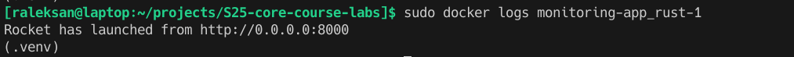

# Logging infrastructure

## Promtail

`Promtail` is a "log agent", which collects logs from sources uses
`pull` model from jobs list, and `push` them to the "log collection unit" (`Loki` in our case).

For my applications I do not have specific log files, therefore I just collect logs
from all running Docker containers.

## Loki

`Loki` is the "log storage and search engine", it is very lightweight and efficient.
Its purpose is to store logs from application, indexing all of them, and perform fast search.

## Grafana

`Grafana` is powerful tool for logs visualization, representation, and analysis.

For now, I use it for nice log preview and interface to `Loki` search engine.

## Applications

`Grafana` with logs:

### app_python

Python application logs with `Grafana`:

Python application logs directly from container:

### app_rust (bonus task)

Rust application logs with `Grafana`:

Rust application logs directly from container:

