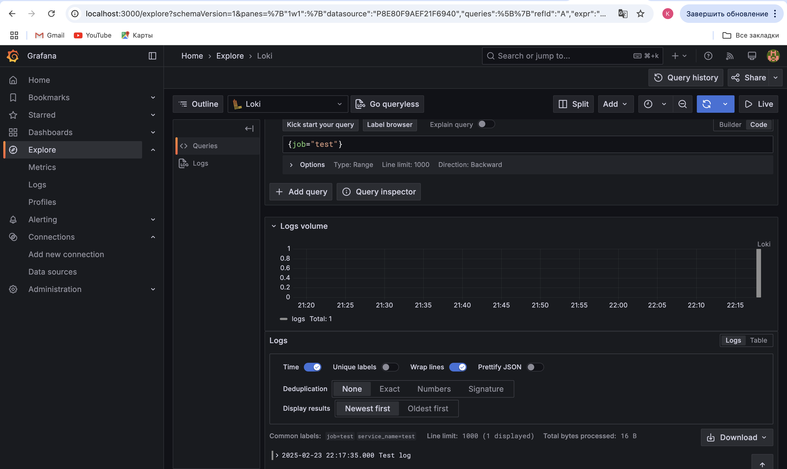
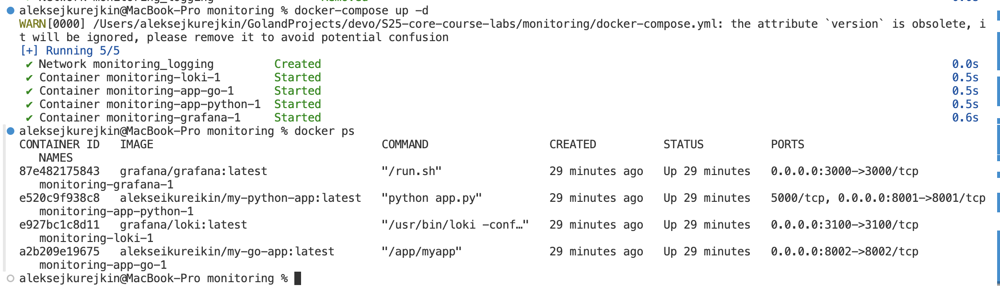
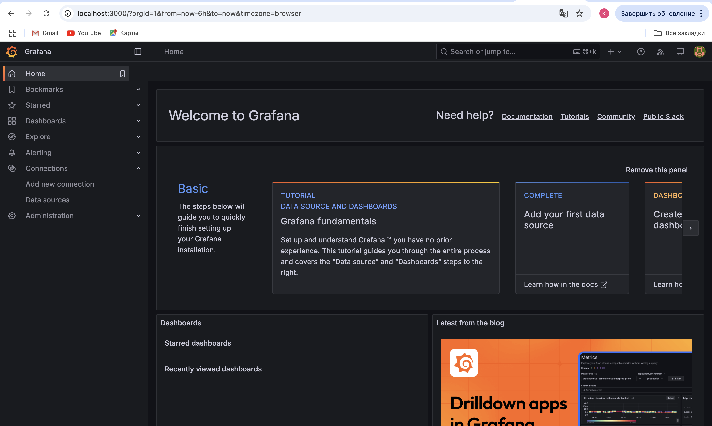
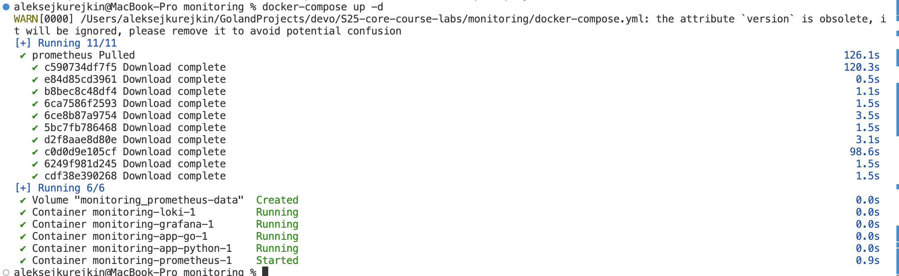

# Logging Stack Documentation

## **Components Overview**
The logging stack consists of the following services:

1. **Loki** – A log aggregation system that stores and indexes logs.
2. **Alloy** – A log collector that reads log files from Docker containers and web apps and forwards them to Loki.
3. **Grafana** – A visualization tool used to query and display logs stored in Loki.
4. **FastAPI App (`app-python`)** – A backend service built with FastAPI.
5. **Gin App (`app-go`)** – A backend service built with the Gin web framework.

## **Logging Stack Components**

### **1. Loki**
**Role:** Loki is a log aggregation system developed by Grafana Labs. It collects, indexes, and stores logs from various sources while using minimal resources compared to traditional logging solutions like Elasticsearch.

**Configuration (`loki-cfg.yml`):**
- `auth_enabled: false`: No authentication required.
- `server.http_listen_port: 3100`: Accessible on port **3100**.
- `ingester`: Handles log ingestion and storage.
  - Uses `inmemory` for key-value storage.
  - Stores logs in **BoltDB** (`boltdb-shipper`).
  - Stores logs for 24 hours (`reject_old_samples_max_age: 24h`).
- `schema_config`: Defines log storage schema.
- `storage_config`: Logs are stored in (`/loki/index`, `/loki/cache`).
- `compactor`: Configured for log compaction every 10 minutes to reduce storage size.

**Docker Configuration:**
- **Volumes:**
  - `/etc/loki/local-config.yaml` (Configuration)
  - `/loki` (Data storage)
- **Ports:**
  - **3100** (HTTP API for log ingestion)
- **Networks:** Uses `monitoring` network.
- **Restart Policy:** Always restart on failure.

---

### **2. Alloy (Log Collector)**

**Role:** Alloy is a lightweight log collector that reads logs from containers and applications, forwarding them to Loki for storage and querying.

**Configuration (`config.alloy`):**
- **Log Sources:**
  - **Docker Logs** (`log_scrape_docker`): Reads logs from `/var/lib/docker/containers/*/*-json.log` with a 15s sync period.
  - **FastAPI App Logs** (`log_scrape_python`): Reads logs from `/var/log/app_logs/python_app.log` with a 5s sync period.
  - **Gin App Logs** (`log_scrape_go`): Reads logs from `/var/log/app_logs/go_app.log` with a 5s sync period.

- **Processing Pipelines:**
  - Each log source is assigned a label (`service`) and a `job` identifier for differentiation in Loki.
  - **Docker Logs:** Labeled as `service=docker`, `job=docker containers log`.
  - **FastAPI Logs:** Labeled as `service=fastapi-app`, `job=fastapi`.
  - **Gin Logs:** Labeled as `service=gin-app`, `job=gin`.

**Docker Configuration:**
- **Volumes:**
  - `/etc/alloy/config.alloy` (Configuration)
  - `/var/log/app_logs` (Application log storage)
  - `/var/lib/docker/containers:/var/lib/docker/containers:ro` (Read-only access to Docker logs)
- **Depends on:** Loki.
- **Networks:** Uses `monitoring` network.
- **Restart Policy:** Always restart on failure.

---

### **3. Grafana (Log Visualization)**
**Role:** Grafana is a visualization tool used to query, analyze, and display logs from Loki.

**Configuration:**
- **Environment Variables:**
  - `GF_SECURITY_ADMIN_PASSWORD=root1234`: Sets default password.
- **Docker Configuration:**
  - **Ports:** Runs on **3000**.
  - **Volumes:** Stores data persistently in `grafana_data`.
  - **Depends on:** Loki (Ensures Loki starts first).
  - **Networks:** Uses `monitoring` network.
  - **Restart Policy:** Always restart on failure.

---

### **4. FastAPI App (`app-python`)**
**Purpose:**  
A backend service running on **port 8000**.

**Docker Configuration:**
- **Build Context:** `../app_python`
- **Container Name:** `fastapi-app`
- **Ports:** Exposes **8000:8000**.
- **Networks:** Uses `monitoring` network.
- **Logging Configuration:**
  - Uses the `json-file` logging driver.
  - Limits log size to **30MB** with a maximum of **3 log files**.
- **Restart Policy:** Always restart on failure.

---

### **5. Gin App (`app-go`)**
**Purpose:**  
A backend service running on **port 8080**.

**Docker Configuration:**
- **Build Context:** `../app_go`
- **Container Name:** `gin-app`
- **Ports:** Exposes **8080:8080**.
- **Networks:** Uses `monitoring` network.
- **Logging Configuration:**
  - Uses the `json-file` logging driver.
  - Limits log size to **30MB** with a maximum of **3 log files**.
- **Restart Policy:** Always restart on failure.

---

## **How the Logging Stack Works**
1. **Logs are generated by FastAPI (`app-python`) and Gin (`app-go`).**
2. **Docker logs are written to `/var/lib/docker/containers/*/*-json.log`.**
3. **Alloy reads these logs** and categorizes them into:
   - `fastapi-app` (FastAPI app logs)
   - `gin-app` (Gin app logs)
   - `docker` (General Docker logs)
4. **Alloy sends logs to Loki**, which stores and indexes them.
5. **Grafana queries Loki** to visualize logs.

---

## **Setting Up and Running the Logging Stack**
To start the logging stack:
```sh
git clone -b lab7 https://github.com/creepydanunity/S25-core-course-labs.git
cd S25-core-course-labs/monitoring
```

```sh
docker-compose up -d
```

To check if services are running:
```sh
docker ps
```

To inspect logs:
```sh
docker logs loki
docker logs alloy
docker logs grafana
```

To view logs in Grafana:
1. Open **http://localhost:3000**
2. Login with:
   - **Username:** `admin`
   - **Password:** `root1234`
3. Add **Loki as a data source**:
   - Go to **Menu** → **Connections** → **Data Sources** -> **Add new data source**
   - Choose **Loki**
   - Set **URL:** `http://loki:3100`
   - Click **Save & Test**
4. Create a dashboard to view logs or go to **Menu** -> **Explore** -> **Logs**

---

## **Demonstrating Success**
**Screenshots:**
0. **Running Containers**:
   - 
1. **Adding Loki to Grafana as Data Source**:
   - 
2. **Generating Logs via Interaction with web apps**:
   - 
3. **Logs Demonstraton**
   - 
4. **Containers Logs Demonstration (Bonus)**:
   - 
---