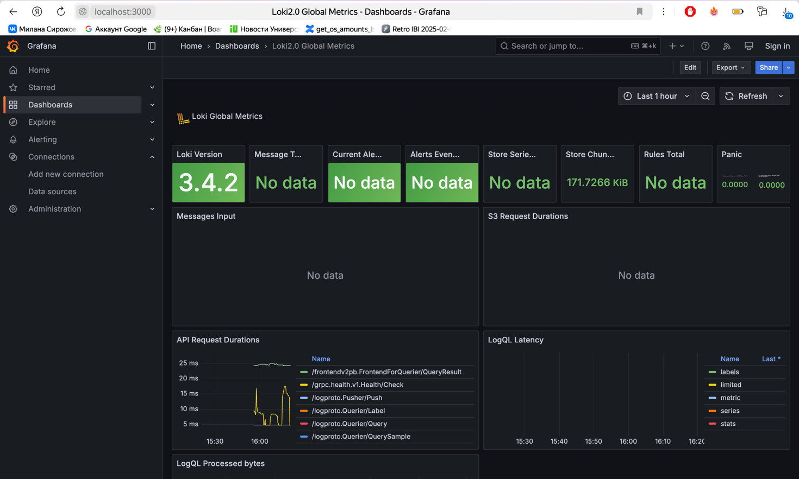

# Logging Stack Report

## 1. Overview of the Logging Stack

The logging stack is designed to collect, store, and visualize logs generated by our application. The main components are:

- **Loki**:  
  Loki is a log aggregation system designed to store and query logs. Unlike traditional log aggregators, Loki is optimized for efficiency by indexing only a few labels for each log stream. In our setup, Loki listens on port ```3100``` and uses a local configuration file to define its storage and ingestion parameters.

- **Promtail**:  
  Promtail is an agent responsible for collecting logs from the host system and shipping them to Loki. It scans local log files (in our case, logs under ```/var/log```) and tags them with labels for easy querying in Loki. Promtail is configured to push logs to Loki’s API (```http://loki:3100```) endpoint.

- **Grafana**:  
  Grafana is a visualization and monitoring tool that integrates with Loki to display log data. With Grafana, you can build dashboards and create queries to analyze log data. In this stack, Grafana listens on port ```3000``` and is configured as a data source pointing to Loki.

- **Web Application Container**:  
  Web application is deployed as a Docker container and generates logs that are picked up by Promtail and forwarded to Loki. These logs are then visualized in Grafana.


## 2. Component Details and Configuration

### Loki

- **Role:**  
  Aggregates logs from multiple sources and makes them available for querying.
  
- **Configuration Highlights:**  
  - **Configuration File:** ```loki-config.yml```
  - **Port:** 3100  
  - **Storage:** Uses BoltDB-shipper with a filesystem-backed object store.

### Promtail

- **Role:**  
  Collects log files from the host (e.g., ```/var/log/*log```) and pushes them to Loki.
  
- **Configuration Highlights:**  
  - **Configuration File:** ```promtail-config.yml```
  - **Scrape Config:** Monitors log files under `/var/log` with a specific job label.
  - **Client:** Sends logs to Loki’s push endpoint at ```http://loki:3100/loki/api/v1/push```.

### Grafana

- **Role:**  
  Visualizes the logs stored in Loki, allowing for monitoring and analysis.
  
- **Configuration Highlights:**  
  - **Port:** 3000
  - **Data Source:** Configured in Grafana to connect to Loki using ```http://loki:3100``` as the URL.
  - **Dashboards:** Custom dashboards and queries can be created to analyze log data.

### Web Application

- **Role:**  
  Generates application-specific logs that are collected by Promtail.
  
- **Configuration Highlights:**  
  - **Port Mapping:** Exposes port 8000 on the host.
  - **Log Generation:** Standard output and error logs are captured and forwarded to Loki via Promtail.


## 3. Screenshots of the Logging Stack in Operation

Below are screenshots that demonstrate the successful operation of the logging stack. 

### Screenshot 1: Grafana Dashboard Overview

  
*Figure 1: Grafana dashboard showing query results from logs stored in Loki.*

### Screenshot 2: Loki Logs

  
*Figure 2: Loki logs retrieved via Docker logs command showing that the service is running without errors.*

### Screenshot 3: Promtail Logs

  
*Figure 3: Promtail logs confirming that it is successfully scraping logs from the host and forwarding them to Loki.*


## 4. How the Logging Stack Functions Together

1. **Log Generation:**  
   The web application produces logs as it handles requests. These logs are written to standard output and/or to log files.

2. **Log Collection (Promtail):**  
   Promtail runs as a Docker container and is configured to scrape logs from the host’s ```/var/log``` directory. It attaches metadata (labels) to each log entry based on the job or service.

3. **Log Aggregation (Loki):**  
   Loki receives the logs pushed by Promtail, stores them on disk, and indexes them using a minimal set of labels for efficient querying.

4. **Log Visualization (Grafana):**  
   Grafana connects to Loki as a data source. Users can create queries, visualize log data, and build dashboards to monitor system behavior, identify issues, and analyze trends.


