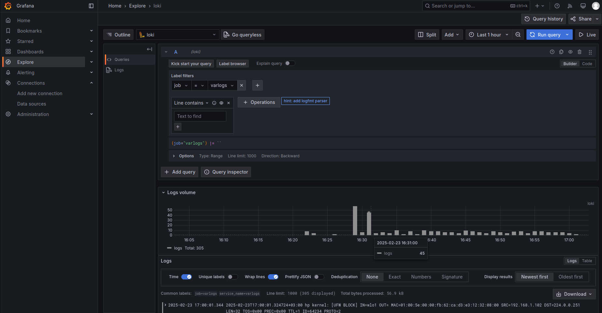

# Logging Stack Report

A logging stack was set up using Loki, Promtail, and Grafana.
- Loki collects, indexes, and stores logs (HTTP port 3100).
- Promtail reads log files (including Docker logs) and sends them to Loki.
- Grafana visualizes logs using data from Loki.

Configuration:
- Docker Compose defines services for Loki, Promtail, Grafana, and the app.
- Key config files: loki-config.yaml (server, storage, schema) and promtail-config.yaml (log paths and parsing).

Testing:
- Launched with "docker compose up". Аll containers started successfully.
- Loki accepts logs, Promtail reads Docker logs from /var/lib/docker/containers, and Grafana displaus log data.
- Grafana dashboard uses the query: `count_over_time({job="docker"}[1m])` to show logs per minute

