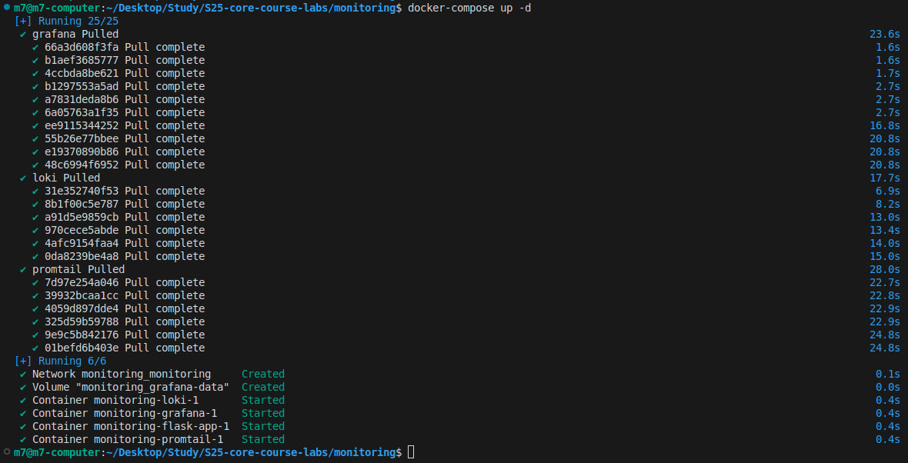

# Logging Monitoring Stack

## Stack Components

### 1. Grafana Loki
Loki is a horizontally scalable log aggregation system. Key features:
- Efficient storage: indexes only metadata
- Uses the same labeling principles as Prometheus
- Optimized for Grafana integration
- Cost-effective solution for log storage and querying

### 2. Promtail
Promtail is an agent that:
- Harvests logs from files and Docker containers
- Adds labels to log entries
- Forwards them to Loki
- Supports various scraping configurations

### 3. Grafana
Visualization platform that enables:
- Real-time log viewing
- Dashboard creation
- Alert configuration
- Advanced query capabilities with LogQL

## System Setup

### 1. Directory Preparation
```bash
mkdir -p loki/wal loki/chunks loki/index
chmod 777 -R loki
```

### 2. Stack Deployment
```bash
docker-compose up -d
```

### 3. Grafana Configuration
1. Access Grafana at http://localhost:3000
2. Login credentials:
   - Username: admin
   - Password: admin
3. Add Loki data source:
   - Navigate to: Configuration → Data Sources → Add data source → Loki
   - Set URL: http://loki:3100
   - Click Save & Test

### 4. Log Viewing
1. Navigate to Explore in Grafana
2. Select Loki as data source
3. Example LogQL queries:
   - `{container_name="flask-app"}` - Flask application logs
   - `{container_name="flask-app"} |= "error"` - Error logs only
   - `{job="docker"}` - All container logs

## LogQL Query Examples

### Basic Queries:
1. Label-based queries:
```logql
{container_name="flask-app"}
{job="docker"}
```

2. Content filtering:
```logql
{container_name="flask-app"} |= "ERROR"
{container_name="flask-app"} |= "GET" != "404"
```

3. Aggregation examples:
```logql
sum(rate({container_name="flask-app"} |= "GET" [5m])) by (status)
```

## Implementation Screenshots

### 1. Log Exploration in Grafana

*Screenshot showing log exploration with a query for Flask application logs.*

### 2. Query Labels

*Screenshot showing the successful retrieval of labels from Loki.*

### 3. Stack Deployment

*Screenshot showing the successful deployment of the logging stack using Docker Compose.*

## Health Monitoring

The stack includes health checks for the Flask application:
```bash
curl -X GET http://localhost:5000/health
```

### Log Pushing (Optional)
For manual log pushing to Loki:
```bash
docker-compose exec loki-push-gateway curl -X POST -d @logs.json http://localhost:9095/api/v1/push
```

## Troubleshooting

Common issues and solutions:
1. If Loki is unavailable, check:
   - Container logs: `docker-compose logs loki`
   - Storage permissions
   - Network connectivity

2. If logs aren't appearing:
   - Verify Promtail configuration
   - Check container labels
   - Ensure proper log driver configuration

## Next Steps

Recommended improvements:
1. Set up log retention policies
2. Configure alerts for error patterns
3. Create custom dashboards for specific use cases
4. Implement log backup strategy

```bash
docker-compose exec loki-push-gateway curl -X POST -d @logs.json http://localhost:9095/api/v1/push
```

### 3. Просмотр логов в Grafana 