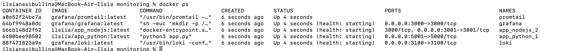

# Overview

Overview of the logging stack implemented within Lab7 + Bonus

## Loki

- Loki is a horizontally scalable, highly available log aggregation system.
- It collects logs from Promtail and stores them efficiently.
- Exposes logs via an API that Grafana can query for visualization.

## Promtail

- Promtail collects logs from Docker containers and sends them to Loki.
- Uses promtail-config.yml to define scraping jobs.

## Grafana

- Grafana provides a UI for querying logs stored in Loki.
- Configured with a Loki data source using provisioning/datasources/ds.yaml.
- Allows filtering logs based on labels.

## Screenshots

## Bonus screenshots

Docker containers of all services

Logs of Grafana:

Logs of Loki:

Logs of Promtail:

Logs of python app:

Logs of second app:

