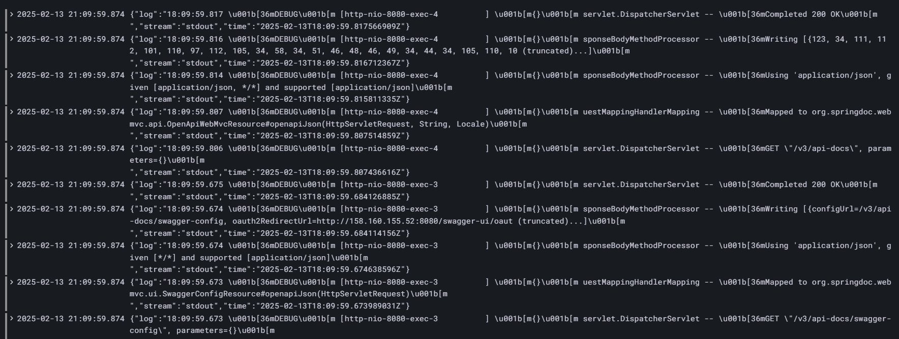

# Monitoring Stack

---

## Grafana

* Mostly UI of the entire metrics system - visualise and prompts the necessary (for users) data
* Fetch the datastream from the sources like `Loki`

## Loki

* Log Storage
* Query Engine
* Mostly a database for aggregated logs from all the sources (applications)

## Promtail

* Scanner for logs (mostly - collector)
* Fetch logs from the specified files and send them into the log storages (i.e. `Loki`)

## Python & Java Application

* Two different application with logs that can be followed by the entire metrics stack

---

## Troubleshooting

It was so hard to understand that:

A) There is no ability to fetch logs from Docker containers in the windows+wsl2 system
B) There is no correct permissions to fetch logs from the Docker daemon that was installed by the ansible / terraform (at
least I didn't find)

So, I create new VM and install docker by hands. There is a result:

---

## Grafana with Loki

## Accessible labels

## Python Application Logs

## Java Application Logs (fetched from containers)

## All `docker-compose` container logs

