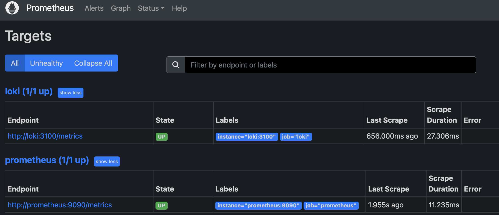

# 📊 METRICS.md – Prometheus Monitoring and Grafana Dashboard Report

## 🏷️ **Overview**

This document provides verification and documentation for the setup of **Prometheus monitoring, Grafana dashboards, and Loki logging**. The following components were configured:

- **Prometheus** to collect metrics from all services.
- **Grafana Dashboards** to visualize metrics and logs.
- **Loki** for log aggregation and querying.
- **Service Configuration Enhancements** including log rotation and memory limits.

---

## ✅ **Task 1: Prometheus Setup**

### 🔹 **Prometheus Overview**
Prometheus is an open-source monitoring system used for collecting, storing, and querying time-series metrics. It scrapes data from configured services and makes it available for analysis in Grafana.

### 🔹 **Verifying Prometheus Targets**
After configuring Prometheus, we confirmed that it successfully scrapes metrics from:
1. **Prometheus itself**
2. **Loki (Log Aggregation Service)**
3. **Flask Application**

#### 📸 **Prometheus Targets Screenshot**


- This screenshot confirms that Prometheus is successfully scraping data.

### 🔹 **Prometheus Query Test**
To verify Prometheus metrics collection, we ran the following query:
```promql
up
```
- Expected output: `1` for all running services.

#### 📸 **Prometheus Metrics Query Screenshot**


---

## ✅ **Task 2: Dashboard and Configuration Enhancements**

### 🔹 **Grafana Dashboards for Loki and Prometheus**
To visualize logs and metrics, two dashboards were imported into **Grafana**:
1. **Loki Dashboard** (for logs)
   - Dashboard ID: **13639**
2. **Prometheus Dashboard** (for metrics)
   - Dashboard ID: **3662**

#### 📸 **Grafana Loki Dashboard Screenshot**


#### 📸 **Grafana Prometheus Dashboard Screenshot**


---

## ✅ **Enhancing Service Configuration**

### 🔹 **Log Rotation and Memory Limits**
To optimize performance and prevent excessive logging, the following enhancements were made in `docker-compose.yml`:

| **Service**     | **Max Log Size** | **Max Log Files** | **Memory Limit** | **Memory Reservation** |
|----------------|---------------|---------------|----------------|------------------|
| Flask App     | 50MB          | 5            | 256MB          | 128MB           |
| Loki         | 50MB          | 5            | 512MB          | 256MB           |
| Promtail      | 50MB          | 5            | 256MB          | 128MB           |
| Grafana      | 50MB          | 5            | 512MB          | 256MB           |
| Prometheus   | 50MB          | 5            | 512MB          | 256MB           |

### 🔹 **Updated Docker Compose File Enhancements**
- Log rotation enabled for all services (`max-size: 50m`, `max-file: 5`).
- Memory limits applied to prevent excessive resource usage.

---

## ✅ **Extending Prometheus to Monitor All Services**

### 🔹 **Updated Prometheus Configuration**
The `prometheus.yml` file was modified to include scraping for all services:

```yaml
global:
  scrape_interval: 15s
  evaluation_interval: 15s

scrape_configs:
  - job_name: "prometheus"
    static_configs:
      - targets: ["prometheus:9090"]

  - job_name: "loki"
    static_configs:
      - targets: ["loki:3100"]

  - job_name: "flask_app"
    static_configs:
      - targets: ["flask_app:5000"]
```

#### 📸 **Updated Prometheus Targets Screenshot**


---

## 🎯 **Conclusion**
With these enhancements, the monitoring stack is now fully operational. Prometheus is collecting metrics from all services, Grafana is visualizing logs and metrics, and Loki is aggregating logs efficiently.

- **✅ Prometheus is successfully scraping all targets.**
- **✅ Grafana dashboards for Loki and Prometheus are set up.**
- **✅ Service configurations have been optimized for logging and memory management.**

This setup ensures that logs and metrics can be efficiently monitored, providing real-time insights into system performance.

**End of Report.**
