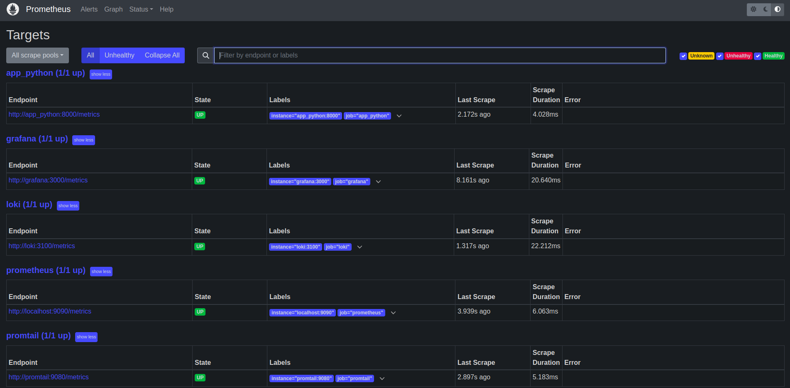
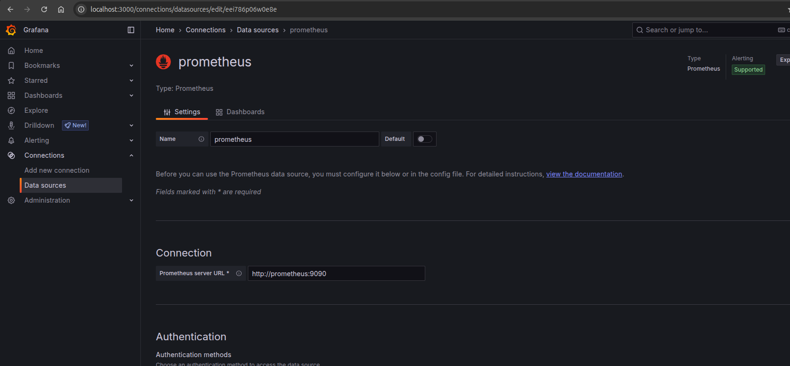
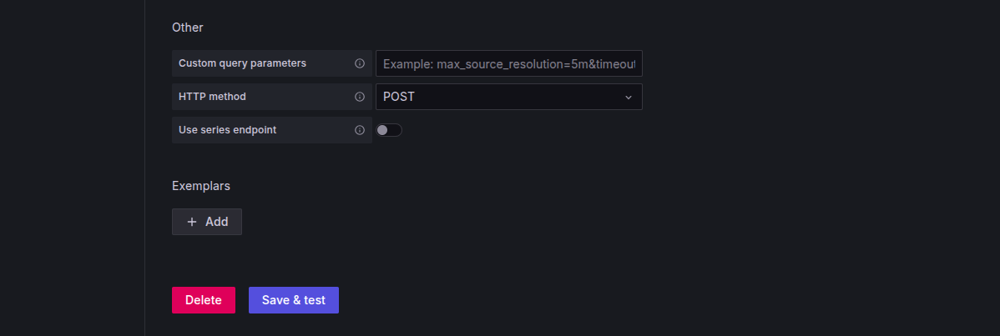
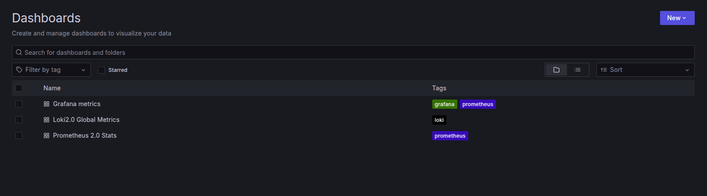
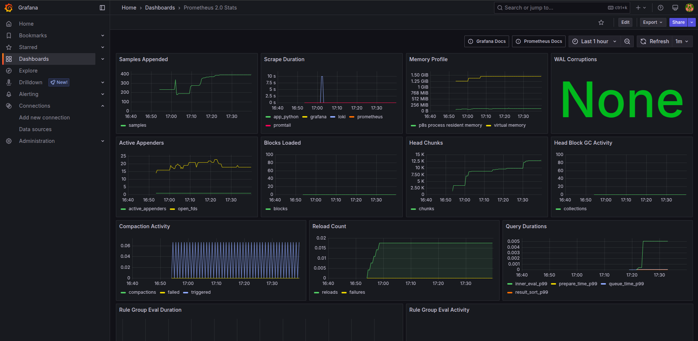
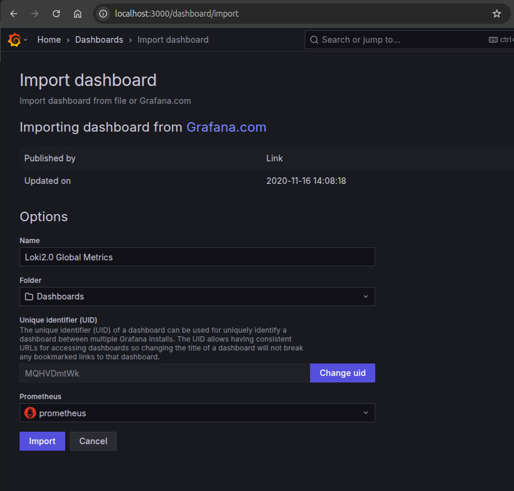
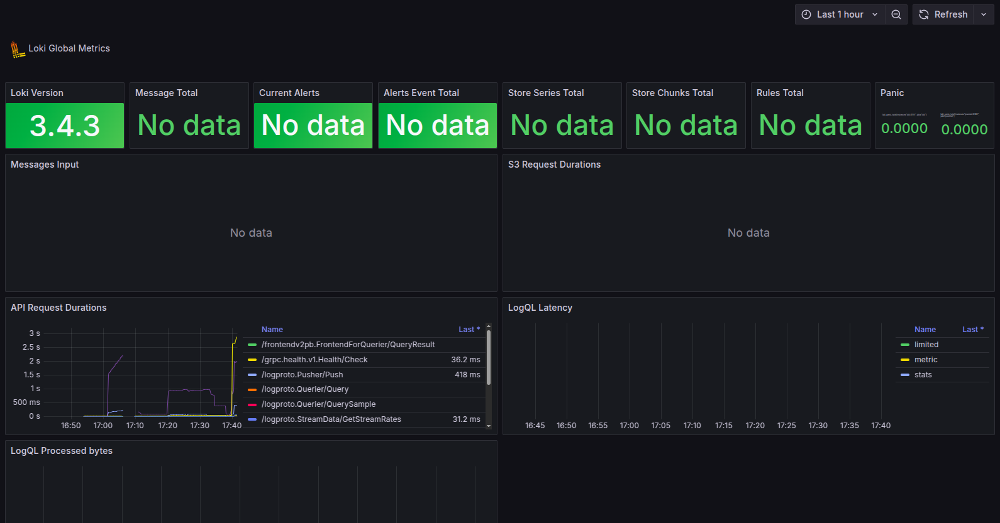

# Metrics - Prometheus Integration

## Overview

This guide explains how Prometheus is integrated into the monitoring stack to collect and visualize metrics from services and applications, with dashboards powered by Grafana.

---

## Prometheus Setup

To configure Prometheus, follow these steps:

- Add a **Prometheus** service to the Docker Compose configuration.
- Create a `prometheus.yml` configuration file to define metric scraping targets and enable data forwarding to Grafana.

---

## Checking Prometheus Targets

After launching the Docker Compose stack, you can visit the Prometheus web interface to confirm that services are being monitored correctly:

 Navigate to: `http://localhost:9090/targets`



---

## Grafana Dashboard Integration

Prebuilt dashboards from [Grafana Labs](https://grafana.com/grafana/dashboards/) were used to visualize collected metrics.

### Adding Prometheus as a Data Source

To connect Prometheus to Grafana:

1. Go to **Data Sources** → **Add new data source** → Select **Prometheus**
2. Set the Prometheus server URL:

   

3. Click **Save & Test** to verify the connection:

   

---

### Imported Dashboards

- **Prometheus Dashboard**:

  
  I used `Prometheus 2.0 Stats` since it was imported by default.

  

- **Loki Dashboard**:

  

  

---

## Exposing Flask App Metrics

To gather metrics from the Flask-based Python web app:

1. Use the [Prometheus Python client](http://prometheus.github.io/client_python/)
2. Follow the [3-step demo](http://prometheus.github.io/client_python/getting-started/three-step-demo/) to expose app metrics via HTTP.

### Update `prometheus.yml`:

```yaml
- job_name: 'app_python'
  static_configs:
    - targets: ['app_python:8000']
```

This lets Prometheus scrape metrics from the app container.

---
