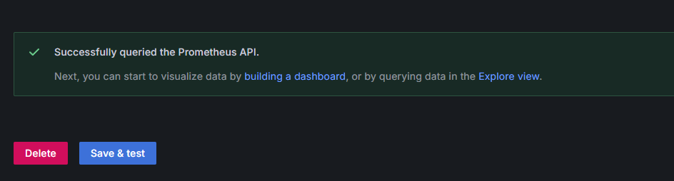
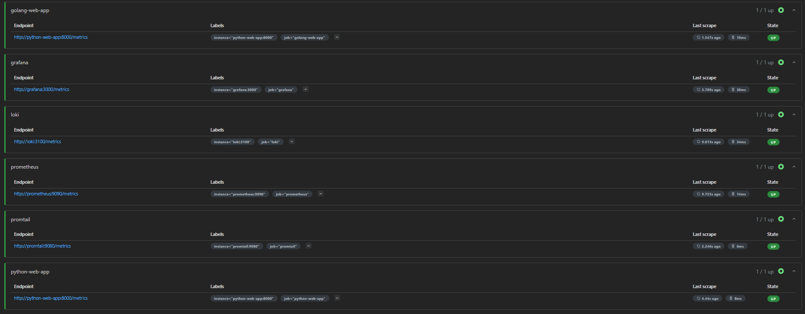
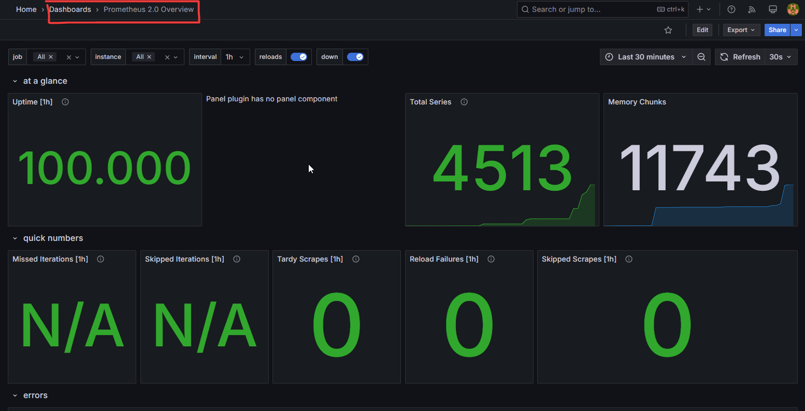
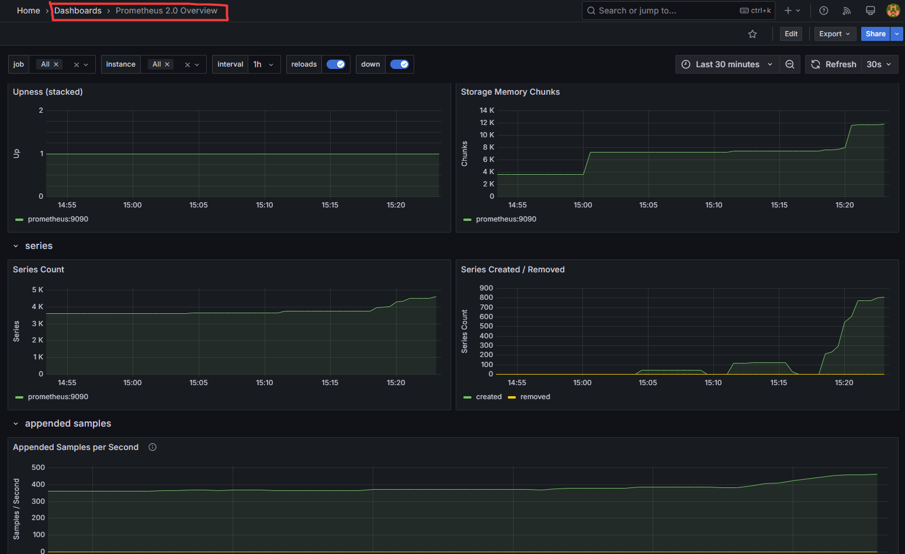
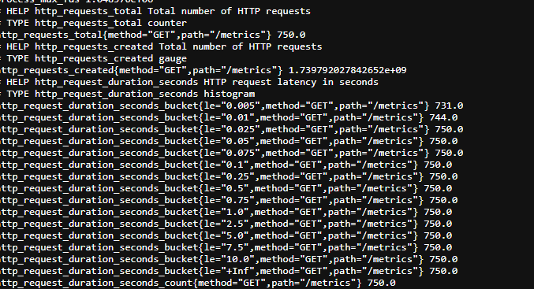
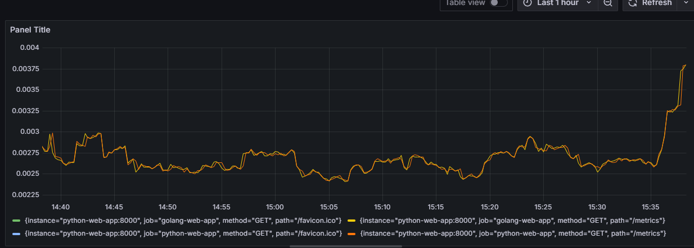
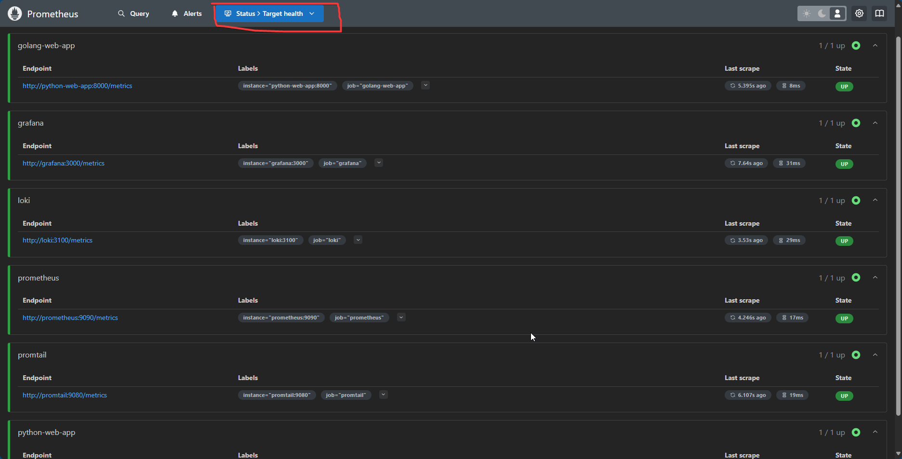

# Lab 8: Monitoring with Prometheus | Mametov Eldar 

This document will describe the work I did to configure prometheus and dashboard. 

## Finalize docker-compose and integrate prometheus | configure prometheus.yml

docker-compose.yml has been finalized compared to lab7, a new prometheus container has been added and prometheus.yml has been created. 
```yml
  prometheus:
    image: prom/prometheus:latest
    container_name: prometheus
    command:
      - '--config.file=/etc/prometheus/prometheus.yml'
    ports:
      - 9090:9090
    volumes:
      - ./prometheus.yml:/etc/prometheus/prometheus.yml
      - prom_data:/prometheus
    networks:
      - loki_net
```

The `prometheus` services and the `prom_data` volume for storing Prometheus data were added.

The prometheus.yml file was created and configured to collect metrics from Loki, Prometheus itself, and other services (which are described in this file). The configuration includes defining targets for metrics collection. 



## Check targets in prometheus 



In the screenshot you can see that prometheus and loki targets (as well as other configured targets: promtail, grafana, python-web-app, golang-web-app) are in “UP” status, which means that Prometheus is successfully collecting metrics from these services.

## Configuring dashboards for Loki and Prometheus 

In Grafana, dashboards for Loki and Prometheus were configured. I used both of the examples in the lab as a template.    

[Example Dashboard for Loki](https://grafana.com/grafana/dashboards/13407)  
[Example Dashboard for Prometheus](https://grafana.com/grafana/dashboards/3662)

**Loki dashboard:**


**Prometheus dashboard:**



The screenshots show customized Grafana dashboards displaying data from Loki and Prometheus.

## Rotation logs and memory limit 
A maximum file size of 20M and a maximum number of 10 files have been added to the rotation logs.
```
x-logging:
  &common_logging
  driver: "json-file"
  options:
    tag: "{{.ImageName}}|{{.ContainerName}}"
    max-size: "20M"
    max-file: "10"
```

Also, a limit of 250M was set for all services. 
```
x-deploy: 
  &default-deploy
  resources:
    limits:
      memory: 250M
```

# Collect metrics from all services 
As you can see in prometheus.yml is configured so that metrics are collected from all services loki, promtail, grafana, python-web-app, golang-web-app a separate task jobs is defined. 
```
global:
  scrape_interval:     10s
  evaluation_interval: 10s


scrape_configs:
  - job_name: 'prometheus'
    static_configs:
      - targets: ['prometheus:9090']

  - job_name: 'promtail'
    static_configs:
      - targets: ["promtail:9080"]
  
  - job_name: 'grafana'
    static_configs:
      - targets: ["grafana:3000"]

...

```

## Bonus assignment
### Application Metrics
Metrics collection for a web-app application was added. The python library prometheus_client was used for this.    
As you can see in the screenshot the metrics are collected and can be used to create graphs in the dashboard.




This graph shows the average time to process requests (seconds).  


### Health Checks
Health checks for all services have been added to the docker-compose.yml file. Health checks allow us to check the health of the services. 

`Loki`: healthcheck: test: [“CMD”, “wget”, “--spider”, “http://localhost:3100/ready”] ... - checks the availability of endpoint /ready.   
`Promtail`: healthcheck: test: [“CMD”, “wget”, “--spider”, “http://localhost:9080/ready”] ... - checks if endpoint /ready is available.   
`Grafana`: healthcheck: test: [“CMD”, “curl”, “-f”, “http://localhost:3000/api/health”] ... - Checks the availability of endpoint /api/health.   
`Python-web-app`: healthcheck: test: [“CMD-SHELL”, “wget --no-verbose --tries=1 --spider http://127.0.0.1:80/ || exit 1”] ... ... - checks if the HTTP endpoint is available on port 80.   
`Golang-web-app`: healthcheck: test: [“CMD-SHELL”, “wget --no-verbose --tries=1 --spider http://127.0.0.1:81/ || exit 1”] ... ... - checks if the HTTP endpoint is available on port 81.

