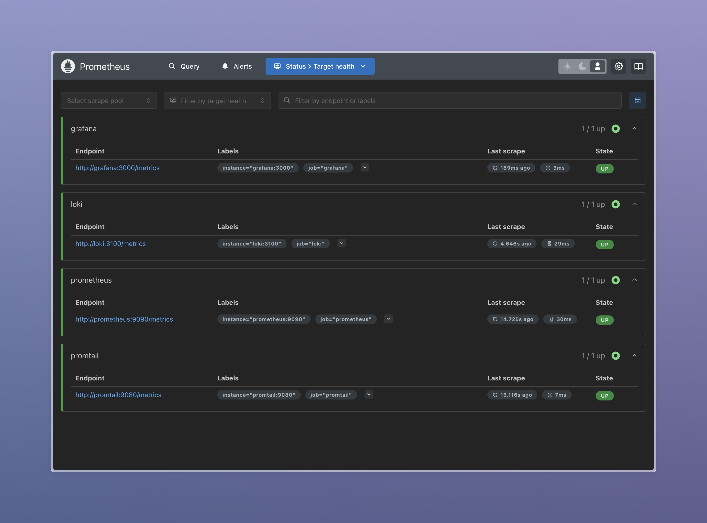
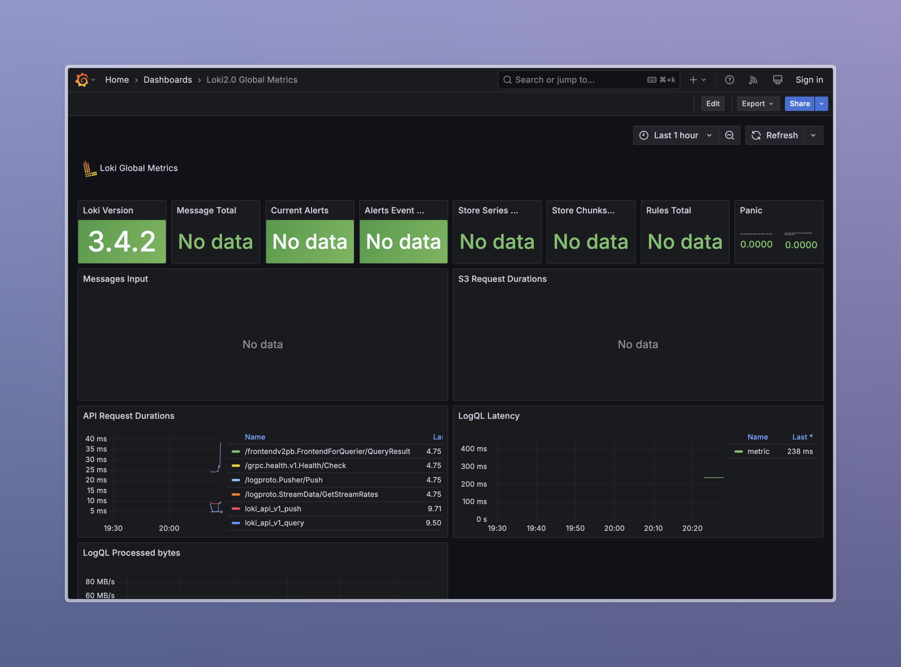
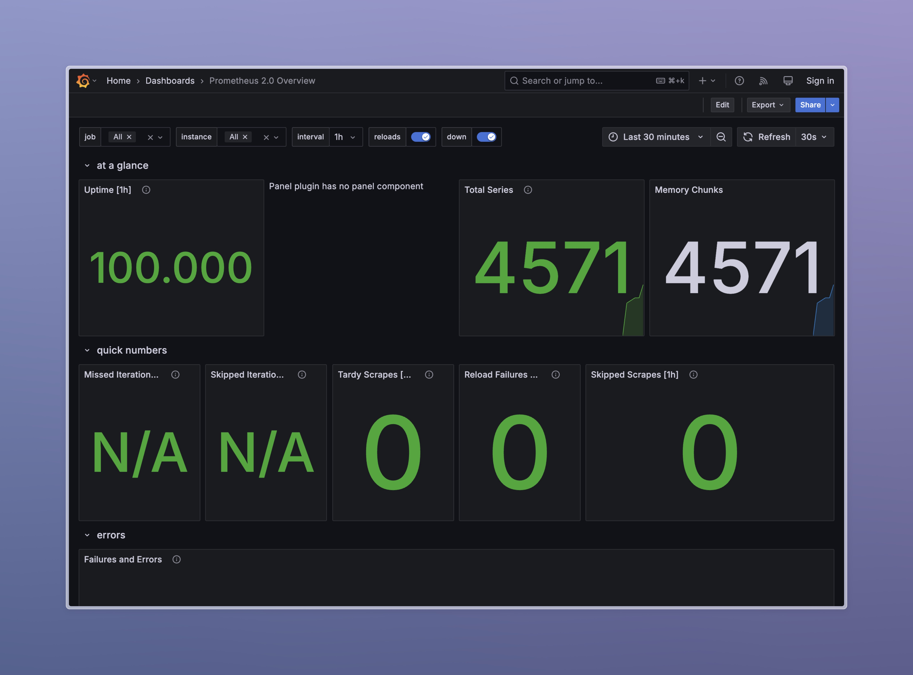

# Monitoring with Prometheus

## Grafana Dashboards

### Loki Dashboard
  
*Loki logs visualized in Grafana.*

### Prometheus Dashboard
  
*Prometheus metrics visualized in Grafana.*

## Service Configuration Updates
- **Log Rotation**: Configured for all services using `json-file` driver with `max-size: 10m` and `max-file: 3`.
- **Memory Limits**:
    - Loki: 512MB
    - Promtail: 512MB
    - Grafana: 512MB
    - Prometheus: 512MB

## Metrics Gathering
Prometheus is configured to scrape metrics from:
- Prometheus (`localhost:9090`)
- Loki (`loki:3100`)
- Promtail (`promtail:9080`)
- Grafana (`grafana:3000`)