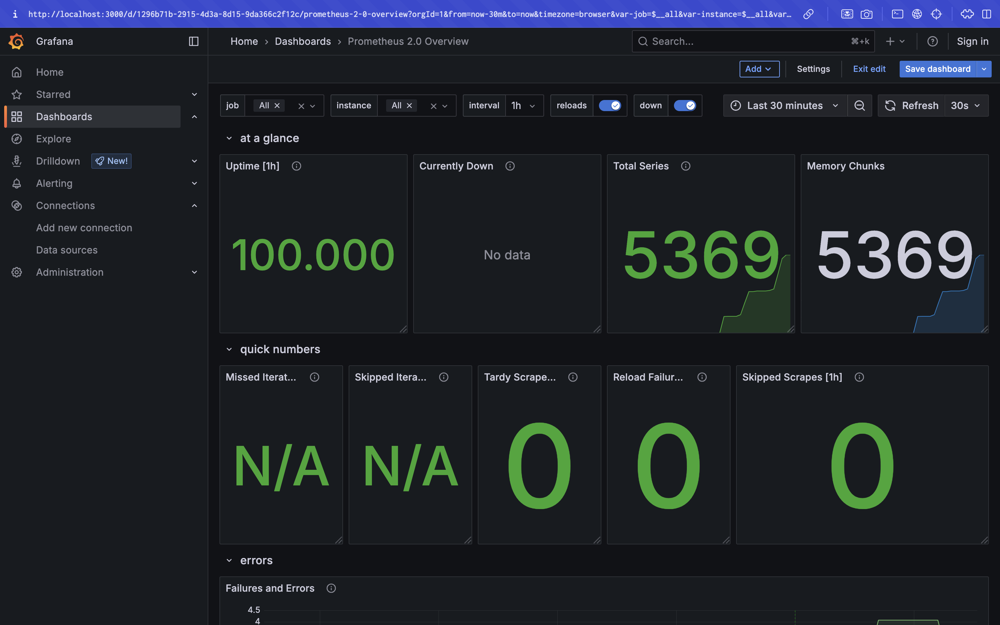
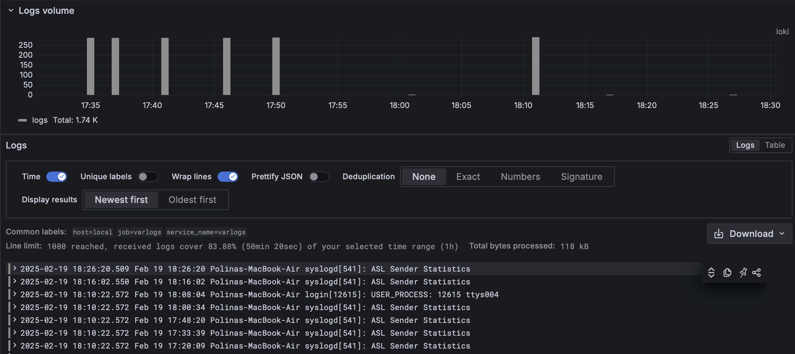
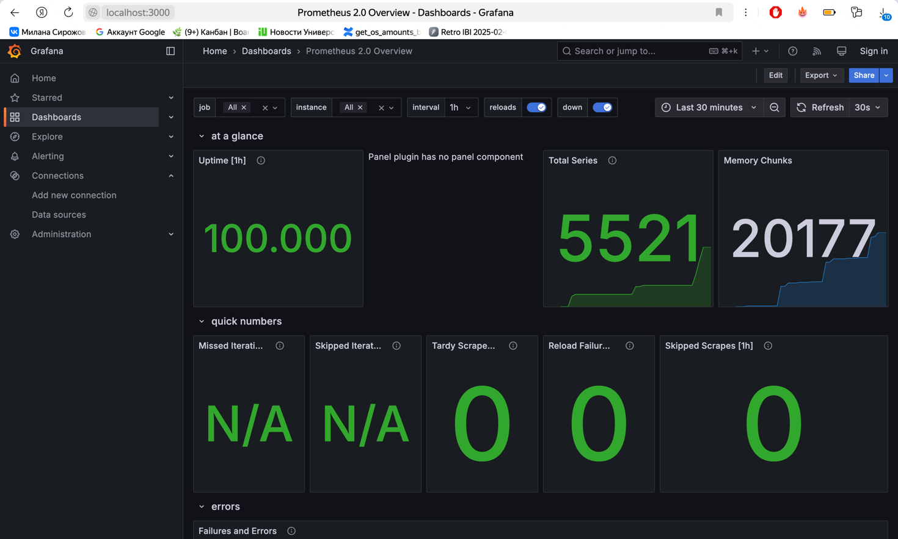
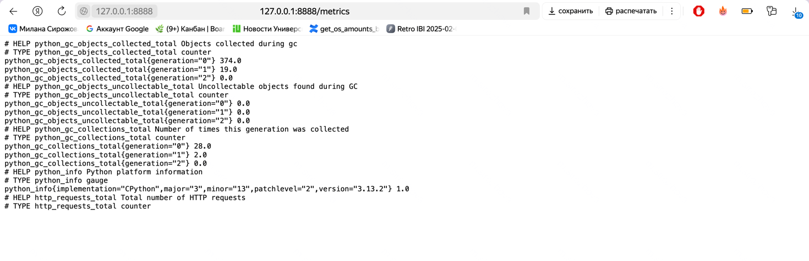
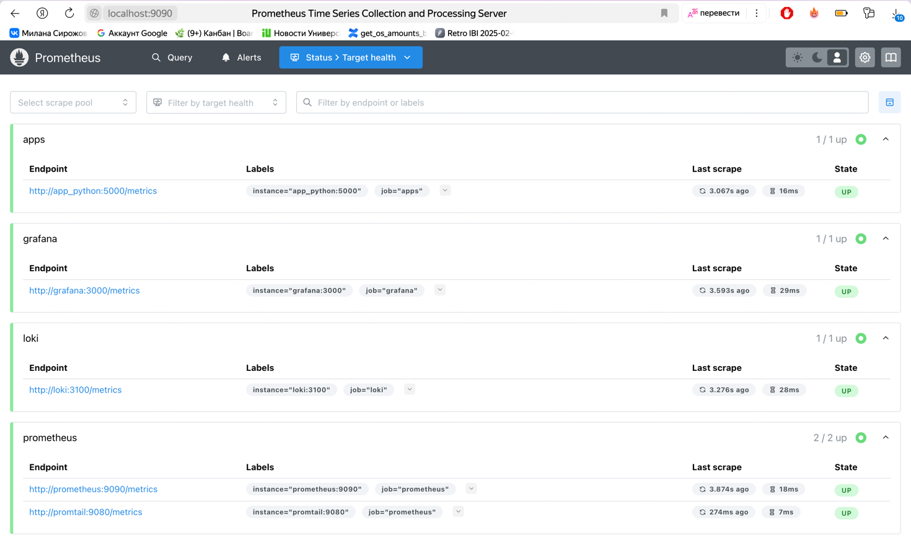

# Monitoring

## Prometheus



## Dashboards





## Log Rotation

Logs are limited to 10MB per file with a maximum of 3 files using Docker's json-file logging driver. This prevents excessive disk usage and ensures old logs are automatically removed.

## Memory Limits

Each container has memory limits set via ```mem_limit``` and ```mem_reservation``` in ```docker-compose.yml```, preventing crashes due to excessive resource consumption. Additionally, ```deploy.resources.limits.memory``` is set to 512MB, enforcing stricter memory usage constraints at the deployment level.

## Metrics





## Health Checks

- All services (Loki, Promtail, Grafana, Prometheus, Python, and Go applications) have a healthcheck to monitor their status.
- The check uses the pgrep command to verify that the corresponding process is running.
- The health check interval ranges from 5 to 10 seconds, with a 5-second timeout and 3 retries.
- Some services have a start_period to allow initialization before health checks begin.
- If a service becomes unhealthy, Docker may restart the container.
