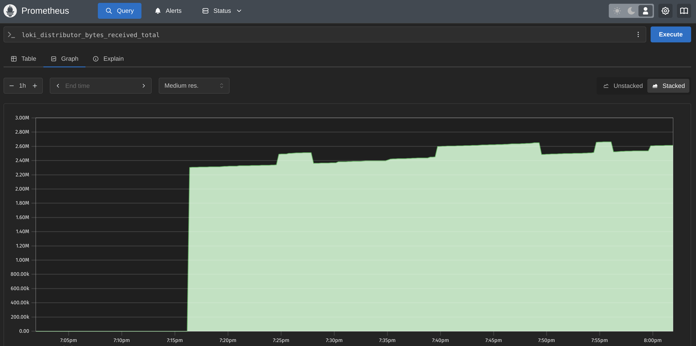

# Metrics Monitoring Setup

This document describes the Prometheus monitoring setup for the Moscow Time application and its components.

## Components

### Prometheus
- **Role**: Metrics collection and storage
- **Port**: 9090
- **Metrics URL**: http://localhost:9090/metrics
- **Targets URL**: http://localhost:9090/targets

### Monitored Services
1. **Moscow Time Application**
   - Port: 5000
   - Metrics: Basic application metrics

2. **Loki**
   - Port: 3100
   - Metrics: Log processing and storage metrics

3. **Docker**
   - Auto-discovered containers
   - Container metrics

## Configuration

### Prometheus Configuration
```yaml
scrape_configs:
  - job_name: 'prometheus'
    static_configs:
      - targets: ['localhost:9090']

  - job_name: 'loki'
    static_configs:
      - targets: ['loki:3100']
```

## Verification

### Screenshots

1. Prometheus Targets

*Shows all configured targets and their health status*

2. Prometheus Metrics

*Sample metrics being collected*

## Usage

1. Access Prometheus UI:
```
http://localhost:9090
```

2. View all targets:
```
http://localhost:9090/targets
```

3. Example PromQL queries:
```promql
# Container metrics
container_memory_usage_bytes{container_name="moscow-time-app"}

# Loki metrics
loki_distributor_bytes_received_total

# Prometheus itself
prometheus_target_interval_length_seconds
```


## Service Enhancements

### Resource Limits and Log Rotation

All services have been configured with memory limits and log rotation:

```yaml
# Example service configuration (applied to all services)
services:
  service_name:
    deploy:
      resources:
        limits:
          memory: 256M/512M  # Depending on service
          cpus: '0.5/1.0'    # Depending on service
    logging:
      driver: "json-file"
      options:
        max-size: "10m"
        max-file: "3"
```

Resource allocations per service:
- Moscow Time App: 256MB RAM, 0.5 CPU
- Loki: 512MB RAM, 1.0 CPU
- Promtail: 256MB RAM, 0.5 CPU
- Grafana: 512MB RAM, 1.0 CPU
- Prometheus: 512MB RAM, 1.0 CPU

### Extended Metrics Collection

Prometheus now collects metrics from all services:
- Moscow Time application (`:8000/metrics`)
- Loki (`:3100/metrics`)
- Prometheus itself (`:9090/metrics`)
- Docker containers (via Docker SD)

## Grafana Dashboards

### Loki Dashboard

- Loki Ingested Bytes
- Log Lines Rate

### Prometheus Dashboard

- Memory usage
- Storage metrics
- Sample ingestion rate
- Scrape duration

