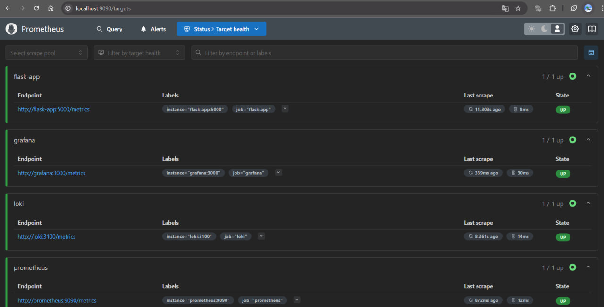
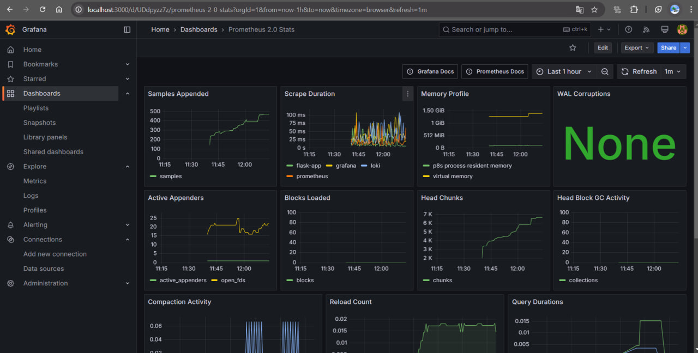

# Metrics

## Lab 8: Monitoring with Prometheus

## Task 1: Prometheus Setup

The following screenshots demonstrate the successful operation of the Monitoring with Prometheus stack.  
Now, Prometheus monitors itself (on `localhost:9090`).

The screenshots show that monitoring is up:

## Task 2: Dashboard and Configuration Enhancements

The following screenshots demonstrate successful Prometheus dashboard configurations:

Additionally, I updated the `docker-compose.yaml` file with log rotation and memory limits for each service.
