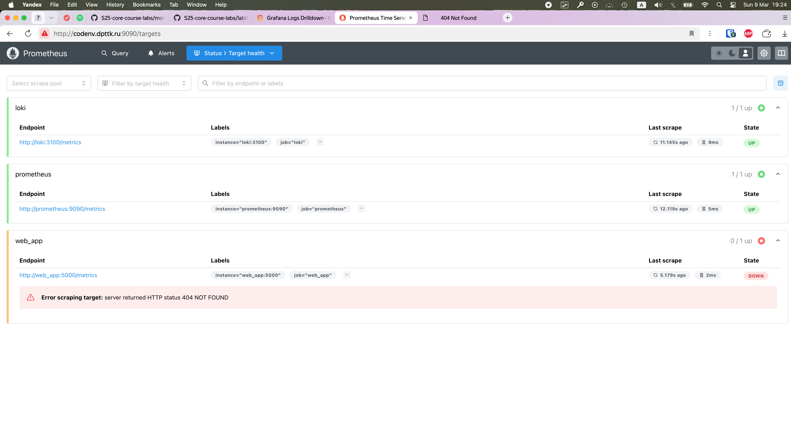
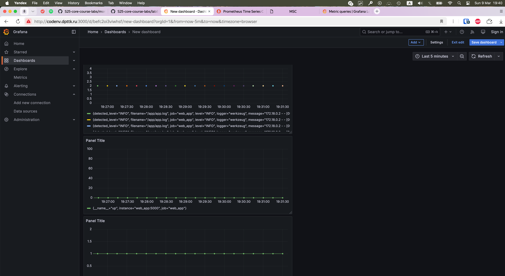
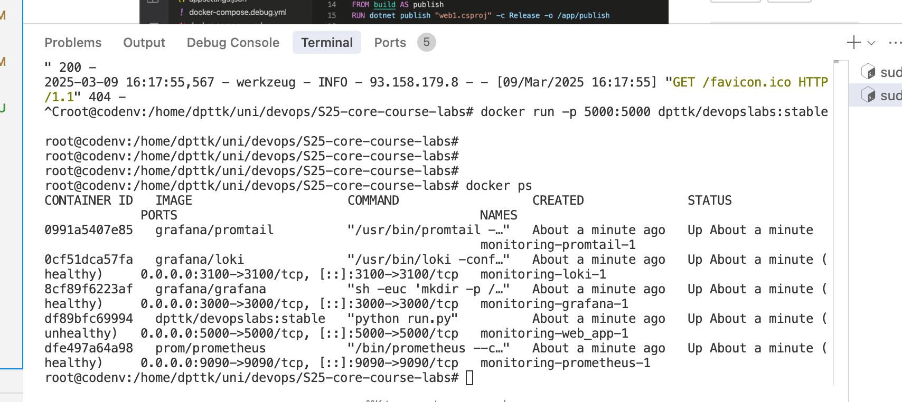
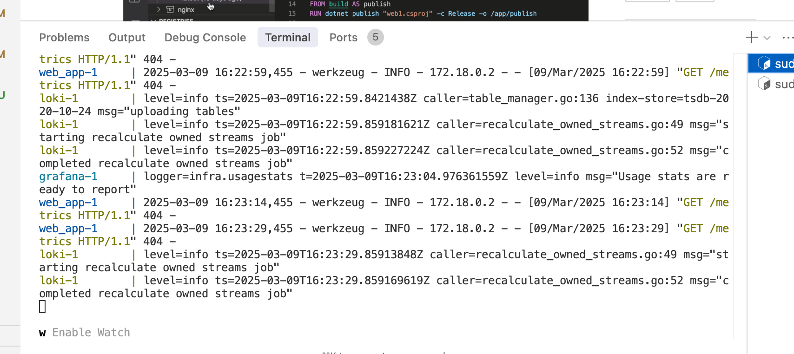

# Metrics Monitoring Documentation

## Prometheus Setup

Prometheus is configured to collect metrics from the following targets:
- Prometheus itself (for self-monitoring)
- Loki (for logging system metrics)
- Web application (for application metrics)

### Prometheus Targets Screenshot

## Grafana Dashboards

### Hosts are up

### Prometheus Dashboard

## Service Configuration Modifications

The following modifications were made to all services in the docker-compose.yml file:

1. Log rotation:
   - All services use json-file logging driver
   - Log files are limited to 200KB
   - Maximum of 10 log files are kept

2. Memory limits:
   - web_app: 256MB
   - loki: 512MB
   - promtail: 128MB
   - prometheus: 512MB
   - grafana: 256MB

3. Health checks:
   - All services have appropriate health checks configured
   - Health checks help Docker manage container lifecycle

## Prometheus Configuration

Prometheus is configured to scrape metrics from all services in the docker-compose.yml file:
- Prometheus itself (port 9090)
- Loki (port 3100)
- Web application (port 5000)

The scrape interval is set to 15 seconds.

## Bonus Tasks

### Application Metrics

The web application has been enhanced to expose Prometheus metrics using the Prometheus Python client library. The metrics endpoint is available at `/metrics`.

The following metrics are exposed:
- Request count
- Request latency
- Active requests

### Health Checks

Health checks were added to all services to ensure proper operation:
- Web app: Checks the root endpoint
- Loki: Checks the /ready endpoint
- Prometheus: Checks the /-/healthy endpoint
- Grafana: Checks the /api/health endpoint
- Promtail: Uses its HTTP endpoint 

### BUT 

I don't know why, but I cannot get the /metrics handle when I do run my app in docker-compose. However, if I run dompose with `docker run` it works perfectly fine.
I wasted 3 hours in a row on this problem and didn't came to solution yet. 

* I did reinstall docker completely with the cache (apt purge)
* I remove all the images from machine with `docker rmi -f $(docker images -aq)` and shurely tried to `docker system prune`
* I rechecked pulled for compose image digest with one that I run with `docker run` and still get that problem

