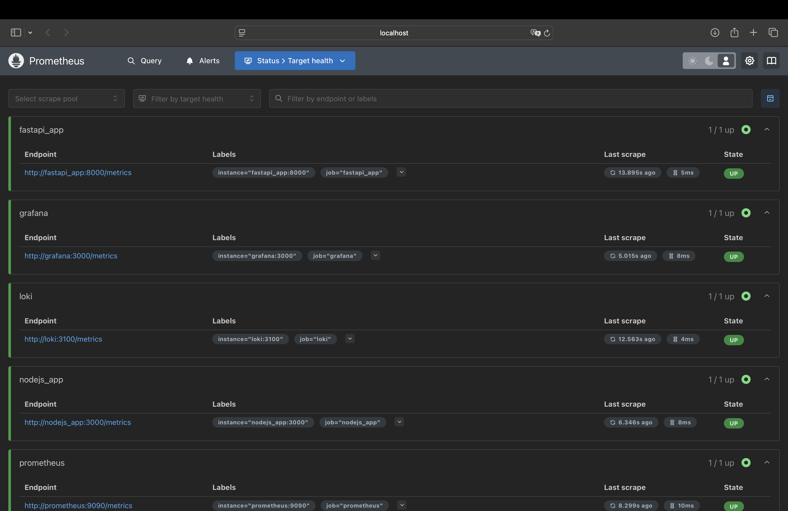
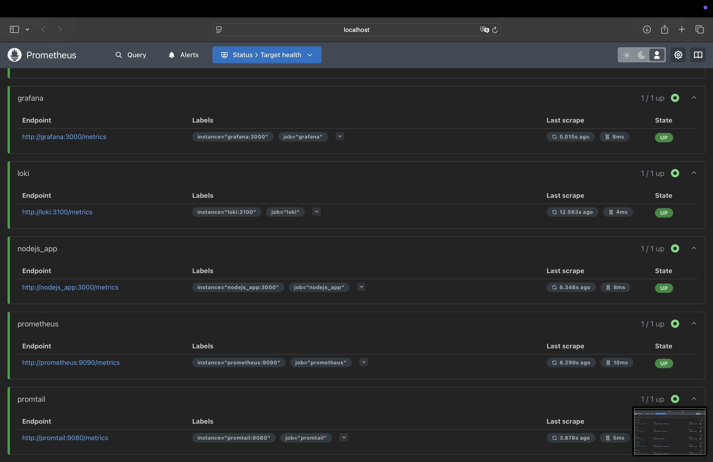
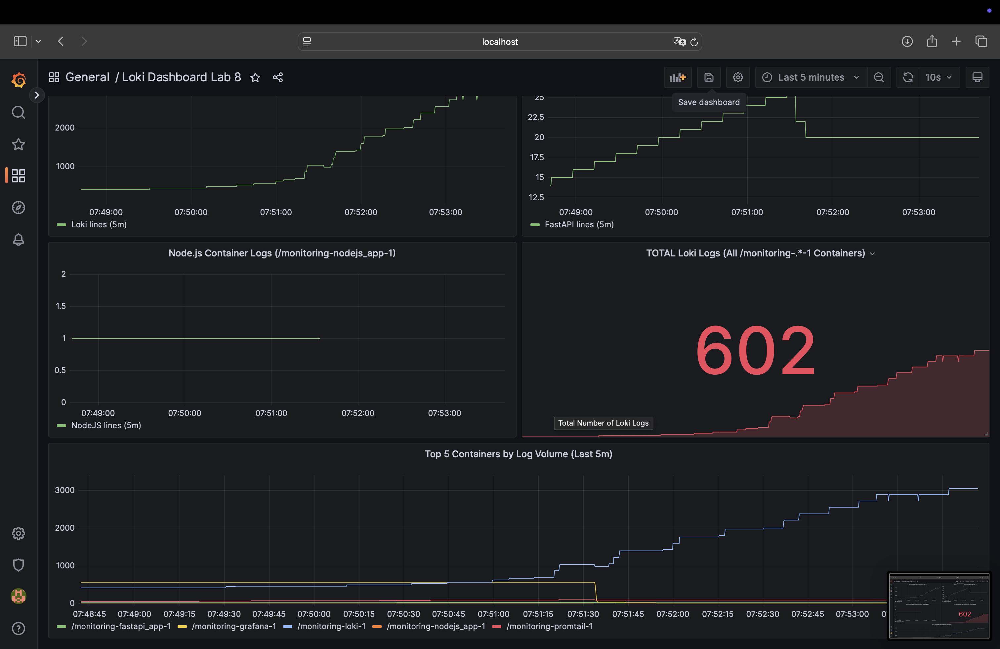
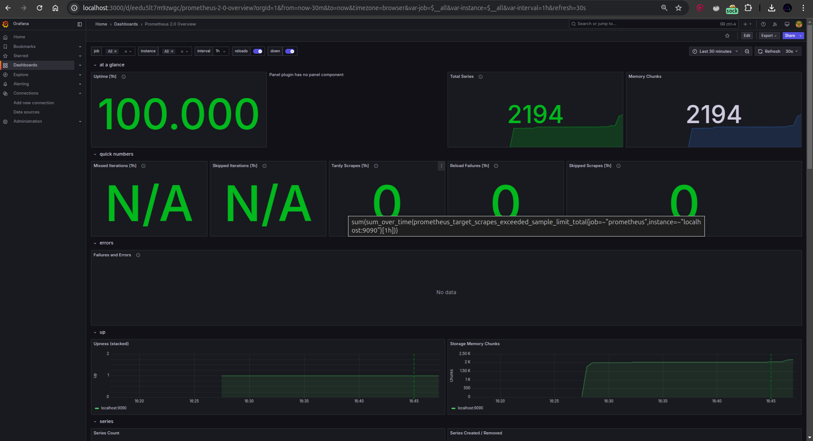

# METRICS.md

## Overview

This document describes how Prometheus has been integrated into our existing Docker-based logging and monitoring stack to collect metrics from multiple services. We also demonstrate dashboards in Grafana for Prometheus and Loki, plus improvements such as log rotation, memory limits, and optional bonus tasks like application-level metrics and health checks.

---

## Task 1: Prometheus Setup

### 1. Learn About Prometheus
We reviewed the official documentation to understand Prometheus fundamentals and naming best practices:
- [Prometheus Overview](https://prometheus.io/docs/introduction/overview/)
- [Prometheus Naming Best Practices](https://prometheus.io/docs/practices/naming/)

### 2. Integration with Docker Compose
We extended our existing `docker-compose.yml` to include a new **Prometheus** service:

```yaml
  prometheus:
    image: prom/prometheus:latest
    container_name: prometheus
    command:
      - '--config.file=/etc/prometheus/prometheus.yml'
    volumes:
      - ./prometheus/prometheus.yml:/etc/prometheus/prometheus.yml
    ports:
      - "9090:9090"
    depends_on:
      - loki
      - promtail
      - grafana
      - fastapi_app
      - nodejs_app
    # Bonus task: log rotation settings
    logging:
      driver: "json-file"
      options:
        max-size: "10m"
        max-file: "3"
    # Bonus task: memory limits
    deploy:
      resources:
        limits:
          memory: 256M
```

Prometheus is now accessible at [http://localhost:9090](http://localhost:9090).

### 3. Prometheus Configuration
A `prometheus.yml` file was created in `monitoring/prometheus/`. It instructs Prometheus to scrape itself, Loki, FastAPI, Node.js, etc.:

```yaml
global:
  scrape_interval: 15s
  evaluation_interval: 15s

scrape_configs:
  # Scrape Prometheus itself
  - job_name: "prometheus"
    static_configs:
      - targets: ["prometheus:9090"]

  # Scrape Loki
  - job_name: "loki"
    static_configs:
      - targets: ["loki:3100"]

  # Scrape Promtail
  - job_name: "promtail"
    static_configs:
      - targets: ["promtail:9080"]

  # Scrape Grafana
  - job_name: "grafana"
    static_configs:
      - targets: ["grafana:3000"]

  # Scrape FastAPI app
  - job_name: "fastapi_app"
    static_configs:
      - targets: ["fastapi_app:8000"]

  # Scrape Node.js app
  - job_name: "nodejs_app"
    static_configs:
      - targets: ["nodejs_app:3000"]

```

Note that **FastAPI** and **Node.js** expose `/metrics` endpoints for these to return data.

### 4. Verify Prometheus Targets
We verified that Prometheus is scraping these new targets by visiting:
```
http://localhost:9090/targets
```

**Screenshot: Prometheus Targets**




You should see each job listed and ideally in the **UP** state.

---

## Task 2: Dashboard and Configuration Enhancements

### 1. Grafana Dashboards
We added or imported dashboards for both **Loki** and **Prometheus**:

1. **Loki** dashboard:  
   - Demonstrates logs-related metrics or queries in LogQL.  



2. **Prometheus** dashboard:  
   - Demonstrates typical Prometheus metrics such as `up` and `scrape duration`. 
   - We also created a custom **Prometheus** dashboard with panels for `sum(up)` and `prometheus_build_info`.


### 2. Service Configuration Updates
We enhanced the configuration of all services in `docker-compose.yml`:

1. **Log Rotation** using Docker’s `json-file` driver:

   ```yaml
   logging:
     driver: "json-file"
     options:
       max-size: "10m"
       max-file: "3"
   ```

2. **Memory Limits** for containers:

   ```yaml
   deploy:
     resources:
       limits:
         memory: 256M
   ```

These changes ensure logs don’t grow indefinitely and that each container has a cap on memory usage.

### 3. Metrics Gathering
With **Prometheus** configured and scraping all defined services, we now gather metrics from:
- **Loki** (at `http://loki:3100/metrics`).
- **Promtail** (at `http://promtail:9080/metrics`)
- **Prometheus** itself (at `http://prometheus:9090/metrics`).
- **Grafana** (at `http://grafana:4000/metrics`)
- **FastAPI** (at `http://prometheus:8000/metrics`)
- **Node.js** (at `http://prometheus:8080/metrics`)

**Output: Loki**
```
# HELP cortex_consul_request_duration_seconds Time spent on consul requests.
# TYPE cortex_consul_request_duration_seconds histogram
cortex_consul_request_duration_seconds_bucket{kv_name="ingester-ring",operation="CAS loop",status_code="200",le="0.005"} 41
cortex_consul_request_duration_seconds_bucket{kv_name="ingester-ring",operation="CAS loop",status_code="200",le="0.01"} 41
cortex_consul_request_duration_seconds_bucket{kv_name="ingester-ring",operation="CAS loop",status_code="200",le="0.025"} 41
cortex_consul_request_duration_seconds_bucket{kv_name="ingester-ring",operation="CAS loop",status_code="200",le="0.05"} 41
cortex_consul_request_duration_seconds_bucket{kv_name="ingester-ring",operation="CAS loop",status_code="200",le="0.1"} 41
cortex_consul_request_duration_seconds_bucket{kv_name="ingester-ring",operation="CAS loop",status_code="200",le="0.25"} 41
cortex_consul_request_duration_seconds_bucket{kv_name="ingester-ring",operation="CAS loop",status_code="200",le="0.5"} 41
cortex_consul_request_duration_seconds_bucket{kv_name="ingester-ring",operation="CAS loop",status_code="200",le="1"} 41
cortex_consul_request_duration_seconds_bucket{kv_name="ingester-ring",operation="CAS loop",status_code="200",le="2.5"} 41
cortex_consul_request_duration_seconds_bucket{kv_name="ingester-ring",operation="CAS loop",status_code="200",le="5"} 41
cortex_consul_request_duration_seconds_bucket{kv_name="ingester-ring",operation="CAS loop",status_code="200",le="10"} 41
cortex_consul_request_duration_seconds_bucket{kv_name="ingester-ring",operation="CAS loop",status_code="200",le="+Inf"} 41
cortex_consul_request_duration_seconds_sum{kv_name="ingester-ring",operation="CAS loop",status_code="200"} 0.0064098739999999986
cortex_consul_request_duration_seconds_count{kv_name="ingester-ring",operation="CAS loop",status_code="200"} 41
# HELP cortex_distributor_ingester_clients The current number of ingester clients.
# TYPE cortex_distributor_ingester_clients gauge
cortex_distributor_ingester_clients 2
# HELP cortex_dns_failures_total The number of DNS lookup failures
# TYPE cortex_dns_failures_total counter
cortex_dns_failures_total{name="memberlist"} 0
# HELP cortex_dns_lookups_total The number of DNS lookups resolutions attempts
# TYPE cortex_dns_lookups_total counter
cortex_dns_lookups_total{name="memberlist"} 0
# HELP cortex_frontend_query_range_duration_seconds Total time spent in seconds doing query range requests.
# TYPE cortex_frontend_query_range_duration_seconds histogram
cortex_frontend_query_range_duration_seconds_bucket{method="retry",status_code="200",le="0.005"} 1
cortex_frontend_query_range_duration_seconds_bucket{method="retry",status_code="200",le="0.01"} 2
cortex_frontend_query_range_duration_seconds_bucket{method="retry",status_code="200",le="0.025"} 2
cortex_frontend_query_range_duration_seconds_bucket{method="retry",status_code="200",le="0.05"} 2
cortex_frontend_query_range_duration_seconds_bucket{method="retry",status_code="200",le="0.1"} 2
cortex_frontend_query_range_duration_seconds_bucket{method="retry",status_code="200",le="0.25"} 2
cortex_frontend_query_range_duration_seconds_bucket{method="retry",status_code="200",le="0.5"} 2
cortex_frontend_query_range_duration_seconds_bucket{method="retry",status_code="200",le="1"} 2
cortex_frontend_query_range_duration_seconds_bucket{method="retry",status_code="200",le="2.5"} 2
cortex_frontend_query_range_duration_seconds_bucket{method="retry",status_code="200",le="5"} 2
cortex_frontend_query_range_duration_seconds_bucket{method="retry",status_code="200",le="10"} 2
cortex_frontend_query_range_duration_seconds_bucket{method="retry",status_code="200",le="+Inf"} 2
cortex_frontend_query_range_duration_seconds_sum{method="retry",status_code="200"} 0.006786416
cortex_frontend_query_range_duration_seconds_count{method="retry",status_code="200"} 2
cortex_frontend_query_range_duration_seconds_bucket{method="split_by_interval",status_code="200",le="0.005"} 1
cortex_frontend_query_range_duration_seconds_bucket{method="split_by_interval",status_code="200",le="0.01"} 2
cortex_frontend_query_range_duration_seconds_bucket{method="split_by_interval",status_code="200",le="0.025"} 2
cortex_frontend_query_range_duration_seconds_bucket{method="split_by_interval",status_code="200",le="0.05"} 2
cortex_frontend_query_range_duration_seconds_bucket{method="split_by_interval",status_code="200",le="0.1"} 2
cortex_frontend_query_range_duration_seconds_bucket{method="split_by_interval",status_code="200",le="0.25"} 2
cortex_frontend_query_range_duration_seconds_bucket{method="split_by_interval",status_code="200",le="0.5"} 2
cortex_frontend_query_range_duration_seconds_bucket{method="split_by_interval",status_code="200",le="1"} 2
cortex_frontend_query_range_duration_seconds_bucket{method="split_by_interval",status_code="200",le="2.5"} 2
cortex_frontend_query_range_duration_seconds_bucket{method="split_by_interval",status_code="200",le="5"} 2
cortex_frontend_query_range_duration_seconds_bucket{method="split_by_interval",status_code="200",le="10"} 2
cortex_frontend_query_range_duration_seconds_bucket{method="split_by_interval",status_code="200",le="+Inf"} 2
cortex_frontend_query_range_duration_seconds_sum{method="split_by_interval",status_code="200"} 0.006817626
cortex_frontend_query_range_duration_seconds_count{method="split_by_interval",status_code="200"} 2
# HELP cortex_ingester_flush_queue_length The total number of series pending in the flush queue.
# TYPE cortex_ingester_flush_queue_length gauge
cortex_ingester_flush_queue_length 0
# HELP cortex_kv_request_duration_seconds Time spent on kv store requests.
# TYPE cortex_kv_request_duration_seconds histogram
cortex_kv_request_duration_seconds_bucket{kv_name="distributor-lifecycler",operation="CAS",role="primary",status_code="200",type="inmemory",le="0.005"} 10
cortex_kv_request_duration_seconds_bucket{kv_name="distributor-lifecycler",operation="CAS",role="primary",status_code="200",type="inmemory",le="0.01"} 10
cortex_kv_request_duration_seconds_bucket{kv_name="distributor-lifecycler",operation="CAS",role="primary",status_code="200",type="inmemory",le="0.025"} 10
cortex_kv_request_duration_seconds_bucket{kv_name="distributor-lifecycler",operation="CAS",role="primary",status_code="200",type="inmemory",le="0.05"} 10
cortex_kv_request_duration_seconds_bucket{kv_name="distributor-lifecycler",operation="CAS",role="primary",status_code="200",type="inmemory",le="0.1"} 10
cortex_kv_request_duration_seconds_bucket{kv_name="distributor-lifecycler",operation="CAS",role="primary",status_code="200",type="inmemory",le="0.25"} 10
cortex_kv_request_duration_seconds_bucket{kv_name="distributor-lifecycler",operation="CAS",role="primary",status_code="200",type="inmemory",le="0.5"} 10
cortex_kv_request_duration_seconds_bucket{kv_name="distributor-lifecycler",operation="CAS",role="primary",status_code="200",type="inmemory",le="1"} 10
cortex_kv_request_duration_seconds_bucket{kv_name="distributor-lifecycler",operation="CAS",role="primary",status_code="200",type="inmemory",le="2.5"} 10
cortex_kv_request_duration_seconds_bucket{kv_name="distributor-lifecycler",operation="CAS",role="primary",status_code="200",type="inmemory",le="5"} 10
cortex_kv_request_duration_seconds_bucket{kv_name="distributor-lifecycler",operation="CAS",role="primary",status_code="200",type="inmemory",le="10"} 10
cortex_kv_request_duration_seconds_bucket{kv_name="distributor-lifecycler",operation="CAS",role="primary",status_code="200",type="inmemory",le="+Inf"} 10
cortex_kv_request_duration_seconds_sum{kv_name="distributor-lifecycler",operation="CAS",role="primary",status_code="200",type="inmemory"} 0.0015408750000000001
cortex_kv_request_duration_seconds_count{kv_name="distributor-lifecycler",operation="CAS",role="primary",status_code="200",type="inmemory"} 10
cortex_kv_request_duration_seconds_bucket{kv_name="ingester-lifecycler",operation="CAS",role="primary",status_code="200",type="inmemory",le="0.005"} 10
cortex_kv_request_duration_seconds_bucket{kv_name="ingester-lifecycler",operation="CAS",role="primary",status_code="200",type="inmemory",le="0.01"} 10
cortex_kv_request_duration_seconds_bucket{kv_name="ingester-lifecycler",operation="CAS",role="primary",status_code="200",type="inmemory",le="0.025"} 10
cortex_kv_request_duration_seconds_bucket{kv_name="ingester-lifecycler",operation="CAS",role="primary",status_code="200",type="inmemory",le="0.05"} 10
cortex_kv_request_duration_seconds_bucket{kv_name="ingester-lifecycler",operation="CAS",role="primary",status_code="200",type="inmemory",le="0.1"} 10
cortex_kv_request_duration_seconds_bucket{kv_name="ingester-lifecycler",operation="CAS",role="primary",status_code="200",type="inmemory",le="0.25"} 10
cortex_kv_request_duration_seconds_bucket{kv_name="ingester-lifecycler",operation="CAS",role="primary",status_code="200",type="inmemory",le="0.5"} 10
cortex_kv_request_duration_seconds_bucket{kv_name="ingester-lifecycler",operation="CAS",role="primary",status_code="200",type="inmemory",le="1"} 10
cortex_kv_request_duration_seconds_bucket{kv_name="ingester-lifecycler",operation="CAS",role="primary",status_code="200",type="inmemory",le="2.5"} 10
cortex_kv_request_duration_seconds_bucket{kv_name="ingester-lifecycler",operation="CAS",role="primary",status_code="200",type="inmemory",le="5"} 10
cortex_kv_request_duration_seconds_bucket{kv_name="ingester-lifecycler",operation="CAS",role="primary",status_code="200",type="inmemory",le="10"} 10
cortex_kv_request_duration_seconds_bucket{kv_name="ingester-lifecycler",operation="CAS",role="primary",status_code="200",type="inmemory",le="+Inf"} 10
cortex_kv_request_duration_seconds_sum{kv_name="ingester-lifecycler",operation="CAS",role="primary",status_code="200",type="inmemory"} 0.00183075
cortex_kv_request_duration_seconds_count{kv_name="ingester-lifecycler",operation="CAS",role="primary",status_code="200",type="inmemory"} 10
cortex_kv_request_duration_seconds_bucket{kv_name="ingester-ring",operation="GET",role="primary",status_code="200",type="inmemory",le="0.005"} 1
cortex_kv_request_duration_seconds_bucket{kv_name="ingester-ring",operation="GET",role="primary",status_code="200",type="inmemory",le="0.01"} 1
cortex_kv_request_duration_seconds_bucket{kv_name="ingester-ring",operation="GET",role="primary",status_code="200",type="inmemory",le="0.025"} 1
cortex_kv_request_duration_seconds_bucket{kv_name="ingester-ring",operation="GET",role="primary",status_code="200",type="inmemory",le="0.05"} 1
cortex_kv_request_duration_seconds_bucket{kv_name="ingester-ring",operation="GET",role="primary",status_code="200",type="inmemory",le="0.1"} 1
cortex_kv_request_duration_seconds_bucket{kv_name="ingester-ring",operation="GET",role="primary",status_code="200",type="inmemory",le="0.25"} 1
cortex_kv_request_duration_seconds_bucket{kv_name="ingester-ring",operation="GET",role="primary",status_code="200",type="inmemory",le="0.5"} 1
cortex_kv_request_duration_seconds_bucket{kv_name="ingester-ring",operation="GET",role="primary",status_code="200",type="inmemory",le="1"} 1
cortex_kv_request_duration_seconds_bucket{kv_name="ingester-ring",operation="GET",role="primary",status_code="200",type="inmemory",le="2.5"} 1
cortex_kv_request_duration_seconds_bucket{kv_name="ingester-ring",operation="GET",role="primary",status_code="200",type="inmemory",le="5"} 1
cortex_kv_request_duration_seconds_bucket{kv_name="ingester-ring",operation="GET",role="primary",status_code="200",type="inmemory",le="10"} 1
cortex_kv_request_duration_seconds_bucket{kv_name="ingester-ring",operation="GET",role="primary",status_code="200",type="inmemory",le="+Inf"} 1
cortex_kv_request_duration_seconds_sum{kv_name="ingester-ring",operation="GET",role="primary",status_code="200",type="inmemory"} 2.6042e-05
cortex_kv_request_duration_seconds_count{kv_name="ingester-ring",operation="GET",role="primary",status_code="200",type="inmemory"} 1
# HELP cortex_member_consul_heartbeats_total The total number of heartbeats sent to consul.
# TYPE cortex_member_consul_heartbeats_total counter
cortex_member_consul_heartbeats_total{name="distributor"} 8
cortex_member_consul_heartbeats_total{name="ingester"} 8
# HELP cortex_query_frontend_connected_schedulers Number of schedulers this frontend is connected to.
# TYPE cortex_query_frontend_connected_schedulers gauge
cortex_query_frontend_connected_schedulers 1
# HELP cortex_query_frontend_queries_in_progress Number of queries in progress handled by this frontend.
# TYPE cortex_query_frontend_queries_in_progress gauge
cortex_query_frontend_queries_in_progress 0
# HELP cortex_query_frontend_retries Number of times a request is retried.
# TYPE cortex_query_frontend_retries histogram
cortex_query_frontend_retries_bucket{le="0"} 2
cortex_query_frontend_retries_bucket{le="1"} 2
cortex_query_frontend_retries_bucket{le="2"} 2
cortex_query_frontend_retries_bucket{le="3"} 2
cortex_query_frontend_retries_bucket{le="4"} 2
cortex_query_frontend_retries_bucket{le="5"} 2
cortex_query_frontend_retries_bucket{le="+Inf"} 2
cortex_query_frontend_retries_sum 0
cortex_query_frontend_retries_count 2
# HELP cortex_query_scheduler_connected_frontend_clients Number of query-frontend worker clients currently connected to the query-scheduler.
# TYPE cortex_query_scheduler_connected_frontend_clients gauge
cortex_query_scheduler_connected_frontend_clients 5
# HELP cortex_query_scheduler_connected_querier_clients Number of querier worker clients currently connected to the query-scheduler.
# TYPE cortex_query_scheduler_connected_querier_clients gauge
cortex_query_scheduler_connected_querier_clients 10
# HELP cortex_query_scheduler_inflight_requests Number of inflight requests (either queued or processing) sampled at a regular interval. Quantile buckets keep track of inflight requests over the last 60s.
# TYPE cortex_query_scheduler_inflight_requests summary
cortex_query_scheduler_inflight_requests{quantile="0.5"} 0
cortex_query_scheduler_inflight_requests{quantile="0.75"} 0
cortex_query_scheduler_inflight_requests{quantile="0.8"} 0
cortex_query_scheduler_inflight_requests{quantile="0.9"} 0
cortex_query_scheduler_inflight_requests{quantile="0.95"} 0
cortex_query_scheduler_inflight_requests{quantile="0.99"} 0
cortex_query_scheduler_inflight_requests_sum 0
cortex_query_scheduler_inflight_requests_count 531
# HELP cortex_query_scheduler_queue_duration_seconds Time spend by requests in queue before getting picked up by a querier.
# TYPE cortex_query_scheduler_queue_duration_seconds histogram
cortex_query_scheduler_queue_duration_seconds_bucket{le="0.005"} 2
cortex_query_scheduler_queue_duration_seconds_bucket{le="0.01"} 2
cortex_query_scheduler_queue_duration_seconds_bucket{le="0.025"} 2
cortex_query_scheduler_queue_duration_seconds_bucket{le="0.05"} 2
cortex_query_scheduler_queue_duration_seconds_bucket{le="0.1"} 2
cortex_query_scheduler_queue_duration_seconds_bucket{le="0.25"} 2
cortex_query_scheduler_queue_duration_seconds_bucket{le="0.5"} 2
cortex_query_scheduler_queue_duration_seconds_bucket{le="1"} 2
cortex_query_scheduler_queue_duration_seconds_bucket{le="2.5"} 2
cortex_query_scheduler_queue_duration_seconds_bucket{le="5"} 2
cortex_query_scheduler_queue_duration_seconds_bucket{le="10"} 2
cortex_query_scheduler_queue_duration_seconds_bucket{le="+Inf"} 2
cortex_query_scheduler_queue_duration_seconds_sum 0.000110958
cortex_query_scheduler_queue_duration_seconds_count 2
# HELP cortex_query_scheduler_queue_length Number of queries in the queue.
# TYPE cortex_query_scheduler_queue_length gauge
cortex_query_scheduler_queue_length{user="fake"} 0
# HELP cortex_query_scheduler_running Value will be 1 if the scheduler is in the ReplicationSet and actively receiving/processing requests
# TYPE cortex_query_scheduler_running gauge
cortex_query_scheduler_running 1
# HELP cortex_ring_members Number of members in the ring
# TYPE cortex_ring_members gauge
cortex_ring_members{name="compactor",state="ACTIVE"} 1
cortex_ring_members{name="compactor",state="JOINING"} 0
cortex_ring_members{name="compactor",state="LEAVING"} 0
cortex_ring_members{name="compactor",state="PENDING"} 0
cortex_ring_members{name="compactor",state="Unhealthy"} 0
cortex_ring_members{name="ingester",state="ACTIVE"} 1
cortex_ring_members{name="ingester",state="JOINING"} 0
cortex_ring_members{name="ingester",state="LEAVING"} 0
cortex_ring_members{name="ingester",state="PENDING"} 0
cortex_ring_members{name="ingester",state="Unhealthy"} 0
cortex_ring_members{name="scheduler",state="ACTIVE"} 1
cortex_ring_members{name="scheduler",state="JOINING"} 0
cortex_ring_members{name="scheduler",state="LEAVING"} 0
cortex_ring_members{name="scheduler",state="PENDING"} 0
cortex_ring_members{name="scheduler",state="Unhealthy"} 0
# HELP cortex_ring_oldest_member_timestamp Timestamp of the oldest member in the ring.
# TYPE cortex_ring_oldest_member_timestamp gauge
cortex_ring_oldest_member_timestamp{name="compactor",state="ACTIVE"} 1.740525612e+09
cortex_ring_oldest_member_timestamp{name="compactor",state="JOINING"} 0
cortex_ring_oldest_member_timestamp{name="compactor",state="LEAVING"} 0
cortex_ring_oldest_member_timestamp{name="compactor",state="PENDING"} 0
cortex_ring_oldest_member_timestamp{name="compactor",state="Unhealthy"} 0
cortex_ring_oldest_member_timestamp{name="ingester",state="ACTIVE"} 1.740525612e+09
cortex_ring_oldest_member_timestamp{name="ingester",state="JOINING"} 0
cortex_ring_oldest_member_timestamp{name="ingester",state="LEAVING"} 0
cortex_ring_oldest_member_timestamp{name="ingester",state="PENDING"} 0
cortex_ring_oldest_member_timestamp{name="ingester",state="Unhealthy"} 0
cortex_ring_oldest_member_timestamp{name="scheduler",state="ACTIVE"} 1.740525612e+09
cortex_ring_oldest_member_timestamp{name="scheduler",state="JOINING"} 0
cortex_ring_oldest_member_timestamp{name="scheduler",state="LEAVING"} 0
cortex_ring_oldest_member_timestamp{name="scheduler",state="PENDING"} 0
cortex_ring_oldest_member_timestamp{name="scheduler",state="Unhealthy"} 0
# HELP cortex_ring_tokens_total Number of tokens in the ring
# TYPE cortex_ring_tokens_total gauge
cortex_ring_tokens_total{name="compactor"} 1
cortex_ring_tokens_total{name="ingester"} 128
cortex_ring_tokens_total{name="scheduler"} 1
# HELP cortex_ruler_clients The current number of ruler clients in the pool.
# TYPE cortex_ruler_clients gauge
cortex_ruler_clients 0
# HELP cortex_ruler_managers_total Total number of managers registered and running in the ruler
# TYPE cortex_ruler_managers_total gauge
cortex_ruler_managers_total 0
# HELP cortex_ruler_ring_check_errors_total Number of errors that have occurred when checking the ring for ownership
# TYPE cortex_ruler_ring_check_errors_total counter
cortex_ruler_ring_check_errors_total 0
# HELP cortex_ruler_sync_rules_total Total number of times the ruler sync operation triggered.
# TYPE cortex_ruler_sync_rules_total counter
cortex_ruler_sync_rules_total{reason="initial"} 1
cortex_ruler_sync_rules_total{reason="periodic"} 2
# HELP deprecated_flags_inuse_total The number of deprecated flags currently set.
# TYPE deprecated_flags_inuse_total counter
deprecated_flags_inuse_total 0
# HELP go_cgo_go_to_c_calls_calls_total Count of calls made from Go to C by the current process.
# TYPE go_cgo_go_to_c_calls_calls_total counter
go_cgo_go_to_c_calls_calls_total 0
# HELP go_gc_cycles_automatic_gc_cycles_total Count of completed GC cycles generated by the Go runtime.
# TYPE go_gc_cycles_automatic_gc_cycles_total counter
go_gc_cycles_automatic_gc_cycles_total 18
# HELP go_gc_cycles_forced_gc_cycles_total Count of completed GC cycles forced by the application.
# TYPE go_gc_cycles_forced_gc_cycles_total counter
go_gc_cycles_forced_gc_cycles_total 0
# HELP go_gc_cycles_total_gc_cycles_total Count of all completed GC cycles.
# TYPE go_gc_cycles_total_gc_cycles_total counter
go_gc_cycles_total_gc_cycles_total 18
# HELP go_gc_duration_seconds A summary of the pause duration of garbage collection cycles.
# TYPE go_gc_duration_seconds summary
go_gc_duration_seconds{quantile="0"} 2.2668e-05
go_gc_duration_seconds{quantile="0.25"} 0.000126708
go_gc_duration_seconds{quantile="0.5"} 0.000309083
go_gc_duration_seconds{quantile="0.75"} 0.0005
go_gc_duration_seconds{quantile="1"} 0.001942083
go_gc_duration_seconds_sum 0.007015418
go_gc_duration_seconds_count 18
# HELP go_gc_heap_allocs_by_size_bytes Distribution of heap allocations by approximate size. Note that this does not include tiny objects as defined by /gc/heap/tiny/allocs:objects, only tiny blocks.
# TYPE go_gc_heap_allocs_by_size_bytes histogram
go_gc_heap_allocs_by_size_bytes_bucket{le="8.999999999999998"} 4945
go_gc_heap_allocs_by_size_bytes_bucket{le="24.999999999999996"} 84018
go_gc_heap_allocs_by_size_bytes_bucket{le="64.99999999999999"} 4.532677e+06
go_gc_heap_allocs_by_size_bytes_bucket{le="144.99999999999997"} 4.580542e+06
go_gc_heap_allocs_by_size_bytes_bucket{le="320.99999999999994"} 4.5928e+06
go_gc_heap_allocs_by_size_bytes_bucket{le="704.9999999999999"} 4.597179e+06
go_gc_heap_allocs_by_size_bytes_bucket{le="1536.9999999999998"} 4.599156e+06
go_gc_heap_allocs_by_size_bytes_bucket{le="3200.9999999999995"} 4.60032e+06
go_gc_heap_allocs_by_size_bytes_bucket{le="6528.999999999999"} 4.601304e+06
go_gc_heap_allocs_by_size_bytes_bucket{le="13568.999999999998"} 4.601553e+06
go_gc_heap_allocs_by_size_bytes_bucket{le="27264.999999999996"} 4.601688e+06
go_gc_heap_allocs_by_size_bytes_bucket{le="+Inf"} 4.602003e+06
go_gc_heap_allocs_by_size_bytes_sum 4.48822744e+08
go_gc_heap_allocs_by_size_bytes_count 4.602003e+06
# HELP go_gc_heap_allocs_bytes_total Cumulative sum of memory allocated to the heap by the application.
# TYPE go_gc_heap_allocs_bytes_total counter
go_gc_heap_allocs_bytes_total 4.48822744e+08
# HELP go_gc_heap_allocs_objects_total Cumulative count of heap allocations triggered by the application. Note that this does not include tiny objects as defined by /gc/heap/tiny/allocs:objects, only tiny blocks.
# TYPE go_gc_heap_allocs_objects_total counter
go_gc_heap_allocs_objects_total 4.602003e+06
# HELP go_gc_heap_frees_by_size_bytes Distribution of freed heap allocations by approximate size. Note that this does not include tiny objects as defined by /gc/heap/tiny/allocs:objects, only tiny blocks.
# TYPE go_gc_heap_frees_by_size_bytes histogram
go_gc_heap_frees_by_size_bytes_bucket{le="8.999999999999998"} 3558
go_gc_heap_frees_by_size_bytes_bucket{le="24.999999999999996"} 69248
go_gc_heap_frees_by_size_bytes_bucket{le="64.99999999999999"} 4.077954e+06
go_gc_heap_frees_by_size_bytes_bucket{le="144.99999999999997"} 4.11337e+06
go_gc_heap_frees_by_size_bytes_bucket{le="320.99999999999994"} 4.123218e+06
go_gc_heap_frees_by_size_bytes_bucket{le="704.9999999999999"} 4.126468e+06
go_gc_heap_frees_by_size_bytes_bucket{le="1536.9999999999998"} 4.12798e+06
go_gc_heap_frees_by_size_bytes_bucket{le="3200.9999999999995"} 4.128861e+06
go_gc_heap_frees_by_size_bytes_bucket{le="6528.999999999999"} 4.129729e+06
go_gc_heap_frees_by_size_bytes_bucket{le="13568.999999999998"} 4.129914e+06
go_gc_heap_frees_by_size_bytes_bucket{le="27264.999999999996"} 4.130022e+06
go_gc_heap_frees_by_size_bytes_bucket{le="+Inf"} 4.130236e+06
go_gc_heap_frees_by_size_bytes_sum 3.78286784e+08
go_gc_heap_frees_by_size_bytes_count 4.130236e+06
# HELP go_gc_heap_frees_bytes_total Cumulative sum of heap memory freed by the garbage collector.
# TYPE go_gc_heap_frees_bytes_total counter
go_gc_heap_frees_bytes_total 3.78286784e+08
# HELP go_gc_heap_frees_objects_total Cumulative count of heap allocations whose storage was freed by the garbage collector. Note that this does not include tiny objects as defined by /gc/heap/tiny/allocs:objects, only tiny blocks.
# TYPE go_gc_heap_frees_objects_total counter
go_gc_heap_frees_objects_total 4.130236e+06
# HELP go_gc_heap_goal_bytes Heap size target for the end of the GC cycle.
# TYPE go_gc_heap_goal_bytes gauge
go_gc_heap_goal_bytes 7.6121744e+07
# HELP go_gc_heap_objects_objects Number of objects, live or unswept, occupying heap memory.
# TYPE go_gc_heap_objects_objects gauge
go_gc_heap_objects_objects 471767
# HELP go_gc_heap_tiny_allocs_objects_total Count of small allocations that are packed together into blocks. These allocations are counted separately from other allocations because each individual allocation is not tracked by the runtime, only their block. Each block is already accounted for in allocs-by-size and frees-by-size.
# TYPE go_gc_heap_tiny_allocs_objects_total counter
go_gc_heap_tiny_allocs_objects_total 18443
# HELP go_gc_limiter_last_enabled_gc_cycle GC cycle the last time the GC CPU limiter was enabled. This metric is useful for diagnosing the root cause of an out-of-memory error, because the limiter trades memory for CPU time when the GC's CPU time gets too high. This is most likely to occur with use of SetMemoryLimit. The first GC cycle is cycle 1, so a value of 0 indicates that it was never enabled.
# TYPE go_gc_limiter_last_enabled_gc_cycle gauge
go_gc_limiter_last_enabled_gc_cycle 0
# HELP go_gc_pauses_seconds Distribution individual GC-related stop-the-world pause latencies.
# TYPE go_gc_pauses_seconds histogram
go_gc_pauses_seconds_bucket{le="9.999999999999999e-10"} 0
go_gc_pauses_seconds_bucket{le="9.999999999999999e-09"} 0
go_gc_pauses_seconds_bucket{le="9.999999999999998e-08"} 0
go_gc_pauses_seconds_bucket{le="1.0239999999999999e-06"} 0
go_gc_pauses_seconds_bucket{le="1.0239999999999999e-05"} 6
go_gc_pauses_seconds_bucket{le="0.00010239999999999998"} 21
go_gc_pauses_seconds_bucket{le="0.0010485759999999998"} 36
go_gc_pauses_seconds_bucket{le="0.010485759999999998"} 36
go_gc_pauses_seconds_bucket{le="0.10485759999999998"} 36
go_gc_pauses_seconds_bucket{le="+Inf"} 36
go_gc_pauses_seconds_sum 0.001695744
go_gc_pauses_seconds_count 36
# HELP go_gc_stack_starting_size_bytes The stack size of new goroutines.
# TYPE go_gc_stack_starting_size_bytes gauge
go_gc_stack_starting_size_bytes 2048
# HELP go_goroutines Number of goroutines that currently exist.
# TYPE go_goroutines gauge
go_goroutines 271
# HELP go_info Information about the Go environment.
# TYPE go_info gauge
go_info{version="go1.19.2"} 1
# HELP go_memory_classes_heap_free_bytes Memory that is completely free and eligible to be returned to the underlying system, but has not been. This metric is the runtime's estimate of free address space that is backed by physical memory.
# TYPE go_memory_classes_heap_free_bytes gauge
go_memory_classes_heap_free_bytes 8.92928e+06
# HELP go_memory_classes_heap_objects_bytes Memory occupied by live objects and dead objects that have not yet been marked free by the garbage collector.
# TYPE go_memory_classes_heap_objects_bytes gauge
go_memory_classes_heap_objects_bytes 7.053596e+07
# HELP go_memory_classes_heap_released_bytes Memory that is completely free and has been returned to the underlying system. This metric is the runtime's estimate of free address space that is still mapped into the process, but is not backed by physical memory.
# TYPE go_memory_classes_heap_released_bytes gauge
go_memory_classes_heap_released_bytes 2.62144e+06
# HELP go_memory_classes_heap_stacks_bytes Memory allocated from the heap that is reserved for stack space, whether or not it is currently in-use.
# TYPE go_memory_classes_heap_stacks_bytes gauge
go_memory_classes_heap_stacks_bytes 2.4576e+06
# HELP go_memory_classes_heap_unused_bytes Memory that is reserved for heap objects but is not currently used to hold heap objects.
# TYPE go_memory_classes_heap_unused_bytes gauge
go_memory_classes_heap_unused_bytes 3.536104e+06
# HELP go_memory_classes_metadata_mcache_free_bytes Memory that is reserved for runtime mcache structures, but not in-use.
# TYPE go_memory_classes_metadata_mcache_free_bytes gauge
go_memory_classes_metadata_mcache_free_bytes 2400
# HELP go_memory_classes_metadata_mcache_inuse_bytes Memory that is occupied by runtime mcache structures that are currently being used.
# TYPE go_memory_classes_metadata_mcache_inuse_bytes gauge
go_memory_classes_metadata_mcache_inuse_bytes 13200
# HELP go_memory_classes_metadata_mspan_free_bytes Memory that is reserved for runtime mspan structures, but not in-use.
# TYPE go_memory_classes_metadata_mspan_free_bytes gauge
go_memory_classes_metadata_mspan_free_bytes 69496
# HELP go_memory_classes_metadata_mspan_inuse_bytes Memory that is occupied by runtime mspan structures that are currently being used.
# TYPE go_memory_classes_metadata_mspan_inuse_bytes gauge
go_memory_classes_metadata_mspan_inuse_bytes 566984
# HELP go_memory_classes_metadata_other_bytes Memory that is reserved for or used to hold runtime metadata.
# TYPE go_memory_classes_metadata_other_bytes gauge
go_memory_classes_metadata_other_bytes 8.487096e+06
# HELP go_memory_classes_os_stacks_bytes Stack memory allocated by the underlying operating system.
# TYPE go_memory_classes_os_stacks_bytes gauge
go_memory_classes_os_stacks_bytes 0
# HELP go_memory_classes_other_bytes Memory used by execution trace buffers, structures for debugging the runtime, finalizer and profiler specials, and more.
# TYPE go_memory_classes_other_bytes gauge
go_memory_classes_other_bytes 2.202545e+06
# HELP go_memory_classes_profiling_buckets_bytes Memory that is used by the stack trace hash map used for profiling.
# TYPE go_memory_classes_profiling_buckets_bytes gauge
go_memory_classes_profiling_buckets_bytes 1.470847e+06
# HELP go_memory_classes_total_bytes All memory mapped by the Go runtime into the current process as read-write. Note that this does not include memory mapped by code called via cgo or via the syscall package. Sum of all metrics in /memory/classes.
# TYPE go_memory_classes_total_bytes gauge
go_memory_classes_total_bytes 1.00892952e+08
# HELP go_memstats_alloc_bytes Number of bytes allocated and still in use.
# TYPE go_memstats_alloc_bytes gauge
go_memstats_alloc_bytes 7.053596e+07
# HELP go_memstats_alloc_bytes_total Total number of bytes allocated, even if freed.
# TYPE go_memstats_alloc_bytes_total counter
go_memstats_alloc_bytes_total 4.48822744e+08
# HELP go_memstats_buck_hash_sys_bytes Number of bytes used by the profiling bucket hash table.
# TYPE go_memstats_buck_hash_sys_bytes gauge
go_memstats_buck_hash_sys_bytes 1.470847e+06
# HELP go_memstats_frees_total Total number of frees.
# TYPE go_memstats_frees_total counter
go_memstats_frees_total 4.148679e+06
# HELP go_memstats_gc_sys_bytes Number of bytes used for garbage collection system metadata.
# TYPE go_memstats_gc_sys_bytes gauge
go_memstats_gc_sys_bytes 8.487096e+06
# HELP go_memstats_heap_alloc_bytes Number of heap bytes allocated and still in use.
# TYPE go_memstats_heap_alloc_bytes gauge
go_memstats_heap_alloc_bytes 7.053596e+07
# HELP go_memstats_heap_idle_bytes Number of heap bytes waiting to be used.
# TYPE go_memstats_heap_idle_bytes gauge
go_memstats_heap_idle_bytes 1.155072e+07
# HELP go_memstats_heap_inuse_bytes Number of heap bytes that are in use.
# TYPE go_memstats_heap_inuse_bytes gauge
go_memstats_heap_inuse_bytes 7.4072064e+07
# HELP go_memstats_heap_objects Number of allocated objects.
# TYPE go_memstats_heap_objects gauge
go_memstats_heap_objects 471767
# HELP go_memstats_heap_released_bytes Number of heap bytes released to OS.
# TYPE go_memstats_heap_released_bytes gauge
go_memstats_heap_released_bytes 2.62144e+06
# HELP go_memstats_heap_sys_bytes Number of heap bytes obtained from system.
# TYPE go_memstats_heap_sys_bytes gauge
go_memstats_heap_sys_bytes 8.5622784e+07
# HELP go_memstats_last_gc_time_seconds Number of seconds since 1970 of last garbage collection.
# TYPE go_memstats_last_gc_time_seconds gauge
go_memstats_last_gc_time_seconds 1.740525613264378e+09
# HELP go_memstats_lookups_total Total number of pointer lookups.
# TYPE go_memstats_lookups_total counter
go_memstats_lookups_total 0
# HELP go_memstats_mallocs_total Total number of mallocs.
# TYPE go_memstats_mallocs_total counter
go_memstats_mallocs_total 4.620446e+06
# HELP go_memstats_mcache_inuse_bytes Number of bytes in use by mcache structures.
# TYPE go_memstats_mcache_inuse_bytes gauge
go_memstats_mcache_inuse_bytes 13200
# HELP go_memstats_mcache_sys_bytes Number of bytes used for mcache structures obtained from system.
# TYPE go_memstats_mcache_sys_bytes gauge
go_memstats_mcache_sys_bytes 15600
# HELP go_memstats_mspan_inuse_bytes Number of bytes in use by mspan structures.
# TYPE go_memstats_mspan_inuse_bytes gauge
go_memstats_mspan_inuse_bytes 566984
# HELP go_memstats_mspan_sys_bytes Number of bytes used for mspan structures obtained from system.
# TYPE go_memstats_mspan_sys_bytes gauge
go_memstats_mspan_sys_bytes 636480
# HELP go_memstats_next_gc_bytes Number of heap bytes when next garbage collection will take place.
# TYPE go_memstats_next_gc_bytes gauge
go_memstats_next_gc_bytes 7.6121744e+07
# HELP go_memstats_other_sys_bytes Number of bytes used for other system allocations.
# TYPE go_memstats_other_sys_bytes gauge
go_memstats_other_sys_bytes 2.202545e+06
# HELP go_memstats_stack_inuse_bytes Number of bytes in use by the stack allocator.
# TYPE go_memstats_stack_inuse_bytes gauge
go_memstats_stack_inuse_bytes 2.4576e+06
# HELP go_memstats_stack_sys_bytes Number of bytes obtained from system for stack allocator.
# TYPE go_memstats_stack_sys_bytes gauge
go_memstats_stack_sys_bytes 2.4576e+06
# HELP go_memstats_sys_bytes Number of bytes obtained from system.
# TYPE go_memstats_sys_bytes gauge
go_memstats_sys_bytes 1.00892952e+08
# HELP go_sched_gomaxprocs_threads The current runtime.GOMAXPROCS setting, or the number of operating system threads that can execute user-level Go code simultaneously.
# TYPE go_sched_gomaxprocs_threads gauge
go_sched_gomaxprocs_threads 11
# HELP go_sched_goroutines_goroutines Count of live goroutines.
# TYPE go_sched_goroutines_goroutines gauge
go_sched_goroutines_goroutines 271
# HELP go_sched_latencies_seconds Distribution of the time goroutines have spent in the scheduler in a runnable state before actually running.
# TYPE go_sched_latencies_seconds histogram
go_sched_latencies_seconds_bucket{le="9.999999999999999e-10"} 762
go_sched_latencies_seconds_bucket{le="9.999999999999999e-09"} 762
go_sched_latencies_seconds_bucket{le="9.999999999999998e-08"} 4008
go_sched_latencies_seconds_bucket{le="1.0239999999999999e-06"} 6360
go_sched_latencies_seconds_bucket{le="1.0239999999999999e-05"} 6566
go_sched_latencies_seconds_bucket{le="0.00010239999999999998"} 7035
go_sched_latencies_seconds_bucket{le="0.0010485759999999998"} 7101
go_sched_latencies_seconds_bucket{le="0.010485759999999998"} 7102
go_sched_latencies_seconds_bucket{le="0.10485759999999998"} 7102
go_sched_latencies_seconds_bucket{le="+Inf"} 7102
go_sched_latencies_seconds_sum 0.013088140000000002
go_sched_latencies_seconds_count 7102
# HELP go_threads Number of OS threads created.
# TYPE go_threads gauge
go_threads 15
# HELP jaeger_tracer_baggage_restrictions_updates_total Number of times baggage restrictions were successfully updated
# TYPE jaeger_tracer_baggage_restrictions_updates_total counter
jaeger_tracer_baggage_restrictions_updates_total{result="err"} 0
jaeger_tracer_baggage_restrictions_updates_total{result="ok"} 0
# HELP jaeger_tracer_baggage_truncations_total Number of times baggage was truncated as per baggage restrictions
# TYPE jaeger_tracer_baggage_truncations_total counter
jaeger_tracer_baggage_truncations_total 0
# HELP jaeger_tracer_baggage_updates_total Number of times baggage was successfully written or updated on spans
# TYPE jaeger_tracer_baggage_updates_total counter
jaeger_tracer_baggage_updates_total{result="err"} 0
jaeger_tracer_baggage_updates_total{result="ok"} 0
# HELP jaeger_tracer_finished_spans_total Number of sampled spans finished by this tracer
# TYPE jaeger_tracer_finished_spans_total counter
jaeger_tracer_finished_spans_total{sampled="delayed"} 0
jaeger_tracer_finished_spans_total{sampled="n"} 269
jaeger_tracer_finished_spans_total{sampled="y"} 0
# HELP jaeger_tracer_reporter_queue_length Current number of spans in the reporter queue
# TYPE jaeger_tracer_reporter_queue_length gauge
jaeger_tracer_reporter_queue_length 0
# HELP jaeger_tracer_reporter_spans_total Number of spans successfully reported
# TYPE jaeger_tracer_reporter_spans_total counter
jaeger_tracer_reporter_spans_total{result="dropped"} 0
jaeger_tracer_reporter_spans_total{result="err"} 0
jaeger_tracer_reporter_spans_total{result="ok"} 0
# HELP jaeger_tracer_sampler_queries_total Number of times the Sampler succeeded to retrieve sampling strategy
# TYPE jaeger_tracer_sampler_queries_total counter
jaeger_tracer_sampler_queries_total{result="err"} 2
jaeger_tracer_sampler_queries_total{result="ok"} 0
# HELP jaeger_tracer_sampler_updates_total Number of times the Sampler succeeded to retrieve and update sampling strategy
# TYPE jaeger_tracer_sampler_updates_total counter
jaeger_tracer_sampler_updates_total{result="err"} 0
jaeger_tracer_sampler_updates_total{result="ok"} 0
# HELP jaeger_tracer_span_context_decoding_errors_total Number of errors decoding tracing context
# TYPE jaeger_tracer_span_context_decoding_errors_total counter
jaeger_tracer_span_context_decoding_errors_total 0
# HELP jaeger_tracer_started_spans_total Number of spans started by this tracer as sampled
# TYPE jaeger_tracer_started_spans_total counter
jaeger_tracer_started_spans_total{sampled="delayed"} 0
jaeger_tracer_started_spans_total{sampled="n"} 290
jaeger_tracer_started_spans_total{sampled="y"} 0
# HELP jaeger_tracer_throttled_debug_spans_total Number of times debug spans were throttled
# TYPE jaeger_tracer_throttled_debug_spans_total counter
jaeger_tracer_throttled_debug_spans_total 0
# HELP jaeger_tracer_throttler_updates_total Number of times throttler successfully updated
# TYPE jaeger_tracer_throttler_updates_total counter
jaeger_tracer_throttler_updates_total{result="err"} 0
jaeger_tracer_throttler_updates_total{result="ok"} 0
# HELP jaeger_tracer_traces_total Number of traces started by this tracer as sampled
# TYPE jaeger_tracer_traces_total counter
jaeger_tracer_traces_total{sampled="n",state="joined"} 65
jaeger_tracer_traces_total{sampled="n",state="started"} 135
jaeger_tracer_traces_total{sampled="y",state="joined"} 0
jaeger_tracer_traces_total{sampled="y",state="started"} 0
# HELP logql_query_duration_seconds LogQL query timings
# TYPE logql_query_duration_seconds histogram
logql_query_duration_seconds_bucket{query_type="labels",le="0.005"} 2
logql_query_duration_seconds_bucket{query_type="labels",le="0.01"} 2
logql_query_duration_seconds_bucket{query_type="labels",le="0.025"} 2
logql_query_duration_seconds_bucket{query_type="labels",le="0.05"} 2
logql_query_duration_seconds_bucket{query_type="labels",le="0.1"} 2
logql_query_duration_seconds_bucket{query_type="labels",le="0.25"} 2
logql_query_duration_seconds_bucket{query_type="labels",le="0.5"} 2
logql_query_duration_seconds_bucket{query_type="labels",le="1"} 2
logql_query_duration_seconds_bucket{query_type="labels",le="2.5"} 2
logql_query_duration_seconds_bucket{query_type="labels",le="5"} 2
logql_query_duration_seconds_bucket{query_type="labels",le="10"} 2
logql_query_duration_seconds_bucket{query_type="labels",le="+Inf"} 2
logql_query_duration_seconds_sum{query_type="labels"} 0.0041153330000000005
logql_query_duration_seconds_count{query_type="labels"} 2
# HELP loki_azure_blob_egress_bytes_total Total bytes downloaded from Azure Blob Storage.
# TYPE loki_azure_blob_egress_bytes_total counter
loki_azure_blob_egress_bytes_total 0
# HELP loki_boltdb_shipper_apply_retention_last_successful_run_timestamp_seconds Unix timestamp of the last successful retention run
# TYPE loki_boltdb_shipper_apply_retention_last_successful_run_timestamp_seconds gauge
loki_boltdb_shipper_apply_retention_last_successful_run_timestamp_seconds 0
# HELP loki_boltdb_shipper_compact_tables_operation_duration_seconds Time (in seconds) spent in compacting all the tables
# TYPE loki_boltdb_shipper_compact_tables_operation_duration_seconds gauge
loki_boltdb_shipper_compact_tables_operation_duration_seconds 0
# HELP loki_boltdb_shipper_compact_tables_operation_last_successful_run_timestamp_seconds Unix timestamp of the last successful compaction run
# TYPE loki_boltdb_shipper_compact_tables_operation_last_successful_run_timestamp_seconds gauge
loki_boltdb_shipper_compact_tables_operation_last_successful_run_timestamp_seconds 0
# HELP loki_boltdb_shipper_compactor_running Value will be 1 if compactor is currently running on this instance
# TYPE loki_boltdb_shipper_compactor_running gauge
loki_boltdb_shipper_compactor_running 1
# HELP loki_boltdb_shipper_open_existing_file_failures_total Total number of failures in opening of existing files while loading active index tables during startup
# TYPE loki_boltdb_shipper_open_existing_file_failures_total counter
loki_boltdb_shipper_open_existing_file_failures_total{component="index-store-boltdb-shipper-2023-01-01"} 0
# HELP loki_boltdb_shipper_query_time_table_download_duration_seconds Time (in seconds) spent in downloading of files per table at query time
# TYPE loki_boltdb_shipper_query_time_table_download_duration_seconds counter
loki_boltdb_shipper_query_time_table_download_duration_seconds{component="index-store-boltdb-shipper-2023-01-01",table="index_20144"} 0.00020533299999999998
# HELP loki_boltdb_shipper_request_duration_seconds Time (in seconds) spent serving requests when using boltdb shipper
# TYPE loki_boltdb_shipper_request_duration_seconds histogram
loki_boltdb_shipper_request_duration_seconds_bucket{component="index-store-boltdb-shipper-2023-01-01",operation="Shipper.Query",status_code="200",le="0.005"} 2
loki_boltdb_shipper_request_duration_seconds_bucket{component="index-store-boltdb-shipper-2023-01-01",operation="Shipper.Query",status_code="200",le="0.01"} 2
loki_boltdb_shipper_request_duration_seconds_bucket{component="index-store-boltdb-shipper-2023-01-01",operation="Shipper.Query",status_code="200",le="0.025"} 2
loki_boltdb_shipper_request_duration_seconds_bucket{component="index-store-boltdb-shipper-2023-01-01",operation="Shipper.Query",status_code="200",le="0.05"} 2
loki_boltdb_shipper_request_duration_seconds_bucket{component="index-store-boltdb-shipper-2023-01-01",operation="Shipper.Query",status_code="200",le="0.1"} 2
loki_boltdb_shipper_request_duration_seconds_bucket{component="index-store-boltdb-shipper-2023-01-01",operation="Shipper.Query",status_code="200",le="0.25"} 2
loki_boltdb_shipper_request_duration_seconds_bucket{component="index-store-boltdb-shipper-2023-01-01",operation="Shipper.Query",status_code="200",le="0.5"} 2
loki_boltdb_shipper_request_duration_seconds_bucket{component="index-store-boltdb-shipper-2023-01-01",operation="Shipper.Query",status_code="200",le="1"} 2
loki_boltdb_shipper_request_duration_seconds_bucket{component="index-store-boltdb-shipper-2023-01-01",operation="Shipper.Query",status_code="200",le="2.5"} 2
loki_boltdb_shipper_request_duration_seconds_bucket{component="index-store-boltdb-shipper-2023-01-01",operation="Shipper.Query",status_code="200",le="5"} 2
loki_boltdb_shipper_request_duration_seconds_bucket{component="index-store-boltdb-shipper-2023-01-01",operation="Shipper.Query",status_code="200",le="10"} 2
loki_boltdb_shipper_request_duration_seconds_bucket{component="index-store-boltdb-shipper-2023-01-01",operation="Shipper.Query",status_code="200",le="25"} 2
loki_boltdb_shipper_request_duration_seconds_bucket{component="index-store-boltdb-shipper-2023-01-01",operation="Shipper.Query",status_code="200",le="50"} 2
loki_boltdb_shipper_request_duration_seconds_bucket{component="index-store-boltdb-shipper-2023-01-01",operation="Shipper.Query",status_code="200",le="100"} 2
loki_boltdb_shipper_request_duration_seconds_bucket{component="index-store-boltdb-shipper-2023-01-01",operation="Shipper.Query",status_code="200",le="+Inf"} 2
loki_boltdb_shipper_request_duration_seconds_sum{component="index-store-boltdb-shipper-2023-01-01",operation="Shipper.Query",status_code="200"} 0.000630917
loki_boltdb_shipper_request_duration_seconds_count{component="index-store-boltdb-shipper-2023-01-01",operation="Shipper.Query",status_code="200"} 2
# HELP loki_boltdb_shipper_tables_download_operation_duration_seconds Time (in seconds) spent in downloading updated files for all the tables
# TYPE loki_boltdb_shipper_tables_download_operation_duration_seconds gauge
loki_boltdb_shipper_tables_download_operation_duration_seconds{component="index-store-boltdb-shipper-2023-01-01"} 0
# HELP loki_boltdb_shipper_tables_upload_operation_total Total number of upload operations done by status
# TYPE loki_boltdb_shipper_tables_upload_operation_total counter
loki_boltdb_shipper_tables_upload_operation_total{component="index-store-boltdb-shipper-2023-01-01",status="success"} 3
# HELP loki_build_info A metric with a constant '1' value labeled by version, revision, branch, and goversion from which loki was built.
# TYPE loki_build_info gauge
loki_build_info{branch="HEAD",goversion="go1.19.2",revision="e0af1cc8a",version="2.7.1"} 1
# HELP loki_bytes_per_line The total number of bytes per line.
# TYPE loki_bytes_per_line histogram
loki_bytes_per_line_bucket{le="1"} 11
loki_bytes_per_line_bucket{le="8"} 13
loki_bytes_per_line_bucket{le="64"} 48
loki_bytes_per_line_bucket{le="512"} 775
loki_bytes_per_line_bucket{le="4096"} 775
loki_bytes_per_line_bucket{le="32768"} 775
loki_bytes_per_line_bucket{le="262144"} 775
loki_bytes_per_line_bucket{le="2.097152e+06"} 775
loki_bytes_per_line_bucket{le="+Inf"} 775
loki_bytes_per_line_sum 100324
loki_bytes_per_line_count 775
# HELP loki_cache_corrupt_chunks_total Total count of corrupt chunks found in cache.
# TYPE loki_cache_corrupt_chunks_total counter
loki_cache_corrupt_chunks_total 0
# HELP loki_cache_fetched_keys Total count of keys requested from cache.
# TYPE loki_cache_fetched_keys counter
loki_cache_fetched_keys{name="chunksembedded-cache"} 0
# HELP loki_cache_hits Total count of keys found in cache.
# TYPE loki_cache_hits counter
loki_cache_hits{name="chunksembedded-cache"} 0
# HELP loki_cache_value_size_bytes Size of values in the cache.
# TYPE loki_cache_value_size_bytes histogram
loki_cache_value_size_bytes_bucket{method="fetch",name="chunksembedded-cache",le="1024"} 0
loki_cache_value_size_bytes_bucket{method="fetch",name="chunksembedded-cache",le="4096"} 0
loki_cache_value_size_bytes_bucket{method="fetch",name="chunksembedded-cache",le="16384"} 0
loki_cache_value_size_bytes_bucket{method="fetch",name="chunksembedded-cache",le="65536"} 0
loki_cache_value_size_bytes_bucket{method="fetch",name="chunksembedded-cache",le="262144"} 0
loki_cache_value_size_bytes_bucket{method="fetch",name="chunksembedded-cache",le="1.048576e+06"} 0
loki_cache_value_size_bytes_bucket{method="fetch",name="chunksembedded-cache",le="4.194304e+06"} 0
loki_cache_value_size_bytes_bucket{method="fetch",name="chunksembedded-cache",le="+Inf"} 0
loki_cache_value_size_bytes_sum{method="fetch",name="chunksembedded-cache"} 0
loki_cache_value_size_bytes_count{method="fetch",name="chunksembedded-cache"} 0
loki_cache_value_size_bytes_bucket{method="store",name="chunksembedded-cache",le="1024"} 0
loki_cache_value_size_bytes_bucket{method="store",name="chunksembedded-cache",le="4096"} 0
loki_cache_value_size_bytes_bucket{method="store",name="chunksembedded-cache",le="16384"} 0
loki_cache_value_size_bytes_bucket{method="store",name="chunksembedded-cache",le="65536"} 0
loki_cache_value_size_bytes_bucket{method="store",name="chunksembedded-cache",le="262144"} 0
loki_cache_value_size_bytes_bucket{method="store",name="chunksembedded-cache",le="1.048576e+06"} 0
loki_cache_value_size_bytes_bucket{method="store",name="chunksembedded-cache",le="4.194304e+06"} 0
loki_cache_value_size_bytes_bucket{method="store",name="chunksembedded-cache",le="+Inf"} 0
loki_cache_value_size_bytes_sum{method="store",name="chunksembedded-cache"} 0
loki_cache_value_size_bytes_count{method="store",name="chunksembedded-cache"} 0
# HELP loki_chunk_fetcher_cache_dequeued_total Total number of chunks asynchronously dequeued from a buffer and written back to the chunk cache.
# TYPE loki_chunk_fetcher_cache_dequeued_total counter
loki_chunk_fetcher_cache_dequeued_total 0
# HELP loki_chunk_fetcher_cache_enqueued_total Total number of chunks enqueued to a buffer to be asynchronously written back to the chunk cache.
# TYPE loki_chunk_fetcher_cache_enqueued_total counter
loki_chunk_fetcher_cache_enqueued_total 0
# HELP loki_chunk_fetcher_cache_skipped_buffer_full_total Total number of operations against cache that have been skipped.
# TYPE loki_chunk_fetcher_cache_skipped_buffer_full_total counter
loki_chunk_fetcher_cache_skipped_buffer_full_total 0
# HELP loki_chunk_store_chunks_per_query Distribution of #chunks per query.
# TYPE loki_chunk_store_chunks_per_query histogram
loki_chunk_store_chunks_per_query_bucket{le="10"} 0
loki_chunk_store_chunks_per_query_bucket{le="80"} 0
loki_chunk_store_chunks_per_query_bucket{le="640"} 0
loki_chunk_store_chunks_per_query_bucket{le="5120"} 0
loki_chunk_store_chunks_per_query_bucket{le="40960"} 0
loki_chunk_store_chunks_per_query_bucket{le="327680"} 0
loki_chunk_store_chunks_per_query_bucket{le="2.62144e+06"} 0
loki_chunk_store_chunks_per_query_bucket{le="+Inf"} 0
loki_chunk_store_chunks_per_query_sum 0
loki_chunk_store_chunks_per_query_count 0
# HELP loki_chunk_store_deduped_chunks_total Count of chunks which were not stored because they have already been stored by another replica.
# TYPE loki_chunk_store_deduped_chunks_total counter
loki_chunk_store_deduped_chunks_total 0
# HELP loki_chunk_store_index_entries_per_chunk Number of entries written to storage per chunk.
# TYPE loki_chunk_store_index_entries_per_chunk histogram
loki_chunk_store_index_entries_per_chunk_bucket{le="1"} 0
loki_chunk_store_index_entries_per_chunk_bucket{le="2"} 0
loki_chunk_store_index_entries_per_chunk_bucket{le="4"} 0
loki_chunk_store_index_entries_per_chunk_bucket{le="8"} 0
loki_chunk_store_index_entries_per_chunk_bucket{le="16"} 0
loki_chunk_store_index_entries_per_chunk_bucket{le="+Inf"} 0
loki_chunk_store_index_entries_per_chunk_sum 0
loki_chunk_store_index_entries_per_chunk_count 0
# HELP loki_chunk_store_index_lookups_per_query Distribution of #index lookups per query.
# TYPE loki_chunk_store_index_lookups_per_query histogram
loki_chunk_store_index_lookups_per_query_bucket{le="1"} 1
loki_chunk_store_index_lookups_per_query_bucket{le="2"} 1
loki_chunk_store_index_lookups_per_query_bucket{le="4"} 1
loki_chunk_store_index_lookups_per_query_bucket{le="8"} 1
loki_chunk_store_index_lookups_per_query_bucket{le="16"} 1
loki_chunk_store_index_lookups_per_query_bucket{le="+Inf"} 1
loki_chunk_store_index_lookups_per_query_sum 1
loki_chunk_store_index_lookups_per_query_count 1
# HELP loki_chunk_store_series_post_intersection_per_query Distribution of #series (post intersection) per query.
# TYPE loki_chunk_store_series_post_intersection_per_query histogram
loki_chunk_store_series_post_intersection_per_query_bucket{le="10"} 0
loki_chunk_store_series_post_intersection_per_query_bucket{le="80"} 0
loki_chunk_store_series_post_intersection_per_query_bucket{le="640"} 0
loki_chunk_store_series_post_intersection_per_query_bucket{le="5120"} 0
loki_chunk_store_series_post_intersection_per_query_bucket{le="40960"} 0
loki_chunk_store_series_post_intersection_per_query_bucket{le="327680"} 0
loki_chunk_store_series_post_intersection_per_query_bucket{le="+Inf"} 0
loki_chunk_store_series_post_intersection_per_query_sum 0
loki_chunk_store_series_post_intersection_per_query_count 0
# HELP loki_chunk_store_series_pre_intersection_per_query Distribution of #series (pre intersection) per query.
# TYPE loki_chunk_store_series_pre_intersection_per_query histogram
loki_chunk_store_series_pre_intersection_per_query_bucket{le="10"} 0
loki_chunk_store_series_pre_intersection_per_query_bucket{le="80"} 0
loki_chunk_store_series_pre_intersection_per_query_bucket{le="640"} 0
loki_chunk_store_series_pre_intersection_per_query_bucket{le="5120"} 0
loki_chunk_store_series_pre_intersection_per_query_bucket{le="40960"} 0
loki_chunk_store_series_pre_intersection_per_query_bucket{le="327680"} 0
loki_chunk_store_series_pre_intersection_per_query_bucket{le="+Inf"} 0
loki_chunk_store_series_pre_intersection_per_query_sum 0
loki_chunk_store_series_pre_intersection_per_query_count 0
# HELP loki_delete_request_lookups_failed_total Number times the client has failed to look up delete requests
# TYPE loki_delete_request_lookups_failed_total counter
loki_delete_request_lookups_failed_total 0
# HELP loki_delete_request_lookups_total Number times the client has looked up delete requests
# TYPE loki_delete_request_lookups_total counter
loki_delete_request_lookups_total 0
# HELP loki_distributor_bytes_received_total The total number of uncompressed bytes received per tenant
# TYPE loki_distributor_bytes_received_total counter
loki_distributor_bytes_received_total{retention_hours="744",tenant="fake"} 100324
# HELP loki_distributor_ingester_appends_total The total number of batch appends sent to ingesters.
# TYPE loki_distributor_ingester_appends_total counter
loki_distributor_ingester_appends_total{ingester="172.18.0.4:9095"} 27
# HELP loki_distributor_lines_received_total The total number of lines received per tenant
# TYPE loki_distributor_lines_received_total counter
loki_distributor_lines_received_total{tenant="fake"} 775
# HELP loki_distributor_replication_factor The configured replication factor.
# TYPE loki_distributor_replication_factor gauge
loki_distributor_replication_factor 1
# HELP loki_experimental_features_in_use_total The number of experimental features in use.
# TYPE loki_experimental_features_in_use_total counter
loki_experimental_features_in_use_total 1
# HELP loki_index_request_duration_seconds Time (in seconds) spent in serving index query requests
# TYPE loki_index_request_duration_seconds histogram
loki_index_request_duration_seconds_bucket{component="index-store-boltdb-shipper-2023-01-01",operation="label_names",status_code="200",le="0.005"} 1
loki_index_request_duration_seconds_bucket{component="index-store-boltdb-shipper-2023-01-01",operation="label_names",status_code="200",le="0.01"} 1
loki_index_request_duration_seconds_bucket{component="index-store-boltdb-shipper-2023-01-01",operation="label_names",status_code="200",le="0.025"} 1
loki_index_request_duration_seconds_bucket{component="index-store-boltdb-shipper-2023-01-01",operation="label_names",status_code="200",le="0.05"} 1
loki_index_request_duration_seconds_bucket{component="index-store-boltdb-shipper-2023-01-01",operation="label_names",status_code="200",le="0.1"} 1
loki_index_request_duration_seconds_bucket{component="index-store-boltdb-shipper-2023-01-01",operation="label_names",status_code="200",le="0.25"} 1
loki_index_request_duration_seconds_bucket{component="index-store-boltdb-shipper-2023-01-01",operation="label_names",status_code="200",le="0.5"} 1
loki_index_request_duration_seconds_bucket{component="index-store-boltdb-shipper-2023-01-01",operation="label_names",status_code="200",le="1"} 1
loki_index_request_duration_seconds_bucket{component="index-store-boltdb-shipper-2023-01-01",operation="label_names",status_code="200",le="2.5"} 1
loki_index_request_duration_seconds_bucket{component="index-store-boltdb-shipper-2023-01-01",operation="label_names",status_code="200",le="5"} 1
loki_index_request_duration_seconds_bucket{component="index-store-boltdb-shipper-2023-01-01",operation="label_names",status_code="200",le="10"} 1
loki_index_request_duration_seconds_bucket{component="index-store-boltdb-shipper-2023-01-01",operation="label_names",status_code="200",le="+Inf"} 1
loki_index_request_duration_seconds_sum{component="index-store-boltdb-shipper-2023-01-01",operation="label_names",status_code="200"} 0.000989916
loki_index_request_duration_seconds_count{component="index-store-boltdb-shipper-2023-01-01",operation="label_names",status_code="200"} 1
loki_index_request_duration_seconds_bucket{component="index-store-boltdb-shipper-2023-01-01",operation="label_values",status_code="200",le="0.005"} 1
loki_index_request_duration_seconds_bucket{component="index-store-boltdb-shipper-2023-01-01",operation="label_values",status_code="200",le="0.01"} 1
loki_index_request_duration_seconds_bucket{component="index-store-boltdb-shipper-2023-01-01",operation="label_values",status_code="200",le="0.025"} 1
loki_index_request_duration_seconds_bucket{component="index-store-boltdb-shipper-2023-01-01",operation="label_values",status_code="200",le="0.05"} 1
loki_index_request_duration_seconds_bucket{component="index-store-boltdb-shipper-2023-01-01",operation="label_values",status_code="200",le="0.1"} 1
loki_index_request_duration_seconds_bucket{component="index-store-boltdb-shipper-2023-01-01",operation="label_values",status_code="200",le="0.25"} 1
loki_index_request_duration_seconds_bucket{component="index-store-boltdb-shipper-2023-01-01",operation="label_values",status_code="200",le="0.5"} 1
loki_index_request_duration_seconds_bucket{component="index-store-boltdb-shipper-2023-01-01",operation="label_values",status_code="200",le="1"} 1
loki_index_request_duration_seconds_bucket{component="index-store-boltdb-shipper-2023-01-01",operation="label_values",status_code="200",le="2.5"} 1
loki_index_request_duration_seconds_bucket{component="index-store-boltdb-shipper-2023-01-01",operation="label_values",status_code="200",le="5"} 1
loki_index_request_duration_seconds_bucket{component="index-store-boltdb-shipper-2023-01-01",operation="label_values",status_code="200",le="10"} 1
loki_index_request_duration_seconds_bucket{component="index-store-boltdb-shipper-2023-01-01",operation="label_values",status_code="200",le="+Inf"} 1
loki_index_request_duration_seconds_sum{component="index-store-boltdb-shipper-2023-01-01",operation="label_values",status_code="200"} 0.000241208
loki_index_request_duration_seconds_count{component="index-store-boltdb-shipper-2023-01-01",operation="label_values",status_code="200"} 1
# HELP loki_inflight_requests Current number of inflight requests.
# TYPE loki_inflight_requests gauge
loki_inflight_requests{method="GET",route="loki_api_v1_label_name_values"} 0
loki_inflight_requests{method="GET",route="loki_api_v1_labels"} 0
loki_inflight_requests{method="GET",route="metrics"} 1
loki_inflight_requests{method="POST",route="loki_api_v1_push"} 0
loki_inflight_requests{method="gRPC",route="/frontendv2pb.FrontendForQuerier/QueryResult"} 0
loki_inflight_requests{method="gRPC",route="/grpc.health.v1.Health/Check"} 0
loki_inflight_requests{method="gRPC",route="/logproto.Pusher/Push"} 0
loki_inflight_requests{method="gRPC",route="/logproto.Querier/Label"} 0
loki_inflight_requests{method="gRPC",route="/schedulerpb.SchedulerForFrontend/FrontendLoop"} 5
loki_inflight_requests{method="gRPC",route="/schedulerpb.SchedulerForQuerier/QuerierLoop"} 10
# HELP loki_ingester_autoforget_unhealthy_ingesters_total Total number of ingesters automatically forgotten
# TYPE loki_ingester_autoforget_unhealthy_ingesters_total counter
loki_ingester_autoforget_unhealthy_ingesters_total 0
# HELP loki_ingester_blocks_per_chunk The number of blocks in a chunk.
# TYPE loki_ingester_blocks_per_chunk histogram
loki_ingester_blocks_per_chunk_bucket{le="5"} 0
loki_ingester_blocks_per_chunk_bucket{le="10"} 0
loki_ingester_blocks_per_chunk_bucket{le="20"} 0
loki_ingester_blocks_per_chunk_bucket{le="40"} 0
loki_ingester_blocks_per_chunk_bucket{le="80"} 0
loki_ingester_blocks_per_chunk_bucket{le="160"} 0
loki_ingester_blocks_per_chunk_bucket{le="+Inf"} 0
loki_ingester_blocks_per_chunk_sum 0
loki_ingester_blocks_per_chunk_count 0
# HELP loki_ingester_checkpoint_creations_failed_total Total number of checkpoint creations that failed.
# TYPE loki_ingester_checkpoint_creations_failed_total counter
loki_ingester_checkpoint_creations_failed_total 0
# HELP loki_ingester_checkpoint_creations_total Total number of checkpoint creations attempted.
# TYPE loki_ingester_checkpoint_creations_total counter
loki_ingester_checkpoint_creations_total 0
# HELP loki_ingester_checkpoint_deletions_failed_total Total number of checkpoint deletions that failed.
# TYPE loki_ingester_checkpoint_deletions_failed_total counter
loki_ingester_checkpoint_deletions_failed_total 0
# HELP loki_ingester_checkpoint_deletions_total Total number of checkpoint deletions attempted.
# TYPE loki_ingester_checkpoint_deletions_total counter
loki_ingester_checkpoint_deletions_total 0
# HELP loki_ingester_checkpoint_duration_seconds Time taken to create a checkpoint.
# TYPE loki_ingester_checkpoint_duration_seconds summary
loki_ingester_checkpoint_duration_seconds{quantile="0.5"} NaN
loki_ingester_checkpoint_duration_seconds{quantile="0.9"} NaN
loki_ingester_checkpoint_duration_seconds{quantile="0.99"} NaN
loki_ingester_checkpoint_duration_seconds_sum 0
loki_ingester_checkpoint_duration_seconds_count 0
# HELP loki_ingester_checkpoint_logged_bytes_total Total number of bytes written to disk for checkpointing.
# TYPE loki_ingester_checkpoint_logged_bytes_total counter
loki_ingester_checkpoint_logged_bytes_total 0
# HELP loki_ingester_chunk_age_seconds Distribution of chunk ages (when stored).
# TYPE loki_ingester_chunk_age_seconds histogram
loki_ingester_chunk_age_seconds_bucket{le="60"} 0
loki_ingester_chunk_age_seconds_bucket{le="300"} 0
loki_ingester_chunk_age_seconds_bucket{le="600"} 0
loki_ingester_chunk_age_seconds_bucket{le="1800"} 0
loki_ingester_chunk_age_seconds_bucket{le="3600"} 0
loki_ingester_chunk_age_seconds_bucket{le="7200"} 0
loki_ingester_chunk_age_seconds_bucket{le="14400"} 0
loki_ingester_chunk_age_seconds_bucket{le="36000"} 0
loki_ingester_chunk_age_seconds_bucket{le="43200"} 0
loki_ingester_chunk_age_seconds_bucket{le="57600"} 0
loki_ingester_chunk_age_seconds_bucket{le="+Inf"} 0
loki_ingester_chunk_age_seconds_sum 0
loki_ingester_chunk_age_seconds_count 0
# HELP loki_ingester_chunk_bounds_hours Distribution of chunk end-start durations.
# TYPE loki_ingester_chunk_bounds_hours histogram
loki_ingester_chunk_bounds_hours_bucket{le="1"} 0
loki_ingester_chunk_bounds_hours_bucket{le="2"} 0
loki_ingester_chunk_bounds_hours_bucket{le="3"} 0
loki_ingester_chunk_bounds_hours_bucket{le="4"} 0
loki_ingester_chunk_bounds_hours_bucket{le="5"} 0
loki_ingester_chunk_bounds_hours_bucket{le="6"} 0
loki_ingester_chunk_bounds_hours_bucket{le="7"} 0
loki_ingester_chunk_bounds_hours_bucket{le="8"} 0
loki_ingester_chunk_bounds_hours_bucket{le="+Inf"} 0
loki_ingester_chunk_bounds_hours_sum 0
loki_ingester_chunk_bounds_hours_count 0
# HELP loki_ingester_chunk_compression_ratio Compression ratio of chunks (when stored).
# TYPE loki_ingester_chunk_compression_ratio histogram
loki_ingester_chunk_compression_ratio_bucket{le="0.75"} 0
loki_ingester_chunk_compression_ratio_bucket{le="2.75"} 0
loki_ingester_chunk_compression_ratio_bucket{le="4.75"} 0
loki_ingester_chunk_compression_ratio_bucket{le="6.75"} 0
loki_ingester_chunk_compression_ratio_bucket{le="8.75"} 0
loki_ingester_chunk_compression_ratio_bucket{le="10.75"} 0
loki_ingester_chunk_compression_ratio_bucket{le="12.75"} 0
loki_ingester_chunk_compression_ratio_bucket{le="14.75"} 0
loki_ingester_chunk_compression_ratio_bucket{le="16.75"} 0
loki_ingester_chunk_compression_ratio_bucket{le="18.75"} 0
loki_ingester_chunk_compression_ratio_bucket{le="+Inf"} 0
loki_ingester_chunk_compression_ratio_sum 0
loki_ingester_chunk_compression_ratio_count 0
# HELP loki_ingester_chunk_encode_time_seconds Distribution of chunk encode times.
# TYPE loki_ingester_chunk_encode_time_seconds histogram
loki_ingester_chunk_encode_time_seconds_bucket{le="0.01"} 0
loki_ingester_chunk_encode_time_seconds_bucket{le="0.04"} 0
loki_ingester_chunk_encode_time_seconds_bucket{le="0.16"} 0
loki_ingester_chunk_encode_time_seconds_bucket{le="0.64"} 0
loki_ingester_chunk_encode_time_seconds_bucket{le="2.56"} 0
loki_ingester_chunk_encode_time_seconds_bucket{le="10.24"} 0
loki_ingester_chunk_encode_time_seconds_bucket{le="+Inf"} 0
loki_ingester_chunk_encode_time_seconds_sum 0
loki_ingester_chunk_encode_time_seconds_count 0
# HELP loki_ingester_chunk_entries Distribution of stored lines per chunk (when stored).
# TYPE loki_ingester_chunk_entries histogram
loki_ingester_chunk_entries_bucket{le="200"} 0
loki_ingester_chunk_entries_bucket{le="400"} 0
loki_ingester_chunk_entries_bucket{le="800"} 0
loki_ingester_chunk_entries_bucket{le="1600"} 0
loki_ingester_chunk_entries_bucket{le="3200"} 0
loki_ingester_chunk_entries_bucket{le="6400"} 0
loki_ingester_chunk_entries_bucket{le="12800"} 0
loki_ingester_chunk_entries_bucket{le="25600"} 0
loki_ingester_chunk_entries_bucket{le="51200"} 0
loki_ingester_chunk_entries_bucket{le="+Inf"} 0
loki_ingester_chunk_entries_sum 0
loki_ingester_chunk_entries_count 0
# HELP loki_ingester_chunk_size_bytes Distribution of stored chunk sizes (when stored).
# TYPE loki_ingester_chunk_size_bytes histogram
loki_ingester_chunk_size_bytes_bucket{le="20000"} 0
loki_ingester_chunk_size_bytes_bucket{le="40000"} 0
loki_ingester_chunk_size_bytes_bucket{le="80000"} 0
loki_ingester_chunk_size_bytes_bucket{le="160000"} 0
loki_ingester_chunk_size_bytes_bucket{le="320000"} 0
loki_ingester_chunk_size_bytes_bucket{le="640000"} 0
loki_ingester_chunk_size_bytes_bucket{le="1.28e+06"} 0
loki_ingester_chunk_size_bytes_bucket{le="2.56e+06"} 0
loki_ingester_chunk_size_bytes_bucket{le="5.12e+06"} 0
loki_ingester_chunk_size_bytes_bucket{le="1.024e+07"} 0
loki_ingester_chunk_size_bytes_bucket{le="+Inf"} 0
loki_ingester_chunk_size_bytes_sum 0
loki_ingester_chunk_size_bytes_count 0
# HELP loki_ingester_chunk_utilization Distribution of stored chunk utilization (when stored).
# TYPE loki_ingester_chunk_utilization histogram
loki_ingester_chunk_utilization_bucket{le="0"} 0
loki_ingester_chunk_utilization_bucket{le="0.2"} 0
loki_ingester_chunk_utilization_bucket{le="0.4"} 0
loki_ingester_chunk_utilization_bucket{le="0.6000000000000001"} 0
loki_ingester_chunk_utilization_bucket{le="0.8"} 0
loki_ingester_chunk_utilization_bucket{le="1"} 0
loki_ingester_chunk_utilization_bucket{le="+Inf"} 0
loki_ingester_chunk_utilization_sum 0
loki_ingester_chunk_utilization_count 0
# HELP loki_ingester_chunks_created_total The total number of chunks created in the ingester.
# TYPE loki_ingester_chunks_created_total counter
loki_ingester_chunks_created_total 7
# HELP loki_ingester_client_request_duration_seconds Time spent doing Ingester requests.
# TYPE loki_ingester_client_request_duration_seconds histogram
loki_ingester_client_request_duration_seconds_bucket{operation="/grpc.health.v1.Health/Check",status_code="2xx",le="0.001"} 12
loki_ingester_client_request_duration_seconds_bucket{operation="/grpc.health.v1.Health/Check",status_code="2xx",le="0.004"} 14
loki_ingester_client_request_duration_seconds_bucket{operation="/grpc.health.v1.Health/Check",status_code="2xx",le="0.016"} 14
loki_ingester_client_request_duration_seconds_bucket{operation="/grpc.health.v1.Health/Check",status_code="2xx",le="0.064"} 14
loki_ingester_client_request_duration_seconds_bucket{operation="/grpc.health.v1.Health/Check",status_code="2xx",le="0.256"} 14
loki_ingester_client_request_duration_seconds_bucket{operation="/grpc.health.v1.Health/Check",status_code="2xx",le="1.024"} 14
loki_ingester_client_request_duration_seconds_bucket{operation="/grpc.health.v1.Health/Check",status_code="2xx",le="+Inf"} 14
loki_ingester_client_request_duration_seconds_sum{operation="/grpc.health.v1.Health/Check",status_code="2xx"} 0.009785915999999999
loki_ingester_client_request_duration_seconds_count{operation="/grpc.health.v1.Health/Check",status_code="2xx"} 14
loki_ingester_client_request_duration_seconds_bucket{operation="/logproto.Pusher/Push",status_code="2xx",le="0.001"} 23
loki_ingester_client_request_duration_seconds_bucket{operation="/logproto.Pusher/Push",status_code="2xx",le="0.004"} 27
loki_ingester_client_request_duration_seconds_bucket{operation="/logproto.Pusher/Push",status_code="2xx",le="0.016"} 27
loki_ingester_client_request_duration_seconds_bucket{operation="/logproto.Pusher/Push",status_code="2xx",le="0.064"} 27
loki_ingester_client_request_duration_seconds_bucket{operation="/logproto.Pusher/Push",status_code="2xx",le="0.256"} 27
loki_ingester_client_request_duration_seconds_bucket{operation="/logproto.Pusher/Push",status_code="2xx",le="1.024"} 27
loki_ingester_client_request_duration_seconds_bucket{operation="/logproto.Pusher/Push",status_code="2xx",le="+Inf"} 27
loki_ingester_client_request_duration_seconds_sum{operation="/logproto.Pusher/Push",status_code="2xx"} 0.023302875
loki_ingester_client_request_duration_seconds_count{operation="/logproto.Pusher/Push",status_code="2xx"} 27
loki_ingester_client_request_duration_seconds_bucket{operation="/logproto.Querier/Label",status_code="2xx",le="0.001"} 1
loki_ingester_client_request_duration_seconds_bucket{operation="/logproto.Querier/Label",status_code="2xx",le="0.004"} 2
loki_ingester_client_request_duration_seconds_bucket{operation="/logproto.Querier/Label",status_code="2xx",le="0.016"} 2
loki_ingester_client_request_duration_seconds_bucket{operation="/logproto.Querier/Label",status_code="2xx",le="0.064"} 2
loki_ingester_client_request_duration_seconds_bucket{operation="/logproto.Querier/Label",status_code="2xx",le="0.256"} 2
loki_ingester_client_request_duration_seconds_bucket{operation="/logproto.Querier/Label",status_code="2xx",le="1.024"} 2
loki_ingester_client_request_duration_seconds_bucket{operation="/logproto.Querier/Label",status_code="2xx",le="+Inf"} 2
loki_ingester_client_request_duration_seconds_sum{operation="/logproto.Querier/Label",status_code="2xx"} 0.003008374
loki_ingester_client_request_duration_seconds_count{operation="/logproto.Querier/Label",status_code="2xx"} 2
# HELP loki_ingester_limiter_enabled Whether the ingester's limiter is enabled
# TYPE loki_ingester_limiter_enabled gauge
loki_ingester_limiter_enabled 1
# HELP loki_ingester_memory_chunks The total number of chunks in memory.
# TYPE loki_ingester_memory_chunks gauge
loki_ingester_memory_chunks 7
# HELP loki_ingester_memory_streams The total number of streams in memory per tenant.
# TYPE loki_ingester_memory_streams gauge
loki_ingester_memory_streams{tenant="fake"} 7
# HELP loki_ingester_received_chunks The total number of chunks received by this ingester whilst joining.
# TYPE loki_ingester_received_chunks counter
loki_ingester_received_chunks 0
# HELP loki_ingester_samples_per_chunk The number of samples in a chunk.
# TYPE loki_ingester_samples_per_chunk histogram
loki_ingester_samples_per_chunk_bucket{le="4096"} 0
loki_ingester_samples_per_chunk_bucket{le="6144"} 0
loki_ingester_samples_per_chunk_bucket{le="8192"} 0
loki_ingester_samples_per_chunk_bucket{le="10240"} 0
loki_ingester_samples_per_chunk_bucket{le="12288"} 0
loki_ingester_samples_per_chunk_bucket{le="14336"} 0
loki_ingester_samples_per_chunk_bucket{le="+Inf"} 0
loki_ingester_samples_per_chunk_sum 0
loki_ingester_samples_per_chunk_count 0
# HELP loki_ingester_sent_chunks The total number of chunks sent by this ingester whilst leaving.
# TYPE loki_ingester_sent_chunks counter
loki_ingester_sent_chunks 0
# HELP loki_ingester_streams_created_total The total number of streams created per tenant.
# TYPE loki_ingester_streams_created_total counter
loki_ingester_streams_created_total{tenant="fake"} 7
# HELP loki_ingester_streams_removed_total The total number of streams removed per tenant.
# TYPE loki_ingester_streams_removed_total counter
loki_ingester_streams_removed_total{tenant="fake"} 0
# HELP loki_ingester_wal_bytes_in_use Total number of bytes in use by the WAL recovery process.
# TYPE loki_ingester_wal_bytes_in_use gauge
loki_ingester_wal_bytes_in_use 0
# HELP loki_ingester_wal_disk_full_failures_total Total number of wal write failures due to full disk.
# TYPE loki_ingester_wal_disk_full_failures_total counter
loki_ingester_wal_disk_full_failures_total 0
# HELP loki_ingester_wal_duplicate_entries_total Entries discarded during WAL replay due to existing in checkpoints.
# TYPE loki_ingester_wal_duplicate_entries_total counter
loki_ingester_wal_duplicate_entries_total 0
# HELP loki_ingester_wal_logged_bytes_total Total number of bytes written to disk for WAL records.
# TYPE loki_ingester_wal_logged_bytes_total counter
loki_ingester_wal_logged_bytes_total 106704
# HELP loki_ingester_wal_records_logged_total Total number of WAL records logged.
# TYPE loki_ingester_wal_records_logged_total counter
loki_ingester_wal_records_logged_total 29
# HELP loki_ingester_wal_recovered_bytes_total Total number of bytes recovered from the WAL.
# TYPE loki_ingester_wal_recovered_bytes_total counter
loki_ingester_wal_recovered_bytes_total 0
# HELP loki_ingester_wal_recovered_chunks_total Total number of chunks recovered from the WAL checkpoints.
# TYPE loki_ingester_wal_recovered_chunks_total counter
loki_ingester_wal_recovered_chunks_total 0
# HELP loki_ingester_wal_recovered_entries_total Total number of entries recovered from the WAL.
# TYPE loki_ingester_wal_recovered_entries_total counter
loki_ingester_wal_recovered_entries_total 0
# HELP loki_ingester_wal_recovered_streams_total Total number of streams recovered from the WAL.
# TYPE loki_ingester_wal_recovered_streams_total counter
loki_ingester_wal_recovered_streams_total 0
# HELP loki_ingester_wal_replay_active Whether the WAL is replaying
# TYPE loki_ingester_wal_replay_active gauge
loki_ingester_wal_replay_active 0
# HELP loki_ingester_wal_replay_duration_seconds Time taken to replay the checkpoint and the WAL.
# TYPE loki_ingester_wal_replay_duration_seconds gauge
loki_ingester_wal_replay_duration_seconds 0.000828375
# HELP loki_ingester_wal_replay_flushing Whether the wal replay is in a flushing phase due to backpressure
# TYPE loki_ingester_wal_replay_flushing gauge
loki_ingester_wal_replay_flushing 0
# HELP loki_internal_log_messages_total Total number of log messages created by Loki itself.
# TYPE loki_internal_log_messages_total counter
loki_internal_log_messages_total{level="debug"} 1197
loki_internal_log_messages_total{level="error"} 0
loki_internal_log_messages_total{level="info"} 74
loki_internal_log_messages_total{level="warn"} 2
# HELP loki_kv_request_duration_seconds Time spent on kv store requests.
# TYPE loki_kv_request_duration_seconds histogram
loki_kv_request_duration_seconds_bucket{kv_name="compactor",operation="CAS",role="primary",status_code="200",type="inmemory",le="0.005"} 10
loki_kv_request_duration_seconds_bucket{kv_name="compactor",operation="CAS",role="primary",status_code="200",type="inmemory",le="0.01"} 10
loki_kv_request_duration_seconds_bucket{kv_name="compactor",operation="CAS",role="primary",status_code="200",type="inmemory",le="0.025"} 10
loki_kv_request_duration_seconds_bucket{kv_name="compactor",operation="CAS",role="primary",status_code="200",type="inmemory",le="0.05"} 10
loki_kv_request_duration_seconds_bucket{kv_name="compactor",operation="CAS",role="primary",status_code="200",type="inmemory",le="0.1"} 10
loki_kv_request_duration_seconds_bucket{kv_name="compactor",operation="CAS",role="primary",status_code="200",type="inmemory",le="0.25"} 10
loki_kv_request_duration_seconds_bucket{kv_name="compactor",operation="CAS",role="primary",status_code="200",type="inmemory",le="0.5"} 10
loki_kv_request_duration_seconds_bucket{kv_name="compactor",operation="CAS",role="primary",status_code="200",type="inmemory",le="1"} 10
loki_kv_request_duration_seconds_bucket{kv_name="compactor",operation="CAS",role="primary",status_code="200",type="inmemory",le="2.5"} 10
loki_kv_request_duration_seconds_bucket{kv_name="compactor",operation="CAS",role="primary",status_code="200",type="inmemory",le="5"} 10
loki_kv_request_duration_seconds_bucket{kv_name="compactor",operation="CAS",role="primary",status_code="200",type="inmemory",le="10"} 10
loki_kv_request_duration_seconds_bucket{kv_name="compactor",operation="CAS",role="primary",status_code="200",type="inmemory",le="+Inf"} 10
loki_kv_request_duration_seconds_sum{kv_name="compactor",operation="CAS",role="primary",status_code="200",type="inmemory"} 0.0014017880000000002
loki_kv_request_duration_seconds_count{kv_name="compactor",operation="CAS",role="primary",status_code="200",type="inmemory"} 10
loki_kv_request_duration_seconds_bucket{kv_name="compactor",operation="GET",role="primary",status_code="200",type="inmemory",le="0.005"} 1
loki_kv_request_duration_seconds_bucket{kv_name="compactor",operation="GET",role="primary",status_code="200",type="inmemory",le="0.01"} 1
loki_kv_request_duration_seconds_bucket{kv_name="compactor",operation="GET",role="primary",status_code="200",type="inmemory",le="0.025"} 1
loki_kv_request_duration_seconds_bucket{kv_name="compactor",operation="GET",role="primary",status_code="200",type="inmemory",le="0.05"} 1
loki_kv_request_duration_seconds_bucket{kv_name="compactor",operation="GET",role="primary",status_code="200",type="inmemory",le="0.1"} 1
loki_kv_request_duration_seconds_bucket{kv_name="compactor",operation="GET",role="primary",status_code="200",type="inmemory",le="0.25"} 1
loki_kv_request_duration_seconds_bucket{kv_name="compactor",operation="GET",role="primary",status_code="200",type="inmemory",le="0.5"} 1
loki_kv_request_duration_seconds_bucket{kv_name="compactor",operation="GET",role="primary",status_code="200",type="inmemory",le="1"} 1
loki_kv_request_duration_seconds_bucket{kv_name="compactor",operation="GET",role="primary",status_code="200",type="inmemory",le="2.5"} 1
loki_kv_request_duration_seconds_bucket{kv_name="compactor",operation="GET",role="primary",status_code="200",type="inmemory",le="5"} 1
loki_kv_request_duration_seconds_bucket{kv_name="compactor",operation="GET",role="primary",status_code="200",type="inmemory",le="10"} 1
loki_kv_request_duration_seconds_bucket{kv_name="compactor",operation="GET",role="primary",status_code="200",type="inmemory",le="+Inf"} 1
loki_kv_request_duration_seconds_sum{kv_name="compactor",operation="GET",role="primary",status_code="200",type="inmemory"} 1.2042e-05
loki_kv_request_duration_seconds_count{kv_name="compactor",operation="GET",role="primary",status_code="200",type="inmemory"} 1
loki_kv_request_duration_seconds_bucket{kv_name="scheduler",operation="CAS",role="primary",status_code="200",type="inmemory",le="0.005"} 10
loki_kv_request_duration_seconds_bucket{kv_name="scheduler",operation="CAS",role="primary",status_code="200",type="inmemory",le="0.01"} 10
loki_kv_request_duration_seconds_bucket{kv_name="scheduler",operation="CAS",role="primary",status_code="200",type="inmemory",le="0.025"} 10
loki_kv_request_duration_seconds_bucket{kv_name="scheduler",operation="CAS",role="primary",status_code="200",type="inmemory",le="0.05"} 10
loki_kv_request_duration_seconds_bucket{kv_name="scheduler",operation="CAS",role="primary",status_code="200",type="inmemory",le="0.1"} 10
loki_kv_request_duration_seconds_bucket{kv_name="scheduler",operation="CAS",role="primary",status_code="200",type="inmemory",le="0.25"} 10
loki_kv_request_duration_seconds_bucket{kv_name="scheduler",operation="CAS",role="primary",status_code="200",type="inmemory",le="0.5"} 10
loki_kv_request_duration_seconds_bucket{kv_name="scheduler",operation="CAS",role="primary",status_code="200",type="inmemory",le="1"} 10
loki_kv_request_duration_seconds_bucket{kv_name="scheduler",operation="CAS",role="primary",status_code="200",type="inmemory",le="2.5"} 10
loki_kv_request_duration_seconds_bucket{kv_name="scheduler",operation="CAS",role="primary",status_code="200",type="inmemory",le="5"} 10
loki_kv_request_duration_seconds_bucket{kv_name="scheduler",operation="CAS",role="primary",status_code="200",type="inmemory",le="10"} 10
loki_kv_request_duration_seconds_bucket{kv_name="scheduler",operation="CAS",role="primary",status_code="200",type="inmemory",le="+Inf"} 10
loki_kv_request_duration_seconds_sum{kv_name="scheduler",operation="CAS",role="primary",status_code="200",type="inmemory"} 0.0018157910000000002
loki_kv_request_duration_seconds_count{kv_name="scheduler",operation="CAS",role="primary",status_code="200",type="inmemory"} 10
loki_kv_request_duration_seconds_bucket{kv_name="scheduler",operation="GET",role="primary",status_code="200",type="inmemory",le="0.005"} 1
loki_kv_request_duration_seconds_bucket{kv_name="scheduler",operation="GET",role="primary",status_code="200",type="inmemory",le="0.01"} 1
loki_kv_request_duration_seconds_bucket{kv_name="scheduler",operation="GET",role="primary",status_code="200",type="inmemory",le="0.025"} 1
loki_kv_request_duration_seconds_bucket{kv_name="scheduler",operation="GET",role="primary",status_code="200",type="inmemory",le="0.05"} 1
loki_kv_request_duration_seconds_bucket{kv_name="scheduler",operation="GET",role="primary",status_code="200",type="inmemory",le="0.1"} 1
loki_kv_request_duration_seconds_bucket{kv_name="scheduler",operation="GET",role="primary",status_code="200",type="inmemory",le="0.25"} 1
loki_kv_request_duration_seconds_bucket{kv_name="scheduler",operation="GET",role="primary",status_code="200",type="inmemory",le="0.5"} 1
loki_kv_request_duration_seconds_bucket{kv_name="scheduler",operation="GET",role="primary",status_code="200",type="inmemory",le="1"} 1
loki_kv_request_duration_seconds_bucket{kv_name="scheduler",operation="GET",role="primary",status_code="200",type="inmemory",le="2.5"} 1
loki_kv_request_duration_seconds_bucket{kv_name="scheduler",operation="GET",role="primary",status_code="200",type="inmemory",le="5"} 1
loki_kv_request_duration_seconds_bucket{kv_name="scheduler",operation="GET",role="primary",status_code="200",type="inmemory",le="10"} 1
loki_kv_request_duration_seconds_bucket{kv_name="scheduler",operation="GET",role="primary",status_code="200",type="inmemory",le="+Inf"} 1
loki_kv_request_duration_seconds_sum{kv_name="scheduler",operation="GET",role="primary",status_code="200",type="inmemory"} 2.8833e-05
loki_kv_request_duration_seconds_count{kv_name="scheduler",operation="GET",role="primary",status_code="200",type="inmemory"} 1
# HELP loki_log_flushes Histogram of log flushes using the line-buffered logger.
# TYPE loki_log_flushes histogram
loki_log_flushes_bucket{le="1"} 1
loki_log_flushes_bucket{le="2"} 6
loki_log_flushes_bucket{le="4"} 6
loki_log_flushes_bucket{le="8"} 8
loki_log_flushes_bucket{le="16"} 8
loki_log_flushes_bucket{le="32"} 8
loki_log_flushes_bucket{le="64"} 9
loki_log_flushes_bucket{le="128"} 9
loki_log_flushes_bucket{le="256"} 9
loki_log_flushes_bucket{le="+Inf"} 9
loki_log_flushes_sum 76
loki_log_flushes_count 9
# HELP loki_log_messages_total DEPRECATED. Use internal_log_messages_total for the same functionality. Total number of log messages created by Loki itself.
# TYPE loki_log_messages_total counter
loki_log_messages_total{level="debug"} 1197
loki_log_messages_total{level="error"} 0
loki_log_messages_total{level="info"} 74
loki_log_messages_total{level="warn"} 2
# HELP loki_logql_querystats_bytes_processed_per_seconds Distribution of bytes processed per second for LogQL queries.
# TYPE loki_logql_querystats_bytes_processed_per_seconds histogram
loki_logql_querystats_bytes_processed_per_seconds_bucket{latency_type="fast",range="",status_code="200",type="labels",le="5e+07"} 4
loki_logql_querystats_bytes_processed_per_seconds_bucket{latency_type="fast",range="",status_code="200",type="labels",le="1e+08"} 4
loki_logql_querystats_bytes_processed_per_seconds_bucket{latency_type="fast",range="",status_code="200",type="labels",le="4e+08"} 4
loki_logql_querystats_bytes_processed_per_seconds_bucket{latency_type="fast",range="",status_code="200",type="labels",le="6e+08"} 4
loki_logql_querystats_bytes_processed_per_seconds_bucket{latency_type="fast",range="",status_code="200",type="labels",le="8e+08"} 4
loki_logql_querystats_bytes_processed_per_seconds_bucket{latency_type="fast",range="",status_code="200",type="labels",le="1e+09"} 4
loki_logql_querystats_bytes_processed_per_seconds_bucket{latency_type="fast",range="",status_code="200",type="labels",le="2e+09"} 4
loki_logql_querystats_bytes_processed_per_seconds_bucket{latency_type="fast",range="",status_code="200",type="labels",le="3e+09"} 4
loki_logql_querystats_bytes_processed_per_seconds_bucket{latency_type="fast",range="",status_code="200",type="labels",le="4e+09"} 4
loki_logql_querystats_bytes_processed_per_seconds_bucket{latency_type="fast",range="",status_code="200",type="labels",le="5e+09"} 4
loki_logql_querystats_bytes_processed_per_seconds_bucket{latency_type="fast",range="",status_code="200",type="labels",le="6e+09"} 4
loki_logql_querystats_bytes_processed_per_seconds_bucket{latency_type="fast",range="",status_code="200",type="labels",le="7e+09"} 4
loki_logql_querystats_bytes_processed_per_seconds_bucket{latency_type="fast",range="",status_code="200",type="labels",le="8e+09"} 4
loki_logql_querystats_bytes_processed_per_seconds_bucket{latency_type="fast",range="",status_code="200",type="labels",le="9e+09"} 4
loki_logql_querystats_bytes_processed_per_seconds_bucket{latency_type="fast",range="",status_code="200",type="labels",le="1e+10"} 4
loki_logql_querystats_bytes_processed_per_seconds_bucket{latency_type="fast",range="",status_code="200",type="labels",le="1.5e+10"} 4
loki_logql_querystats_bytes_processed_per_seconds_bucket{latency_type="fast",range="",status_code="200",type="labels",le="2e+10"} 4
loki_logql_querystats_bytes_processed_per_seconds_bucket{latency_type="fast",range="",status_code="200",type="labels",le="3e+10"} 4
loki_logql_querystats_bytes_processed_per_seconds_bucket{latency_type="fast",range="",status_code="200",type="labels",le="4e+10"} 4
loki_logql_querystats_bytes_processed_per_seconds_bucket{latency_type="fast",range="",status_code="200",type="labels",le="5e+10"} 4
loki_logql_querystats_bytes_processed_per_seconds_bucket{latency_type="fast",range="",status_code="200",type="labels",le="6e+10"} 4
loki_logql_querystats_bytes_processed_per_seconds_bucket{latency_type="fast",range="",status_code="200",type="labels",le="+Inf"} 4
loki_logql_querystats_bytes_processed_per_seconds_sum{latency_type="fast",range="",status_code="200",type="labels"} 0
loki_logql_querystats_bytes_processed_per_seconds_count{latency_type="fast",range="",status_code="200",type="labels"} 4
# HELP loki_logql_querystats_chunk_download_latency_seconds Distribution of chunk downloads latency for LogQL queries.
# TYPE loki_logql_querystats_chunk_download_latency_seconds histogram
loki_logql_querystats_chunk_download_latency_seconds_bucket{range="",status_code="200",type="labels",le="0.25"} 4
loki_logql_querystats_chunk_download_latency_seconds_bucket{range="",status_code="200",type="labels",le="0.5"} 4
loki_logql_querystats_chunk_download_latency_seconds_bucket{range="",status_code="200",type="labels",le="1"} 4
loki_logql_querystats_chunk_download_latency_seconds_bucket{range="",status_code="200",type="labels",le="2"} 4
loki_logql_querystats_chunk_download_latency_seconds_bucket{range="",status_code="200",type="labels",le="4"} 4
loki_logql_querystats_chunk_download_latency_seconds_bucket{range="",status_code="200",type="labels",le="8"} 4
loki_logql_querystats_chunk_download_latency_seconds_bucket{range="",status_code="200",type="labels",le="16"} 4
loki_logql_querystats_chunk_download_latency_seconds_bucket{range="",status_code="200",type="labels",le="32"} 4
loki_logql_querystats_chunk_download_latency_seconds_bucket{range="",status_code="200",type="labels",le="64"} 4
loki_logql_querystats_chunk_download_latency_seconds_bucket{range="",status_code="200",type="labels",le="128"} 4
loki_logql_querystats_chunk_download_latency_seconds_bucket{range="",status_code="200",type="labels",le="+Inf"} 4
loki_logql_querystats_chunk_download_latency_seconds_sum{range="",status_code="200",type="labels"} 0
loki_logql_querystats_chunk_download_latency_seconds_count{range="",status_code="200",type="labels"} 4
# HELP loki_logql_querystats_downloaded_chunk_total Total count of chunks downloaded found while executing LogQL queries.
# TYPE loki_logql_querystats_downloaded_chunk_total counter
loki_logql_querystats_downloaded_chunk_total{range="",status_code="200",type="labels"} 0
# HELP loki_logql_querystats_duplicates_total Total count of duplicates found while executing LogQL queries.
# TYPE loki_logql_querystats_duplicates_total counter
loki_logql_querystats_duplicates_total 0
# HELP loki_logql_querystats_ingester_sent_lines_total Total count of lines sent from ingesters while executing LogQL queries.
# TYPE loki_logql_querystats_ingester_sent_lines_total counter
loki_logql_querystats_ingester_sent_lines_total 0
# HELP loki_logql_querystats_latency_seconds Distribution of latency for LogQL queries.
# TYPE loki_logql_querystats_latency_seconds histogram
loki_logql_querystats_latency_seconds_bucket{range="",status_code="200",type="labels",le="0.25"} 4
loki_logql_querystats_latency_seconds_bucket{range="",status_code="200",type="labels",le="0.5"} 4
loki_logql_querystats_latency_seconds_bucket{range="",status_code="200",type="labels",le="1"} 4
loki_logql_querystats_latency_seconds_bucket{range="",status_code="200",type="labels",le="2"} 4
loki_logql_querystats_latency_seconds_bucket{range="",status_code="200",type="labels",le="4"} 4
loki_logql_querystats_latency_seconds_bucket{range="",status_code="200",type="labels",le="8"} 4
loki_logql_querystats_latency_seconds_bucket{range="",status_code="200",type="labels",le="16"} 4
loki_logql_querystats_latency_seconds_bucket{range="",status_code="200",type="labels",le="32"} 4
loki_logql_querystats_latency_seconds_bucket{range="",status_code="200",type="labels",le="64"} 4
loki_logql_querystats_latency_seconds_bucket{range="",status_code="200",type="labels",le="128"} 4
loki_logql_querystats_latency_seconds_bucket{range="",status_code="200",type="labels",le="+Inf"} 4
loki_logql_querystats_latency_seconds_sum{range="",status_code="200",type="labels"} 0.010481125
loki_logql_querystats_latency_seconds_count{range="",status_code="200",type="labels"} 4
# HELP loki_panic_total The total number of panic triggered
# TYPE loki_panic_total counter
loki_panic_total 0
# HELP loki_querier_index_cache_corruptions_total The number of cache corruptions for the index cache.
# TYPE loki_querier_index_cache_corruptions_total counter
loki_querier_index_cache_corruptions_total 0
# HELP loki_querier_index_cache_encode_errors_total The number of errors for the index cache while encoding the body.
# TYPE loki_querier_index_cache_encode_errors_total counter
loki_querier_index_cache_encode_errors_total 0
# HELP loki_querier_index_cache_gets_total The number of gets for the index cache.
# TYPE loki_querier_index_cache_gets_total counter
loki_querier_index_cache_gets_total 32
# HELP loki_querier_index_cache_hits_total The number of cache hits for the index cache.
# TYPE loki_querier_index_cache_hits_total counter
loki_querier_index_cache_hits_total 0
# HELP loki_querier_index_cache_puts_total The number of puts for the index cache.
# TYPE loki_querier_index_cache_puts_total counter
loki_querier_index_cache_puts_total 32
# HELP loki_querier_query_frontend_clients The current number of clients connected to query-frontend.
# TYPE loki_querier_query_frontend_clients gauge
loki_querier_query_frontend_clients 1
# HELP loki_querier_query_frontend_request_duration_seconds Time spend doing requests to frontend.
# TYPE loki_querier_query_frontend_request_duration_seconds histogram
loki_querier_query_frontend_request_duration_seconds_bucket{operation="/frontendv2pb.FrontendForQuerier/QueryResult",status_code="2xx",le="0.001"} 1
loki_querier_query_frontend_request_duration_seconds_bucket{operation="/frontendv2pb.FrontendForQuerier/QueryResult",status_code="2xx",le="0.004"} 2
loki_querier_query_frontend_request_duration_seconds_bucket{operation="/frontendv2pb.FrontendForQuerier/QueryResult",status_code="2xx",le="0.016"} 2
loki_querier_query_frontend_request_duration_seconds_bucket{operation="/frontendv2pb.FrontendForQuerier/QueryResult",status_code="2xx",le="0.064"} 2
loki_querier_query_frontend_request_duration_seconds_bucket{operation="/frontendv2pb.FrontendForQuerier/QueryResult",status_code="2xx",le="0.256"} 2
loki_querier_query_frontend_request_duration_seconds_bucket{operation="/frontendv2pb.FrontendForQuerier/QueryResult",status_code="2xx",le="1.024"} 2
loki_querier_query_frontend_request_duration_seconds_bucket{operation="/frontendv2pb.FrontendForQuerier/QueryResult",status_code="2xx",le="+Inf"} 2
loki_querier_query_frontend_request_duration_seconds_sum{operation="/frontendv2pb.FrontendForQuerier/QueryResult",status_code="2xx"} 0.001522249
loki_querier_query_frontend_request_duration_seconds_count{operation="/frontendv2pb.FrontendForQuerier/QueryResult",status_code="2xx"} 2
loki_querier_query_frontend_request_duration_seconds_bucket{operation="/grpc.health.v1.Health/Check",status_code="2xx",le="0.001"} 17
loki_querier_query_frontend_request_duration_seconds_bucket{operation="/grpc.health.v1.Health/Check",status_code="2xx",le="0.004"} 18
loki_querier_query_frontend_request_duration_seconds_bucket{operation="/grpc.health.v1.Health/Check",status_code="2xx",le="0.016"} 18
loki_querier_query_frontend_request_duration_seconds_bucket{operation="/grpc.health.v1.Health/Check",status_code="2xx",le="0.064"} 18
loki_querier_query_frontend_request_duration_seconds_bucket{operation="/grpc.health.v1.Health/Check",status_code="2xx",le="0.256"} 18
loki_querier_query_frontend_request_duration_seconds_bucket{operation="/grpc.health.v1.Health/Check",status_code="2xx",le="1.024"} 18
loki_querier_query_frontend_request_duration_seconds_bucket{operation="/grpc.health.v1.Health/Check",status_code="2xx",le="+Inf"} 18
loki_querier_query_frontend_request_duration_seconds_sum{operation="/grpc.health.v1.Health/Check",status_code="2xx"} 0.012707205000000003
loki_querier_query_frontend_request_duration_seconds_count{operation="/grpc.health.v1.Health/Check",status_code="2xx"} 18
# HELP loki_querier_tail_active Number of active tailers
# TYPE loki_querier_tail_active gauge
loki_querier_tail_active 0
# HELP loki_querier_tail_active_streams Number of active streams being tailed
# TYPE loki_querier_tail_active_streams gauge
loki_querier_tail_active_streams 0
# HELP loki_querier_tail_bytes_total total bytes tailed
# TYPE loki_querier_tail_bytes_total counter
loki_querier_tail_bytes_total 0
# HELP loki_querier_worker_concurrency Number of concurrent querier workers
# TYPE loki_querier_worker_concurrency gauge
loki_querier_worker_concurrency 10
# HELP loki_querier_worker_inflight_queries Number of queries being processed by the querier workers
# TYPE loki_querier_worker_inflight_queries gauge
loki_querier_worker_inflight_queries 0
# HELP loki_query_frontend_log_result_cache_hit_total 
# TYPE loki_query_frontend_log_result_cache_hit_total counter
loki_query_frontend_log_result_cache_hit_total 0
# HELP loki_query_frontend_log_result_cache_miss_total 
# TYPE loki_query_frontend_log_result_cache_miss_total counter
loki_query_frontend_log_result_cache_miss_total 0
# HELP loki_query_frontend_partitions Number of time-based partitions (sub-requests) per request
# TYPE loki_query_frontend_partitions histogram
loki_query_frontend_partitions_bucket{le="1"} 2
loki_query_frontend_partitions_bucket{le="4"} 2
loki_query_frontend_partitions_bucket{le="16"} 2
loki_query_frontend_partitions_bucket{le="64"} 2
loki_query_frontend_partitions_bucket{le="256"} 2
loki_query_frontend_partitions_bucket{le="+Inf"} 2
loki_query_frontend_partitions_sum 2
loki_query_frontend_partitions_count 2
# HELP loki_query_frontend_shard_factor Number of downstream queries per request
# TYPE loki_query_frontend_shard_factor histogram
loki_query_frontend_shard_factor_bucket{mapper="range",le="1"} 0
loki_query_frontend_shard_factor_bucket{mapper="range",le="4"} 0
loki_query_frontend_shard_factor_bucket{mapper="range",le="16"} 0
loki_query_frontend_shard_factor_bucket{mapper="range",le="64"} 0
loki_query_frontend_shard_factor_bucket{mapper="range",le="256"} 0
loki_query_frontend_shard_factor_bucket{mapper="range",le="1024"} 0
loki_query_frontend_shard_factor_bucket{mapper="range",le="4096"} 0
loki_query_frontend_shard_factor_bucket{mapper="range",le="16384"} 0
loki_query_frontend_shard_factor_bucket{mapper="range",le="+Inf"} 0
loki_query_frontend_shard_factor_sum{mapper="range"} 0
loki_query_frontend_shard_factor_count{mapper="range"} 0
loki_query_frontend_shard_factor_bucket{mapper="shard",le="1"} 0
loki_query_frontend_shard_factor_bucket{mapper="shard",le="4"} 0
loki_query_frontend_shard_factor_bucket{mapper="shard",le="16"} 0
loki_query_frontend_shard_factor_bucket{mapper="shard",le="64"} 0
loki_query_frontend_shard_factor_bucket{mapper="shard",le="256"} 0
loki_query_frontend_shard_factor_bucket{mapper="shard",le="1024"} 0
loki_query_frontend_shard_factor_bucket{mapper="shard",le="4096"} 0
loki_query_frontend_shard_factor_bucket{mapper="shard",le="16384"} 0
loki_query_frontend_shard_factor_bucket{mapper="shard",le="+Inf"} 0
loki_query_frontend_shard_factor_sum{mapper="shard"} 0
loki_query_frontend_shard_factor_count{mapper="shard"} 0
# HELP loki_rate_store_max_stream_rate_bytes The maximum stream rate for any stream reported by ingesters during a sync operation. Sharded Streams are combined.
# TYPE loki_rate_store_max_stream_rate_bytes gauge
loki_rate_store_max_stream_rate_bytes 0
# HELP loki_rate_store_max_stream_shards The number of shards for a single stream reported by ingesters during a sync operation.
# TYPE loki_rate_store_max_stream_shards gauge
loki_rate_store_max_stream_shards 0
# HELP loki_rate_store_max_unique_stream_rate_bytes The maximum stream rate for any stream reported by ingesters during a sync operation. Sharded Streams are considered separate.
# TYPE loki_rate_store_max_unique_stream_rate_bytes gauge
loki_rate_store_max_unique_stream_rate_bytes 0
# HELP loki_rate_store_streams The number of unique streams reported by all ingesters. Sharded streams are combined
# TYPE loki_rate_store_streams gauge
loki_rate_store_streams 0
# HELP loki_request_duration_seconds Time (in seconds) spent serving HTTP requests.
# TYPE loki_request_duration_seconds histogram
loki_request_duration_seconds_bucket{method="GET",route="loki_api_v1_label_name_values",status_code="200",ws="false",le="0.005"} 1
loki_request_duration_seconds_bucket{method="GET",route="loki_api_v1_label_name_values",status_code="200",ws="false",le="0.01"} 1
loki_request_duration_seconds_bucket{method="GET",route="loki_api_v1_label_name_values",status_code="200",ws="false",le="0.025"} 1
loki_request_duration_seconds_bucket{method="GET",route="loki_api_v1_label_name_values",status_code="200",ws="false",le="0.05"} 1
loki_request_duration_seconds_bucket{method="GET",route="loki_api_v1_label_name_values",status_code="200",ws="false",le="0.1"} 1
loki_request_duration_seconds_bucket{method="GET",route="loki_api_v1_label_name_values",status_code="200",ws="false",le="0.25"} 1
loki_request_duration_seconds_bucket{method="GET",route="loki_api_v1_label_name_values",status_code="200",ws="false",le="0.5"} 1
loki_request_duration_seconds_bucket{method="GET",route="loki_api_v1_label_name_values",status_code="200",ws="false",le="1"} 1
loki_request_duration_seconds_bucket{method="GET",route="loki_api_v1_label_name_values",status_code="200",ws="false",le="2.5"} 1
loki_request_duration_seconds_bucket{method="GET",route="loki_api_v1_label_name_values",status_code="200",ws="false",le="5"} 1
loki_request_duration_seconds_bucket{method="GET",route="loki_api_v1_label_name_values",status_code="200",ws="false",le="10"} 1
loki_request_duration_seconds_bucket{method="GET",route="loki_api_v1_label_name_values",status_code="200",ws="false",le="25"} 1
loki_request_duration_seconds_bucket{method="GET",route="loki_api_v1_label_name_values",status_code="200",ws="false",le="50"} 1
loki_request_duration_seconds_bucket{method="GET",route="loki_api_v1_label_name_values",status_code="200",ws="false",le="100"} 1
loki_request_duration_seconds_bucket{method="GET",route="loki_api_v1_label_name_values",status_code="200",ws="false",le="+Inf"} 1
loki_request_duration_seconds_sum{method="GET",route="loki_api_v1_label_name_values",status_code="200",ws="false"} 0.00191275
loki_request_duration_seconds_count{method="GET",route="loki_api_v1_label_name_values",status_code="200",ws="false"} 1
loki_request_duration_seconds_bucket{method="GET",route="loki_api_v1_labels",status_code="200",ws="false",le="0.005"} 0
loki_request_duration_seconds_bucket{method="GET",route="loki_api_v1_labels",status_code="200",ws="false",le="0.01"} 1
loki_request_duration_seconds_bucket{method="GET",route="loki_api_v1_labels",status_code="200",ws="false",le="0.025"} 1
loki_request_duration_seconds_bucket{method="GET",route="loki_api_v1_labels",status_code="200",ws="false",le="0.05"} 1
loki_request_duration_seconds_bucket{method="GET",route="loki_api_v1_labels",status_code="200",ws="false",le="0.1"} 1
loki_request_duration_seconds_bucket{method="GET",route="loki_api_v1_labels",status_code="200",ws="false",le="0.25"} 1
loki_request_duration_seconds_bucket{method="GET",route="loki_api_v1_labels",status_code="200",ws="false",le="0.5"} 1
loki_request_duration_seconds_bucket{method="GET",route="loki_api_v1_labels",status_code="200",ws="false",le="1"} 1
loki_request_duration_seconds_bucket{method="GET",route="loki_api_v1_labels",status_code="200",ws="false",le="2.5"} 1
loki_request_duration_seconds_bucket{method="GET",route="loki_api_v1_labels",status_code="200",ws="false",le="5"} 1
loki_request_duration_seconds_bucket{method="GET",route="loki_api_v1_labels",status_code="200",ws="false",le="10"} 1
loki_request_duration_seconds_bucket{method="GET",route="loki_api_v1_labels",status_code="200",ws="false",le="25"} 1
loki_request_duration_seconds_bucket{method="GET",route="loki_api_v1_labels",status_code="200",ws="false",le="50"} 1
loki_request_duration_seconds_bucket{method="GET",route="loki_api_v1_labels",status_code="200",ws="false",le="100"} 1
loki_request_duration_seconds_bucket{method="GET",route="loki_api_v1_labels",status_code="200",ws="false",le="+Inf"} 1
loki_request_duration_seconds_sum{method="GET",route="loki_api_v1_labels",status_code="200",ws="false"} 0.00547225
loki_request_duration_seconds_count{method="GET",route="loki_api_v1_labels",status_code="200",ws="false"} 1
loki_request_duration_seconds_bucket{method="GET",route="metrics",status_code="200",ws="false",le="0.005"} 1
loki_request_duration_seconds_bucket{method="GET",route="metrics",status_code="200",ws="false",le="0.01"} 9
loki_request_duration_seconds_bucket{method="GET",route="metrics",status_code="200",ws="false",le="0.025"} 9
loki_request_duration_seconds_bucket{method="GET",route="metrics",status_code="200",ws="false",le="0.05"} 9
loki_request_duration_seconds_bucket{method="GET",route="metrics",status_code="200",ws="false",le="0.1"} 9
loki_request_duration_seconds_bucket{method="GET",route="metrics",status_code="200",ws="false",le="0.25"} 9
loki_request_duration_seconds_bucket{method="GET",route="metrics",status_code="200",ws="false",le="0.5"} 9
loki_request_duration_seconds_bucket{method="GET",route="metrics",status_code="200",ws="false",le="1"} 9
loki_request_duration_seconds_bucket{method="GET",route="metrics",status_code="200",ws="false",le="2.5"} 9
loki_request_duration_seconds_bucket{method="GET",route="metrics",status_code="200",ws="false",le="5"} 9
loki_request_duration_seconds_bucket{method="GET",route="metrics",status_code="200",ws="false",le="10"} 9
loki_request_duration_seconds_bucket{method="GET",route="metrics",status_code="200",ws="false",le="25"} 9
loki_request_duration_seconds_bucket{method="GET",route="metrics",status_code="200",ws="false",le="50"} 9
loki_request_duration_seconds_bucket{method="GET",route="metrics",status_code="200",ws="false",le="100"} 9
loki_request_duration_seconds_bucket{method="GET",route="metrics",status_code="200",ws="false",le="+Inf"} 9
loki_request_duration_seconds_sum{method="GET",route="metrics",status_code="200",ws="false"} 0.056885709
loki_request_duration_seconds_count{method="GET",route="metrics",status_code="200",ws="false"} 9
loki_request_duration_seconds_bucket{method="POST",route="loki_api_v1_push",status_code="204",ws="false",le="0.005"} 26
loki_request_duration_seconds_bucket{method="POST",route="loki_api_v1_push",status_code="204",ws="false",le="0.01"} 27
loki_request_duration_seconds_bucket{method="POST",route="loki_api_v1_push",status_code="204",ws="false",le="0.025"} 27
loki_request_duration_seconds_bucket{method="POST",route="loki_api_v1_push",status_code="204",ws="false",le="0.05"} 27
loki_request_duration_seconds_bucket{method="POST",route="loki_api_v1_push",status_code="204",ws="false",le="0.1"} 27
loki_request_duration_seconds_bucket{method="POST",route="loki_api_v1_push",status_code="204",ws="false",le="0.25"} 27
loki_request_duration_seconds_bucket{method="POST",route="loki_api_v1_push",status_code="204",ws="false",le="0.5"} 27
loki_request_duration_seconds_bucket{method="POST",route="loki_api_v1_push",status_code="204",ws="false",le="1"} 27
loki_request_duration_seconds_bucket{method="POST",route="loki_api_v1_push",status_code="204",ws="false",le="2.5"} 27
loki_request_duration_seconds_bucket{method="POST",route="loki_api_v1_push",status_code="204",ws="false",le="5"} 27
loki_request_duration_seconds_bucket{method="POST",route="loki_api_v1_push",status_code="204",ws="false",le="10"} 27
loki_request_duration_seconds_bucket{method="POST",route="loki_api_v1_push",status_code="204",ws="false",le="25"} 27
loki_request_duration_seconds_bucket{method="POST",route="loki_api_v1_push",status_code="204",ws="false",le="50"} 27
loki_request_duration_seconds_bucket{method="POST",route="loki_api_v1_push",status_code="204",ws="false",le="100"} 27
loki_request_duration_seconds_bucket{method="POST",route="loki_api_v1_push",status_code="204",ws="false",le="+Inf"} 27
loki_request_duration_seconds_sum{method="POST",route="loki_api_v1_push",status_code="204",ws="false"} 0.03931383
loki_request_duration_seconds_count{method="POST",route="loki_api_v1_push",status_code="204",ws="false"} 27
loki_request_duration_seconds_bucket{method="gRPC",route="/frontendv2pb.FrontendForQuerier/QueryResult",status_code="success",ws="false",le="0.005"} 2
loki_request_duration_seconds_bucket{method="gRPC",route="/frontendv2pb.FrontendForQuerier/QueryResult",status_code="success",ws="false",le="0.01"} 2
loki_request_duration_seconds_bucket{method="gRPC",route="/frontendv2pb.FrontendForQuerier/QueryResult",status_code="success",ws="false",le="0.025"} 2
loki_request_duration_seconds_bucket{method="gRPC",route="/frontendv2pb.FrontendForQuerier/QueryResult",status_code="success",ws="false",le="0.05"} 2
loki_request_duration_seconds_bucket{method="gRPC",route="/frontendv2pb.FrontendForQuerier/QueryResult",status_code="success",ws="false",le="0.1"} 2
loki_request_duration_seconds_bucket{method="gRPC",route="/frontendv2pb.FrontendForQuerier/QueryResult",status_code="success",ws="false",le="0.25"} 2
loki_request_duration_seconds_bucket{method="gRPC",route="/frontendv2pb.FrontendForQuerier/QueryResult",status_code="success",ws="false",le="0.5"} 2
loki_request_duration_seconds_bucket{method="gRPC",route="/frontendv2pb.FrontendForQuerier/QueryResult",status_code="success",ws="false",le="1"} 2
loki_request_duration_seconds_bucket{method="gRPC",route="/frontendv2pb.FrontendForQuerier/QueryResult",status_code="success",ws="false",le="2.5"} 2
loki_request_duration_seconds_bucket{method="gRPC",route="/frontendv2pb.FrontendForQuerier/QueryResult",status_code="success",ws="false",le="5"} 2
loki_request_duration_seconds_bucket{method="gRPC",route="/frontendv2pb.FrontendForQuerier/QueryResult",status_code="success",ws="false",le="10"} 2
loki_request_duration_seconds_bucket{method="gRPC",route="/frontendv2pb.FrontendForQuerier/QueryResult",status_code="success",ws="false",le="25"} 2
loki_request_duration_seconds_bucket{method="gRPC",route="/frontendv2pb.FrontendForQuerier/QueryResult",status_code="success",ws="false",le="50"} 2
loki_request_duration_seconds_bucket{method="gRPC",route="/frontendv2pb.FrontendForQuerier/QueryResult",status_code="success",ws="false",le="100"} 2
loki_request_duration_seconds_bucket{method="gRPC",route="/frontendv2pb.FrontendForQuerier/QueryResult",status_code="success",ws="false",le="+Inf"} 2
loki_request_duration_seconds_sum{method="gRPC",route="/frontendv2pb.FrontendForQuerier/QueryResult",status_code="success",ws="false"} 1.5583e-05
loki_request_duration_seconds_count{method="gRPC",route="/frontendv2pb.FrontendForQuerier/QueryResult",status_code="success",ws="false"} 2
loki_request_duration_seconds_bucket{method="gRPC",route="/grpc.health.v1.Health/Check",status_code="success",ws="false",le="0.005"} 32
loki_request_duration_seconds_bucket{method="gRPC",route="/grpc.health.v1.Health/Check",status_code="success",ws="false",le="0.01"} 32
loki_request_duration_seconds_bucket{method="gRPC",route="/grpc.health.v1.Health/Check",status_code="success",ws="false",le="0.025"} 32
loki_request_duration_seconds_bucket{method="gRPC",route="/grpc.health.v1.Health/Check",status_code="success",ws="false",le="0.05"} 32
loki_request_duration_seconds_bucket{method="gRPC",route="/grpc.health.v1.Health/Check",status_code="success",ws="false",le="0.1"} 32
loki_request_duration_seconds_bucket{method="gRPC",route="/grpc.health.v1.Health/Check",status_code="success",ws="false",le="0.25"} 32
loki_request_duration_seconds_bucket{method="gRPC",route="/grpc.health.v1.Health/Check",status_code="success",ws="false",le="0.5"} 32
loki_request_duration_seconds_bucket{method="gRPC",route="/grpc.health.v1.Health/Check",status_code="success",ws="false",le="1"} 32
loki_request_duration_seconds_bucket{method="gRPC",route="/grpc.health.v1.Health/Check",status_code="success",ws="false",le="2.5"} 32
loki_request_duration_seconds_bucket{method="gRPC",route="/grpc.health.v1.Health/Check",status_code="success",ws="false",le="5"} 32
loki_request_duration_seconds_bucket{method="gRPC",route="/grpc.health.v1.Health/Check",status_code="success",ws="false",le="10"} 32
loki_request_duration_seconds_bucket{method="gRPC",route="/grpc.health.v1.Health/Check",status_code="success",ws="false",le="25"} 32
loki_request_duration_seconds_bucket{method="gRPC",route="/grpc.health.v1.Health/Check",status_code="success",ws="false",le="50"} 32
loki_request_duration_seconds_bucket{method="gRPC",route="/grpc.health.v1.Health/Check",status_code="success",ws="false",le="100"} 32
loki_request_duration_seconds_bucket{method="gRPC",route="/grpc.health.v1.Health/Check",status_code="success",ws="false",le="+Inf"} 32
loki_request_duration_seconds_sum{method="gRPC",route="/grpc.health.v1.Health/Check",status_code="success",ws="false"} 0.00028433599999999994
loki_request_duration_seconds_count{method="gRPC",route="/grpc.health.v1.Health/Check",status_code="success",ws="false"} 32
loki_request_duration_seconds_bucket{method="gRPC",route="/logproto.Pusher/Push",status_code="success",ws="false",le="0.005"} 27
loki_request_duration_seconds_bucket{method="gRPC",route="/logproto.Pusher/Push",status_code="success",ws="false",le="0.01"} 27
loki_request_duration_seconds_bucket{method="gRPC",route="/logproto.Pusher/Push",status_code="success",ws="false",le="0.025"} 27
loki_request_duration_seconds_bucket{method="gRPC",route="/logproto.Pusher/Push",status_code="success",ws="false",le="0.05"} 27
loki_request_duration_seconds_bucket{method="gRPC",route="/logproto.Pusher/Push",status_code="success",ws="false",le="0.1"} 27
loki_request_duration_seconds_bucket{method="gRPC",route="/logproto.Pusher/Push",status_code="success",ws="false",le="0.25"} 27
loki_request_duration_seconds_bucket{method="gRPC",route="/logproto.Pusher/Push",status_code="success",ws="false",le="0.5"} 27
loki_request_duration_seconds_bucket{method="gRPC",route="/logproto.Pusher/Push",status_code="success",ws="false",le="1"} 27
loki_request_duration_seconds_bucket{method="gRPC",route="/logproto.Pusher/Push",status_code="success",ws="false",le="2.5"} 27
loki_request_duration_seconds_bucket{method="gRPC",route="/logproto.Pusher/Push",status_code="success",ws="false",le="5"} 27
loki_request_duration_seconds_bucket{method="gRPC",route="/logproto.Pusher/Push",status_code="success",ws="false",le="10"} 27
loki_request_duration_seconds_bucket{method="gRPC",route="/logproto.Pusher/Push",status_code="success",ws="false",le="25"} 27
loki_request_duration_seconds_bucket{method="gRPC",route="/logproto.Pusher/Push",status_code="success",ws="false",le="50"} 27
loki_request_duration_seconds_bucket{method="gRPC",route="/logproto.Pusher/Push",status_code="success",ws="false",le="100"} 27
loki_request_duration_seconds_bucket{method="gRPC",route="/logproto.Pusher/Push",status_code="success",ws="false",le="+Inf"} 27
loki_request_duration_seconds_sum{method="gRPC",route="/logproto.Pusher/Push",status_code="success",ws="false"} 0.004344415999999999
loki_request_duration_seconds_count{method="gRPC",route="/logproto.Pusher/Push",status_code="success",ws="false"} 27
loki_request_duration_seconds_bucket{method="gRPC",route="/logproto.Querier/Label",status_code="success",ws="false",le="0.005"} 2
loki_request_duration_seconds_bucket{method="gRPC",route="/logproto.Querier/Label",status_code="success",ws="false",le="0.01"} 2
loki_request_duration_seconds_bucket{method="gRPC",route="/logproto.Querier/Label",status_code="success",ws="false",le="0.025"} 2
loki_request_duration_seconds_bucket{method="gRPC",route="/logproto.Querier/Label",status_code="success",ws="false",le="0.05"} 2
loki_request_duration_seconds_bucket{method="gRPC",route="/logproto.Querier/Label",status_code="success",ws="false",le="0.1"} 2
loki_request_duration_seconds_bucket{method="gRPC",route="/logproto.Querier/Label",status_code="success",ws="false",le="0.25"} 2
loki_request_duration_seconds_bucket{method="gRPC",route="/logproto.Querier/Label",status_code="success",ws="false",le="0.5"} 2
loki_request_duration_seconds_bucket{method="gRPC",route="/logproto.Querier/Label",status_code="success",ws="false",le="1"} 2
loki_request_duration_seconds_bucket{method="gRPC",route="/logproto.Querier/Label",status_code="success",ws="false",le="2.5"} 2
loki_request_duration_seconds_bucket{method="gRPC",route="/logproto.Querier/Label",status_code="success",ws="false",le="5"} 2
loki_request_duration_seconds_bucket{method="gRPC",route="/logproto.Querier/Label",status_code="success",ws="false",le="10"} 2
loki_request_duration_seconds_bucket{method="gRPC",route="/logproto.Querier/Label",status_code="success",ws="false",le="25"} 2
loki_request_duration_seconds_bucket{method="gRPC",route="/logproto.Querier/Label",status_code="success",ws="false",le="50"} 2
loki_request_duration_seconds_bucket{method="gRPC",route="/logproto.Querier/Label",status_code="success",ws="false",le="100"} 2
loki_request_duration_seconds_bucket{method="gRPC",route="/logproto.Querier/Label",status_code="success",ws="false",le="+Inf"} 2
loki_request_duration_seconds_sum{method="gRPC",route="/logproto.Querier/Label",status_code="success",ws="false"} 0.001466291
loki_request_duration_seconds_count{method="gRPC",route="/logproto.Querier/Label",status_code="success",ws="false"} 2
# HELP loki_request_message_bytes Size (in bytes) of messages received in the request.
# TYPE loki_request_message_bytes histogram
loki_request_message_bytes_bucket{method="GET",route="loki_api_v1_label_name_values",le="1.048576e+06"} 1
loki_request_message_bytes_bucket{method="GET",route="loki_api_v1_label_name_values",le="2.62144e+06"} 1
loki_request_message_bytes_bucket{method="GET",route="loki_api_v1_label_name_values",le="5.24288e+06"} 1
loki_request_message_bytes_bucket{method="GET",route="loki_api_v1_label_name_values",le="1.048576e+07"} 1
loki_request_message_bytes_bucket{method="GET",route="loki_api_v1_label_name_values",le="2.62144e+07"} 1
loki_request_message_bytes_bucket{method="GET",route="loki_api_v1_label_name_values",le="5.24288e+07"} 1
loki_request_message_bytes_bucket{method="GET",route="loki_api_v1_label_name_values",le="1.048576e+08"} 1
loki_request_message_bytes_bucket{method="GET",route="loki_api_v1_label_name_values",le="2.62144e+08"} 1
loki_request_message_bytes_bucket{method="GET",route="loki_api_v1_label_name_values",le="+Inf"} 1
loki_request_message_bytes_sum{method="GET",route="loki_api_v1_label_name_values"} 0
loki_request_message_bytes_count{method="GET",route="loki_api_v1_label_name_values"} 1
loki_request_message_bytes_bucket{method="GET",route="loki_api_v1_labels",le="1.048576e+06"} 1
loki_request_message_bytes_bucket{method="GET",route="loki_api_v1_labels",le="2.62144e+06"} 1
loki_request_message_bytes_bucket{method="GET",route="loki_api_v1_labels",le="5.24288e+06"} 1
loki_request_message_bytes_bucket{method="GET",route="loki_api_v1_labels",le="1.048576e+07"} 1
loki_request_message_bytes_bucket{method="GET",route="loki_api_v1_labels",le="2.62144e+07"} 1
loki_request_message_bytes_bucket{method="GET",route="loki_api_v1_labels",le="5.24288e+07"} 1
loki_request_message_bytes_bucket{method="GET",route="loki_api_v1_labels",le="1.048576e+08"} 1
loki_request_message_bytes_bucket{method="GET",route="loki_api_v1_labels",le="2.62144e+08"} 1
loki_request_message_bytes_bucket{method="GET",route="loki_api_v1_labels",le="+Inf"} 1
loki_request_message_bytes_sum{method="GET",route="loki_api_v1_labels"} 0
loki_request_message_bytes_count{method="GET",route="loki_api_v1_labels"} 1
loki_request_message_bytes_bucket{method="GET",route="metrics",le="1.048576e+06"} 9
loki_request_message_bytes_bucket{method="GET",route="metrics",le="2.62144e+06"} 9
loki_request_message_bytes_bucket{method="GET",route="metrics",le="5.24288e+06"} 9
loki_request_message_bytes_bucket{method="GET",route="metrics",le="1.048576e+07"} 9
loki_request_message_bytes_bucket{method="GET",route="metrics",le="2.62144e+07"} 9
loki_request_message_bytes_bucket{method="GET",route="metrics",le="5.24288e+07"} 9
loki_request_message_bytes_bucket{method="GET",route="metrics",le="1.048576e+08"} 9
loki_request_message_bytes_bucket{method="GET",route="metrics",le="2.62144e+08"} 9
loki_request_message_bytes_bucket{method="GET",route="metrics",le="+Inf"} 9
loki_request_message_bytes_sum{method="GET",route="metrics"} 0
loki_request_message_bytes_count{method="GET",route="metrics"} 9
loki_request_message_bytes_bucket{method="POST",route="loki_api_v1_push",le="1.048576e+06"} 27
loki_request_message_bytes_bucket{method="POST",route="loki_api_v1_push",le="2.62144e+06"} 27
loki_request_message_bytes_bucket{method="POST",route="loki_api_v1_push",le="5.24288e+06"} 27
loki_request_message_bytes_bucket{method="POST",route="loki_api_v1_push",le="1.048576e+07"} 27
loki_request_message_bytes_bucket{method="POST",route="loki_api_v1_push",le="2.62144e+07"} 27
loki_request_message_bytes_bucket{method="POST",route="loki_api_v1_push",le="5.24288e+07"} 27
loki_request_message_bytes_bucket{method="POST",route="loki_api_v1_push",le="1.048576e+08"} 27
loki_request_message_bytes_bucket{method="POST",route="loki_api_v1_push",le="2.62144e+08"} 27
loki_request_message_bytes_bucket{method="POST",route="loki_api_v1_push",le="+Inf"} 27
loki_request_message_bytes_sum{method="POST",route="loki_api_v1_push"} 38594
loki_request_message_bytes_count{method="POST",route="loki_api_v1_push"} 27
loki_request_message_bytes_bucket{method="gRPC",route="/frontendv2pb.FrontendForQuerier/QueryResult",le="1.048576e+06"} 2
loki_request_message_bytes_bucket{method="gRPC",route="/frontendv2pb.FrontendForQuerier/QueryResult",le="2.62144e+06"} 2
loki_request_message_bytes_bucket{method="gRPC",route="/frontendv2pb.FrontendForQuerier/QueryResult",le="5.24288e+06"} 2
loki_request_message_bytes_bucket{method="gRPC",route="/frontendv2pb.FrontendForQuerier/QueryResult",le="1.048576e+07"} 2
loki_request_message_bytes_bucket{method="gRPC",route="/frontendv2pb.FrontendForQuerier/QueryResult",le="2.62144e+07"} 2
loki_request_message_bytes_bucket{method="gRPC",route="/frontendv2pb.FrontendForQuerier/QueryResult",le="5.24288e+07"} 2
loki_request_message_bytes_bucket{method="gRPC",route="/frontendv2pb.FrontendForQuerier/QueryResult",le="1.048576e+08"} 2
loki_request_message_bytes_bucket{method="gRPC",route="/frontendv2pb.FrontendForQuerier/QueryResult",le="2.62144e+08"} 2
loki_request_message_bytes_bucket{method="gRPC",route="/frontendv2pb.FrontendForQuerier/QueryResult",le="+Inf"} 2
loki_request_message_bytes_sum{method="gRPC",route="/frontendv2pb.FrontendForQuerier/QueryResult"} 366
loki_request_message_bytes_count{method="gRPC",route="/frontendv2pb.FrontendForQuerier/QueryResult"} 2
loki_request_message_bytes_bucket{method="gRPC",route="/grpc.health.v1.Health/Check",le="1.048576e+06"} 32
loki_request_message_bytes_bucket{method="gRPC",route="/grpc.health.v1.Health/Check",le="2.62144e+06"} 32
loki_request_message_bytes_bucket{method="gRPC",route="/grpc.health.v1.Health/Check",le="5.24288e+06"} 32
loki_request_message_bytes_bucket{method="gRPC",route="/grpc.health.v1.Health/Check",le="1.048576e+07"} 32
loki_request_message_bytes_bucket{method="gRPC",route="/grpc.health.v1.Health/Check",le="2.62144e+07"} 32
loki_request_message_bytes_bucket{method="gRPC",route="/grpc.health.v1.Health/Check",le="5.24288e+07"} 32
loki_request_message_bytes_bucket{method="gRPC",route="/grpc.health.v1.Health/Check",le="1.048576e+08"} 32
loki_request_message_bytes_bucket{method="gRPC",route="/grpc.health.v1.Health/Check",le="2.62144e+08"} 32
loki_request_message_bytes_bucket{method="gRPC",route="/grpc.health.v1.Health/Check",le="+Inf"} 32
loki_request_message_bytes_sum{method="gRPC",route="/grpc.health.v1.Health/Check"} 160
loki_request_message_bytes_count{method="gRPC",route="/grpc.health.v1.Health/Check"} 32
loki_request_message_bytes_bucket{method="gRPC",route="/logproto.Pusher/Push",le="1.048576e+06"} 27
loki_request_message_bytes_bucket{method="gRPC",route="/logproto.Pusher/Push",le="2.62144e+06"} 27
loki_request_message_bytes_bucket{method="gRPC",route="/logproto.Pusher/Push",le="5.24288e+06"} 27
loki_request_message_bytes_bucket{method="gRPC",route="/logproto.Pusher/Push",le="1.048576e+07"} 27
loki_request_message_bytes_bucket{method="gRPC",route="/logproto.Pusher/Push",le="2.62144e+07"} 27
loki_request_message_bytes_bucket{method="gRPC",route="/logproto.Pusher/Push",le="5.24288e+07"} 27
loki_request_message_bytes_bucket{method="gRPC",route="/logproto.Pusher/Push",le="1.048576e+08"} 27
loki_request_message_bytes_bucket{method="gRPC",route="/logproto.Pusher/Push",le="2.62144e+08"} 27
loki_request_message_bytes_bucket{method="gRPC",route="/logproto.Pusher/Push",le="+Inf"} 27
loki_request_message_bytes_sum{method="gRPC",route="/logproto.Pusher/Push"} 118495
loki_request_message_bytes_count{method="gRPC",route="/logproto.Pusher/Push"} 27
loki_request_message_bytes_bucket{method="gRPC",route="/logproto.Querier/Label",le="1.048576e+06"} 2
loki_request_message_bytes_bucket{method="gRPC",route="/logproto.Querier/Label",le="2.62144e+06"} 2
loki_request_message_bytes_bucket{method="gRPC",route="/logproto.Querier/Label",le="5.24288e+06"} 2
loki_request_message_bytes_bucket{method="gRPC",route="/logproto.Querier/Label",le="1.048576e+07"} 2
loki_request_message_bytes_bucket{method="gRPC",route="/logproto.Querier/Label",le="2.62144e+07"} 2
loki_request_message_bytes_bucket{method="gRPC",route="/logproto.Querier/Label",le="5.24288e+07"} 2
loki_request_message_bytes_bucket{method="gRPC",route="/logproto.Querier/Label",le="1.048576e+08"} 2
loki_request_message_bytes_bucket{method="gRPC",route="/logproto.Querier/Label",le="2.62144e+08"} 2
loki_request_message_bytes_bucket{method="gRPC",route="/logproto.Querier/Label",le="+Inf"} 2
loki_request_message_bytes_sum{method="gRPC",route="/logproto.Querier/Label"} 79
loki_request_message_bytes_count{method="gRPC",route="/logproto.Querier/Label"} 2
loki_request_message_bytes_bucket{method="gRPC",route="/schedulerpb.SchedulerForFrontend/FrontendLoop",le="1.048576e+06"} 7
loki_request_message_bytes_bucket{method="gRPC",route="/schedulerpb.SchedulerForFrontend/FrontendLoop",le="2.62144e+06"} 7
loki_request_message_bytes_bucket{method="gRPC",route="/schedulerpb.SchedulerForFrontend/FrontendLoop",le="5.24288e+06"} 7
loki_request_message_bytes_bucket{method="gRPC",route="/schedulerpb.SchedulerForFrontend/FrontendLoop",le="1.048576e+07"} 7
loki_request_message_bytes_bucket{method="gRPC",route="/schedulerpb.SchedulerForFrontend/FrontendLoop",le="2.62144e+07"} 7
loki_request_message_bytes_bucket{method="gRPC",route="/schedulerpb.SchedulerForFrontend/FrontendLoop",le="5.24288e+07"} 7
loki_request_message_bytes_bucket{method="gRPC",route="/schedulerpb.SchedulerForFrontend/FrontendLoop",le="1.048576e+08"} 7
loki_request_message_bytes_bucket{method="gRPC",route="/schedulerpb.SchedulerForFrontend/FrontendLoop",le="2.62144e+08"} 7
loki_request_message_bytes_bucket{method="gRPC",route="/schedulerpb.SchedulerForFrontend/FrontendLoop",le="+Inf"} 7
loki_request_message_bytes_sum{method="gRPC",route="/schedulerpb.SchedulerForFrontend/FrontendLoop"} 554
loki_request_message_bytes_count{method="gRPC",route="/schedulerpb.SchedulerForFrontend/FrontendLoop"} 7
loki_request_message_bytes_bucket{method="gRPC",route="/schedulerpb.SchedulerForQuerier/QuerierLoop",le="1.048576e+06"} 12
loki_request_message_bytes_bucket{method="gRPC",route="/schedulerpb.SchedulerForQuerier/QuerierLoop",le="2.62144e+06"} 12
loki_request_message_bytes_bucket{method="gRPC",route="/schedulerpb.SchedulerForQuerier/QuerierLoop",le="5.24288e+06"} 12
loki_request_message_bytes_bucket{method="gRPC",route="/schedulerpb.SchedulerForQuerier/QuerierLoop",le="1.048576e+07"} 12
loki_request_message_bytes_bucket{method="gRPC",route="/schedulerpb.SchedulerForQuerier/QuerierLoop",le="2.62144e+07"} 12
loki_request_message_bytes_bucket{method="gRPC",route="/schedulerpb.SchedulerForQuerier/QuerierLoop",le="5.24288e+07"} 12
loki_request_message_bytes_bucket{method="gRPC",route="/schedulerpb.SchedulerForQuerier/QuerierLoop",le="1.048576e+08"} 12
loki_request_message_bytes_bucket{method="gRPC",route="/schedulerpb.SchedulerForQuerier/QuerierLoop",le="2.62144e+08"} 12
loki_request_message_bytes_bucket{method="gRPC",route="/schedulerpb.SchedulerForQuerier/QuerierLoop",le="+Inf"} 12
loki_request_message_bytes_sum{method="gRPC",route="/schedulerpb.SchedulerForQuerier/QuerierLoop"} 200
loki_request_message_bytes_count{method="gRPC",route="/schedulerpb.SchedulerForQuerier/QuerierLoop"} 12
# HELP loki_response_message_bytes Size (in bytes) of messages sent in response.
# TYPE loki_response_message_bytes histogram
loki_response_message_bytes_bucket{method="GET",route="loki_api_v1_label_name_values",le="1.048576e+06"} 1
loki_response_message_bytes_bucket{method="GET",route="loki_api_v1_label_name_values",le="2.62144e+06"} 1
loki_response_message_bytes_bucket{method="GET",route="loki_api_v1_label_name_values",le="5.24288e+06"} 1
loki_response_message_bytes_bucket{method="GET",route="loki_api_v1_label_name_values",le="1.048576e+07"} 1
loki_response_message_bytes_bucket{method="GET",route="loki_api_v1_label_name_values",le="2.62144e+07"} 1
loki_response_message_bytes_bucket{method="GET",route="loki_api_v1_label_name_values",le="5.24288e+07"} 1
loki_response_message_bytes_bucket{method="GET",route="loki_api_v1_label_name_values",le="1.048576e+08"} 1
loki_response_message_bytes_bucket{method="GET",route="loki_api_v1_label_name_values",le="2.62144e+08"} 1
loki_response_message_bytes_bucket{method="GET",route="loki_api_v1_label_name_values",le="+Inf"} 1
loki_response_message_bytes_sum{method="GET",route="loki_api_v1_label_name_values"} 172
loki_response_message_bytes_count{method="GET",route="loki_api_v1_label_name_values"} 1
loki_response_message_bytes_bucket{method="GET",route="loki_api_v1_labels",le="1.048576e+06"} 1
loki_response_message_bytes_bucket{method="GET",route="loki_api_v1_labels",le="2.62144e+06"} 1
loki_response_message_bytes_bucket{method="GET",route="loki_api_v1_labels",le="5.24288e+06"} 1
loki_response_message_bytes_bucket{method="GET",route="loki_api_v1_labels",le="1.048576e+07"} 1
loki_response_message_bytes_bucket{method="GET",route="loki_api_v1_labels",le="2.62144e+07"} 1
loki_response_message_bytes_bucket{method="GET",route="loki_api_v1_labels",le="5.24288e+07"} 1
loki_response_message_bytes_bucket{method="GET",route="loki_api_v1_labels",le="1.048576e+08"} 1
loki_response_message_bytes_bucket{method="GET",route="loki_api_v1_labels",le="2.62144e+08"} 1
loki_response_message_bytes_bucket{method="GET",route="loki_api_v1_labels",le="+Inf"} 1
loki_response_message_bytes_sum{method="GET",route="loki_api_v1_labels"} 48
loki_response_message_bytes_count{method="GET",route="loki_api_v1_labels"} 1
loki_response_message_bytes_bucket{method="GET",route="metrics",le="1.048576e+06"} 9
loki_response_message_bytes_bucket{method="GET",route="metrics",le="2.62144e+06"} 9
loki_response_message_bytes_bucket{method="GET",route="metrics",le="5.24288e+06"} 9
loki_response_message_bytes_bucket{method="GET",route="metrics",le="1.048576e+07"} 9
loki_response_message_bytes_bucket{method="GET",route="metrics",le="2.62144e+07"} 9
loki_response_message_bytes_bucket{method="GET",route="metrics",le="5.24288e+07"} 9
loki_response_message_bytes_bucket{method="GET",route="metrics",le="1.048576e+08"} 9
loki_response_message_bytes_bucket{method="GET",route="metrics",le="2.62144e+08"} 9
loki_response_message_bytes_bucket{method="GET",route="metrics",le="+Inf"} 9
loki_response_message_bytes_sum{method="GET",route="metrics"} 131992
loki_response_message_bytes_count{method="GET",route="metrics"} 9
loki_response_message_bytes_bucket{method="POST",route="loki_api_v1_push",le="1.048576e+06"} 27
loki_response_message_bytes_bucket{method="POST",route="loki_api_v1_push",le="2.62144e+06"} 27
loki_response_message_bytes_bucket{method="POST",route="loki_api_v1_push",le="5.24288e+06"} 27
loki_response_message_bytes_bucket{method="POST",route="loki_api_v1_push",le="1.048576e+07"} 27
loki_response_message_bytes_bucket{method="POST",route="loki_api_v1_push",le="2.62144e+07"} 27
loki_response_message_bytes_bucket{method="POST",route="loki_api_v1_push",le="5.24288e+07"} 27
loki_response_message_bytes_bucket{method="POST",route="loki_api_v1_push",le="1.048576e+08"} 27
loki_response_message_bytes_bucket{method="POST",route="loki_api_v1_push",le="2.62144e+08"} 27
loki_response_message_bytes_bucket{method="POST",route="loki_api_v1_push",le="+Inf"} 27
loki_response_message_bytes_sum{method="POST",route="loki_api_v1_push"} 0
loki_response_message_bytes_count{method="POST",route="loki_api_v1_push"} 27
loki_response_message_bytes_bucket{method="gRPC",route="/frontendv2pb.FrontendForQuerier/QueryResult",le="1.048576e+06"} 2
loki_response_message_bytes_bucket{method="gRPC",route="/frontendv2pb.FrontendForQuerier/QueryResult",le="2.62144e+06"} 2
loki_response_message_bytes_bucket{method="gRPC",route="/frontendv2pb.FrontendForQuerier/QueryResult",le="5.24288e+06"} 2
loki_response_message_bytes_bucket{method="gRPC",route="/frontendv2pb.FrontendForQuerier/QueryResult",le="1.048576e+07"} 2
loki_response_message_bytes_bucket{method="gRPC",route="/frontendv2pb.FrontendForQuerier/QueryResult",le="2.62144e+07"} 2
loki_response_message_bytes_bucket{method="gRPC",route="/frontendv2pb.FrontendForQuerier/QueryResult",le="5.24288e+07"} 2
loki_response_message_bytes_bucket{method="gRPC",route="/frontendv2pb.FrontendForQuerier/QueryResult",le="1.048576e+08"} 2
loki_response_message_bytes_bucket{method="gRPC",route="/frontendv2pb.FrontendForQuerier/QueryResult",le="2.62144e+08"} 2
loki_response_message_bytes_bucket{method="gRPC",route="/frontendv2pb.FrontendForQuerier/QueryResult",le="+Inf"} 2
loki_response_message_bytes_sum{method="gRPC",route="/frontendv2pb.FrontendForQuerier/QueryResult"} 10
loki_response_message_bytes_count{method="gRPC",route="/frontendv2pb.FrontendForQuerier/QueryResult"} 2
loki_response_message_bytes_bucket{method="gRPC",route="/grpc.health.v1.Health/Check",le="1.048576e+06"} 32
loki_response_message_bytes_bucket{method="gRPC",route="/grpc.health.v1.Health/Check",le="2.62144e+06"} 32
loki_response_message_bytes_bucket{method="gRPC",route="/grpc.health.v1.Health/Check",le="5.24288e+06"} 32
loki_response_message_bytes_bucket{method="gRPC",route="/grpc.health.v1.Health/Check",le="1.048576e+07"} 32
loki_response_message_bytes_bucket{method="gRPC",route="/grpc.health.v1.Health/Check",le="2.62144e+07"} 32
loki_response_message_bytes_bucket{method="gRPC",route="/grpc.health.v1.Health/Check",le="5.24288e+07"} 32
loki_response_message_bytes_bucket{method="gRPC",route="/grpc.health.v1.Health/Check",le="1.048576e+08"} 32
loki_response_message_bytes_bucket{method="gRPC",route="/grpc.health.v1.Health/Check",le="2.62144e+08"} 32
loki_response_message_bytes_bucket{method="gRPC",route="/grpc.health.v1.Health/Check",le="+Inf"} 32
loki_response_message_bytes_sum{method="gRPC",route="/grpc.health.v1.Health/Check"} 224
loki_response_message_bytes_count{method="gRPC",route="/grpc.health.v1.Health/Check"} 32
loki_response_message_bytes_bucket{method="gRPC",route="/logproto.Pusher/Push",le="1.048576e+06"} 27
loki_response_message_bytes_bucket{method="gRPC",route="/logproto.Pusher/Push",le="2.62144e+06"} 27
loki_response_message_bytes_bucket{method="gRPC",route="/logproto.Pusher/Push",le="5.24288e+06"} 27
loki_response_message_bytes_bucket{method="gRPC",route="/logproto.Pusher/Push",le="1.048576e+07"} 27
loki_response_message_bytes_bucket{method="gRPC",route="/logproto.Pusher/Push",le="2.62144e+07"} 27
loki_response_message_bytes_bucket{method="gRPC",route="/logproto.Pusher/Push",le="5.24288e+07"} 27
loki_response_message_bytes_bucket{method="gRPC",route="/logproto.Pusher/Push",le="1.048576e+08"} 27
loki_response_message_bytes_bucket{method="gRPC",route="/logproto.Pusher/Push",le="2.62144e+08"} 27
loki_response_message_bytes_bucket{method="gRPC",route="/logproto.Pusher/Push",le="+Inf"} 27
loki_response_message_bytes_sum{method="gRPC",route="/logproto.Pusher/Push"} 135
loki_response_message_bytes_count{method="gRPC",route="/logproto.Pusher/Push"} 27
loki_response_message_bytes_bucket{method="gRPC",route="/logproto.Querier/Label",le="1.048576e+06"} 2
loki_response_message_bytes_bucket{method="gRPC",route="/logproto.Querier/Label",le="2.62144e+06"} 2
loki_response_message_bytes_bucket{method="gRPC",route="/logproto.Querier/Label",le="5.24288e+06"} 2
loki_response_message_bytes_bucket{method="gRPC",route="/logproto.Querier/Label",le="1.048576e+07"} 2
loki_response_message_bytes_bucket{method="gRPC",route="/logproto.Querier/Label",le="2.62144e+07"} 2
loki_response_message_bytes_bucket{method="gRPC",route="/logproto.Querier/Label",le="5.24288e+07"} 2
loki_response_message_bytes_bucket{method="gRPC",route="/logproto.Querier/Label",le="1.048576e+08"} 2
loki_response_message_bytes_bucket{method="gRPC",route="/logproto.Querier/Label",le="2.62144e+08"} 2
loki_response_message_bytes_bucket{method="gRPC",route="/logproto.Querier/Label",le="+Inf"} 2
loki_response_message_bytes_sum{method="gRPC",route="/logproto.Querier/Label"} 162
loki_response_message_bytes_count{method="gRPC",route="/logproto.Querier/Label"} 2
loki_response_message_bytes_bucket{method="gRPC",route="/schedulerpb.SchedulerForFrontend/FrontendLoop",le="1.048576e+06"} 7
loki_response_message_bytes_bucket{method="gRPC",route="/schedulerpb.SchedulerForFrontend/FrontendLoop",le="2.62144e+06"} 7
loki_response_message_bytes_bucket{method="gRPC",route="/schedulerpb.SchedulerForFrontend/FrontendLoop",le="5.24288e+06"} 7
loki_response_message_bytes_bucket{method="gRPC",route="/schedulerpb.SchedulerForFrontend/FrontendLoop",le="1.048576e+07"} 7
loki_response_message_bytes_bucket{method="gRPC",route="/schedulerpb.SchedulerForFrontend/FrontendLoop",le="2.62144e+07"} 7
loki_response_message_bytes_bucket{method="gRPC",route="/schedulerpb.SchedulerForFrontend/FrontendLoop",le="5.24288e+07"} 7
loki_response_message_bytes_bucket{method="gRPC",route="/schedulerpb.SchedulerForFrontend/FrontendLoop",le="1.048576e+08"} 7
loki_response_message_bytes_bucket{method="gRPC",route="/schedulerpb.SchedulerForFrontend/FrontendLoop",le="2.62144e+08"} 7
loki_response_message_bytes_bucket{method="gRPC",route="/schedulerpb.SchedulerForFrontend/FrontendLoop",le="+Inf"} 7
loki_response_message_bytes_sum{method="gRPC",route="/schedulerpb.SchedulerForFrontend/FrontendLoop"} 35
loki_response_message_bytes_count{method="gRPC",route="/schedulerpb.SchedulerForFrontend/FrontendLoop"} 7
loki_response_message_bytes_bucket{method="gRPC",route="/schedulerpb.SchedulerForQuerier/QuerierLoop",le="1.048576e+06"} 2
loki_response_message_bytes_bucket{method="gRPC",route="/schedulerpb.SchedulerForQuerier/QuerierLoop",le="2.62144e+06"} 2
loki_response_message_bytes_bucket{method="gRPC",route="/schedulerpb.SchedulerForQuerier/QuerierLoop",le="5.24288e+06"} 2
loki_response_message_bytes_bucket{method="gRPC",route="/schedulerpb.SchedulerForQuerier/QuerierLoop",le="1.048576e+07"} 2
loki_response_message_bytes_bucket{method="gRPC",route="/schedulerpb.SchedulerForQuerier/QuerierLoop",le="2.62144e+07"} 2
loki_response_message_bytes_bucket{method="gRPC",route="/schedulerpb.SchedulerForQuerier/QuerierLoop",le="5.24288e+07"} 2
loki_response_message_bytes_bucket{method="gRPC",route="/schedulerpb.SchedulerForQuerier/QuerierLoop",le="1.048576e+08"} 2
loki_response_message_bytes_bucket{method="gRPC",route="/schedulerpb.SchedulerForQuerier/QuerierLoop",le="2.62144e+08"} 2
loki_response_message_bytes_bucket{method="gRPC",route="/schedulerpb.SchedulerForQuerier/QuerierLoop",le="+Inf"} 2
loki_response_message_bytes_sum{method="gRPC",route="/schedulerpb.SchedulerForQuerier/QuerierLoop"} 504
loki_response_message_bytes_count{method="gRPC",route="/schedulerpb.SchedulerForQuerier/QuerierLoop"} 2
# HELP loki_results_cache_version_comparisons_total Comparisons of cache key versions in the results cache between query-frontends & queriers
# TYPE loki_results_cache_version_comparisons_total counter
loki_results_cache_version_comparisons_total 0
# HELP loki_stream_sharding_count Total number of times the distributor has sharded streams
# TYPE loki_stream_sharding_count counter
loki_stream_sharding_count 0
# HELP loki_tcp_connections Current number of accepted TCP connections.
# TYPE loki_tcp_connections gauge
loki_tcp_connections{protocol="grpc"} 6
loki_tcp_connections{protocol="http"} 3
# HELP loki_tcp_connections_limit The max number of TCP connections that can be accepted (0 means no limit).
# TYPE loki_tcp_connections_limit gauge
loki_tcp_connections_limit{protocol="grpc"} 0
loki_tcp_connections_limit{protocol="http"} 0
# HELP process_cpu_seconds_total Total user and system CPU time spent in seconds.
# TYPE process_cpu_seconds_total counter
process_cpu_seconds_total 1.29
# HELP process_max_fds Maximum number of open file descriptors.
# TYPE process_max_fds gauge
process_max_fds 1.048576e+06
# HELP process_open_fds Number of open file descriptors.
# TYPE process_open_fds gauge
process_open_fds 27
# HELP process_resident_memory_bytes Resident memory size in bytes.
# TYPE process_resident_memory_bytes gauge
process_resident_memory_bytes 1.17870592e+08
# HELP process_start_time_seconds Start time of the process since unix epoch in seconds.
# TYPE process_start_time_seconds gauge
process_start_time_seconds 1.74052549173e+09
# HELP process_virtual_memory_bytes Virtual memory size in bytes.
# TYPE process_virtual_memory_bytes gauge
process_virtual_memory_bytes 8.57473024e+08
# HELP process_virtual_memory_max_bytes Maximum amount of virtual memory available in bytes.
# TYPE process_virtual_memory_max_bytes gauge
process_virtual_memory_max_bytes 1.8446744073709552e+19
# HELP prometheus_remote_storage_exemplars_in_total Exemplars in to remote storage, compare to exemplars out for queue managers.
# TYPE prometheus_remote_storage_exemplars_in_total counter
prometheus_remote_storage_exemplars_in_total 0
# HELP prometheus_remote_storage_samples_in_total Samples in to remote storage, compare to samples out for queue managers.
# TYPE prometheus_remote_storage_samples_in_total counter
prometheus_remote_storage_samples_in_total 0
# HELP prometheus_remote_storage_string_interner_zero_reference_releases_total The number of times release has been called for strings that are not interned.
# TYPE prometheus_remote_storage_string_interner_zero_reference_releases_total counter
prometheus_remote_storage_string_interner_zero_reference_releases_total 0
# HELP prometheus_sd_dns_lookup_failures_total The number of DNS-SD lookup failures.
# TYPE prometheus_sd_dns_lookup_failures_total counter
prometheus_sd_dns_lookup_failures_total 0
# HELP prometheus_sd_dns_lookups_total The number of DNS-SD lookups.
# TYPE prometheus_sd_dns_lookups_total counter
prometheus_sd_dns_lookups_total 0
# HELP prometheus_target_scrape_pool_exceeded_label_limits_total Total number of times scrape pools hit the label limits, during sync or config reload.
# TYPE prometheus_target_scrape_pool_exceeded_label_limits_total counter
prometheus_target_scrape_pool_exceeded_label_limits_total 0
# HELP prometheus_target_scrape_pool_exceeded_target_limit_total Total number of times scrape pools hit the target limit, during sync or config reload.
# TYPE prometheus_target_scrape_pool_exceeded_target_limit_total counter
prometheus_target_scrape_pool_exceeded_target_limit_total 0
# HELP prometheus_target_scrape_pool_reloads_failed_total Total number of failed scrape pool reloads.
# TYPE prometheus_target_scrape_pool_reloads_failed_total counter
prometheus_target_scrape_pool_reloads_failed_total 0
# HELP prometheus_target_scrape_pool_reloads_total Total number of scrape pool reloads.
# TYPE prometheus_target_scrape_pool_reloads_total counter
prometheus_target_scrape_pool_reloads_total 0
# HELP prometheus_target_scrape_pools_failed_total Total number of scrape pool creations that failed.
# TYPE prometheus_target_scrape_pools_failed_total counter
prometheus_target_scrape_pools_failed_total 0
# HELP prometheus_target_scrape_pools_total Total number of scrape pool creation attempts.
# TYPE prometheus_target_scrape_pools_total counter
prometheus_target_scrape_pools_total 0
# HELP prometheus_target_scrapes_cache_flush_forced_total How many times a scrape cache was flushed due to getting big while scrapes are failing.
# TYPE prometheus_target_scrapes_cache_flush_forced_total counter
prometheus_target_scrapes_cache_flush_forced_total 0
# HELP prometheus_target_scrapes_exceeded_body_size_limit_total Total number of scrapes that hit the body size limit
# TYPE prometheus_target_scrapes_exceeded_body_size_limit_total counter
prometheus_target_scrapes_exceeded_body_size_limit_total 0
# HELP prometheus_target_scrapes_exceeded_sample_limit_total Total number of scrapes that hit the sample limit and were rejected.
# TYPE prometheus_target_scrapes_exceeded_sample_limit_total counter
prometheus_target_scrapes_exceeded_sample_limit_total 0
# HELP prometheus_target_scrapes_exemplar_out_of_order_total Total number of exemplar rejected due to not being out of the expected order.
# TYPE prometheus_target_scrapes_exemplar_out_of_order_total counter
prometheus_target_scrapes_exemplar_out_of_order_total 0
# HELP prometheus_target_scrapes_sample_duplicate_timestamp_total Total number of samples rejected due to duplicate timestamps but different values.
# TYPE prometheus_target_scrapes_sample_duplicate_timestamp_total counter
prometheus_target_scrapes_sample_duplicate_timestamp_total 0
# HELP prometheus_target_scrapes_sample_out_of_bounds_total Total number of samples rejected due to timestamp falling outside of the time bounds.
# TYPE prometheus_target_scrapes_sample_out_of_bounds_total counter
prometheus_target_scrapes_sample_out_of_bounds_total 0
# HELP prometheus_target_scrapes_sample_out_of_order_total Total number of samples rejected due to not being out of the expected order.
# TYPE prometheus_target_scrapes_sample_out_of_order_total counter
prometheus_target_scrapes_sample_out_of_order_total 0
# HELP prometheus_template_text_expansion_failures_total The total number of template text expansion failures.
# TYPE prometheus_template_text_expansion_failures_total counter
prometheus_template_text_expansion_failures_total 0
# HELP prometheus_template_text_expansions_total The total number of template text expansions.
# TYPE prometheus_template_text_expansions_total counter
prometheus_template_text_expansions_total 0
# HELP prometheus_tsdb_wal_completed_pages_total Total number of completed pages.
# TYPE prometheus_tsdb_wal_completed_pages_total counter
prometheus_tsdb_wal_completed_pages_total 3
# HELP prometheus_tsdb_wal_fsync_duration_seconds Duration of WAL fsync.
# TYPE prometheus_tsdb_wal_fsync_duration_seconds summary
prometheus_tsdb_wal_fsync_duration_seconds{quantile="0.5"} NaN
prometheus_tsdb_wal_fsync_duration_seconds{quantile="0.9"} NaN
prometheus_tsdb_wal_fsync_duration_seconds{quantile="0.99"} NaN
prometheus_tsdb_wal_fsync_duration_seconds_sum 0
prometheus_tsdb_wal_fsync_duration_seconds_count 0
# HELP prometheus_tsdb_wal_page_flushes_total Total number of page flushes.
# TYPE prometheus_tsdb_wal_page_flushes_total counter
prometheus_tsdb_wal_page_flushes_total 32
# HELP prometheus_tsdb_wal_segment_current WAL segment index that TSDB is currently writing to.
# TYPE prometheus_tsdb_wal_segment_current gauge
prometheus_tsdb_wal_segment_current 0
# HELP prometheus_tsdb_wal_truncations_failed_total Total number of WAL truncations that failed.
# TYPE prometheus_tsdb_wal_truncations_failed_total counter
prometheus_tsdb_wal_truncations_failed_total 0
# HELP prometheus_tsdb_wal_truncations_total Total number of WAL truncations attempted.
# TYPE prometheus_tsdb_wal_truncations_total counter
prometheus_tsdb_wal_truncations_total 0
# HELP prometheus_tsdb_wal_writes_failed_total Total number of WAL writes that failed.
# TYPE prometheus_tsdb_wal_writes_failed_total counter
prometheus_tsdb_wal_writes_failed_total 0
# HELP querier_cache_added_new_total The total number of new entries added to the cache
# TYPE querier_cache_added_new_total counter
querier_cache_added_new_total{cache="chunksembedded-cache"} 0
# HELP querier_cache_added_total The total number of Put calls on the cache
# TYPE querier_cache_added_total counter
querier_cache_added_total{cache="chunksembedded-cache"} 0
# HELP querier_cache_entries The total number of entries
# TYPE querier_cache_entries gauge
querier_cache_entries{cache="chunksembedded-cache"} 0
# HELP querier_cache_gets_total The total number of Get calls
# TYPE querier_cache_gets_total counter
querier_cache_gets_total{cache="chunksembedded-cache"} 0
# HELP querier_cache_memory_bytes The current cache size in bytes
# TYPE querier_cache_memory_bytes gauge
querier_cache_memory_bytes{cache="chunksembedded-cache"} 0
# HELP querier_cache_misses_total The total number of Get calls that had no valid entry
# TYPE querier_cache_misses_total counter
querier_cache_misses_total{cache="chunksembedded-cache"} 0
# HELP querier_cache_stale_gets_total The total number of Get calls that had an entry which expired (deprecated)
# TYPE querier_cache_stale_gets_total counter
querier_cache_stale_gets_total{cache="chunksembedded-cache"} 0
# HELP ring_member_heartbeats_total The total number of heartbeats sent.
# TYPE ring_member_heartbeats_total counter
ring_member_heartbeats_total{name="compactor"} 8
ring_member_heartbeats_total{name="scheduler"} 8
# HELP ring_member_tokens_owned The number of tokens owned in the ring.
# TYPE ring_member_tokens_owned gauge
ring_member_tokens_owned{name="compactor"} 1
ring_member_tokens_owned{name="scheduler"} 1
# HELP ring_member_tokens_to_own The number of tokens to own in the ring.
# TYPE ring_member_tokens_to_own gauge
ring_member_tokens_to_own{name="compactor"} 1
ring_member_tokens_to_own{name="scheduler"} 1
```

**Output: Promtail**
```
# HELP deprecated_flags_inuse_total The number of deprecated flags currently set.
# TYPE deprecated_flags_inuse_total counter
deprecated_flags_inuse_total 0
# HELP go_gc_duration_seconds A summary of the pause duration of garbage collection cycles.
# TYPE go_gc_duration_seconds summary
go_gc_duration_seconds{quantile="0"} 0.000125834
go_gc_duration_seconds{quantile="0.25"} 0.000336834
go_gc_duration_seconds{quantile="0.5"} 0.000563958
go_gc_duration_seconds{quantile="0.75"} 0.001218208
go_gc_duration_seconds{quantile="1"} 0.001433584
go_gc_duration_seconds_sum 0.004026126
go_gc_duration_seconds_count 6
# HELP go_goroutines Number of goroutines that currently exist.
# TYPE go_goroutines gauge
go_goroutines 75
# HELP go_info Information about the Go environment.
# TYPE go_info gauge
go_info{version="go1.19.2"} 1
# HELP go_memstats_alloc_bytes Number of bytes allocated and still in use.
# TYPE go_memstats_alloc_bytes gauge
go_memstats_alloc_bytes 2.5431064e+07
# HELP go_memstats_alloc_bytes_total Total number of bytes allocated, even if freed.
# TYPE go_memstats_alloc_bytes_total counter
go_memstats_alloc_bytes_total 3.8848688e+07
# HELP go_memstats_buck_hash_sys_bytes Number of bytes used by the profiling bucket hash table.
# TYPE go_memstats_buck_hash_sys_bytes gauge
go_memstats_buck_hash_sys_bytes 1.466792e+06
# HELP go_memstats_frees_total Total number of frees.
# TYPE go_memstats_frees_total counter
go_memstats_frees_total 91843
# HELP go_memstats_gc_sys_bytes Number of bytes used for garbage collection system metadata.
# TYPE go_memstats_gc_sys_bytes gauge
go_memstats_gc_sys_bytes 5.770744e+06
# HELP go_memstats_heap_alloc_bytes Number of heap bytes allocated and still in use.
# TYPE go_memstats_heap_alloc_bytes gauge
go_memstats_heap_alloc_bytes 2.5431064e+07
# HELP go_memstats_heap_idle_bytes Number of heap bytes waiting to be used.
# TYPE go_memstats_heap_idle_bytes gauge
go_memstats_heap_idle_bytes 7.135232e+06
# HELP go_memstats_heap_inuse_bytes Number of heap bytes that are in use.
# TYPE go_memstats_heap_inuse_bytes gauge
go_memstats_heap_inuse_bytes 2.953216e+07
# HELP go_memstats_heap_objects Number of allocated objects.
# TYPE go_memstats_heap_objects gauge
go_memstats_heap_objects 46263
# HELP go_memstats_heap_released_bytes Number of heap bytes released to OS.
# TYPE go_memstats_heap_released_bytes gauge
go_memstats_heap_released_bytes 3.956736e+06
# HELP go_memstats_heap_sys_bytes Number of heap bytes obtained from system.
# TYPE go_memstats_heap_sys_bytes gauge
go_memstats_heap_sys_bytes 3.6667392e+07
# HELP go_memstats_last_gc_time_seconds Number of seconds since 1970 of last garbage collection.
# TYPE go_memstats_last_gc_time_seconds gauge
go_memstats_last_gc_time_seconds 1.740525538046232e+09
# HELP go_memstats_lookups_total Total number of pointer lookups.
# TYPE go_memstats_lookups_total counter
go_memstats_lookups_total 0
# HELP go_memstats_mallocs_total Total number of mallocs.
# TYPE go_memstats_mallocs_total counter
go_memstats_mallocs_total 138106
# HELP go_memstats_mcache_inuse_bytes Number of bytes in use by mcache structures.
# TYPE go_memstats_mcache_inuse_bytes gauge
go_memstats_mcache_inuse_bytes 13200
# HELP go_memstats_mcache_sys_bytes Number of bytes used for mcache structures obtained from system.
# TYPE go_memstats_mcache_sys_bytes gauge
go_memstats_mcache_sys_bytes 15600
# HELP go_memstats_mspan_inuse_bytes Number of bytes in use by mspan structures.
# TYPE go_memstats_mspan_inuse_bytes gauge
go_memstats_mspan_inuse_bytes 194616
# HELP go_memstats_mspan_sys_bytes Number of bytes used for mspan structures obtained from system.
# TYPE go_memstats_mspan_sys_bytes gauge
go_memstats_mspan_sys_bytes 261120
# HELP go_memstats_next_gc_bytes Number of heap bytes when next garbage collection will take place.
# TYPE go_memstats_next_gc_bytes gauge
go_memstats_next_gc_bytes 4.5362352e+07
# HELP go_memstats_other_sys_bytes Number of bytes used for other system allocations.
# TYPE go_memstats_other_sys_bytes gauge
go_memstats_other_sys_bytes 1.494136e+06
# HELP go_memstats_stack_inuse_bytes Number of bytes in use by the stack allocator.
# TYPE go_memstats_stack_inuse_bytes gauge
go_memstats_stack_inuse_bytes 1.081344e+06
# HELP go_memstats_stack_sys_bytes Number of bytes obtained from system for stack allocator.
# TYPE go_memstats_stack_sys_bytes gauge
go_memstats_stack_sys_bytes 1.081344e+06
# HELP go_memstats_sys_bytes Number of bytes obtained from system.
# TYPE go_memstats_sys_bytes gauge
go_memstats_sys_bytes 4.6757128e+07
# HELP go_threads Number of OS threads created.
# TYPE go_threads gauge
go_threads 13
# HELP inflight_requests Current number of inflight requests.
# TYPE inflight_requests gauge
inflight_requests{method="GET",route="metrics"} 1
# HELP jaeger_tracer_baggage_restrictions_updates_total Number of times baggage restrictions were successfully updated
# TYPE jaeger_tracer_baggage_restrictions_updates_total counter
jaeger_tracer_baggage_restrictions_updates_total{result="err"} 0
jaeger_tracer_baggage_restrictions_updates_total{result="ok"} 0
# HELP jaeger_tracer_baggage_truncations_total Number of times baggage was truncated as per baggage restrictions
# TYPE jaeger_tracer_baggage_truncations_total counter
jaeger_tracer_baggage_truncations_total 0
# HELP jaeger_tracer_baggage_updates_total Number of times baggage was successfully written or updated on spans
# TYPE jaeger_tracer_baggage_updates_total counter
jaeger_tracer_baggage_updates_total{result="err"} 0
jaeger_tracer_baggage_updates_total{result="ok"} 0
# HELP jaeger_tracer_finished_spans_total Number of sampled spans finished by this tracer
# TYPE jaeger_tracer_finished_spans_total counter
jaeger_tracer_finished_spans_total{sampled="delayed"} 0
jaeger_tracer_finished_spans_total{sampled="n"} 9
jaeger_tracer_finished_spans_total{sampled="y"} 0
# HELP jaeger_tracer_reporter_queue_length Current number of spans in the reporter queue
# TYPE jaeger_tracer_reporter_queue_length gauge
jaeger_tracer_reporter_queue_length 0
# HELP jaeger_tracer_reporter_spans_total Number of spans successfully reported
# TYPE jaeger_tracer_reporter_spans_total counter
jaeger_tracer_reporter_spans_total{result="dropped"} 0
jaeger_tracer_reporter_spans_total{result="err"} 0
jaeger_tracer_reporter_spans_total{result="ok"} 0
# HELP jaeger_tracer_sampler_queries_total Number of times the Sampler succeeded to retrieve sampling strategy
# TYPE jaeger_tracer_sampler_queries_total counter
jaeger_tracer_sampler_queries_total{result="err"} 2
jaeger_tracer_sampler_queries_total{result="ok"} 0
# HELP jaeger_tracer_sampler_updates_total Number of times the Sampler succeeded to retrieve and update sampling strategy
# TYPE jaeger_tracer_sampler_updates_total counter
jaeger_tracer_sampler_updates_total{result="err"} 0
jaeger_tracer_sampler_updates_total{result="ok"} 0
# HELP jaeger_tracer_span_context_decoding_errors_total Number of errors decoding tracing context
# TYPE jaeger_tracer_span_context_decoding_errors_total counter
jaeger_tracer_span_context_decoding_errors_total 0
# HELP jaeger_tracer_started_spans_total Number of spans started by this tracer as sampled
# TYPE jaeger_tracer_started_spans_total counter
jaeger_tracer_started_spans_total{sampled="delayed"} 0
jaeger_tracer_started_spans_total{sampled="n"} 10
jaeger_tracer_started_spans_total{sampled="y"} 0
# HELP jaeger_tracer_throttled_debug_spans_total Number of times debug spans were throttled
# TYPE jaeger_tracer_throttled_debug_spans_total counter
jaeger_tracer_throttled_debug_spans_total 0
# HELP jaeger_tracer_throttler_updates_total Number of times throttler successfully updated
# TYPE jaeger_tracer_throttler_updates_total counter
jaeger_tracer_throttler_updates_total{result="err"} 0
jaeger_tracer_throttler_updates_total{result="ok"} 0
# HELP jaeger_tracer_traces_total Number of traces started by this tracer as sampled
# TYPE jaeger_tracer_traces_total counter
jaeger_tracer_traces_total{sampled="n",state="joined"} 0
jaeger_tracer_traces_total{sampled="n",state="started"} 10
jaeger_tracer_traces_total{sampled="y",state="joined"} 0
jaeger_tracer_traces_total{sampled="y",state="started"} 0
# HELP loki_experimental_features_in_use_total The number of experimental features in use.
# TYPE loki_experimental_features_in_use_total counter
loki_experimental_features_in_use_total 0
# HELP loki_internal_log_messages_total Total number of log messages created by Loki itself.
# TYPE loki_internal_log_messages_total counter
loki_internal_log_messages_total{level="debug"} 44
loki_internal_log_messages_total{level="error"} 0
loki_internal_log_messages_total{level="info"} 10
loki_internal_log_messages_total{level="warn"} 1
# HELP loki_log_flushes Histogram of log flushes using the line-buffered logger.
# TYPE loki_log_flushes histogram
loki_log_flushes_bucket{le="1"} 9
loki_log_flushes_bucket{le="2"} 9
loki_log_flushes_bucket{le="4"} 9
loki_log_flushes_bucket{le="8"} 10
loki_log_flushes_bucket{le="16"} 13
loki_log_flushes_bucket{le="32"} 13
loki_log_flushes_bucket{le="64"} 13
loki_log_flushes_bucket{le="128"} 13
loki_log_flushes_bucket{le="256"} 13
loki_log_flushes_bucket{le="+Inf"} 13
loki_log_flushes_sum 55
loki_log_flushes_count 13
# HELP loki_log_messages_total DEPRECATED. Use internal_log_messages_total for the same functionality. Total number of log messages created by Loki itself.
# TYPE loki_log_messages_total counter
loki_log_messages_total{level="debug"} 44
loki_log_messages_total{level="error"} 0
loki_log_messages_total{level="info"} 10
loki_log_messages_total{level="warn"} 1
# HELP loki_logql_querystats_duplicates_total Total count of duplicates found while executing LogQL queries.
# TYPE loki_logql_querystats_duplicates_total counter
loki_logql_querystats_duplicates_total 0
# HELP loki_logql_querystats_ingester_sent_lines_total Total count of lines sent from ingesters while executing LogQL queries.
# TYPE loki_logql_querystats_ingester_sent_lines_total counter
loki_logql_querystats_ingester_sent_lines_total 0
# HELP loki_querier_index_cache_corruptions_total The number of cache corruptions for the index cache.
# TYPE loki_querier_index_cache_corruptions_total counter
loki_querier_index_cache_corruptions_total 0
# HELP loki_querier_index_cache_encode_errors_total The number of errors for the index cache while encoding the body.
# TYPE loki_querier_index_cache_encode_errors_total counter
loki_querier_index_cache_encode_errors_total 0
# HELP loki_querier_index_cache_gets_total The number of gets for the index cache.
# TYPE loki_querier_index_cache_gets_total counter
loki_querier_index_cache_gets_total 0
# HELP loki_querier_index_cache_hits_total The number of cache hits for the index cache.
# TYPE loki_querier_index_cache_hits_total counter
loki_querier_index_cache_hits_total 0
# HELP loki_querier_index_cache_puts_total The number of puts for the index cache.
# TYPE loki_querier_index_cache_puts_total counter
loki_querier_index_cache_puts_total 0
# HELP net_conntrack_dialer_conn_attempted_total Total number of connections attempted by the given dialer a given name.
# TYPE net_conntrack_dialer_conn_attempted_total counter
net_conntrack_dialer_conn_attempted_total{dialer_name="promtail"} 1
# HELP net_conntrack_dialer_conn_closed_total Total number of connections closed which originated from the dialer of a given name.
# TYPE net_conntrack_dialer_conn_closed_total counter
net_conntrack_dialer_conn_closed_total{dialer_name="promtail"} 0
# HELP net_conntrack_dialer_conn_established_total Total number of connections successfully established by the given dialer a given name.
# TYPE net_conntrack_dialer_conn_established_total counter
net_conntrack_dialer_conn_established_total{dialer_name="promtail"} 1
# HELP net_conntrack_dialer_conn_failed_total Total number of connections failed to dial by the dialer a given name.
# TYPE net_conntrack_dialer_conn_failed_total counter
net_conntrack_dialer_conn_failed_total{dialer_name="promtail",reason="refused"} 0
net_conntrack_dialer_conn_failed_total{dialer_name="promtail",reason="resolution"} 0
net_conntrack_dialer_conn_failed_total{dialer_name="promtail",reason="timeout"} 0
net_conntrack_dialer_conn_failed_total{dialer_name="promtail",reason="unknown"} 0
# HELP process_cpu_seconds_total Total user and system CPU time spent in seconds.
# TYPE process_cpu_seconds_total counter
process_cpu_seconds_total 0.59
# HELP process_max_fds Maximum number of open file descriptors.
# TYPE process_max_fds gauge
process_max_fds 1.048576e+06
# HELP process_open_fds Number of open file descriptors.
# TYPE process_open_fds gauge
process_open_fds 22
# HELP process_resident_memory_bytes Resident memory size in bytes.
# TYPE process_resident_memory_bytes gauge
process_resident_memory_bytes 7.7410304e+07
# HELP process_start_time_seconds Start time of the process since unix epoch in seconds.
# TYPE process_start_time_seconds gauge
process_start_time_seconds 1.74052549189e+09
# HELP process_virtual_memory_bytes Virtual memory size in bytes.
# TYPE process_virtual_memory_bytes gauge
process_virtual_memory_bytes 1.646682112e+09
# HELP process_virtual_memory_max_bytes Maximum amount of virtual memory available in bytes.
# TYPE process_virtual_memory_max_bytes gauge
process_virtual_memory_max_bytes 1.8446744073709552e+19
# HELP prometheus_remote_storage_exemplars_in_total Exemplars in to remote storage, compare to exemplars out for queue managers.
# TYPE prometheus_remote_storage_exemplars_in_total counter
prometheus_remote_storage_exemplars_in_total 0
# HELP prometheus_remote_storage_samples_in_total Samples in to remote storage, compare to samples out for queue managers.
# TYPE prometheus_remote_storage_samples_in_total counter
prometheus_remote_storage_samples_in_total 0
# HELP prometheus_remote_storage_string_interner_zero_reference_releases_total The number of times release has been called for strings that are not interned.
# TYPE prometheus_remote_storage_string_interner_zero_reference_releases_total counter
prometheus_remote_storage_string_interner_zero_reference_releases_total 0
# HELP prometheus_sd_azure_failures_total Number of Azure service discovery refresh failures.
# TYPE prometheus_sd_azure_failures_total counter
prometheus_sd_azure_failures_total 0
# HELP prometheus_sd_consul_rpc_duration_seconds The duration of a Consul RPC call in seconds.
# TYPE prometheus_sd_consul_rpc_duration_seconds summary
prometheus_sd_consul_rpc_duration_seconds{call="service",endpoint="catalog",quantile="0.5"} NaN
prometheus_sd_consul_rpc_duration_seconds{call="service",endpoint="catalog",quantile="0.9"} NaN
prometheus_sd_consul_rpc_duration_seconds{call="service",endpoint="catalog",quantile="0.99"} NaN
prometheus_sd_consul_rpc_duration_seconds_sum{call="service",endpoint="catalog"} 0
prometheus_sd_consul_rpc_duration_seconds_count{call="service",endpoint="catalog"} 0
prometheus_sd_consul_rpc_duration_seconds{call="services",endpoint="catalog",quantile="0.5"} NaN
prometheus_sd_consul_rpc_duration_seconds{call="services",endpoint="catalog",quantile="0.9"} NaN
prometheus_sd_consul_rpc_duration_seconds{call="services",endpoint="catalog",quantile="0.99"} NaN
prometheus_sd_consul_rpc_duration_seconds_sum{call="services",endpoint="catalog"} 0
prometheus_sd_consul_rpc_duration_seconds_count{call="services",endpoint="catalog"} 0
# HELP prometheus_sd_consul_rpc_failures_total The number of Consul RPC call failures.
# TYPE prometheus_sd_consul_rpc_failures_total counter
prometheus_sd_consul_rpc_failures_total 0
# HELP prometheus_sd_consulagent_rpc_duration_seconds The duration of a Consul Agent RPC call in seconds.
# TYPE prometheus_sd_consulagent_rpc_duration_seconds summary
prometheus_sd_consulagent_rpc_duration_seconds{call="service",endpoint="agent",quantile="0.5"} NaN
prometheus_sd_consulagent_rpc_duration_seconds{call="service",endpoint="agent",quantile="0.9"} NaN
prometheus_sd_consulagent_rpc_duration_seconds{call="service",endpoint="agent",quantile="0.99"} NaN
prometheus_sd_consulagent_rpc_duration_seconds_sum{call="service",endpoint="agent"} 0
prometheus_sd_consulagent_rpc_duration_seconds_count{call="service",endpoint="agent"} 0
prometheus_sd_consulagent_rpc_duration_seconds{call="services",endpoint="agent",quantile="0.5"} NaN
prometheus_sd_consulagent_rpc_duration_seconds{call="services",endpoint="agent",quantile="0.9"} NaN
prometheus_sd_consulagent_rpc_duration_seconds{call="services",endpoint="agent",quantile="0.99"} NaN
prometheus_sd_consulagent_rpc_duration_seconds_sum{call="services",endpoint="agent"} 0
prometheus_sd_consulagent_rpc_duration_seconds_count{call="services",endpoint="agent"} 0
# HELP prometheus_sd_consulagent_rpc_failures_total The number of Consul Agent RPC call failures.
# TYPE prometheus_sd_consulagent_rpc_failures_total counter
prometheus_sd_consulagent_rpc_failures_total 0
# HELP prometheus_sd_dns_lookup_failures_total The number of DNS-SD lookup failures.
# TYPE prometheus_sd_dns_lookup_failures_total counter
prometheus_sd_dns_lookup_failures_total 0
# HELP prometheus_sd_dns_lookups_total The number of DNS-SD lookups.
# TYPE prometheus_sd_dns_lookups_total counter
prometheus_sd_dns_lookups_total 0
# HELP prometheus_sd_file_read_errors_total The number of File-SD read errors.
# TYPE prometheus_sd_file_read_errors_total counter
prometheus_sd_file_read_errors_total 0
# HELP prometheus_sd_file_scan_duration_seconds The duration of the File-SD scan in seconds.
# TYPE prometheus_sd_file_scan_duration_seconds summary
prometheus_sd_file_scan_duration_seconds{quantile="0.5"} NaN
prometheus_sd_file_scan_duration_seconds{quantile="0.9"} NaN
prometheus_sd_file_scan_duration_seconds{quantile="0.99"} NaN
prometheus_sd_file_scan_duration_seconds_sum 0
prometheus_sd_file_scan_duration_seconds_count 0
# HELP prometheus_sd_kubernetes_events_total The number of Kubernetes events handled.
# TYPE prometheus_sd_kubernetes_events_total counter
prometheus_sd_kubernetes_events_total{event="add",role="endpoints"} 0
prometheus_sd_kubernetes_events_total{event="add",role="endpointslice"} 0
prometheus_sd_kubernetes_events_total{event="add",role="ingress"} 0
prometheus_sd_kubernetes_events_total{event="add",role="node"} 0
prometheus_sd_kubernetes_events_total{event="add",role="pod"} 0
prometheus_sd_kubernetes_events_total{event="add",role="service"} 0
prometheus_sd_kubernetes_events_total{event="delete",role="endpoints"} 0
prometheus_sd_kubernetes_events_total{event="delete",role="endpointslice"} 0
prometheus_sd_kubernetes_events_total{event="delete",role="ingress"} 0
prometheus_sd_kubernetes_events_total{event="delete",role="node"} 0
prometheus_sd_kubernetes_events_total{event="delete",role="pod"} 0
prometheus_sd_kubernetes_events_total{event="delete",role="service"} 0
prometheus_sd_kubernetes_events_total{event="update",role="endpoints"} 0
prometheus_sd_kubernetes_events_total{event="update",role="endpointslice"} 0
prometheus_sd_kubernetes_events_total{event="update",role="ingress"} 0
prometheus_sd_kubernetes_events_total{event="update",role="node"} 0
prometheus_sd_kubernetes_events_total{event="update",role="pod"} 0
prometheus_sd_kubernetes_events_total{event="update",role="service"} 0
# HELP prometheus_sd_refresh_duration_seconds The duration of a refresh in seconds for the given SD mechanism.
# TYPE prometheus_sd_refresh_duration_seconds summary
prometheus_sd_refresh_duration_seconds{mechanism="docker",quantile="0.5"} 1.75e-06
prometheus_sd_refresh_duration_seconds{mechanism="docker",quantile="0.9"} 2e-06
prometheus_sd_refresh_duration_seconds{mechanism="docker",quantile="0.99"} 2e-06
prometheus_sd_refresh_duration_seconds_sum{mechanism="docker"} 3.833e-06
prometheus_sd_refresh_duration_seconds_count{mechanism="docker"} 3
# HELP prometheus_sd_refresh_failures_total Number of refresh failures for the given SD mechanism.
# TYPE prometheus_sd_refresh_failures_total counter
prometheus_sd_refresh_failures_total{mechanism="docker"} 0
# HELP prometheus_target_scrape_pool_exceeded_label_limits_total Total number of times scrape pools hit the label limits, during sync or config reload.
# TYPE prometheus_target_scrape_pool_exceeded_label_limits_total counter
prometheus_target_scrape_pool_exceeded_label_limits_total 0
# HELP prometheus_target_scrape_pool_exceeded_target_limit_total Total number of times scrape pools hit the target limit, during sync or config reload.
# TYPE prometheus_target_scrape_pool_exceeded_target_limit_total counter
prometheus_target_scrape_pool_exceeded_target_limit_total 0
# HELP prometheus_target_scrape_pool_reloads_failed_total Total number of failed scrape pool reloads.
# TYPE prometheus_target_scrape_pool_reloads_failed_total counter
prometheus_target_scrape_pool_reloads_failed_total 0
# HELP prometheus_target_scrape_pool_reloads_total Total number of scrape pool reloads.
# TYPE prometheus_target_scrape_pool_reloads_total counter
prometheus_target_scrape_pool_reloads_total 0
# HELP prometheus_target_scrape_pools_failed_total Total number of scrape pool creations that failed.
# TYPE prometheus_target_scrape_pools_failed_total counter
prometheus_target_scrape_pools_failed_total 0
# HELP prometheus_target_scrape_pools_total Total number of scrape pool creation attempts.
# TYPE prometheus_target_scrape_pools_total counter
prometheus_target_scrape_pools_total 0
# HELP prometheus_target_scrapes_cache_flush_forced_total How many times a scrape cache was flushed due to getting big while scrapes are failing.
# TYPE prometheus_target_scrapes_cache_flush_forced_total counter
prometheus_target_scrapes_cache_flush_forced_total 0
# HELP prometheus_target_scrapes_exceeded_body_size_limit_total Total number of scrapes that hit the body size limit
# TYPE prometheus_target_scrapes_exceeded_body_size_limit_total counter
prometheus_target_scrapes_exceeded_body_size_limit_total 0
# HELP prometheus_target_scrapes_exceeded_sample_limit_total Total number of scrapes that hit the sample limit and were rejected.
# TYPE prometheus_target_scrapes_exceeded_sample_limit_total counter
prometheus_target_scrapes_exceeded_sample_limit_total 0
# HELP prometheus_target_scrapes_exemplar_out_of_order_total Total number of exemplar rejected due to not being out of the expected order.
# TYPE prometheus_target_scrapes_exemplar_out_of_order_total counter
prometheus_target_scrapes_exemplar_out_of_order_total 0
# HELP prometheus_target_scrapes_sample_duplicate_timestamp_total Total number of samples rejected due to duplicate timestamps but different values.
# TYPE prometheus_target_scrapes_sample_duplicate_timestamp_total counter
prometheus_target_scrapes_sample_duplicate_timestamp_total 0
# HELP prometheus_target_scrapes_sample_out_of_bounds_total Total number of samples rejected due to timestamp falling outside of the time bounds.
# TYPE prometheus_target_scrapes_sample_out_of_bounds_total counter
prometheus_target_scrapes_sample_out_of_bounds_total 0
# HELP prometheus_target_scrapes_sample_out_of_order_total Total number of samples rejected due to not being out of the expected order.
# TYPE prometheus_target_scrapes_sample_out_of_order_total counter
prometheus_target_scrapes_sample_out_of_order_total 0
# HELP prometheus_template_text_expansion_failures_total The total number of template text expansion failures.
# TYPE prometheus_template_text_expansion_failures_total counter
prometheus_template_text_expansion_failures_total 0
# HELP prometheus_template_text_expansions_total The total number of template text expansions.
# TYPE prometheus_template_text_expansions_total counter
prometheus_template_text_expansions_total 0
# HELP prometheus_treecache_watcher_goroutines The current number of watcher goroutines.
# TYPE prometheus_treecache_watcher_goroutines gauge
prometheus_treecache_watcher_goroutines 0
# HELP prometheus_treecache_zookeeper_failures_total The total number of ZooKeeper failures.
# TYPE prometheus_treecache_zookeeper_failures_total counter
prometheus_treecache_zookeeper_failures_total 0
# HELP promtail_build_info A metric with a constant '1' value labeled by version, revision, branch, and goversion from which promtail was built.
# TYPE promtail_build_info gauge
promtail_build_info{branch="HEAD",goversion="go1.19.2",revision="e0af1cc8a",version="2.7.1"} 1
# HELP promtail_config_reload_fail_total Number of reload fail times.
# TYPE promtail_config_reload_fail_total counter
promtail_config_reload_fail_total 0
# HELP promtail_config_reload_success_total Number of reload success times.
# TYPE promtail_config_reload_success_total counter
promtail_config_reload_success_total 0
# HELP promtail_docker_target_entries_total Total number of successful entries sent to the Docker target
# TYPE promtail_docker_target_entries_total counter
promtail_docker_target_entries_total 776
# HELP promtail_docker_target_parsing_errors_total Total number of parsing errors while receiving Docker messages
# TYPE promtail_docker_target_parsing_errors_total counter
promtail_docker_target_parsing_errors_total 0
# HELP promtail_dropped_bytes_total Number of bytes dropped because failed to be sent to the ingester after all retries.
# TYPE promtail_dropped_bytes_total counter
promtail_dropped_bytes_total{host="loki:3100"} 0
# HELP promtail_dropped_entries_total Number of log entries dropped because failed to be sent to the ingester after all retries.
# TYPE promtail_dropped_entries_total counter
promtail_dropped_entries_total{host="loki:3100"} 0
# HELP promtail_encoded_bytes_total Number of bytes encoded and ready to send.
# TYPE promtail_encoded_bytes_total counter
promtail_encoded_bytes_total{host="loki:3100"} 38594
# HELP promtail_request_duration_seconds Duration of send requests.
# TYPE promtail_request_duration_seconds histogram
promtail_request_duration_seconds_bucket{host="loki:3100",status_code="204",le="0.005"} 25
promtail_request_duration_seconds_bucket{host="loki:3100",status_code="204",le="0.01"} 26
promtail_request_duration_seconds_bucket{host="loki:3100",status_code="204",le="0.025"} 27
promtail_request_duration_seconds_bucket{host="loki:3100",status_code="204",le="0.05"} 27
promtail_request_duration_seconds_bucket{host="loki:3100",status_code="204",le="0.1"} 27
promtail_request_duration_seconds_bucket{host="loki:3100",status_code="204",le="0.25"} 27
promtail_request_duration_seconds_bucket{host="loki:3100",status_code="204",le="0.5"} 27
promtail_request_duration_seconds_bucket{host="loki:3100",status_code="204",le="1"} 27
promtail_request_duration_seconds_bucket{host="loki:3100",status_code="204",le="2.5"} 27
promtail_request_duration_seconds_bucket{host="loki:3100",status_code="204",le="5"} 27
promtail_request_duration_seconds_bucket{host="loki:3100",status_code="204",le="10"} 27
promtail_request_duration_seconds_bucket{host="loki:3100",status_code="204",le="+Inf"} 27
promtail_request_duration_seconds_sum{host="loki:3100",status_code="204"} 0.072784167
promtail_request_duration_seconds_count{host="loki:3100",status_code="204"} 27
# HELP promtail_sent_bytes_total Number of bytes sent.
# TYPE promtail_sent_bytes_total counter
promtail_sent_bytes_total{host="loki:3100"} 38594
# HELP promtail_sent_entries_total Number of log entries sent to the ingester.
# TYPE promtail_sent_entries_total counter
promtail_sent_entries_total{host="loki:3100"} 775
# HELP promtail_stream_lag_seconds Difference between current time and last batch timestamp for successful sends
# TYPE promtail_stream_lag_seconds gauge
promtail_stream_lag_seconds{client="b4d5d4",host="loki:3100"} 1.042397667
# HELP request_duration_seconds Time (in seconds) spent serving HTTP requests.
# TYPE request_duration_seconds histogram
request_duration_seconds_bucket{method="GET",route="metrics",status_code="200",ws="false",le="0.005"} 8
request_duration_seconds_bucket{method="GET",route="metrics",status_code="200",ws="false",le="0.01"} 9
request_duration_seconds_bucket{method="GET",route="metrics",status_code="200",ws="false",le="0.025"} 9
request_duration_seconds_bucket{method="GET",route="metrics",status_code="200",ws="false",le="0.05"} 9
request_duration_seconds_bucket{method="GET",route="metrics",status_code="200",ws="false",le="0.1"} 9
request_duration_seconds_bucket{method="GET",route="metrics",status_code="200",ws="false",le="0.25"} 9
request_duration_seconds_bucket{method="GET",route="metrics",status_code="200",ws="false",le="0.5"} 9
request_duration_seconds_bucket{method="GET",route="metrics",status_code="200",ws="false",le="1"} 9
request_duration_seconds_bucket{method="GET",route="metrics",status_code="200",ws="false",le="2.5"} 9
request_duration_seconds_bucket{method="GET",route="metrics",status_code="200",ws="false",le="5"} 9
request_duration_seconds_bucket{method="GET",route="metrics",status_code="200",ws="false",le="10"} 9
request_duration_seconds_bucket{method="GET",route="metrics",status_code="200",ws="false",le="25"} 9
request_duration_seconds_bucket{method="GET",route="metrics",status_code="200",ws="false",le="50"} 9
request_duration_seconds_bucket{method="GET",route="metrics",status_code="200",ws="false",le="100"} 9
request_duration_seconds_bucket{method="GET",route="metrics",status_code="200",ws="false",le="+Inf"} 9
request_duration_seconds_sum{method="GET",route="metrics",status_code="200",ws="false"} 0.029075291000000003
request_duration_seconds_count{method="GET",route="metrics",status_code="200",ws="false"} 9
# HELP request_message_bytes Size (in bytes) of messages received in the request.
# TYPE request_message_bytes histogram
request_message_bytes_bucket{method="GET",route="metrics",le="1.048576e+06"} 9
request_message_bytes_bucket{method="GET",route="metrics",le="2.62144e+06"} 9
request_message_bytes_bucket{method="GET",route="metrics",le="5.24288e+06"} 9
request_message_bytes_bucket{method="GET",route="metrics",le="1.048576e+07"} 9
request_message_bytes_bucket{method="GET",route="metrics",le="2.62144e+07"} 9
request_message_bytes_bucket{method="GET",route="metrics",le="5.24288e+07"} 9
request_message_bytes_bucket{method="GET",route="metrics",le="1.048576e+08"} 9
request_message_bytes_bucket{method="GET",route="metrics",le="2.62144e+08"} 9
request_message_bytes_bucket{method="GET",route="metrics",le="+Inf"} 9
request_message_bytes_sum{method="GET",route="metrics"} 0
request_message_bytes_count{method="GET",route="metrics"} 9
# HELP response_message_bytes Size (in bytes) of messages sent in response.
# TYPE response_message_bytes histogram
response_message_bytes_bucket{method="GET",route="metrics",le="1.048576e+06"} 9
response_message_bytes_bucket{method="GET",route="metrics",le="2.62144e+06"} 9
response_message_bytes_bucket{method="GET",route="metrics",le="5.24288e+06"} 9
response_message_bytes_bucket{method="GET",route="metrics",le="1.048576e+07"} 9
response_message_bytes_bucket{method="GET",route="metrics",le="2.62144e+07"} 9
response_message_bytes_bucket{method="GET",route="metrics",le="5.24288e+07"} 9
response_message_bytes_bucket{method="GET",route="metrics",le="1.048576e+08"} 9
response_message_bytes_bucket{method="GET",route="metrics",le="2.62144e+08"} 9
response_message_bytes_bucket{method="GET",route="metrics",le="+Inf"} 9
response_message_bytes_sum{method="GET",route="metrics"} 44557
response_message_bytes_count{method="GET",route="metrics"} 9
# HELP tcp_connections Current number of accepted TCP connections.
# TYPE tcp_connections gauge
tcp_connections{protocol="grpc"} 0
tcp_connections{protocol="http"} 2
# HELP tcp_connections_limit The max number of TCP connections that can be accepted (0 means no limit).
# TYPE tcp_connections_limit gauge
tcp_connections_limit{protocol="grpc"} 0
tcp_connections_limit{protocol="http"} 0
```

**Output: Prometheus**
```
# HELP go_gc_cycles_automatic_gc_cycles_total Count of completed GC cycles generated by the Go runtime. Sourced from /gc/cycles/automatic:gc-cycles.
# TYPE go_gc_cycles_automatic_gc_cycles_total counter
go_gc_cycles_automatic_gc_cycles_total 10
# HELP go_gc_cycles_forced_gc_cycles_total Count of completed GC cycles forced by the application. Sourced from /gc/cycles/forced:gc-cycles.
# TYPE go_gc_cycles_forced_gc_cycles_total counter
go_gc_cycles_forced_gc_cycles_total 0
# HELP go_gc_cycles_total_gc_cycles_total Count of all completed GC cycles. Sourced from /gc/cycles/total:gc-cycles.
# TYPE go_gc_cycles_total_gc_cycles_total counter
go_gc_cycles_total_gc_cycles_total 10
# HELP go_gc_duration_seconds A summary of the wall-time pause (stop-the-world) duration in garbage collection cycles.
# TYPE go_gc_duration_seconds summary
go_gc_duration_seconds{quantile="0"} 1.4791e-05
go_gc_duration_seconds{quantile="0.25"} 8.7708e-05
go_gc_duration_seconds{quantile="0.5"} 0.000261417
go_gc_duration_seconds{quantile="0.75"} 0.000290708
go_gc_duration_seconds{quantile="1"} 0.000969251
go_gc_duration_seconds_sum 0.003121125
go_gc_duration_seconds_count 10
# HELP go_gc_gogc_percent Heap size target percentage configured by the user, otherwise 100. This value is set by the GOGC environment variable, and the runtime/debug.SetGCPercent function. Sourced from /gc/gogc:percent.
# TYPE go_gc_gogc_percent gauge
go_gc_gogc_percent 75
# HELP go_gc_gomemlimit_bytes Go runtime memory limit configured by the user, otherwise math.MaxInt64. This value is set by the GOMEMLIMIT environment variable, and the runtime/debug.SetMemoryLimit function. Sourced from /gc/gomemlimit:bytes.
# TYPE go_gc_gomemlimit_bytes gauge
go_gc_gomemlimit_bytes 2.4159191e+08
# HELP go_gc_heap_allocs_by_size_bytes Distribution of heap allocations by approximate size. Bucket counts increase monotonically. Note that this does not include tiny objects as defined by /gc/heap/tiny/allocs:objects, only tiny blocks. Sourced from /gc/heap/allocs-by-size:bytes.
# TYPE go_gc_heap_allocs_by_size_bytes histogram
go_gc_heap_allocs_by_size_bytes_bucket{le="8.999999999999998"} 6575
go_gc_heap_allocs_by_size_bytes_bucket{le="24.999999999999996"} 55413
go_gc_heap_allocs_by_size_bytes_bucket{le="64.99999999999999"} 164244
go_gc_heap_allocs_by_size_bytes_bucket{le="144.99999999999997"} 224454
go_gc_heap_allocs_by_size_bytes_bucket{le="320.99999999999994"} 239094
go_gc_heap_allocs_by_size_bytes_bucket{le="704.9999999999999"} 241163
go_gc_heap_allocs_by_size_bytes_bucket{le="1536.9999999999998"} 242418
go_gc_heap_allocs_by_size_bytes_bucket{le="3200.9999999999995"} 243033
go_gc_heap_allocs_by_size_bytes_bucket{le="6528.999999999999"} 243510
go_gc_heap_allocs_by_size_bytes_bucket{le="13568.999999999998"} 243823
go_gc_heap_allocs_by_size_bytes_bucket{le="27264.999999999996"} 243944
go_gc_heap_allocs_by_size_bytes_bucket{le="+Inf"} 244173
go_gc_heap_allocs_by_size_bytes_sum 7.4545928e+07
go_gc_heap_allocs_by_size_bytes_count 244173
# HELP go_gc_heap_allocs_bytes_total Cumulative sum of memory allocated to the heap by the application. Sourced from /gc/heap/allocs:bytes.
# TYPE go_gc_heap_allocs_bytes_total counter
go_gc_heap_allocs_bytes_total 7.4545928e+07
# HELP go_gc_heap_allocs_objects_total Cumulative count of heap allocations triggered by the application. Note that this does not include tiny objects as defined by /gc/heap/tiny/allocs:objects, only tiny blocks. Sourced from /gc/heap/allocs:objects.
# TYPE go_gc_heap_allocs_objects_total counter
go_gc_heap_allocs_objects_total 244173
# HELP go_gc_heap_frees_by_size_bytes Distribution of freed heap allocations by approximate size. Bucket counts increase monotonically. Note that this does not include tiny objects as defined by /gc/heap/tiny/allocs:objects, only tiny blocks. Sourced from /gc/heap/frees-by-size:bytes.
# TYPE go_gc_heap_frees_by_size_bytes histogram
go_gc_heap_frees_by_size_bytes_bucket{le="8.999999999999998"} 4619
go_gc_heap_frees_by_size_bytes_bucket{le="24.999999999999996"} 40635
go_gc_heap_frees_by_size_bytes_bucket{le="64.99999999999999"} 80617
go_gc_heap_frees_by_size_bytes_bucket{le="144.99999999999997"} 111513
go_gc_heap_frees_by_size_bytes_bucket{le="320.99999999999994"} 118820
go_gc_heap_frees_by_size_bytes_bucket{le="704.9999999999999"} 119954
go_gc_heap_frees_by_size_bytes_bucket{le="1536.9999999999998"} 120775
go_gc_heap_frees_by_size_bytes_bucket{le="3200.9999999999995"} 121111
go_gc_heap_frees_by_size_bytes_bucket{le="6528.999999999999"} 121381
go_gc_heap_frees_by_size_bytes_bucket{le="13568.999999999998"} 121539
go_gc_heap_frees_by_size_bytes_bucket{le="27264.999999999996"} 121628
go_gc_heap_frees_by_size_bytes_bucket{le="+Inf"} 121808
go_gc_heap_frees_by_size_bytes_sum 5.5621824e+07
go_gc_heap_frees_by_size_bytes_count 121808
# HELP go_gc_heap_frees_bytes_total Cumulative sum of heap memory freed by the garbage collector. Sourced from /gc/heap/frees:bytes.
# TYPE go_gc_heap_frees_bytes_total counter
go_gc_heap_frees_bytes_total 5.5621824e+07
# HELP go_gc_heap_frees_objects_total Cumulative count of heap allocations whose storage was freed by the garbage collector. Note that this does not include tiny objects as defined by /gc/heap/tiny/allocs:objects, only tiny blocks. Sourced from /gc/heap/frees:objects.
# TYPE go_gc_heap_frees_objects_total counter
go_gc_heap_frees_objects_total 121808
# HELP go_gc_heap_goal_bytes Heap size target for the end of the GC cycle. Sourced from /gc/heap/goal:bytes.
# TYPE go_gc_heap_goal_bytes gauge
go_gc_heap_goal_bytes 3.0866172e+07
# HELP go_gc_heap_live_bytes Heap memory occupied by live objects that were marked by the previous GC. Sourced from /gc/heap/live:bytes.
# TYPE go_gc_heap_live_bytes gauge
go_gc_heap_live_bytes 1.7360304e+07
# HELP go_gc_heap_objects_objects Number of objects, live or unswept, occupying heap memory. Sourced from /gc/heap/objects:objects.
# TYPE go_gc_heap_objects_objects gauge
go_gc_heap_objects_objects 122365
# HELP go_gc_heap_tiny_allocs_objects_total Count of small allocations that are packed together into blocks. These allocations are counted separately from other allocations because each individual allocation is not tracked by the runtime, only their block. Each block is already accounted for in allocs-by-size and frees-by-size. Sourced from /gc/heap/tiny/allocs:objects.
# TYPE go_gc_heap_tiny_allocs_objects_total counter
go_gc_heap_tiny_allocs_objects_total 11917
# HELP go_gc_limiter_last_enabled_gc_cycle GC cycle the last time the GC CPU limiter was enabled. This metric is useful for diagnosing the root cause of an out-of-memory error, because the limiter trades memory for CPU time when the GC's CPU time gets too high. This is most likely to occur with use of SetMemoryLimit. The first GC cycle is cycle 1, so a value of 0 indicates that it was never enabled. Sourced from /gc/limiter/last-enabled:gc-cycle.
# TYPE go_gc_limiter_last_enabled_gc_cycle gauge
go_gc_limiter_last_enabled_gc_cycle 0
# HELP go_gc_pauses_seconds Deprecated. Prefer the identical /sched/pauses/total/gc:seconds. Sourced from /gc/pauses:seconds.
# TYPE go_gc_pauses_seconds histogram
go_gc_pauses_seconds_bucket{le="6.399999999999999e-08"} 0
go_gc_pauses_seconds_bucket{le="6.399999999999999e-07"} 0
go_gc_pauses_seconds_bucket{le="7.167999999999999e-06"} 3
go_gc_pauses_seconds_bucket{le="8.191999999999999e-05"} 12
go_gc_pauses_seconds_bucket{le="0.0009175039999999999"} 19
go_gc_pauses_seconds_bucket{le="0.010485759999999998"} 20
go_gc_pauses_seconds_bucket{le="0.11744051199999998"} 20
go_gc_pauses_seconds_bucket{le="+Inf"} 20
go_gc_pauses_seconds_sum 0.001557376
go_gc_pauses_seconds_count 20
# HELP go_gc_scan_globals_bytes The total amount of global variable space that is scannable. Sourced from /gc/scan/globals:bytes.
# TYPE go_gc_scan_globals_bytes gauge
go_gc_scan_globals_bytes 575568
# HELP go_gc_scan_heap_bytes The total amount of heap space that is scannable. Sourced from /gc/scan/heap:bytes.
# TYPE go_gc_scan_heap_bytes gauge
go_gc_scan_heap_bytes 1.100752e+07
# HELP go_gc_scan_stack_bytes The number of bytes of stack that were scanned last GC cycle. Sourced from /gc/scan/stack:bytes.
# TYPE go_gc_scan_stack_bytes gauge
go_gc_scan_stack_bytes 71952
# HELP go_gc_scan_total_bytes The total amount space that is scannable. Sum of all metrics in /gc/scan. Sourced from /gc/scan/total:bytes.
# TYPE go_gc_scan_total_bytes gauge
go_gc_scan_total_bytes 1.165504e+07
# HELP go_gc_stack_starting_size_bytes The stack size of new goroutines. Sourced from /gc/stack/starting-size:bytes.
# TYPE go_gc_stack_starting_size_bytes gauge
go_gc_stack_starting_size_bytes 2048
# HELP go_goroutines Number of goroutines that currently exist.
# TYPE go_goroutines gauge
go_goroutines 58
# HELP go_info Information about the Go environment.
# TYPE go_info gauge
go_info{version="go1.23.6"} 1
# HELP go_memstats_alloc_bytes Number of bytes allocated in heap and currently in use. Equals to /memory/classes/heap/objects:bytes.
# TYPE go_memstats_alloc_bytes gauge
go_memstats_alloc_bytes 1.8924104e+07
# HELP go_memstats_alloc_bytes_total Total number of bytes allocated in heap until now, even if released already. Equals to /gc/heap/allocs:bytes.
# TYPE go_memstats_alloc_bytes_total counter
go_memstats_alloc_bytes_total 7.4545928e+07
# HELP go_memstats_buck_hash_sys_bytes Number of bytes used by the profiling bucket hash table. Equals to /memory/classes/profiling/buckets:bytes.
# TYPE go_memstats_buck_hash_sys_bytes gauge
go_memstats_buck_hash_sys_bytes 1.470308e+06
# HELP go_memstats_frees_total Total number of heap objects frees. Equals to /gc/heap/frees:objects + /gc/heap/tiny/allocs:objects.
# TYPE go_memstats_frees_total counter
go_memstats_frees_total 133725
# HELP go_memstats_gc_sys_bytes Number of bytes used for garbage collection system metadata. Equals to /memory/classes/metadata/other:bytes.
# TYPE go_memstats_gc_sys_bytes gauge
go_memstats_gc_sys_bytes 3.767904e+06
# HELP go_memstats_heap_alloc_bytes Number of heap bytes allocated and currently in use, same as go_memstats_alloc_bytes. Equals to /memory/classes/heap/objects:bytes.
# TYPE go_memstats_heap_alloc_bytes gauge
go_memstats_heap_alloc_bytes 1.8924104e+07
# HELP go_memstats_heap_idle_bytes Number of heap bytes waiting to be used. Equals to /memory/classes/heap/released:bytes + /memory/classes/heap/free:bytes.
# TYPE go_memstats_heap_idle_bytes gauge
go_memstats_heap_idle_bytes 2.0979712e+07
# HELP go_memstats_heap_inuse_bytes Number of heap bytes that are in use. Equals to /memory/classes/heap/objects:bytes + /memory/classes/heap/unused:bytes
# TYPE go_memstats_heap_inuse_bytes gauge
go_memstats_heap_inuse_bytes 2.3273472e+07
# HELP go_memstats_heap_objects Number of currently allocated objects. Equals to /gc/heap/objects:objects.
# TYPE go_memstats_heap_objects gauge
go_memstats_heap_objects 122365
# HELP go_memstats_heap_released_bytes Number of heap bytes released to OS. Equals to /memory/classes/heap/released:bytes.
# TYPE go_memstats_heap_released_bytes gauge
go_memstats_heap_released_bytes 1.1124736e+07
# HELP go_memstats_heap_sys_bytes Number of heap bytes obtained from system. Equals to /memory/classes/heap/objects:bytes + /memory/classes/heap/unused:bytes + /memory/classes/heap/released:bytes + /memory/classes/heap/free:bytes.
# TYPE go_memstats_heap_sys_bytes gauge
go_memstats_heap_sys_bytes 4.4253184e+07
# HELP go_memstats_last_gc_time_seconds Number of seconds since 1970 of last garbage collection.
# TYPE go_memstats_last_gc_time_seconds gauge
go_memstats_last_gc_time_seconds 1.7405256086344953e+09
# HELP go_memstats_mallocs_total Total number of heap objects allocated, both live and gc-ed. Semantically a counter version for go_memstats_heap_objects gauge. Equals to /gc/heap/allocs:objects + /gc/heap/tiny/allocs:objects.
# TYPE go_memstats_mallocs_total counter
go_memstats_mallocs_total 256090
# HELP go_memstats_mcache_inuse_bytes Number of bytes in use by mcache structures. Equals to /memory/classes/metadata/mcache/inuse:bytes.
# TYPE go_memstats_mcache_inuse_bytes gauge
go_memstats_mcache_inuse_bytes 13200
# HELP go_memstats_mcache_sys_bytes Number of bytes used for mcache structures obtained from system. Equals to /memory/classes/metadata/mcache/inuse:bytes + /memory/classes/metadata/mcache/free:bytes.
# TYPE go_memstats_mcache_sys_bytes gauge
go_memstats_mcache_sys_bytes 15600
# HELP go_memstats_mspan_inuse_bytes Number of bytes in use by mspan structures. Equals to /memory/classes/metadata/mspan/inuse:bytes.
# TYPE go_memstats_mspan_inuse_bytes gauge
go_memstats_mspan_inuse_bytes 394720
# HELP go_memstats_mspan_sys_bytes Number of bytes used for mspan structures obtained from system. Equals to /memory/classes/metadata/mspan/inuse:bytes + /memory/classes/metadata/mspan/free:bytes.
# TYPE go_memstats_mspan_sys_bytes gauge
go_memstats_mspan_sys_bytes 408000
# HELP go_memstats_next_gc_bytes Number of heap bytes when next garbage collection will take place. Equals to /gc/heap/goal:bytes.
# TYPE go_memstats_next_gc_bytes gauge
go_memstats_next_gc_bytes 3.0866172e+07
# HELP go_memstats_other_sys_bytes Number of bytes used for other system allocations. Equals to /memory/classes/other:bytes.
# TYPE go_memstats_other_sys_bytes gauge
go_memstats_other_sys_bytes 1.781908e+06
# HELP go_memstats_stack_inuse_bytes Number of bytes obtained from system for stack allocator in non-CGO environments. Equals to /memory/classes/heap/stacks:bytes.
# TYPE go_memstats_stack_inuse_bytes gauge
go_memstats_stack_inuse_bytes 1.867776e+06
# HELP go_memstats_stack_sys_bytes Number of bytes obtained from system for stack allocator. Equals to /memory/classes/heap/stacks:bytes + /memory/classes/os-stacks:bytes.
# TYPE go_memstats_stack_sys_bytes gauge
go_memstats_stack_sys_bytes 1.867776e+06
# HELP go_memstats_sys_bytes Number of bytes obtained from system. Equals to /memory/classes/total:byte.
# TYPE go_memstats_sys_bytes gauge
go_memstats_sys_bytes 5.356468e+07
# HELP go_sched_gomaxprocs_threads The current runtime.GOMAXPROCS setting, or the number of operating system threads that can execute user-level Go code simultaneously. Sourced from /sched/gomaxprocs:threads.
# TYPE go_sched_gomaxprocs_threads gauge
go_sched_gomaxprocs_threads 11
# HELP go_sched_goroutines_goroutines Count of live goroutines. Sourced from /sched/goroutines:goroutines.
# TYPE go_sched_goroutines_goroutines gauge
go_sched_goroutines_goroutines 58
# HELP go_sched_latencies_seconds Distribution of the time goroutines have spent in the scheduler in a runnable state before actually running. Bucket counts increase monotonically. Sourced from /sched/latencies:seconds.
# TYPE go_sched_latencies_seconds histogram
go_sched_latencies_seconds_bucket{le="6.399999999999999e-08"} 333
go_sched_latencies_seconds_bucket{le="6.399999999999999e-07"} 506
go_sched_latencies_seconds_bucket{le="7.167999999999999e-06"} 566
go_sched_latencies_seconds_bucket{le="8.191999999999999e-05"} 678
go_sched_latencies_seconds_bucket{le="0.0009175039999999999"} 710
go_sched_latencies_seconds_bucket{le="0.010485759999999998"} 718
go_sched_latencies_seconds_bucket{le="0.11744051199999998"} 718
go_sched_latencies_seconds_bucket{le="+Inf"} 718
go_sched_latencies_seconds_sum 0.01081376
go_sched_latencies_seconds_count 718
# HELP go_sched_pauses_stopping_gc_seconds Distribution of individual GC-related stop-the-world stopping latencies. This is the time it takes from deciding to stop the world until all Ps are stopped. This is a subset of the total GC-related stop-the-world time (/sched/pauses/total/gc:seconds). During this time, some threads may be executing. Bucket counts increase monotonically. Sourced from /sched/pauses/stopping/gc:seconds.
# TYPE go_sched_pauses_stopping_gc_seconds histogram
go_sched_pauses_stopping_gc_seconds_bucket{le="6.399999999999999e-08"} 0
go_sched_pauses_stopping_gc_seconds_bucket{le="6.399999999999999e-07"} 0
go_sched_pauses_stopping_gc_seconds_bucket{le="7.167999999999999e-06"} 13
go_sched_pauses_stopping_gc_seconds_bucket{le="8.191999999999999e-05"} 18
go_sched_pauses_stopping_gc_seconds_bucket{le="0.0009175039999999999"} 20
go_sched_pauses_stopping_gc_seconds_bucket{le="0.010485759999999998"} 20
go_sched_pauses_stopping_gc_seconds_bucket{le="0.11744051199999998"} 20
go_sched_pauses_stopping_gc_seconds_bucket{le="+Inf"} 20
go_sched_pauses_stopping_gc_seconds_sum 0.00020800000000000001
go_sched_pauses_stopping_gc_seconds_count 20
# HELP go_sched_pauses_stopping_other_seconds Distribution of individual non-GC-related stop-the-world stopping latencies. This is the time it takes from deciding to stop the world until all Ps are stopped. This is a subset of the total non-GC-related stop-the-world time (/sched/pauses/total/other:seconds). During this time, some threads may be executing. Bucket counts increase monotonically. Sourced from /sched/pauses/stopping/other:seconds.
# TYPE go_sched_pauses_stopping_other_seconds histogram
go_sched_pauses_stopping_other_seconds_bucket{le="6.399999999999999e-08"} 0
go_sched_pauses_stopping_other_seconds_bucket{le="6.399999999999999e-07"} 0
go_sched_pauses_stopping_other_seconds_bucket{le="7.167999999999999e-06"} 0
go_sched_pauses_stopping_other_seconds_bucket{le="8.191999999999999e-05"} 0
go_sched_pauses_stopping_other_seconds_bucket{le="0.0009175039999999999"} 0
go_sched_pauses_stopping_other_seconds_bucket{le="0.010485759999999998"} 0
go_sched_pauses_stopping_other_seconds_bucket{le="0.11744051199999998"} 0
go_sched_pauses_stopping_other_seconds_bucket{le="+Inf"} 0
go_sched_pauses_stopping_other_seconds_sum 0
go_sched_pauses_stopping_other_seconds_count 0
# HELP go_sched_pauses_total_gc_seconds Distribution of individual GC-related stop-the-world pause latencies. This is the time from deciding to stop the world until the world is started again. Some of this time is spent getting all threads to stop (this is measured directly in /sched/pauses/stopping/gc:seconds), during which some threads may still be running. Bucket counts increase monotonically. Sourced from /sched/pauses/total/gc:seconds.
# TYPE go_sched_pauses_total_gc_seconds histogram
go_sched_pauses_total_gc_seconds_bucket{le="6.399999999999999e-08"} 0
go_sched_pauses_total_gc_seconds_bucket{le="6.399999999999999e-07"} 0
go_sched_pauses_total_gc_seconds_bucket{le="7.167999999999999e-06"} 3
go_sched_pauses_total_gc_seconds_bucket{le="8.191999999999999e-05"} 12
go_sched_pauses_total_gc_seconds_bucket{le="0.0009175039999999999"} 19
go_sched_pauses_total_gc_seconds_bucket{le="0.010485759999999998"} 20
go_sched_pauses_total_gc_seconds_bucket{le="0.11744051199999998"} 20
go_sched_pauses_total_gc_seconds_bucket{le="+Inf"} 20
go_sched_pauses_total_gc_seconds_sum 0.001557376
go_sched_pauses_total_gc_seconds_count 20
# HELP go_sched_pauses_total_other_seconds Distribution of individual non-GC-related stop-the-world pause latencies. This is the time from deciding to stop the world until the world is started again. Some of this time is spent getting all threads to stop (measured directly in /sched/pauses/stopping/other:seconds). Bucket counts increase monotonically. Sourced from /sched/pauses/total/other:seconds.
# TYPE go_sched_pauses_total_other_seconds histogram
go_sched_pauses_total_other_seconds_bucket{le="6.399999999999999e-08"} 0
go_sched_pauses_total_other_seconds_bucket{le="6.399999999999999e-07"} 0
go_sched_pauses_total_other_seconds_bucket{le="7.167999999999999e-06"} 0
go_sched_pauses_total_other_seconds_bucket{le="8.191999999999999e-05"} 0
go_sched_pauses_total_other_seconds_bucket{le="0.0009175039999999999"} 0
go_sched_pauses_total_other_seconds_bucket{le="0.010485759999999998"} 0
go_sched_pauses_total_other_seconds_bucket{le="0.11744051199999998"} 0
go_sched_pauses_total_other_seconds_bucket{le="+Inf"} 0
go_sched_pauses_total_other_seconds_sum 0
go_sched_pauses_total_other_seconds_count 0
# HELP go_sync_mutex_wait_total_seconds_total Approximate cumulative time goroutines have spent blocked on a sync.Mutex, sync.RWMutex, or runtime-internal lock. This metric is useful for identifying global changes in lock contention. Collect a mutex or block profile using the runtime/pprof package for more detailed contention data. Sourced from /sync/mutex/wait/total:seconds.
# TYPE go_sync_mutex_wait_total_seconds_total counter
go_sync_mutex_wait_total_seconds_total 0.022230664
# HELP go_threads Number of OS threads created.
# TYPE go_threads gauge
go_threads 16
# HELP net_conntrack_dialer_conn_attempted_total Total number of connections attempted by the given dialer a given name.
# TYPE net_conntrack_dialer_conn_attempted_total counter
net_conntrack_dialer_conn_attempted_total{dialer_name="default"} 0
net_conntrack_dialer_conn_attempted_total{dialer_name="fastapi_app"} 9
net_conntrack_dialer_conn_attempted_total{dialer_name="grafana"} 1
net_conntrack_dialer_conn_attempted_total{dialer_name="loki"} 1
net_conntrack_dialer_conn_attempted_total{dialer_name="nodejs_app"} 9
net_conntrack_dialer_conn_attempted_total{dialer_name="prometheus"} 1
net_conntrack_dialer_conn_attempted_total{dialer_name="promtail"} 1
# HELP net_conntrack_dialer_conn_closed_total Total number of connections closed which originated from the dialer of a given name.
# TYPE net_conntrack_dialer_conn_closed_total counter
net_conntrack_dialer_conn_closed_total{dialer_name="default"} 0
net_conntrack_dialer_conn_closed_total{dialer_name="fastapi_app"} 9
net_conntrack_dialer_conn_closed_total{dialer_name="grafana"} 0
net_conntrack_dialer_conn_closed_total{dialer_name="loki"} 0
net_conntrack_dialer_conn_closed_total{dialer_name="nodejs_app"} 8
net_conntrack_dialer_conn_closed_total{dialer_name="prometheus"} 0
net_conntrack_dialer_conn_closed_total{dialer_name="promtail"} 0
# HELP net_conntrack_dialer_conn_established_total Total number of connections successfully established by the given dialer a given name.
# TYPE net_conntrack_dialer_conn_established_total counter
net_conntrack_dialer_conn_established_total{dialer_name="default"} 0
net_conntrack_dialer_conn_established_total{dialer_name="fastapi_app"} 9
net_conntrack_dialer_conn_established_total{dialer_name="grafana"} 1
net_conntrack_dialer_conn_established_total{dialer_name="loki"} 1
net_conntrack_dialer_conn_established_total{dialer_name="nodejs_app"} 9
net_conntrack_dialer_conn_established_total{dialer_name="prometheus"} 1
net_conntrack_dialer_conn_established_total{dialer_name="promtail"} 1
# HELP net_conntrack_dialer_conn_failed_total Total number of connections failed to dial by the dialer a given name.
# TYPE net_conntrack_dialer_conn_failed_total counter
net_conntrack_dialer_conn_failed_total{dialer_name="default",reason="refused"} 0
net_conntrack_dialer_conn_failed_total{dialer_name="default",reason="resolution"} 0
net_conntrack_dialer_conn_failed_total{dialer_name="default",reason="timeout"} 0
net_conntrack_dialer_conn_failed_total{dialer_name="default",reason="unknown"} 0
net_conntrack_dialer_conn_failed_total{dialer_name="fastapi_app",reason="refused"} 0
net_conntrack_dialer_conn_failed_total{dialer_name="fastapi_app",reason="resolution"} 0
net_conntrack_dialer_conn_failed_total{dialer_name="fastapi_app",reason="timeout"} 0
net_conntrack_dialer_conn_failed_total{dialer_name="fastapi_app",reason="unknown"} 0
net_conntrack_dialer_conn_failed_total{dialer_name="grafana",reason="refused"} 0
net_conntrack_dialer_conn_failed_total{dialer_name="grafana",reason="resolution"} 0
net_conntrack_dialer_conn_failed_total{dialer_name="grafana",reason="timeout"} 0
net_conntrack_dialer_conn_failed_total{dialer_name="grafana",reason="unknown"} 0
net_conntrack_dialer_conn_failed_total{dialer_name="loki",reason="refused"} 0
net_conntrack_dialer_conn_failed_total{dialer_name="loki",reason="resolution"} 0
net_conntrack_dialer_conn_failed_total{dialer_name="loki",reason="timeout"} 0
net_conntrack_dialer_conn_failed_total{dialer_name="loki",reason="unknown"} 0
net_conntrack_dialer_conn_failed_total{dialer_name="nodejs_app",reason="refused"} 0
net_conntrack_dialer_conn_failed_total{dialer_name="nodejs_app",reason="resolution"} 0
net_conntrack_dialer_conn_failed_total{dialer_name="nodejs_app",reason="timeout"} 0
net_conntrack_dialer_conn_failed_total{dialer_name="nodejs_app",reason="unknown"} 0
net_conntrack_dialer_conn_failed_total{dialer_name="prometheus",reason="refused"} 0
net_conntrack_dialer_conn_failed_total{dialer_name="prometheus",reason="resolution"} 0
net_conntrack_dialer_conn_failed_total{dialer_name="prometheus",reason="timeout"} 0
net_conntrack_dialer_conn_failed_total{dialer_name="prometheus",reason="unknown"} 0
net_conntrack_dialer_conn_failed_total{dialer_name="promtail",reason="refused"} 0
net_conntrack_dialer_conn_failed_total{dialer_name="promtail",reason="resolution"} 0
net_conntrack_dialer_conn_failed_total{dialer_name="promtail",reason="timeout"} 0
net_conntrack_dialer_conn_failed_total{dialer_name="promtail",reason="unknown"} 0
# HELP net_conntrack_listener_conn_accepted_total Total number of connections opened to the listener of a given name.
# TYPE net_conntrack_listener_conn_accepted_total counter
net_conntrack_listener_conn_accepted_total{listener_name="http"} 12
# HELP net_conntrack_listener_conn_closed_total Total number of connections closed that were made to the listener of a given name.
# TYPE net_conntrack_listener_conn_closed_total counter
net_conntrack_listener_conn_closed_total{listener_name="http"} 5
# HELP process_cpu_seconds_total Total user and system CPU time spent in seconds.
# TYPE process_cpu_seconds_total counter
process_cpu_seconds_total 0.51
# HELP process_max_fds Maximum number of open file descriptors.
# TYPE process_max_fds gauge
process_max_fds 1.048576e+06
# HELP process_network_receive_bytes_total Number of bytes received by the process over the network.
# TYPE process_network_receive_bytes_total counter
process_network_receive_bytes_total 515162
# HELP process_network_transmit_bytes_total Number of bytes sent by the process over the network.
# TYPE process_network_transmit_bytes_total counter
process_network_transmit_bytes_total 3.076096e+06
# HELP process_open_fds Number of open file descriptors.
# TYPE process_open_fds gauge
process_open_fds 22
# HELP process_resident_memory_bytes Resident memory size in bytes.
# TYPE process_resident_memory_bytes gauge
process_resident_memory_bytes 9.6198656e+07
# HELP process_start_time_seconds Start time of the process since unix epoch in seconds.
# TYPE process_start_time_seconds gauge
process_start_time_seconds 1.74052549203e+09
# HELP process_virtual_memory_bytes Virtual memory size in bytes.
# TYPE process_virtual_memory_bytes gauge
process_virtual_memory_bytes 1.363222528e+09
# HELP process_virtual_memory_max_bytes Maximum amount of virtual memory available in bytes.
# TYPE process_virtual_memory_max_bytes gauge
process_virtual_memory_max_bytes 1.8446744073709552e+19
# HELP prometheus_api_notification_active_subscribers The current number of active notification subscribers.
# TYPE prometheus_api_notification_active_subscribers gauge
prometheus_api_notification_active_subscribers 0
# HELP prometheus_api_notification_updates_dropped_total Total number of notification updates dropped.
# TYPE prometheus_api_notification_updates_dropped_total counter
prometheus_api_notification_updates_dropped_total 0
# HELP prometheus_api_notification_updates_sent_total Total number of notification updates sent.
# TYPE prometheus_api_notification_updates_sent_total counter
prometheus_api_notification_updates_sent_total 0
# HELP prometheus_build_info A metric with a constant '1' value labeled by version, revision, branch, goversion from which prometheus was built, and the goos and goarch for the build.
# TYPE prometheus_build_info gauge
prometheus_build_info{branch="HEAD",goarch="arm64",goos="linux",goversion="go1.23.6",revision="bf7ec404b2a4933a81b0ffe2baba32b92d471655",tags="netgo,builtinassets,stringlabels",version="3.2.0"} 1
# HELP prometheus_config_last_reload_success_timestamp_seconds Timestamp of the last successful configuration reload.
# TYPE prometheus_config_last_reload_success_timestamp_seconds gauge
prometheus_config_last_reload_success_timestamp_seconds 1.740525492338647e+09
# HELP prometheus_config_last_reload_successful Whether the last configuration reload attempt was successful.
# TYPE prometheus_config_last_reload_successful gauge
prometheus_config_last_reload_successful 1
# HELP prometheus_engine_queries The current number of queries being executed or waiting.
# TYPE prometheus_engine_queries gauge
prometheus_engine_queries 0
# HELP prometheus_engine_queries_concurrent_max The max number of concurrent queries.
# TYPE prometheus_engine_queries_concurrent_max gauge
prometheus_engine_queries_concurrent_max 20
# HELP prometheus_engine_query_duration_seconds Query timings
# TYPE prometheus_engine_query_duration_seconds summary
prometheus_engine_query_duration_seconds{slice="inner_eval",quantile="0.5"} 8.5041e-05
prometheus_engine_query_duration_seconds{slice="inner_eval",quantile="0.9"} 0.000371458
prometheus_engine_query_duration_seconds{slice="inner_eval",quantile="0.99"} 0.000503334
prometheus_engine_query_duration_seconds_sum{slice="inner_eval"} 0.002273458
prometheus_engine_query_duration_seconds_count{slice="inner_eval"} 15
prometheus_engine_query_duration_seconds{slice="prepare_time",quantile="0.5"} 2.3458e-05
prometheus_engine_query_duration_seconds{slice="prepare_time",quantile="0.9"} 6.4375e-05
prometheus_engine_query_duration_seconds{slice="prepare_time",quantile="0.99"} 8.7166e-05
prometheus_engine_query_duration_seconds_sum{slice="prepare_time"} 0.00045120800000000003
prometheus_engine_query_duration_seconds_count{slice="prepare_time"} 15
prometheus_engine_query_duration_seconds{slice="queue_time",quantile="0.5"} 1.2166e-05
prometheus_engine_query_duration_seconds{slice="queue_time",quantile="0.9"} 6.8791e-05
prometheus_engine_query_duration_seconds{slice="queue_time",quantile="0.99"} 0.000397375
prometheus_engine_query_duration_seconds_sum{slice="queue_time"} 0.0012046250000000002
prometheus_engine_query_duration_seconds_count{slice="queue_time"} 30
prometheus_engine_query_duration_seconds{slice="result_sort",quantile="0.5"} 7.92e-07
prometheus_engine_query_duration_seconds{slice="result_sort",quantile="0.9"} 3.875e-06
prometheus_engine_query_duration_seconds{slice="result_sort",quantile="0.99"} 4.291e-06
prometheus_engine_query_duration_seconds_sum{slice="result_sort"} 1.8626999999999996e-05
prometheus_engine_query_duration_seconds_count{slice="result_sort"} 15
# HELP prometheus_engine_query_log_enabled State of the query log.
# TYPE prometheus_engine_query_log_enabled gauge
prometheus_engine_query_log_enabled 0
# HELP prometheus_engine_query_log_failures_total The number of query log failures.
# TYPE prometheus_engine_query_log_failures_total counter
prometheus_engine_query_log_failures_total 0
# HELP prometheus_engine_query_samples_total The total number of samples loaded by all queries.
# TYPE prometheus_engine_query_samples_total counter
prometheus_engine_query_samples_total 918
# HELP prometheus_http_request_duration_seconds Histogram of latencies for HTTP requests.
# TYPE prometheus_http_request_duration_seconds histogram
prometheus_http_request_duration_seconds_bucket{handler="/api/v1/notifications/live",le="0.1"} 0
prometheus_http_request_duration_seconds_bucket{handler="/api/v1/notifications/live",le="0.2"} 0
prometheus_http_request_duration_seconds_bucket{handler="/api/v1/notifications/live",le="0.4"} 0
prometheus_http_request_duration_seconds_bucket{handler="/api/v1/notifications/live",le="1"} 1
prometheus_http_request_duration_seconds_bucket{handler="/api/v1/notifications/live",le="3"} 3
prometheus_http_request_duration_seconds_bucket{handler="/api/v1/notifications/live",le="8"} 4
prometheus_http_request_duration_seconds_bucket{handler="/api/v1/notifications/live",le="20"} 5
prometheus_http_request_duration_seconds_bucket{handler="/api/v1/notifications/live",le="60"} 5
prometheus_http_request_duration_seconds_bucket{handler="/api/v1/notifications/live",le="120"} 5
prometheus_http_request_duration_seconds_bucket{handler="/api/v1/notifications/live",le="+Inf"} 5
prometheus_http_request_duration_seconds_sum{handler="/api/v1/notifications/live"} 20.596340134000002
prometheus_http_request_duration_seconds_count{handler="/api/v1/notifications/live"} 5
prometheus_http_request_duration_seconds_bucket{handler="/api/v1/query_range",le="0.1"} 15
prometheus_http_request_duration_seconds_bucket{handler="/api/v1/query_range",le="0.2"} 15
prometheus_http_request_duration_seconds_bucket{handler="/api/v1/query_range",le="0.4"} 15
prometheus_http_request_duration_seconds_bucket{handler="/api/v1/query_range",le="1"} 15
prometheus_http_request_duration_seconds_bucket{handler="/api/v1/query_range",le="3"} 15
prometheus_http_request_duration_seconds_bucket{handler="/api/v1/query_range",le="8"} 15
prometheus_http_request_duration_seconds_bucket{handler="/api/v1/query_range",le="20"} 15
prometheus_http_request_duration_seconds_bucket{handler="/api/v1/query_range",le="60"} 15
prometheus_http_request_duration_seconds_bucket{handler="/api/v1/query_range",le="120"} 15
prometheus_http_request_duration_seconds_bucket{handler="/api/v1/query_range",le="+Inf"} 15
prometheus_http_request_duration_seconds_sum{handler="/api/v1/query_range"} 0.04650808699999998
prometheus_http_request_duration_seconds_count{handler="/api/v1/query_range"} 15
prometheus_http_request_duration_seconds_bucket{handler="/api/v1/scrape_pools",le="0.1"} 1
prometheus_http_request_duration_seconds_bucket{handler="/api/v1/scrape_pools",le="0.2"} 1
prometheus_http_request_duration_seconds_bucket{handler="/api/v1/scrape_pools",le="0.4"} 1
prometheus_http_request_duration_seconds_bucket{handler="/api/v1/scrape_pools",le="1"} 1
prometheus_http_request_duration_seconds_bucket{handler="/api/v1/scrape_pools",le="3"} 1
prometheus_http_request_duration_seconds_bucket{handler="/api/v1/scrape_pools",le="8"} 1
prometheus_http_request_duration_seconds_bucket{handler="/api/v1/scrape_pools",le="20"} 1
prometheus_http_request_duration_seconds_bucket{handler="/api/v1/scrape_pools",le="60"} 1
prometheus_http_request_duration_seconds_bucket{handler="/api/v1/scrape_pools",le="120"} 1
prometheus_http_request_duration_seconds_bucket{handler="/api/v1/scrape_pools",le="+Inf"} 1
prometheus_http_request_duration_seconds_sum{handler="/api/v1/scrape_pools"} 0.000439542
prometheus_http_request_duration_seconds_count{handler="/api/v1/scrape_pools"} 1
prometheus_http_request_duration_seconds_bucket{handler="/api/v1/targets",le="0.1"} 1
prometheus_http_request_duration_seconds_bucket{handler="/api/v1/targets",le="0.2"} 1
prometheus_http_request_duration_seconds_bucket{handler="/api/v1/targets",le="0.4"} 1
prometheus_http_request_duration_seconds_bucket{handler="/api/v1/targets",le="1"} 1
prometheus_http_request_duration_seconds_bucket{handler="/api/v1/targets",le="3"} 1
prometheus_http_request_duration_seconds_bucket{handler="/api/v1/targets",le="8"} 1
prometheus_http_request_duration_seconds_bucket{handler="/api/v1/targets",le="20"} 1
prometheus_http_request_duration_seconds_bucket{handler="/api/v1/targets",le="60"} 1
prometheus_http_request_duration_seconds_bucket{handler="/api/v1/targets",le="120"} 1
prometheus_http_request_duration_seconds_bucket{handler="/api/v1/targets",le="+Inf"} 1
prometheus_http_request_duration_seconds_sum{handler="/api/v1/targets"} 0.001055791
prometheus_http_request_duration_seconds_count{handler="/api/v1/targets"} 1
prometheus_http_request_duration_seconds_bucket{handler="/assets/*filepath",le="0.1"} 2
prometheus_http_request_duration_seconds_bucket{handler="/assets/*filepath",le="0.2"} 2
prometheus_http_request_duration_seconds_bucket{handler="/assets/*filepath",le="0.4"} 2
prometheus_http_request_duration_seconds_bucket{handler="/assets/*filepath",le="1"} 2
prometheus_http_request_duration_seconds_bucket{handler="/assets/*filepath",le="3"} 2
prometheus_http_request_duration_seconds_bucket{handler="/assets/*filepath",le="8"} 2
prometheus_http_request_duration_seconds_bucket{handler="/assets/*filepath",le="20"} 2
prometheus_http_request_duration_seconds_bucket{handler="/assets/*filepath",le="60"} 2
prometheus_http_request_duration_seconds_bucket{handler="/assets/*filepath",le="120"} 2
prometheus_http_request_duration_seconds_bucket{handler="/assets/*filepath",le="+Inf"} 2
prometheus_http_request_duration_seconds_sum{handler="/assets/*filepath"} 0.032907417
prometheus_http_request_duration_seconds_count{handler="/assets/*filepath"} 2
prometheus_http_request_duration_seconds_bucket{handler="/metrics",le="0.1"} 9
prometheus_http_request_duration_seconds_bucket{handler="/metrics",le="0.2"} 9
prometheus_http_request_duration_seconds_bucket{handler="/metrics",le="0.4"} 9
prometheus_http_request_duration_seconds_bucket{handler="/metrics",le="1"} 9
prometheus_http_request_duration_seconds_bucket{handler="/metrics",le="3"} 9
prometheus_http_request_duration_seconds_bucket{handler="/metrics",le="8"} 9
prometheus_http_request_duration_seconds_bucket{handler="/metrics",le="20"} 9
prometheus_http_request_duration_seconds_bucket{handler="/metrics",le="60"} 9
prometheus_http_request_duration_seconds_bucket{handler="/metrics",le="120"} 9
prometheus_http_request_duration_seconds_bucket{handler="/metrics",le="+Inf"} 9
prometheus_http_request_duration_seconds_sum{handler="/metrics"} 0.065389
prometheus_http_request_duration_seconds_count{handler="/metrics"} 9
prometheus_http_request_duration_seconds_bucket{handler="/targets",le="0.1"} 1
prometheus_http_request_duration_seconds_bucket{handler="/targets",le="0.2"} 1
prometheus_http_request_duration_seconds_bucket{handler="/targets",le="0.4"} 1
prometheus_http_request_duration_seconds_bucket{handler="/targets",le="1"} 1
prometheus_http_request_duration_seconds_bucket{handler="/targets",le="3"} 1
prometheus_http_request_duration_seconds_bucket{handler="/targets",le="8"} 1
prometheus_http_request_duration_seconds_bucket{handler="/targets",le="20"} 1
prometheus_http_request_duration_seconds_bucket{handler="/targets",le="60"} 1
prometheus_http_request_duration_seconds_bucket{handler="/targets",le="120"} 1
prometheus_http_request_duration_seconds_bucket{handler="/targets",le="+Inf"} 1
prometheus_http_request_duration_seconds_sum{handler="/targets"} 0.000436125
prometheus_http_request_duration_seconds_count{handler="/targets"} 1
# HELP prometheus_http_requests_total Counter of HTTP requests.
# TYPE prometheus_http_requests_total counter
prometheus_http_requests_total{code="200",handler="/"} 0
prometheus_http_requests_total{code="200",handler="/-/healthy"} 0
prometheus_http_requests_total{code="200",handler="/-/quit"} 0
prometheus_http_requests_total{code="200",handler="/-/ready"} 0
prometheus_http_requests_total{code="200",handler="/-/reload"} 0
prometheus_http_requests_total{code="200",handler="/alertmanager-discovery"} 0
prometheus_http_requests_total{code="200",handler="/alerts"} 0
prometheus_http_requests_total{code="200",handler="/api/v1/*path"} 0
prometheus_http_requests_total{code="200",handler="/api/v1/admin/tsdb/clean_tombstones"} 0
prometheus_http_requests_total{code="200",handler="/api/v1/admin/tsdb/delete_series"} 0
prometheus_http_requests_total{code="200",handler="/api/v1/admin/tsdb/snapshot"} 0
prometheus_http_requests_total{code="200",handler="/api/v1/alertmanagers"} 0
prometheus_http_requests_total{code="200",handler="/api/v1/alerts"} 0
prometheus_http_requests_total{code="200",handler="/api/v1/format_query"} 0
prometheus_http_requests_total{code="200",handler="/api/v1/label/:name/values"} 0
prometheus_http_requests_total{code="200",handler="/api/v1/labels"} 0
prometheus_http_requests_total{code="200",handler="/api/v1/metadata"} 0
prometheus_http_requests_total{code="200",handler="/api/v1/notifications"} 0
prometheus_http_requests_total{code="200",handler="/api/v1/notifications/live"} 5
prometheus_http_requests_total{code="200",handler="/api/v1/otlp/v1/metrics"} 0
prometheus_http_requests_total{code="200",handler="/api/v1/parse_query"} 0
prometheus_http_requests_total{code="200",handler="/api/v1/query"} 0
prometheus_http_requests_total{code="200",handler="/api/v1/query_exemplars"} 0
prometheus_http_requests_total{code="200",handler="/api/v1/query_range"} 15
prometheus_http_requests_total{code="200",handler="/api/v1/read"} 0
prometheus_http_requests_total{code="200",handler="/api/v1/rules"} 0
prometheus_http_requests_total{code="200",handler="/api/v1/scrape_pools"} 1
prometheus_http_requests_total{code="200",handler="/api/v1/series"} 0
prometheus_http_requests_total{code="200",handler="/api/v1/status/buildinfo"} 0
prometheus_http_requests_total{code="200",handler="/api/v1/status/config"} 0
prometheus_http_requests_total{code="200",handler="/api/v1/status/flags"} 0
prometheus_http_requests_total{code="200",handler="/api/v1/status/runtimeinfo"} 0
prometheus_http_requests_total{code="200",handler="/api/v1/status/tsdb"} 0
prometheus_http_requests_total{code="200",handler="/api/v1/status/walreplay"} 0
prometheus_http_requests_total{code="200",handler="/api/v1/targets"} 1
prometheus_http_requests_total{code="200",handler="/api/v1/targets/metadata"} 0
prometheus_http_requests_total{code="200",handler="/api/v1/write"} 0
prometheus_http_requests_total{code="200",handler="/assets/*filepath"} 2
prometheus_http_requests_total{code="200",handler="/classic/static/*filepath"} 0
prometheus_http_requests_total{code="200",handler="/config"} 0
prometheus_http_requests_total{code="200",handler="/consoles/*filepath"} 0
prometheus_http_requests_total{code="200",handler="/debug/*subpath"} 0
prometheus_http_requests_total{code="200",handler="/favicon.ico"} 0
prometheus_http_requests_total{code="200",handler="/favicon.svg"} 0
prometheus_http_requests_total{code="200",handler="/federate"} 0
prometheus_http_requests_total{code="200",handler="/flags"} 0
prometheus_http_requests_total{code="200",handler="/graph"} 0
prometheus_http_requests_total{code="200",handler="/manifest.json"} 0
prometheus_http_requests_total{code="200",handler="/metrics"} 9
prometheus_http_requests_total{code="200",handler="/query"} 0
prometheus_http_requests_total{code="200",handler="/rules"} 0
prometheus_http_requests_total{code="200",handler="/service-discovery"} 0
prometheus_http_requests_total{code="200",handler="/status"} 0
prometheus_http_requests_total{code="200",handler="/targets"} 1
prometheus_http_requests_total{code="200",handler="/tsdb-status"} 0
prometheus_http_requests_total{code="200",handler="/version"} 0
# HELP prometheus_http_response_size_bytes Histogram of response size for HTTP requests.
# TYPE prometheus_http_response_size_bytes histogram
prometheus_http_response_size_bytes_bucket{handler="/api/v1/notifications/live",le="100"} 5
prometheus_http_response_size_bytes_bucket{handler="/api/v1/notifications/live",le="1000"} 5
prometheus_http_response_size_bytes_bucket{handler="/api/v1/notifications/live",le="10000"} 5
prometheus_http_response_size_bytes_bucket{handler="/api/v1/notifications/live",le="100000"} 5
prometheus_http_response_size_bytes_bucket{handler="/api/v1/notifications/live",le="1e+06"} 5
prometheus_http_response_size_bytes_bucket{handler="/api/v1/notifications/live",le="1e+07"} 5
prometheus_http_response_size_bytes_bucket{handler="/api/v1/notifications/live",le="1e+08"} 5
prometheus_http_response_size_bytes_bucket{handler="/api/v1/notifications/live",le="1e+09"} 5
prometheus_http_response_size_bytes_bucket{handler="/api/v1/notifications/live",le="+Inf"} 5
prometheus_http_response_size_bytes_sum{handler="/api/v1/notifications/live"} 0
prometheus_http_response_size_bytes_count{handler="/api/v1/notifications/live"} 5
prometheus_http_response_size_bytes_bucket{handler="/api/v1/query_range",le="100"} 3
prometheus_http_response_size_bytes_bucket{handler="/api/v1/query_range",le="1000"} 15
prometheus_http_response_size_bytes_bucket{handler="/api/v1/query_range",le="10000"} 15
prometheus_http_response_size_bytes_bucket{handler="/api/v1/query_range",le="100000"} 15
prometheus_http_response_size_bytes_bucket{handler="/api/v1/query_range",le="1e+06"} 15
prometheus_http_response_size_bytes_bucket{handler="/api/v1/query_range",le="1e+07"} 15
prometheus_http_response_size_bytes_bucket{handler="/api/v1/query_range",le="1e+08"} 15
prometheus_http_response_size_bytes_bucket{handler="/api/v1/query_range",le="1e+09"} 15
prometheus_http_response_size_bytes_bucket{handler="/api/v1/query_range",le="+Inf"} 15
prometheus_http_response_size_bytes_sum{handler="/api/v1/query_range"} 2683
prometheus_http_response_size_bytes_count{handler="/api/v1/query_range"} 15
prometheus_http_response_size_bytes_bucket{handler="/api/v1/scrape_pools",le="100"} 0
prometheus_http_response_size_bytes_bucket{handler="/api/v1/scrape_pools",le="1000"} 1
prometheus_http_response_size_bytes_bucket{handler="/api/v1/scrape_pools",le="10000"} 1
prometheus_http_response_size_bytes_bucket{handler="/api/v1/scrape_pools",le="100000"} 1
prometheus_http_response_size_bytes_bucket{handler="/api/v1/scrape_pools",le="1e+06"} 1
prometheus_http_response_size_bytes_bucket{handler="/api/v1/scrape_pools",le="1e+07"} 1
prometheus_http_response_size_bytes_bucket{handler="/api/v1/scrape_pools",le="1e+08"} 1
prometheus_http_response_size_bytes_bucket{handler="/api/v1/scrape_pools",le="1e+09"} 1
prometheus_http_response_size_bytes_bucket{handler="/api/v1/scrape_pools",le="+Inf"} 1
prometheus_http_response_size_bytes_sum{handler="/api/v1/scrape_pools"} 143
prometheus_http_response_size_bytes_count{handler="/api/v1/scrape_pools"} 1
prometheus_http_response_size_bytes_bucket{handler="/api/v1/targets",le="100"} 0
prometheus_http_response_size_bytes_bucket{handler="/api/v1/targets",le="1000"} 1
prometheus_http_response_size_bytes_bucket{handler="/api/v1/targets",le="10000"} 1
prometheus_http_response_size_bytes_bucket{handler="/api/v1/targets",le="100000"} 1
prometheus_http_response_size_bytes_bucket{handler="/api/v1/targets",le="1e+06"} 1
prometheus_http_response_size_bytes_bucket{handler="/api/v1/targets",le="1e+07"} 1
prometheus_http_response_size_bytes_bucket{handler="/api/v1/targets",le="1e+08"} 1
prometheus_http_response_size_bytes_bucket{handler="/api/v1/targets",le="1e+09"} 1
prometheus_http_response_size_bytes_bucket{handler="/api/v1/targets",le="+Inf"} 1
prometheus_http_response_size_bytes_sum{handler="/api/v1/targets"} 588
prometheus_http_response_size_bytes_count{handler="/api/v1/targets"} 1
prometheus_http_response_size_bytes_bucket{handler="/assets/*filepath",le="100"} 0
prometheus_http_response_size_bytes_bucket{handler="/assets/*filepath",le="1000"} 0
prometheus_http_response_size_bytes_bucket{handler="/assets/*filepath",le="10000"} 0
prometheus_http_response_size_bytes_bucket{handler="/assets/*filepath",le="100000"} 0
prometheus_http_response_size_bytes_bucket{handler="/assets/*filepath",le="1e+06"} 1
prometheus_http_response_size_bytes_bucket{handler="/assets/*filepath",le="1e+07"} 2
prometheus_http_response_size_bytes_bucket{handler="/assets/*filepath",le="1e+08"} 2
prometheus_http_response_size_bytes_bucket{handler="/assets/*filepath",le="1e+09"} 2
prometheus_http_response_size_bytes_bucket{handler="/assets/*filepath",le="+Inf"} 2
prometheus_http_response_size_bytes_sum{handler="/assets/*filepath"} 2.905308e+06
prometheus_http_response_size_bytes_count{handler="/assets/*filepath"} 2
prometheus_http_response_size_bytes_bucket{handler="/metrics",le="100"} 0
prometheus_http_response_size_bytes_bucket{handler="/metrics",le="1000"} 0
prometheus_http_response_size_bytes_bucket{handler="/metrics",le="10000"} 0
prometheus_http_response_size_bytes_bucket{handler="/metrics",le="100000"} 9
prometheus_http_response_size_bytes_bucket{handler="/metrics",le="1e+06"} 9
prometheus_http_response_size_bytes_bucket{handler="/metrics",le="1e+07"} 9
prometheus_http_response_size_bytes_bucket{handler="/metrics",le="1e+08"} 9
prometheus_http_response_size_bytes_bucket{handler="/metrics",le="1e+09"} 9
prometheus_http_response_size_bytes_bucket{handler="/metrics",le="+Inf"} 9
prometheus_http_response_size_bytes_sum{handler="/metrics"} 108449
prometheus_http_response_size_bytes_count{handler="/metrics"} 9
prometheus_http_response_size_bytes_bucket{handler="/targets",le="100"} 0
prometheus_http_response_size_bytes_bucket{handler="/targets",le="1000"} 0
prometheus_http_response_size_bytes_bucket{handler="/targets",le="10000"} 1
prometheus_http_response_size_bytes_bucket{handler="/targets",le="100000"} 1
prometheus_http_response_size_bytes_bucket{handler="/targets",le="1e+06"} 1
prometheus_http_response_size_bytes_bucket{handler="/targets",le="1e+07"} 1
prometheus_http_response_size_bytes_bucket{handler="/targets",le="1e+08"} 1
prometheus_http_response_size_bytes_bucket{handler="/targets",le="1e+09"} 1
prometheus_http_response_size_bytes_bucket{handler="/targets",le="+Inf"} 1
prometheus_http_response_size_bytes_sum{handler="/targets"} 1752
prometheus_http_response_size_bytes_count{handler="/targets"} 1
# HELP prometheus_notifications_alertmanagers_discovered The number of alertmanagers discovered and active.
# TYPE prometheus_notifications_alertmanagers_discovered gauge
prometheus_notifications_alertmanagers_discovered 0
# HELP prometheus_notifications_dropped_total Total number of alerts dropped due to errors when sending to Alertmanager.
# TYPE prometheus_notifications_dropped_total counter
prometheus_notifications_dropped_total 0
# HELP prometheus_notifications_queue_capacity The capacity of the alert notifications queue.
# TYPE prometheus_notifications_queue_capacity gauge
prometheus_notifications_queue_capacity 10000
# HELP prometheus_notifications_queue_length The number of alert notifications in the queue.
# TYPE prometheus_notifications_queue_length gauge
prometheus_notifications_queue_length 0
# HELP prometheus_ready Whether Prometheus startup was fully completed and the server is ready for normal operation.
# TYPE prometheus_ready gauge
prometheus_ready 1
# HELP prometheus_remote_read_handler_queries The current number of remote read queries that are either in execution or queued on the handler.
# TYPE prometheus_remote_read_handler_queries gauge
prometheus_remote_read_handler_queries 0
# HELP prometheus_remote_storage_exemplars_in_total Exemplars in to remote storage, compare to exemplars out for queue managers.
# TYPE prometheus_remote_storage_exemplars_in_total counter
prometheus_remote_storage_exemplars_in_total 0
# HELP prometheus_remote_storage_highest_timestamp_in_seconds Highest timestamp that has come into the remote storage via the Appender interface, in seconds since epoch. Initialized to 0 when no data has been received yet.
# TYPE prometheus_remote_storage_highest_timestamp_in_seconds gauge
prometheus_remote_storage_highest_timestamp_in_seconds 1.740525626e+09
# HELP prometheus_remote_storage_histograms_in_total HistogramSamples in to remote storage, compare to histograms out for queue managers.
# TYPE prometheus_remote_storage_histograms_in_total counter
prometheus_remote_storage_histograms_in_total 0
# HELP prometheus_remote_storage_samples_in_total Samples in to remote storage, compare to samples out for queue managers.
# TYPE prometheus_remote_storage_samples_in_total counter
prometheus_remote_storage_samples_in_total 27273
# HELP prometheus_remote_storage_string_interner_zero_reference_releases_total The number of times release has been called for strings that are not interned.
# TYPE prometheus_remote_storage_string_interner_zero_reference_releases_total counter
prometheus_remote_storage_string_interner_zero_reference_releases_total 0
# HELP prometheus_rule_evaluation_duration_seconds The duration for a rule to execute.
# TYPE prometheus_rule_evaluation_duration_seconds summary
prometheus_rule_evaluation_duration_seconds{quantile="0.5"} NaN
prometheus_rule_evaluation_duration_seconds{quantile="0.9"} NaN
prometheus_rule_evaluation_duration_seconds{quantile="0.99"} NaN
prometheus_rule_evaluation_duration_seconds_sum 0
prometheus_rule_evaluation_duration_seconds_count 0
# HELP prometheus_rule_group_duration_seconds The duration of rule group evaluations.
# TYPE prometheus_rule_group_duration_seconds summary
prometheus_rule_group_duration_seconds{quantile="0.01"} NaN
prometheus_rule_group_duration_seconds{quantile="0.05"} NaN
prometheus_rule_group_duration_seconds{quantile="0.5"} NaN
prometheus_rule_group_duration_seconds{quantile="0.9"} NaN
prometheus_rule_group_duration_seconds{quantile="0.99"} NaN
prometheus_rule_group_duration_seconds_sum 0
prometheus_rule_group_duration_seconds_count 0
# HELP prometheus_sd_azure_cache_hit_total Number of cache hit during refresh.
# TYPE prometheus_sd_azure_cache_hit_total counter
prometheus_sd_azure_cache_hit_total 0
# HELP prometheus_sd_azure_failures_total Number of Azure service discovery refresh failures.
# TYPE prometheus_sd_azure_failures_total counter
prometheus_sd_azure_failures_total 0
# HELP prometheus_sd_consul_rpc_duration_seconds The duration of a Consul RPC call in seconds.
# TYPE prometheus_sd_consul_rpc_duration_seconds summary
prometheus_sd_consul_rpc_duration_seconds{call="service",endpoint="catalog",quantile="0.5"} NaN
prometheus_sd_consul_rpc_duration_seconds{call="service",endpoint="catalog",quantile="0.9"} NaN
prometheus_sd_consul_rpc_duration_seconds{call="service",endpoint="catalog",quantile="0.99"} NaN
prometheus_sd_consul_rpc_duration_seconds_sum{call="service",endpoint="catalog"} 0
prometheus_sd_consul_rpc_duration_seconds_count{call="service",endpoint="catalog"} 0
prometheus_sd_consul_rpc_duration_seconds{call="services",endpoint="catalog",quantile="0.5"} NaN
prometheus_sd_consul_rpc_duration_seconds{call="services",endpoint="catalog",quantile="0.9"} NaN
prometheus_sd_consul_rpc_duration_seconds{call="services",endpoint="catalog",quantile="0.99"} NaN
prometheus_sd_consul_rpc_duration_seconds_sum{call="services",endpoint="catalog"} 0
prometheus_sd_consul_rpc_duration_seconds_count{call="services",endpoint="catalog"} 0
# HELP prometheus_sd_consul_rpc_failures_total The number of Consul RPC call failures.
# TYPE prometheus_sd_consul_rpc_failures_total counter
prometheus_sd_consul_rpc_failures_total 0
# HELP prometheus_sd_discovered_targets Current number of discovered targets.
# TYPE prometheus_sd_discovered_targets gauge
prometheus_sd_discovered_targets{config="fastapi_app",name="scrape"} 1
prometheus_sd_discovered_targets{config="grafana",name="scrape"} 1
prometheus_sd_discovered_targets{config="loki",name="scrape"} 1
prometheus_sd_discovered_targets{config="nodejs_app",name="scrape"} 1
prometheus_sd_discovered_targets{config="prometheus",name="scrape"} 1
prometheus_sd_discovered_targets{config="promtail",name="scrape"} 1
# HELP prometheus_sd_dns_lookup_failures_total The number of DNS-SD lookup failures.
# TYPE prometheus_sd_dns_lookup_failures_total counter
prometheus_sd_dns_lookup_failures_total 0
# HELP prometheus_sd_dns_lookups_total The number of DNS-SD lookups.
# TYPE prometheus_sd_dns_lookups_total counter
prometheus_sd_dns_lookups_total 0
# HELP prometheus_sd_failed_configs Current number of service discovery configurations that failed to load.
# TYPE prometheus_sd_failed_configs gauge
prometheus_sd_failed_configs{name="notify"} 0
prometheus_sd_failed_configs{name="scrape"} 0
# HELP prometheus_sd_file_read_errors_total The number of File-SD read errors.
# TYPE prometheus_sd_file_read_errors_total counter
prometheus_sd_file_read_errors_total 0
# HELP prometheus_sd_file_scan_duration_seconds The duration of the File-SD scan in seconds.
# TYPE prometheus_sd_file_scan_duration_seconds summary
prometheus_sd_file_scan_duration_seconds{quantile="0.5"} NaN
prometheus_sd_file_scan_duration_seconds{quantile="0.9"} NaN
prometheus_sd_file_scan_duration_seconds{quantile="0.99"} NaN
prometheus_sd_file_scan_duration_seconds_sum 0
prometheus_sd_file_scan_duration_seconds_count 0
# HELP prometheus_sd_file_watcher_errors_total The number of File-SD errors caused by filesystem watch failures.
# TYPE prometheus_sd_file_watcher_errors_total counter
prometheus_sd_file_watcher_errors_total 0
# HELP prometheus_sd_http_failures_total Number of HTTP service discovery refresh failures.
# TYPE prometheus_sd_http_failures_total counter
prometheus_sd_http_failures_total 0
# HELP prometheus_sd_kubernetes_events_total The number of Kubernetes events handled.
# TYPE prometheus_sd_kubernetes_events_total counter
prometheus_sd_kubernetes_events_total{event="add",role="endpoints"} 0
prometheus_sd_kubernetes_events_total{event="add",role="endpointslice"} 0
prometheus_sd_kubernetes_events_total{event="add",role="ingress"} 0
prometheus_sd_kubernetes_events_total{event="add",role="node"} 0
prometheus_sd_kubernetes_events_total{event="add",role="pod"} 0
prometheus_sd_kubernetes_events_total{event="add",role="service"} 0
prometheus_sd_kubernetes_events_total{event="delete",role="endpoints"} 0
prometheus_sd_kubernetes_events_total{event="delete",role="endpointslice"} 0
prometheus_sd_kubernetes_events_total{event="delete",role="ingress"} 0
prometheus_sd_kubernetes_events_total{event="delete",role="node"} 0
prometheus_sd_kubernetes_events_total{event="delete",role="pod"} 0
prometheus_sd_kubernetes_events_total{event="delete",role="service"} 0
prometheus_sd_kubernetes_events_total{event="update",role="endpoints"} 0
prometheus_sd_kubernetes_events_total{event="update",role="endpointslice"} 0
prometheus_sd_kubernetes_events_total{event="update",role="ingress"} 0
prometheus_sd_kubernetes_events_total{event="update",role="node"} 0
prometheus_sd_kubernetes_events_total{event="update",role="pod"} 0
prometheus_sd_kubernetes_events_total{event="update",role="service"} 0
# HELP prometheus_sd_kubernetes_failures_total The number of failed WATCH/LIST requests.
# TYPE prometheus_sd_kubernetes_failures_total counter
prometheus_sd_kubernetes_failures_total 0
# HELP prometheus_sd_kuma_fetch_duration_seconds The duration of a Kuma MADS fetch call.
# TYPE prometheus_sd_kuma_fetch_duration_seconds summary
prometheus_sd_kuma_fetch_duration_seconds{quantile="0.5"} NaN
prometheus_sd_kuma_fetch_duration_seconds{quantile="0.9"} NaN
prometheus_sd_kuma_fetch_duration_seconds{quantile="0.99"} NaN
prometheus_sd_kuma_fetch_duration_seconds_sum 0
prometheus_sd_kuma_fetch_duration_seconds_count 0
# HELP prometheus_sd_kuma_fetch_failures_total The number of Kuma MADS fetch call failures.
# TYPE prometheus_sd_kuma_fetch_failures_total counter
prometheus_sd_kuma_fetch_failures_total 0
# HELP prometheus_sd_kuma_fetch_skipped_updates_total The number of Kuma MADS fetch calls that result in no updates to the targets.
# TYPE prometheus_sd_kuma_fetch_skipped_updates_total counter
prometheus_sd_kuma_fetch_skipped_updates_total 0
# HELP prometheus_sd_linode_failures_total Number of Linode service discovery refresh failures.
# TYPE prometheus_sd_linode_failures_total counter
prometheus_sd_linode_failures_total 0
# HELP prometheus_sd_nomad_failures_total Number of nomad service discovery refresh failures.
# TYPE prometheus_sd_nomad_failures_total counter
prometheus_sd_nomad_failures_total 0
# HELP prometheus_sd_received_updates_total Total number of update events received from the SD providers.
# TYPE prometheus_sd_received_updates_total counter
prometheus_sd_received_updates_total{name="notify"} 0
prometheus_sd_received_updates_total{name="scrape"} 12
# HELP prometheus_sd_updates_delayed_total Total number of update events that couldn't be sent immediately.
# TYPE prometheus_sd_updates_delayed_total counter
prometheus_sd_updates_delayed_total{name="notify"} 0
prometheus_sd_updates_delayed_total{name="scrape"} 0
# HELP prometheus_sd_updates_total Total number of update events sent to the SD consumers.
# TYPE prometheus_sd_updates_total counter
prometheus_sd_updates_total{name="notify"} 0
prometheus_sd_updates_total{name="scrape"} 1
# HELP prometheus_target_interval_length_seconds Actual intervals between scrapes.
# TYPE prometheus_target_interval_length_seconds summary
prometheus_target_interval_length_seconds{interval="15s",quantile="0.01"} 14.99403909
prometheus_target_interval_length_seconds{interval="15s",quantile="0.05"} 14.995231216
prometheus_target_interval_length_seconds{interval="15s",quantile="0.5"} 15.000688674
prometheus_target_interval_length_seconds{interval="15s",quantile="0.9"} 15.004202591
prometheus_target_interval_length_seconds{interval="15s",quantile="0.99"} 15.006085298
prometheus_target_interval_length_seconds_sum{interval="15s"} 705.019949654
prometheus_target_interval_length_seconds_count{interval="15s"} 47
# HELP prometheus_target_metadata_cache_bytes The number of bytes that are currently used for storing metric metadata in the cache
# TYPE prometheus_target_metadata_cache_bytes gauge
prometheus_target_metadata_cache_bytes{scrape_job="fastapi_app"} 505
prometheus_target_metadata_cache_bytes{scrape_job="grafana"} 7900
prometheus_target_metadata_cache_bytes{scrape_job="loki"} 16589
prometheus_target_metadata_cache_bytes{scrape_job="nodejs_app"} 1534
prometheus_target_metadata_cache_bytes{scrape_job="prometheus"} 19294
prometheus_target_metadata_cache_bytes{scrape_job="promtail"} 6667
# HELP prometheus_target_metadata_cache_entries Total number of metric metadata entries in the cache
# TYPE prometheus_target_metadata_cache_entries gauge
prometheus_target_metadata_cache_entries{scrape_job="fastapi_app"} 12
prometheus_target_metadata_cache_entries{scrape_job="grafana"} 162
prometheus_target_metadata_cache_entries{scrape_job="loki"} 251
prometheus_target_metadata_cache_entries{scrape_job="nodejs_app"} 30
prometheus_target_metadata_cache_entries{scrape_job="prometheus"} 222
prometheus_target_metadata_cache_entries{scrape_job="promtail"} 112
# HELP prometheus_target_scrape_pool_exceeded_label_limits_total Total number of times scrape pools hit the label limits, during sync or config reload.
# TYPE prometheus_target_scrape_pool_exceeded_label_limits_total counter
prometheus_target_scrape_pool_exceeded_label_limits_total 0
# HELP prometheus_target_scrape_pool_exceeded_target_limit_total Total number of times scrape pools hit the target limit, during sync or config reload.
# TYPE prometheus_target_scrape_pool_exceeded_target_limit_total counter
prometheus_target_scrape_pool_exceeded_target_limit_total 0
# HELP prometheus_target_scrape_pool_reloads_failed_total Total number of failed scrape pool reloads.
# TYPE prometheus_target_scrape_pool_reloads_failed_total counter
prometheus_target_scrape_pool_reloads_failed_total 0
# HELP prometheus_target_scrape_pool_reloads_total Total number of scrape pool reloads.
# TYPE prometheus_target_scrape_pool_reloads_total counter
prometheus_target_scrape_pool_reloads_total 0
# HELP prometheus_target_scrape_pool_symboltable_items Current number of symbols in table for this scrape pool.
# TYPE prometheus_target_scrape_pool_symboltable_items gauge
prometheus_target_scrape_pool_symboltable_items{scrape_job="fastapi_app"} 0
prometheus_target_scrape_pool_symboltable_items{scrape_job="grafana"} 0
prometheus_target_scrape_pool_symboltable_items{scrape_job="loki"} 0
prometheus_target_scrape_pool_symboltable_items{scrape_job="nodejs_app"} 0
prometheus_target_scrape_pool_symboltable_items{scrape_job="prometheus"} 0
prometheus_target_scrape_pool_symboltable_items{scrape_job="promtail"} 0
# HELP prometheus_target_scrape_pool_sync_total Total number of syncs that were executed on a scrape pool.
# TYPE prometheus_target_scrape_pool_sync_total counter
prometheus_target_scrape_pool_sync_total{scrape_job="fastapi_app"} 1
prometheus_target_scrape_pool_sync_total{scrape_job="grafana"} 1
prometheus_target_scrape_pool_sync_total{scrape_job="loki"} 1
prometheus_target_scrape_pool_sync_total{scrape_job="nodejs_app"} 1
prometheus_target_scrape_pool_sync_total{scrape_job="prometheus"} 1
prometheus_target_scrape_pool_sync_total{scrape_job="promtail"} 1
# HELP prometheus_target_scrape_pool_target_limit Maximum number of targets allowed in this scrape pool.
# TYPE prometheus_target_scrape_pool_target_limit gauge
prometheus_target_scrape_pool_target_limit{scrape_job="fastapi_app"} 0
prometheus_target_scrape_pool_target_limit{scrape_job="grafana"} 0
prometheus_target_scrape_pool_target_limit{scrape_job="loki"} 0
prometheus_target_scrape_pool_target_limit{scrape_job="nodejs_app"} 0
prometheus_target_scrape_pool_target_limit{scrape_job="prometheus"} 0
prometheus_target_scrape_pool_target_limit{scrape_job="promtail"} 0
# HELP prometheus_target_scrape_pool_targets Current number of targets in this scrape pool.
# TYPE prometheus_target_scrape_pool_targets gauge
prometheus_target_scrape_pool_targets{scrape_job="fastapi_app"} 1
prometheus_target_scrape_pool_targets{scrape_job="grafana"} 1
prometheus_target_scrape_pool_targets{scrape_job="loki"} 1
prometheus_target_scrape_pool_targets{scrape_job="nodejs_app"} 1
prometheus_target_scrape_pool_targets{scrape_job="prometheus"} 1
prometheus_target_scrape_pool_targets{scrape_job="promtail"} 1
# HELP prometheus_target_scrape_pools_failed_total Total number of scrape pool creations that failed.
# TYPE prometheus_target_scrape_pools_failed_total counter
prometheus_target_scrape_pools_failed_total 0
# HELP prometheus_target_scrape_pools_total Total number of scrape pool creation attempts.
# TYPE prometheus_target_scrape_pools_total counter
prometheus_target_scrape_pools_total 6
# HELP prometheus_target_scrapes_cache_flush_forced_total How many times a scrape cache was flushed due to getting big while scrapes are failing.
# TYPE prometheus_target_scrapes_cache_flush_forced_total counter
prometheus_target_scrapes_cache_flush_forced_total 0
# HELP prometheus_target_scrapes_exceeded_body_size_limit_total Total number of scrapes that hit the body size limit
# TYPE prometheus_target_scrapes_exceeded_body_size_limit_total counter
prometheus_target_scrapes_exceeded_body_size_limit_total 0
# HELP prometheus_target_scrapes_exceeded_native_histogram_bucket_limit_total Total number of scrapes that hit the native histogram bucket limit and were rejected.
# TYPE prometheus_target_scrapes_exceeded_native_histogram_bucket_limit_total counter
prometheus_target_scrapes_exceeded_native_histogram_bucket_limit_total 0
# HELP prometheus_target_scrapes_exceeded_sample_limit_total Total number of scrapes that hit the sample limit and were rejected.
# TYPE prometheus_target_scrapes_exceeded_sample_limit_total counter
prometheus_target_scrapes_exceeded_sample_limit_total 0
# HELP prometheus_target_scrapes_exemplar_out_of_order_total Total number of exemplar rejected due to not being out of the expected order.
# TYPE prometheus_target_scrapes_exemplar_out_of_order_total counter
prometheus_target_scrapes_exemplar_out_of_order_total 0
# HELP prometheus_target_scrapes_sample_duplicate_timestamp_total Total number of samples rejected due to duplicate timestamps but different values.
# TYPE prometheus_target_scrapes_sample_duplicate_timestamp_total counter
prometheus_target_scrapes_sample_duplicate_timestamp_total 0
# HELP prometheus_target_scrapes_sample_out_of_bounds_total Total number of samples rejected due to timestamp falling outside of the time bounds.
# TYPE prometheus_target_scrapes_sample_out_of_bounds_total counter
prometheus_target_scrapes_sample_out_of_bounds_total 0
# HELP prometheus_target_scrapes_sample_out_of_order_total Total number of samples rejected due to not being out of the expected order.
# TYPE prometheus_target_scrapes_sample_out_of_order_total counter
prometheus_target_scrapes_sample_out_of_order_total 0
# HELP prometheus_target_sync_failed_total Total number of target sync failures.
# TYPE prometheus_target_sync_failed_total counter
prometheus_target_sync_failed_total{scrape_job="fastapi_app"} 0
prometheus_target_sync_failed_total{scrape_job="grafana"} 0
prometheus_target_sync_failed_total{scrape_job="loki"} 0
prometheus_target_sync_failed_total{scrape_job="nodejs_app"} 0
prometheus_target_sync_failed_total{scrape_job="prometheus"} 0
prometheus_target_sync_failed_total{scrape_job="promtail"} 0
# HELP prometheus_target_sync_length_seconds Actual interval to sync the scrape pool.
# TYPE prometheus_target_sync_length_seconds summary
prometheus_target_sync_length_seconds{scrape_job="fastapi_app",quantile="0.01"} 0.00028925
prometheus_target_sync_length_seconds{scrape_job="fastapi_app",quantile="0.05"} 0.00028925
prometheus_target_sync_length_seconds{scrape_job="fastapi_app",quantile="0.5"} 0.00028925
prometheus_target_sync_length_seconds{scrape_job="fastapi_app",quantile="0.9"} 0.00028925
prometheus_target_sync_length_seconds{scrape_job="fastapi_app",quantile="0.99"} 0.00028925
prometheus_target_sync_length_seconds_sum{scrape_job="fastapi_app"} 0.00028925
prometheus_target_sync_length_seconds_count{scrape_job="fastapi_app"} 1
prometheus_target_sync_length_seconds{scrape_job="grafana",quantile="0.01"} 0.000513042
prometheus_target_sync_length_seconds{scrape_job="grafana",quantile="0.05"} 0.000513042
prometheus_target_sync_length_seconds{scrape_job="grafana",quantile="0.5"} 0.000513042
prometheus_target_sync_length_seconds{scrape_job="grafana",quantile="0.9"} 0.000513042
prometheus_target_sync_length_seconds{scrape_job="grafana",quantile="0.99"} 0.000513042
prometheus_target_sync_length_seconds_sum{scrape_job="grafana"} 0.000513042
prometheus_target_sync_length_seconds_count{scrape_job="grafana"} 1
prometheus_target_sync_length_seconds{scrape_job="loki",quantile="0.01"} 0.000427792
prometheus_target_sync_length_seconds{scrape_job="loki",quantile="0.05"} 0.000427792
prometheus_target_sync_length_seconds{scrape_job="loki",quantile="0.5"} 0.000427792
prometheus_target_sync_length_seconds{scrape_job="loki",quantile="0.9"} 0.000427792
prometheus_target_sync_length_seconds{scrape_job="loki",quantile="0.99"} 0.000427792
prometheus_target_sync_length_seconds_sum{scrape_job="loki"} 0.000427792
prometheus_target_sync_length_seconds_count{scrape_job="loki"} 1
prometheus_target_sync_length_seconds{scrape_job="nodejs_app",quantile="0.01"} 0.000478625
prometheus_target_sync_length_seconds{scrape_job="nodejs_app",quantile="0.05"} 0.000478625
prometheus_target_sync_length_seconds{scrape_job="nodejs_app",quantile="0.5"} 0.000478625
prometheus_target_sync_length_seconds{scrape_job="nodejs_app",quantile="0.9"} 0.000478625
prometheus_target_sync_length_seconds{scrape_job="nodejs_app",quantile="0.99"} 0.000478625
prometheus_target_sync_length_seconds_sum{scrape_job="nodejs_app"} 0.000478625
prometheus_target_sync_length_seconds_count{scrape_job="nodejs_app"} 1
prometheus_target_sync_length_seconds{scrape_job="prometheus",quantile="0.01"} 0.000304958
prometheus_target_sync_length_seconds{scrape_job="prometheus",quantile="0.05"} 0.000304958
prometheus_target_sync_length_seconds{scrape_job="prometheus",quantile="0.5"} 0.000304958
prometheus_target_sync_length_seconds{scrape_job="prometheus",quantile="0.9"} 0.000304958
prometheus_target_sync_length_seconds{scrape_job="prometheus",quantile="0.99"} 0.000304958
prometheus_target_sync_length_seconds_sum{scrape_job="prometheus"} 0.000304958
prometheus_target_sync_length_seconds_count{scrape_job="prometheus"} 1
prometheus_target_sync_length_seconds{scrape_job="promtail",quantile="0.01"} 0.000352
prometheus_target_sync_length_seconds{scrape_job="promtail",quantile="0.05"} 0.000352
prometheus_target_sync_length_seconds{scrape_job="promtail",quantile="0.5"} 0.000352
prometheus_target_sync_length_seconds{scrape_job="promtail",quantile="0.9"} 0.000352
prometheus_target_sync_length_seconds{scrape_job="promtail",quantile="0.99"} 0.000352
prometheus_target_sync_length_seconds_sum{scrape_job="promtail"} 0.000352
prometheus_target_sync_length_seconds_count{scrape_job="promtail"} 1
# HELP prometheus_template_text_expansion_failures_total The total number of template text expansion failures.
# TYPE prometheus_template_text_expansion_failures_total counter
prometheus_template_text_expansion_failures_total 0
# HELP prometheus_template_text_expansions_total The total number of template text expansions.
# TYPE prometheus_template_text_expansions_total counter
prometheus_template_text_expansions_total 0
# HELP prometheus_treecache_watcher_goroutines The current number of watcher goroutines.
# TYPE prometheus_treecache_watcher_goroutines gauge
prometheus_treecache_watcher_goroutines 0
# HELP prometheus_treecache_zookeeper_failures_total The total number of ZooKeeper failures.
# TYPE prometheus_treecache_zookeeper_failures_total counter
prometheus_treecache_zookeeper_failures_total 0
# HELP prometheus_tsdb_blocks_loaded Number of currently loaded data blocks
# TYPE prometheus_tsdb_blocks_loaded gauge
prometheus_tsdb_blocks_loaded 0
# HELP prometheus_tsdb_checkpoint_creations_failed_total Total number of checkpoint creations that failed.
# TYPE prometheus_tsdb_checkpoint_creations_failed_total counter
prometheus_tsdb_checkpoint_creations_failed_total 0
# HELP prometheus_tsdb_checkpoint_creations_total Total number of checkpoint creations attempted.
# TYPE prometheus_tsdb_checkpoint_creations_total counter
prometheus_tsdb_checkpoint_creations_total 0
# HELP prometheus_tsdb_checkpoint_deletions_failed_total Total number of checkpoint deletions that failed.
# TYPE prometheus_tsdb_checkpoint_deletions_failed_total counter
prometheus_tsdb_checkpoint_deletions_failed_total 0
# HELP prometheus_tsdb_checkpoint_deletions_total Total number of checkpoint deletions attempted.
# TYPE prometheus_tsdb_checkpoint_deletions_total counter
prometheus_tsdb_checkpoint_deletions_total 0
# HELP prometheus_tsdb_clean_start -1: lockfile is disabled. 0: a lockfile from a previous execution was replaced. 1: lockfile creation was clean
# TYPE prometheus_tsdb_clean_start gauge
prometheus_tsdb_clean_start 1
# HELP prometheus_tsdb_compaction_chunk_range_seconds Final time range of chunks on their first compaction
# TYPE prometheus_tsdb_compaction_chunk_range_seconds histogram
prometheus_tsdb_compaction_chunk_range_seconds_bucket{le="100"} 0
prometheus_tsdb_compaction_chunk_range_seconds_bucket{le="400"} 0
prometheus_tsdb_compaction_chunk_range_seconds_bucket{le="1600"} 0
prometheus_tsdb_compaction_chunk_range_seconds_bucket{le="6400"} 0
prometheus_tsdb_compaction_chunk_range_seconds_bucket{le="25600"} 0
prometheus_tsdb_compaction_chunk_range_seconds_bucket{le="102400"} 0
prometheus_tsdb_compaction_chunk_range_seconds_bucket{le="409600"} 0
prometheus_tsdb_compaction_chunk_range_seconds_bucket{le="1.6384e+06"} 0
prometheus_tsdb_compaction_chunk_range_seconds_bucket{le="6.5536e+06"} 0
prometheus_tsdb_compaction_chunk_range_seconds_bucket{le="2.62144e+07"} 0
prometheus_tsdb_compaction_chunk_range_seconds_bucket{le="+Inf"} 0
prometheus_tsdb_compaction_chunk_range_seconds_sum 0
prometheus_tsdb_compaction_chunk_range_seconds_count 0
# HELP prometheus_tsdb_compaction_chunk_samples Final number of samples on their first compaction
# TYPE prometheus_tsdb_compaction_chunk_samples histogram
prometheus_tsdb_compaction_chunk_samples_bucket{le="4"} 0
prometheus_tsdb_compaction_chunk_samples_bucket{le="6"} 0
prometheus_tsdb_compaction_chunk_samples_bucket{le="9"} 0
prometheus_tsdb_compaction_chunk_samples_bucket{le="13.5"} 0
prometheus_tsdb_compaction_chunk_samples_bucket{le="20.25"} 0
prometheus_tsdb_compaction_chunk_samples_bucket{le="30.375"} 0
prometheus_tsdb_compaction_chunk_samples_bucket{le="45.5625"} 0
prometheus_tsdb_compaction_chunk_samples_bucket{le="68.34375"} 0
prometheus_tsdb_compaction_chunk_samples_bucket{le="102.515625"} 0
prometheus_tsdb_compaction_chunk_samples_bucket{le="153.7734375"} 0
prometheus_tsdb_compaction_chunk_samples_bucket{le="230.66015625"} 0
prometheus_tsdb_compaction_chunk_samples_bucket{le="345.990234375"} 0
prometheus_tsdb_compaction_chunk_samples_bucket{le="+Inf"} 0
prometheus_tsdb_compaction_chunk_samples_sum 0
prometheus_tsdb_compaction_chunk_samples_count 0
# HELP prometheus_tsdb_compaction_chunk_size_bytes Final size of chunks on their first compaction
# TYPE prometheus_tsdb_compaction_chunk_size_bytes histogram
prometheus_tsdb_compaction_chunk_size_bytes_bucket{le="32"} 0
prometheus_tsdb_compaction_chunk_size_bytes_bucket{le="48"} 0
prometheus_tsdb_compaction_chunk_size_bytes_bucket{le="72"} 0
prometheus_tsdb_compaction_chunk_size_bytes_bucket{le="108"} 0
prometheus_tsdb_compaction_chunk_size_bytes_bucket{le="162"} 0
prometheus_tsdb_compaction_chunk_size_bytes_bucket{le="243"} 0
prometheus_tsdb_compaction_chunk_size_bytes_bucket{le="364.5"} 0
prometheus_tsdb_compaction_chunk_size_bytes_bucket{le="546.75"} 0
prometheus_tsdb_compaction_chunk_size_bytes_bucket{le="820.125"} 0
prometheus_tsdb_compaction_chunk_size_bytes_bucket{le="1230.1875"} 0
prometheus_tsdb_compaction_chunk_size_bytes_bucket{le="1845.28125"} 0
prometheus_tsdb_compaction_chunk_size_bytes_bucket{le="2767.921875"} 0
prometheus_tsdb_compaction_chunk_size_bytes_bucket{le="+Inf"} 0
prometheus_tsdb_compaction_chunk_size_bytes_sum 0
prometheus_tsdb_compaction_chunk_size_bytes_count 0
# HELP prometheus_tsdb_compaction_duration_seconds Duration of compaction runs
# TYPE prometheus_tsdb_compaction_duration_seconds histogram
prometheus_tsdb_compaction_duration_seconds_bucket{le="1"} 0
prometheus_tsdb_compaction_duration_seconds_bucket{le="2"} 0
prometheus_tsdb_compaction_duration_seconds_bucket{le="4"} 0
prometheus_tsdb_compaction_duration_seconds_bucket{le="8"} 0
prometheus_tsdb_compaction_duration_seconds_bucket{le="16"} 0
prometheus_tsdb_compaction_duration_seconds_bucket{le="32"} 0
prometheus_tsdb_compaction_duration_seconds_bucket{le="64"} 0
prometheus_tsdb_compaction_duration_seconds_bucket{le="128"} 0
prometheus_tsdb_compaction_duration_seconds_bucket{le="256"} 0
prometheus_tsdb_compaction_duration_seconds_bucket{le="512"} 0
prometheus_tsdb_compaction_duration_seconds_bucket{le="1024"} 0
prometheus_tsdb_compaction_duration_seconds_bucket{le="2048"} 0
prometheus_tsdb_compaction_duration_seconds_bucket{le="4096"} 0
prometheus_tsdb_compaction_duration_seconds_bucket{le="8192"} 0
prometheus_tsdb_compaction_duration_seconds_bucket{le="+Inf"} 0
prometheus_tsdb_compaction_duration_seconds_sum 0
prometheus_tsdb_compaction_duration_seconds_count 0
# HELP prometheus_tsdb_compaction_populating_block Set to 1 when a block is currently being written to the disk.
# TYPE prometheus_tsdb_compaction_populating_block gauge
prometheus_tsdb_compaction_populating_block 0
# HELP prometheus_tsdb_compactions_failed_total Total number of compactions that failed for the partition.
# TYPE prometheus_tsdb_compactions_failed_total counter
prometheus_tsdb_compactions_failed_total 0
# HELP prometheus_tsdb_compactions_skipped_total Total number of skipped compactions due to disabled auto compaction.
# TYPE prometheus_tsdb_compactions_skipped_total counter
prometheus_tsdb_compactions_skipped_total 0
# HELP prometheus_tsdb_compactions_total Total number of compactions that were executed for the partition.
# TYPE prometheus_tsdb_compactions_total counter
prometheus_tsdb_compactions_total 0
# HELP prometheus_tsdb_compactions_triggered_total Total number of triggered compactions for the partition.
# TYPE prometheus_tsdb_compactions_triggered_total counter
prometheus_tsdb_compactions_triggered_total 2
# HELP prometheus_tsdb_data_replay_duration_seconds Time taken to replay the data on disk.
# TYPE prometheus_tsdb_data_replay_duration_seconds gauge
prometheus_tsdb_data_replay_duration_seconds 0.000456958
# HELP prometheus_tsdb_exemplar_exemplars_appended_total Total number of appended exemplars.
# TYPE prometheus_tsdb_exemplar_exemplars_appended_total counter
prometheus_tsdb_exemplar_exemplars_appended_total 0
# HELP prometheus_tsdb_exemplar_exemplars_in_storage Number of exemplars currently in circular storage.
# TYPE prometheus_tsdb_exemplar_exemplars_in_storage gauge
prometheus_tsdb_exemplar_exemplars_in_storage 0
# HELP prometheus_tsdb_exemplar_last_exemplars_timestamp_seconds The timestamp of the oldest exemplar stored in circular storage. Useful to check for what timerange the current exemplar buffer limit allows. This usually means the last timestampfor all exemplars for a typical setup. This is not true though if one of the series timestamp is in future compared to rest series.
# TYPE prometheus_tsdb_exemplar_last_exemplars_timestamp_seconds gauge
prometheus_tsdb_exemplar_last_exemplars_timestamp_seconds 0
# HELP prometheus_tsdb_exemplar_max_exemplars Total number of exemplars the exemplar storage can store, resizeable.
# TYPE prometheus_tsdb_exemplar_max_exemplars gauge
prometheus_tsdb_exemplar_max_exemplars 0
# HELP prometheus_tsdb_exemplar_out_of_order_exemplars_total Total number of out of order exemplar ingestion failed attempts.
# TYPE prometheus_tsdb_exemplar_out_of_order_exemplars_total counter
prometheus_tsdb_exemplar_out_of_order_exemplars_total 0
# HELP prometheus_tsdb_exemplar_series_with_exemplars_in_storage Number of series with exemplars currently in circular storage.
# TYPE prometheus_tsdb_exemplar_series_with_exemplars_in_storage gauge
prometheus_tsdb_exemplar_series_with_exemplars_in_storage 0
# HELP prometheus_tsdb_head_active_appenders Number of currently active appender transactions
# TYPE prometheus_tsdb_head_active_appenders gauge
prometheus_tsdb_head_active_appenders 0
# HELP prometheus_tsdb_head_chunks Total number of chunks in the head block.
# TYPE prometheus_tsdb_head_chunks gauge
prometheus_tsdb_head_chunks 3432
# HELP prometheus_tsdb_head_chunks_created_total Total number of chunks created in the head
# TYPE prometheus_tsdb_head_chunks_created_total counter
prometheus_tsdb_head_chunks_created_total 3432
# HELP prometheus_tsdb_head_chunks_removed_total Total number of chunks removed in the head
# TYPE prometheus_tsdb_head_chunks_removed_total counter
prometheus_tsdb_head_chunks_removed_total 0
# HELP prometheus_tsdb_head_chunks_storage_size_bytes Size of the chunks_head directory.
# TYPE prometheus_tsdb_head_chunks_storage_size_bytes gauge
prometheus_tsdb_head_chunks_storage_size_bytes 0
# HELP prometheus_tsdb_head_gc_duration_seconds Runtime of garbage collection in the head block.
# TYPE prometheus_tsdb_head_gc_duration_seconds summary
prometheus_tsdb_head_gc_duration_seconds_sum 0
prometheus_tsdb_head_gc_duration_seconds_count 0
# HELP prometheus_tsdb_head_max_time Maximum timestamp of the head block. The unit is decided by the library consumer.
# TYPE prometheus_tsdb_head_max_time gauge
prometheus_tsdb_head_max_time 1.740525626905e+12
# HELP prometheus_tsdb_head_max_time_seconds Maximum timestamp of the head block.
# TYPE prometheus_tsdb_head_max_time_seconds gauge
prometheus_tsdb_head_max_time_seconds 1.740525626e+09
# HELP prometheus_tsdb_head_min_time Minimum time bound of the head block. The unit is decided by the library consumer.
# TYPE prometheus_tsdb_head_min_time gauge
prometheus_tsdb_head_min_time 1.74052549802e+12
# HELP prometheus_tsdb_head_min_time_seconds Minimum time bound of the head block.
# TYPE prometheus_tsdb_head_min_time_seconds gauge
prometheus_tsdb_head_min_time_seconds 1.740525498e+09
# HELP prometheus_tsdb_head_out_of_order_samples_appended_total Total number of appended out of order samples.
# TYPE prometheus_tsdb_head_out_of_order_samples_appended_total counter
prometheus_tsdb_head_out_of_order_samples_appended_total{type="float"} 0
prometheus_tsdb_head_out_of_order_samples_appended_total{type="histogram"} 0
# HELP prometheus_tsdb_head_samples_appended_total Total number of appended samples.
# TYPE prometheus_tsdb_head_samples_appended_total counter
prometheus_tsdb_head_samples_appended_total{type="float"} 27273
prometheus_tsdb_head_samples_appended_total{type="histogram"} 0
# HELP prometheus_tsdb_head_series Total number of series in the head block.
# TYPE prometheus_tsdb_head_series gauge
prometheus_tsdb_head_series 3432
# HELP prometheus_tsdb_head_series_created_total Total number of series created in the head
# TYPE prometheus_tsdb_head_series_created_total counter
prometheus_tsdb_head_series_created_total 3432
# HELP prometheus_tsdb_head_series_not_found_total Total number of requests for series that were not found.
# TYPE prometheus_tsdb_head_series_not_found_total counter
prometheus_tsdb_head_series_not_found_total 0
# HELP prometheus_tsdb_head_series_removed_total Total number of series removed in the head
# TYPE prometheus_tsdb_head_series_removed_total counter
prometheus_tsdb_head_series_removed_total 0
# HELP prometheus_tsdb_head_truncations_failed_total Total number of head truncations that failed.
# TYPE prometheus_tsdb_head_truncations_failed_total counter
prometheus_tsdb_head_truncations_failed_total 0
# HELP prometheus_tsdb_head_truncations_total Total number of head truncations attempted.
# TYPE prometheus_tsdb_head_truncations_total counter
prometheus_tsdb_head_truncations_total 0
# HELP prometheus_tsdb_isolation_high_watermark The highest TSDB append ID that has been given out.
# TYPE prometheus_tsdb_isolation_high_watermark gauge
prometheus_tsdb_isolation_high_watermark 53
# HELP prometheus_tsdb_isolation_low_watermark The lowest TSDB append ID that is still referenced.
# TYPE prometheus_tsdb_isolation_low_watermark gauge
prometheus_tsdb_isolation_low_watermark 53
# HELP prometheus_tsdb_lowest_timestamp Lowest timestamp value stored in the database. The unit is decided by the library consumer.
# TYPE prometheus_tsdb_lowest_timestamp gauge
prometheus_tsdb_lowest_timestamp 1.74052549802e+12
# HELP prometheus_tsdb_lowest_timestamp_seconds Lowest timestamp value stored in the database.
# TYPE prometheus_tsdb_lowest_timestamp_seconds gauge
prometheus_tsdb_lowest_timestamp_seconds 1.740525498e+09
# HELP prometheus_tsdb_mmap_chunk_corruptions_total Total number of memory-mapped chunk corruptions.
# TYPE prometheus_tsdb_mmap_chunk_corruptions_total counter
prometheus_tsdb_mmap_chunk_corruptions_total 0
# HELP prometheus_tsdb_mmap_chunks_total Total number of chunks that were memory-mapped.
# TYPE prometheus_tsdb_mmap_chunks_total counter
prometheus_tsdb_mmap_chunks_total 0
# HELP prometheus_tsdb_out_of_bound_samples_total Total number of out of bound samples ingestion failed attempts with out of order support disabled.
# TYPE prometheus_tsdb_out_of_bound_samples_total counter
prometheus_tsdb_out_of_bound_samples_total{type="float"} 0
# HELP prometheus_tsdb_out_of_order_samples_total Total number of out of order samples ingestion failed attempts due to out of order being disabled.
# TYPE prometheus_tsdb_out_of_order_samples_total counter
prometheus_tsdb_out_of_order_samples_total{type="float"} 0
prometheus_tsdb_out_of_order_samples_total{type="histogram"} 0
# HELP prometheus_tsdb_reloads_failures_total Number of times the database failed to reloadBlocks block data from disk.
# TYPE prometheus_tsdb_reloads_failures_total counter
prometheus_tsdb_reloads_failures_total 0
# HELP prometheus_tsdb_reloads_total Number of times the database reloaded block data from disk.
# TYPE prometheus_tsdb_reloads_total counter
prometheus_tsdb_reloads_total 3
# HELP prometheus_tsdb_retention_limit_bytes Max number of bytes to be retained in the tsdb blocks, configured 0 means disabled
# TYPE prometheus_tsdb_retention_limit_bytes gauge
prometheus_tsdb_retention_limit_bytes 0
# HELP prometheus_tsdb_retention_limit_seconds How long to retain samples in storage.
# TYPE prometheus_tsdb_retention_limit_seconds gauge
prometheus_tsdb_retention_limit_seconds 1.296e+06
# HELP prometheus_tsdb_size_retentions_total The number of times that blocks were deleted because the maximum number of bytes was exceeded.
# TYPE prometheus_tsdb_size_retentions_total counter
prometheus_tsdb_size_retentions_total 0
# HELP prometheus_tsdb_snapshot_replay_error_total Total number snapshot replays that failed.
# TYPE prometheus_tsdb_snapshot_replay_error_total counter
prometheus_tsdb_snapshot_replay_error_total 0
# HELP prometheus_tsdb_storage_blocks_bytes The number of bytes that are currently used for local storage by all blocks.
# TYPE prometheus_tsdb_storage_blocks_bytes gauge
prometheus_tsdb_storage_blocks_bytes 0
# HELP prometheus_tsdb_symbol_table_size_bytes Size of symbol table in memory for loaded blocks
# TYPE prometheus_tsdb_symbol_table_size_bytes gauge
prometheus_tsdb_symbol_table_size_bytes 0
# HELP prometheus_tsdb_time_retentions_total The number of times that blocks were deleted because the maximum time limit was exceeded.
# TYPE prometheus_tsdb_time_retentions_total counter
prometheus_tsdb_time_retentions_total 0
# HELP prometheus_tsdb_tombstone_cleanup_seconds The time taken to recompact blocks to remove tombstones.
# TYPE prometheus_tsdb_tombstone_cleanup_seconds histogram
prometheus_tsdb_tombstone_cleanup_seconds_bucket{le="+Inf"} 0
prometheus_tsdb_tombstone_cleanup_seconds_sum 0
prometheus_tsdb_tombstone_cleanup_seconds_count 0
# HELP prometheus_tsdb_too_old_samples_total Total number of out of order samples ingestion failed attempts with out of support enabled, but sample outside of time window.
# TYPE prometheus_tsdb_too_old_samples_total counter
prometheus_tsdb_too_old_samples_total{type="float"} 0
# HELP prometheus_tsdb_vertical_compactions_total Total number of compactions done on overlapping blocks.
# TYPE prometheus_tsdb_vertical_compactions_total counter
prometheus_tsdb_vertical_compactions_total 0
# HELP prometheus_tsdb_wal_completed_pages_total Total number of completed pages.
# TYPE prometheus_tsdb_wal_completed_pages_total counter
prometheus_tsdb_wal_completed_pages_total 6
# HELP prometheus_tsdb_wal_corruptions_total Total number of WAL corruptions.
# TYPE prometheus_tsdb_wal_corruptions_total counter
prometheus_tsdb_wal_corruptions_total 0
# HELP prometheus_tsdb_wal_fsync_duration_seconds Duration of write log fsync.
# TYPE prometheus_tsdb_wal_fsync_duration_seconds summary
prometheus_tsdb_wal_fsync_duration_seconds{quantile="0.5"} NaN
prometheus_tsdb_wal_fsync_duration_seconds{quantile="0.9"} NaN
prometheus_tsdb_wal_fsync_duration_seconds{quantile="0.99"} NaN
prometheus_tsdb_wal_fsync_duration_seconds_sum 0
prometheus_tsdb_wal_fsync_duration_seconds_count 0
# HELP prometheus_tsdb_wal_page_flushes_total Total number of page flushes.
# TYPE prometheus_tsdb_wal_page_flushes_total counter
prometheus_tsdb_wal_page_flushes_total 79
# HELP prometheus_tsdb_wal_segment_current Write log segment index that TSDB is currently writing to.
# TYPE prometheus_tsdb_wal_segment_current gauge
prometheus_tsdb_wal_segment_current 0
# HELP prometheus_tsdb_wal_storage_size_bytes Size of the write log directory.
# TYPE prometheus_tsdb_wal_storage_size_bytes gauge
prometheus_tsdb_wal_storage_size_bytes 200105
# HELP prometheus_tsdb_wal_truncate_duration_seconds Duration of WAL truncation.
# TYPE prometheus_tsdb_wal_truncate_duration_seconds summary
prometheus_tsdb_wal_truncate_duration_seconds_sum 0
prometheus_tsdb_wal_truncate_duration_seconds_count 0
# HELP prometheus_tsdb_wal_truncations_failed_total Total number of write log truncations that failed.
# TYPE prometheus_tsdb_wal_truncations_failed_total counter
prometheus_tsdb_wal_truncations_failed_total 0
# HELP prometheus_tsdb_wal_truncations_total Total number of write log truncations attempted.
# TYPE prometheus_tsdb_wal_truncations_total counter
prometheus_tsdb_wal_truncations_total 0
# HELP prometheus_tsdb_wal_writes_failed_total Total number of write log writes that failed.
# TYPE prometheus_tsdb_wal_writes_failed_total counter
prometheus_tsdb_wal_writes_failed_total 0
# HELP prometheus_web_federation_errors_total Total number of errors that occurred while sending federation responses.
# TYPE prometheus_web_federation_errors_total counter
prometheus_web_federation_errors_total 0
# HELP prometheus_web_federation_warnings_total Total number of warnings that occurred while sending federation responses.
# TYPE prometheus_web_federation_warnings_total counter
prometheus_web_federation_warnings_total 0
# HELP promhttp_metric_handler_requests_in_flight Current number of scrapes being served.
# TYPE promhttp_metric_handler_requests_in_flight gauge
promhttp_metric_handler_requests_in_flight 1
# HELP promhttp_metric_handler_requests_total Total number of scrapes by HTTP status code.
# TYPE promhttp_metric_handler_requests_total counter
promhttp_metric_handler_requests_total{code="200"} 9
promhttp_metric_handler_requests_total{code="500"} 0
promhttp_metric_handler_requests_total{code="503"} 0
```

**Output: Grafana**
```
# HELP access_evaluation_duration Histogram for the runtime of evaluation function.
# TYPE access_evaluation_duration histogram
access_evaluation_duration_bucket{le="1e-05"} 79
access_evaluation_duration_bucket{le="4e-05"} 82
access_evaluation_duration_bucket{le="0.00016"} 83
access_evaluation_duration_bucket{le="0.00064"} 83
access_evaluation_duration_bucket{le="0.00256"} 83
access_evaluation_duration_bucket{le="0.01024"} 83
access_evaluation_duration_bucket{le="0.04096"} 83
access_evaluation_duration_bucket{le="0.16384"} 83
access_evaluation_duration_bucket{le="0.65536"} 83
access_evaluation_duration_bucket{le="2.62144"} 83
access_evaluation_duration_bucket{le="+Inf"} 83
access_evaluation_duration_sum 0.00022942200000000004
access_evaluation_duration_count 83
# HELP access_permissions_duration Histogram for the runtime of permissions check function.
# TYPE access_permissions_duration histogram
access_permissions_duration_bucket{le="1e-05"} 13
access_permissions_duration_bucket{le="4e-05"} 34
access_permissions_duration_bucket{le="0.00016"} 34
access_permissions_duration_bucket{le="0.00064"} 34
access_permissions_duration_bucket{le="0.00256"} 34
access_permissions_duration_bucket{le="0.01024"} 34
access_permissions_duration_bucket{le="0.04096"} 58
access_permissions_duration_bucket{le="0.16384"} 58
access_permissions_duration_bucket{le="0.65536"} 58
access_permissions_duration_bucket{le="2.62144"} 58
access_permissions_duration_bucket{le="+Inf"} 58
access_permissions_duration_sum 0.28947907800000006
access_permissions_duration_count 58
# HELP cortex_experimental_features_in_use_total The number of experimental features in use.
# TYPE cortex_experimental_features_in_use_total counter
cortex_experimental_features_in_use_total 0
# HELP deprecated_flags_inuse_total The number of deprecated flags currently set.
# TYPE deprecated_flags_inuse_total counter
deprecated_flags_inuse_total 0
# HELP go_gc_duration_seconds A summary of the pause duration of garbage collection cycles.
# TYPE go_gc_duration_seconds summary
go_gc_duration_seconds{quantile="0"} 3.6418e-05
go_gc_duration_seconds{quantile="0.25"} 4.7833e-05
go_gc_duration_seconds{quantile="0.5"} 7.0666e-05
go_gc_duration_seconds{quantile="0.75"} 0.000851751
go_gc_duration_seconds{quantile="1"} 0.001658083
go_gc_duration_seconds_sum 0.008231294
go_gc_duration_seconds_count 23
# HELP go_goroutines Number of goroutines that currently exist.
# TYPE go_goroutines gauge
go_goroutines 148
# HELP go_info Information about the Go environment.
# TYPE go_info gauge
go_info{version="go1.20.1"} 1
# HELP go_memstats_alloc_bytes Number of bytes allocated and still in use.
# TYPE go_memstats_alloc_bytes gauge
go_memstats_alloc_bytes 3.0940432e+07
# HELP go_memstats_alloc_bytes_total Total number of bytes allocated, even if freed.
# TYPE go_memstats_alloc_bytes_total counter
go_memstats_alloc_bytes_total 2.75122264e+08
# HELP go_memstats_buck_hash_sys_bytes Number of bytes used by the profiling bucket hash table.
# TYPE go_memstats_buck_hash_sys_bytes gauge
go_memstats_buck_hash_sys_bytes 1.64192e+06
# HELP go_memstats_frees_total Total number of frees.
# TYPE go_memstats_frees_total counter
go_memstats_frees_total 3.818587e+06
# HELP go_memstats_gc_sys_bytes Number of bytes used for garbage collection system metadata.
# TYPE go_memstats_gc_sys_bytes gauge
go_memstats_gc_sys_bytes 5.42636e+06
# HELP go_memstats_heap_alloc_bytes Number of heap bytes allocated and still in use.
# TYPE go_memstats_heap_alloc_bytes gauge
go_memstats_heap_alloc_bytes 3.0940432e+07
# HELP go_memstats_heap_idle_bytes Number of heap bytes waiting to be used.
# TYPE go_memstats_heap_idle_bytes gauge
go_memstats_heap_idle_bytes 1.441792e+07
# HELP go_memstats_heap_inuse_bytes Number of heap bytes that are in use.
# TYPE go_memstats_heap_inuse_bytes gauge
go_memstats_heap_inuse_bytes 4.685824e+07
# HELP go_memstats_heap_objects Number of allocated objects.
# TYPE go_memstats_heap_objects gauge
go_memstats_heap_objects 210616
# HELP go_memstats_heap_released_bytes Number of heap bytes released to OS.
# TYPE go_memstats_heap_released_bytes gauge
go_memstats_heap_released_bytes 4.612096e+06
# HELP go_memstats_heap_sys_bytes Number of heap bytes obtained from system.
# TYPE go_memstats_heap_sys_bytes gauge
go_memstats_heap_sys_bytes 6.127616e+07
# HELP go_memstats_last_gc_time_seconds Number of seconds since 1970 of last garbage collection.
# TYPE go_memstats_last_gc_time_seconds gauge
go_memstats_last_gc_time_seconds 1.7405256135112417e+09
# HELP go_memstats_lookups_total Total number of pointer lookups.
# TYPE go_memstats_lookups_total counter
go_memstats_lookups_total 0
# HELP go_memstats_mallocs_total Total number of mallocs.
# TYPE go_memstats_mallocs_total counter
go_memstats_mallocs_total 4.029203e+06
# HELP go_memstats_mcache_inuse_bytes Number of bytes in use by mcache structures.
# TYPE go_memstats_mcache_inuse_bytes gauge
go_memstats_mcache_inuse_bytes 13200
# HELP go_memstats_mcache_sys_bytes Number of bytes used for mcache structures obtained from system.
# TYPE go_memstats_mcache_sys_bytes gauge
go_memstats_mcache_sys_bytes 15600
# HELP go_memstats_mspan_inuse_bytes Number of bytes in use by mspan structures.
# TYPE go_memstats_mspan_inuse_bytes gauge
go_memstats_mspan_inuse_bytes 769760
# HELP go_memstats_mspan_sys_bytes Number of bytes used for mspan structures obtained from system.
# TYPE go_memstats_mspan_sys_bytes gauge
go_memstats_mspan_sys_bytes 913920
# HELP go_memstats_next_gc_bytes Number of heap bytes when next garbage collection will take place.
# TYPE go_memstats_next_gc_bytes gauge
go_memstats_next_gc_bytes 6.2704144e+07
# HELP go_memstats_other_sys_bytes Number of bytes used for other system allocations.
# TYPE go_memstats_other_sys_bytes gauge
go_memstats_other_sys_bytes 2.010016e+06
# HELP go_memstats_stack_inuse_bytes Number of bytes in use by the stack allocator.
# TYPE go_memstats_stack_inuse_bytes gauge
go_memstats_stack_inuse_bytes 1.6384e+06
# HELP go_memstats_stack_sys_bytes Number of bytes obtained from system for stack allocator.
# TYPE go_memstats_stack_sys_bytes gauge
go_memstats_stack_sys_bytes 1.6384e+06
# HELP go_memstats_sys_bytes Number of bytes obtained from system.
# TYPE go_memstats_sys_bytes gauge
go_memstats_sys_bytes 7.2922376e+07
# HELP go_sql_stats_connections_blocked_seconds The total time blocked waiting for a new connection.
# TYPE go_sql_stats_connections_blocked_seconds counter
go_sql_stats_connections_blocked_seconds{db_name="grafana"} 0
# HELP go_sql_stats_connections_closed_max_idle The total number of connections closed due to SetMaxIdleConns.
# TYPE go_sql_stats_connections_closed_max_idle counter
go_sql_stats_connections_closed_max_idle{db_name="grafana"} 28
# HELP go_sql_stats_connections_closed_max_idle_time The total number of connections closed due to SetConnMaxIdleTime.
# TYPE go_sql_stats_connections_closed_max_idle_time counter
go_sql_stats_connections_closed_max_idle_time{db_name="grafana"} 0
# HELP go_sql_stats_connections_closed_max_lifetime The total number of connections closed due to SetConnMaxLifetime.
# TYPE go_sql_stats_connections_closed_max_lifetime counter
go_sql_stats_connections_closed_max_lifetime{db_name="grafana"} 0
# HELP go_sql_stats_connections_idle The number of idle connections.
# TYPE go_sql_stats_connections_idle gauge
go_sql_stats_connections_idle{db_name="grafana"} 2
# HELP go_sql_stats_connections_in_use The number of connections currently in use.
# TYPE go_sql_stats_connections_in_use gauge
go_sql_stats_connections_in_use{db_name="grafana"} 0
# HELP go_sql_stats_connections_max_open Maximum number of open connections to the database.
# TYPE go_sql_stats_connections_max_open gauge
go_sql_stats_connections_max_open{db_name="grafana"} 0
# HELP go_sql_stats_connections_open The number of established connections both in use and idle.
# TYPE go_sql_stats_connections_open gauge
go_sql_stats_connections_open{db_name="grafana"} 2
# HELP go_sql_stats_connections_waited_for The total number of connections waited for.
# TYPE go_sql_stats_connections_waited_for counter
go_sql_stats_connections_waited_for{db_name="grafana"} 0
# HELP go_threads Number of OS threads created.
# TYPE go_threads gauge
go_threads 16
# HELP grafana_access_evaluation_count number of evaluation calls
# TYPE grafana_access_evaluation_count counter
grafana_access_evaluation_count 83
# HELP grafana_alerting_active_alerts amount of active alerts
# TYPE grafana_alerting_active_alerts gauge
grafana_alerting_active_alerts 0
# HELP grafana_alerting_active_configurations The number of active Alertmanager configurations.
# TYPE grafana_alerting_active_configurations gauge
grafana_alerting_active_configurations 1
# HELP grafana_alerting_alerts How many alerts by state.
# TYPE grafana_alerting_alerts gauge
grafana_alerting_alerts{state="alerting"} 0
grafana_alerting_alerts{state="error"} 0
grafana_alerting_alerts{state="nodata"} 0
grafana_alerting_alerts{state="normal"} 0
grafana_alerting_alerts{state="pending"} 0
# HELP grafana_alerting_discovered_configurations The number of organizations we've discovered that require an Alertmanager configuration.
# TYPE grafana_alerting_discovered_configurations gauge
grafana_alerting_discovered_configurations 1
# HELP grafana_alerting_execution_time_milliseconds summary of alert execution duration
# TYPE grafana_alerting_execution_time_milliseconds summary
grafana_alerting_execution_time_milliseconds{quantile="0.5"} NaN
grafana_alerting_execution_time_milliseconds{quantile="0.9"} NaN
grafana_alerting_execution_time_milliseconds{quantile="0.99"} NaN
grafana_alerting_execution_time_milliseconds_sum 0
grafana_alerting_execution_time_milliseconds_count 0
# HELP grafana_alerting_request_duration_seconds Histogram of requests to the Alerting API
# TYPE grafana_alerting_request_duration_seconds histogram
grafana_alerting_request_duration_seconds_bucket{backend="grafana",method="GET",route="api_prometheus_grafana_api_v1_rules",status_code="200",le="0.005"} 0
grafana_alerting_request_duration_seconds_bucket{backend="grafana",method="GET",route="api_prometheus_grafana_api_v1_rules",status_code="200",le="0.01"} 0
grafana_alerting_request_duration_seconds_bucket{backend="grafana",method="GET",route="api_prometheus_grafana_api_v1_rules",status_code="200",le="0.025"} 1
grafana_alerting_request_duration_seconds_bucket{backend="grafana",method="GET",route="api_prometheus_grafana_api_v1_rules",status_code="200",le="0.05"} 1
grafana_alerting_request_duration_seconds_bucket{backend="grafana",method="GET",route="api_prometheus_grafana_api_v1_rules",status_code="200",le="0.1"} 1
grafana_alerting_request_duration_seconds_bucket{backend="grafana",method="GET",route="api_prometheus_grafana_api_v1_rules",status_code="200",le="0.25"} 1
grafana_alerting_request_duration_seconds_bucket{backend="grafana",method="GET",route="api_prometheus_grafana_api_v1_rules",status_code="200",le="0.5"} 1
grafana_alerting_request_duration_seconds_bucket{backend="grafana",method="GET",route="api_prometheus_grafana_api_v1_rules",status_code="200",le="1"} 1
grafana_alerting_request_duration_seconds_bucket{backend="grafana",method="GET",route="api_prometheus_grafana_api_v1_rules",status_code="200",le="2.5"} 1
grafana_alerting_request_duration_seconds_bucket{backend="grafana",method="GET",route="api_prometheus_grafana_api_v1_rules",status_code="200",le="5"} 1
grafana_alerting_request_duration_seconds_bucket{backend="grafana",method="GET",route="api_prometheus_grafana_api_v1_rules",status_code="200",le="10"} 1
grafana_alerting_request_duration_seconds_bucket{backend="grafana",method="GET",route="api_prometheus_grafana_api_v1_rules",status_code="200",le="+Inf"} 1
grafana_alerting_request_duration_seconds_sum{backend="grafana",method="GET",route="api_prometheus_grafana_api_v1_rules",status_code="200"} 0.011537125
grafana_alerting_request_duration_seconds_count{backend="grafana",method="GET",route="api_prometheus_grafana_api_v1_rules",status_code="200"} 1
# HELP grafana_alerting_schedule_alert_rules The number of alert rules that could be considered for evaluation at the next tick.
# TYPE grafana_alerting_schedule_alert_rules gauge
grafana_alerting_schedule_alert_rules 0
# HELP grafana_alerting_schedule_alert_rules_hash A hash of the alert rules that could be considered for evaluation at the next tick.
# TYPE grafana_alerting_schedule_alert_rules_hash gauge
grafana_alerting_schedule_alert_rules_hash 1.4695981039346655e+19
# HELP grafana_alerting_schedule_periodic_duration_seconds The time taken to run the scheduler.
# TYPE grafana_alerting_schedule_periodic_duration_seconds histogram
grafana_alerting_schedule_periodic_duration_seconds_bucket{le="0.1"} 13
grafana_alerting_schedule_periodic_duration_seconds_bucket{le="0.25"} 13
grafana_alerting_schedule_periodic_duration_seconds_bucket{le="0.5"} 13
grafana_alerting_schedule_periodic_duration_seconds_bucket{le="1"} 13
grafana_alerting_schedule_periodic_duration_seconds_bucket{le="2"} 13
grafana_alerting_schedule_periodic_duration_seconds_bucket{le="5"} 13
grafana_alerting_schedule_periodic_duration_seconds_bucket{le="10"} 13
grafana_alerting_schedule_periodic_duration_seconds_bucket{le="+Inf"} 13
grafana_alerting_schedule_periodic_duration_seconds_sum 0.160895167
grafana_alerting_schedule_periodic_duration_seconds_count 13
# HELP grafana_alerting_schedule_query_alert_rules_duration_seconds The time taken to fetch alert rules from the database.
# TYPE grafana_alerting_schedule_query_alert_rules_duration_seconds histogram
grafana_alerting_schedule_query_alert_rules_duration_seconds_bucket{le="0.1"} 13
grafana_alerting_schedule_query_alert_rules_duration_seconds_bucket{le="0.25"} 13
grafana_alerting_schedule_query_alert_rules_duration_seconds_bucket{le="0.5"} 13
grafana_alerting_schedule_query_alert_rules_duration_seconds_bucket{le="1"} 13
grafana_alerting_schedule_query_alert_rules_duration_seconds_bucket{le="2"} 13
grafana_alerting_schedule_query_alert_rules_duration_seconds_bucket{le="5"} 13
grafana_alerting_schedule_query_alert_rules_duration_seconds_bucket{le="10"} 13
grafana_alerting_schedule_query_alert_rules_duration_seconds_bucket{le="+Inf"} 13
grafana_alerting_schedule_query_alert_rules_duration_seconds_sum 0.160600376
grafana_alerting_schedule_query_alert_rules_duration_seconds_count 13
# HELP grafana_alerting_scheduler_behind_seconds The total number of seconds the scheduler is behind.
# TYPE grafana_alerting_scheduler_behind_seconds gauge
grafana_alerting_scheduler_behind_seconds 0.001539131
# HELP grafana_alerting_state_history_info Information about the state history store.
# TYPE grafana_alerting_state_history_info gauge
grafana_alerting_state_history_info{backend="annotations"} 1
# HELP grafana_alerting_state_history_writes_bytes_total The total number of bytes sent within a batch to the state history store. Only valid when using the Loki store.
# TYPE grafana_alerting_state_history_writes_bytes_total counter
grafana_alerting_state_history_writes_bytes_total 0
# HELP grafana_alerting_ticker_interval_seconds Interval at which the ticker is meant to tick.
# TYPE grafana_alerting_ticker_interval_seconds gauge
grafana_alerting_ticker_interval_seconds 10
# HELP grafana_alerting_ticker_last_consumed_tick_timestamp_seconds Timestamp of the last consumed tick in seconds.
# TYPE grafana_alerting_ticker_last_consumed_tick_timestamp_seconds gauge
grafana_alerting_ticker_last_consumed_tick_timestamp_seconds 1.74052562e+09
# HELP grafana_alerting_ticker_next_tick_timestamp_seconds Timestamp of the next tick in seconds before it is consumed.
# TYPE grafana_alerting_ticker_next_tick_timestamp_seconds gauge
grafana_alerting_ticker_next_tick_timestamp_seconds 1.74052563e+09
# HELP grafana_api_admin_user_created_total api admin user created counter
# TYPE grafana_api_admin_user_created_total counter
grafana_api_admin_user_created_total 0
# HELP grafana_api_dashboard_get_milliseconds summary for dashboard get duration
# TYPE grafana_api_dashboard_get_milliseconds summary
grafana_api_dashboard_get_milliseconds{quantile="0.5"} 60
grafana_api_dashboard_get_milliseconds{quantile="0.9"} 60
grafana_api_dashboard_get_milliseconds{quantile="0.99"} 60
grafana_api_dashboard_get_milliseconds_sum 60
grafana_api_dashboard_get_milliseconds_count 1
# HELP grafana_api_dashboard_save_milliseconds summary for dashboard save duration
# TYPE grafana_api_dashboard_save_milliseconds summary
grafana_api_dashboard_save_milliseconds{quantile="0.5"} NaN
grafana_api_dashboard_save_milliseconds{quantile="0.9"} NaN
grafana_api_dashboard_save_milliseconds{quantile="0.99"} NaN
grafana_api_dashboard_save_milliseconds_sum 0
grafana_api_dashboard_save_milliseconds_count 0
# HELP grafana_api_dashboard_search_milliseconds summary for dashboard search duration
# TYPE grafana_api_dashboard_search_milliseconds summary
grafana_api_dashboard_search_milliseconds{quantile="0.5"} 57
grafana_api_dashboard_search_milliseconds{quantile="0.9"} 80
grafana_api_dashboard_search_milliseconds{quantile="0.99"} 80
grafana_api_dashboard_search_milliseconds_sum 788
grafana_api_dashboard_search_milliseconds_count 15
# HELP grafana_api_dashboard_snapshot_create_total dashboard snapshots created
# TYPE grafana_api_dashboard_snapshot_create_total counter
grafana_api_dashboard_snapshot_create_total 0
# HELP grafana_api_dashboard_snapshot_external_total external dashboard snapshots created
# TYPE grafana_api_dashboard_snapshot_external_total counter
grafana_api_dashboard_snapshot_external_total 0
# HELP grafana_api_dashboard_snapshot_get_total loaded dashboards
# TYPE grafana_api_dashboard_snapshot_get_total counter
grafana_api_dashboard_snapshot_get_total 0
# HELP grafana_api_dataproxy_request_all_milliseconds summary for dataproxy request duration
# TYPE grafana_api_dataproxy_request_all_milliseconds summary
grafana_api_dataproxy_request_all_milliseconds{quantile="0.5"} NaN
grafana_api_dataproxy_request_all_milliseconds{quantile="0.9"} NaN
grafana_api_dataproxy_request_all_milliseconds{quantile="0.99"} NaN
grafana_api_dataproxy_request_all_milliseconds_sum 0
grafana_api_dataproxy_request_all_milliseconds_count 0
# HELP grafana_api_login_oauth_total api login oauth counter
# TYPE grafana_api_login_oauth_total counter
grafana_api_login_oauth_total 0
# HELP grafana_api_login_post_total api login post counter
# TYPE grafana_api_login_post_total counter
grafana_api_login_post_total 1
# HELP grafana_api_login_saml_total api login saml counter
# TYPE grafana_api_login_saml_total counter
grafana_api_login_saml_total 0
# HELP grafana_api_models_dashboard_insert_total dashboards inserted 
# TYPE grafana_api_models_dashboard_insert_total counter
grafana_api_models_dashboard_insert_total 1
# HELP grafana_api_org_create_total api org created counter
# TYPE grafana_api_org_create_total counter
grafana_api_org_create_total 0
# HELP grafana_api_response_status_total api http response status
# TYPE grafana_api_response_status_total counter
grafana_api_response_status_total{code="200"} 44
grafana_api_response_status_total{code="404"} 3
grafana_api_response_status_total{code="500"} 0
grafana_api_response_status_total{code="unknown"} 3
# HELP grafana_api_user_signup_completed_total amount of users who completed the signup flow
# TYPE grafana_api_user_signup_completed_total counter
grafana_api_user_signup_completed_total 0
# HELP grafana_api_user_signup_invite_total amount of users who have been invited
# TYPE grafana_api_user_signup_invite_total counter
grafana_api_user_signup_invite_total 0
# HELP grafana_api_user_signup_started_total amount of users who started the signup flow
# TYPE grafana_api_user_signup_started_total counter
grafana_api_user_signup_started_total 0
# HELP grafana_aws_cloudwatch_get_metric_data_total counter for getting metric data time series from aws
# TYPE grafana_aws_cloudwatch_get_metric_data_total counter
grafana_aws_cloudwatch_get_metric_data_total 0
# HELP grafana_aws_cloudwatch_get_metric_statistics_total counter for getting metric statistics from aws
# TYPE grafana_aws_cloudwatch_get_metric_statistics_total counter
grafana_aws_cloudwatch_get_metric_statistics_total 0
# HELP grafana_aws_cloudwatch_list_metrics_total counter for getting list of metrics from aws
# TYPE grafana_aws_cloudwatch_list_metrics_total counter
grafana_aws_cloudwatch_list_metrics_total 0
# HELP grafana_build_info A metric with a constant '1' value labeled by version, revision, branch, and goversion from which Grafana was built
# TYPE grafana_build_info gauge
grafana_build_info{branch="HEAD",edition="oss",goversion="go1.20.1",revision="4add91f03d",version="9.4.7"} 1
# HELP grafana_build_timestamp A metric exposing when the binary was built in epoch
# TYPE grafana_build_timestamp gauge
grafana_build_timestamp{branch="HEAD",edition="oss",goversion="go1.20.1",revision="4add91f03d",version="9.4.7"} 1.679011012e+09
# HELP grafana_database_conn_idle The number of idle connections
# TYPE grafana_database_conn_idle gauge
grafana_database_conn_idle 2
# HELP grafana_database_conn_in_use The number of connections currently in use
# TYPE grafana_database_conn_in_use gauge
grafana_database_conn_in_use 0
# HELP grafana_database_conn_max_idle_closed_seconds The total number of connections closed due to SetConnMaxIdleTime
# TYPE grafana_database_conn_max_idle_closed_seconds counter
grafana_database_conn_max_idle_closed_seconds 0
# HELP grafana_database_conn_max_idle_closed_total The total number of connections closed due to SetMaxIdleConns
# TYPE grafana_database_conn_max_idle_closed_total counter
grafana_database_conn_max_idle_closed_total 28
# HELP grafana_database_conn_max_lifetime_closed_total The total number of connections closed due to SetConnMaxLifetime
# TYPE grafana_database_conn_max_lifetime_closed_total counter
grafana_database_conn_max_lifetime_closed_total 0
# HELP grafana_database_conn_max_open Maximum number of open connections to the database
# TYPE grafana_database_conn_max_open gauge
grafana_database_conn_max_open 0
# HELP grafana_database_conn_open The number of established connections both in use and idle
# TYPE grafana_database_conn_open gauge
grafana_database_conn_open 2
# HELP grafana_database_conn_wait_count_total The total number of connections waited for
# TYPE grafana_database_conn_wait_count_total counter
grafana_database_conn_wait_count_total 0
# HELP grafana_database_conn_wait_duration_seconds The total time blocked waiting for a new connection
# TYPE grafana_database_conn_wait_duration_seconds counter
grafana_database_conn_wait_duration_seconds 0
# HELP grafana_datasource_request_duration_seconds histogram of durations of outgoing data source requests sent from Grafana
# TYPE grafana_datasource_request_duration_seconds histogram
grafana_datasource_request_duration_seconds_bucket{code="200",datasource="Loki",method="get",le="0.005"} 1
grafana_datasource_request_duration_seconds_bucket{code="200",datasource="Loki",method="get",le="0.01"} 2
grafana_datasource_request_duration_seconds_bucket{code="200",datasource="Loki",method="get",le="0.025"} 2
grafana_datasource_request_duration_seconds_bucket{code="200",datasource="Loki",method="get",le="0.05"} 2
grafana_datasource_request_duration_seconds_bucket{code="200",datasource="Loki",method="get",le="0.1"} 2
grafana_datasource_request_duration_seconds_bucket{code="200",datasource="Loki",method="get",le="0.25"} 2
grafana_datasource_request_duration_seconds_bucket{code="200",datasource="Loki",method="get",le="0.5"} 2
grafana_datasource_request_duration_seconds_bucket{code="200",datasource="Loki",method="get",le="1"} 2
grafana_datasource_request_duration_seconds_bucket{code="200",datasource="Loki",method="get",le="2.5"} 2
grafana_datasource_request_duration_seconds_bucket{code="200",datasource="Loki",method="get",le="5"} 2
grafana_datasource_request_duration_seconds_bucket{code="200",datasource="Loki",method="get",le="10"} 2
grafana_datasource_request_duration_seconds_bucket{code="200",datasource="Loki",method="get",le="25"} 2
grafana_datasource_request_duration_seconds_bucket{code="200",datasource="Loki",method="get",le="50"} 2
grafana_datasource_request_duration_seconds_bucket{code="200",datasource="Loki",method="get",le="100"} 2
grafana_datasource_request_duration_seconds_bucket{code="200",datasource="Loki",method="get",le="+Inf"} 2
grafana_datasource_request_duration_seconds_sum{code="200",datasource="Loki",method="get"} 0.010001499
grafana_datasource_request_duration_seconds_count{code="200",datasource="Loki",method="get"} 2
grafana_datasource_request_duration_seconds_bucket{code="200",datasource="Prometheus",method="get",le="0.005"} 9
grafana_datasource_request_duration_seconds_bucket{code="200",datasource="Prometheus",method="get",le="0.01"} 13
grafana_datasource_request_duration_seconds_bucket{code="200",datasource="Prometheus",method="get",le="0.025"} 15
grafana_datasource_request_duration_seconds_bucket{code="200",datasource="Prometheus",method="get",le="0.05"} 15
grafana_datasource_request_duration_seconds_bucket{code="200",datasource="Prometheus",method="get",le="0.1"} 15
grafana_datasource_request_duration_seconds_bucket{code="200",datasource="Prometheus",method="get",le="0.25"} 15
grafana_datasource_request_duration_seconds_bucket{code="200",datasource="Prometheus",method="get",le="0.5"} 15
grafana_datasource_request_duration_seconds_bucket{code="200",datasource="Prometheus",method="get",le="1"} 15
grafana_datasource_request_duration_seconds_bucket{code="200",datasource="Prometheus",method="get",le="2.5"} 15
grafana_datasource_request_duration_seconds_bucket{code="200",datasource="Prometheus",method="get",le="5"} 15
grafana_datasource_request_duration_seconds_bucket{code="200",datasource="Prometheus",method="get",le="10"} 15
grafana_datasource_request_duration_seconds_bucket{code="200",datasource="Prometheus",method="get",le="25"} 15
grafana_datasource_request_duration_seconds_bucket{code="200",datasource="Prometheus",method="get",le="50"} 15
grafana_datasource_request_duration_seconds_bucket{code="200",datasource="Prometheus",method="get",le="100"} 15
grafana_datasource_request_duration_seconds_bucket{code="200",datasource="Prometheus",method="get",le="+Inf"} 15
grafana_datasource_request_duration_seconds_sum{code="200",datasource="Prometheus",method="get"} 0.071432958
grafana_datasource_request_duration_seconds_count{code="200",datasource="Prometheus",method="get"} 15
# HELP grafana_datasource_request_in_flight A gauge of outgoing data source requests currently being sent by Grafana
# TYPE grafana_datasource_request_in_flight gauge
grafana_datasource_request_in_flight{datasource="Loki"} 0
grafana_datasource_request_in_flight{datasource="Prometheus"} 0
# HELP grafana_datasource_request_total A counter for outgoing requests for a data source
# TYPE grafana_datasource_request_total counter
grafana_datasource_request_total{code="200",datasource="Loki",method="get"} 2
grafana_datasource_request_total{code="200",datasource="Prometheus",method="get"} 15
# HELP grafana_datasource_response_size_bytes histogram of data source response sizes returned to Grafana
# TYPE grafana_datasource_response_size_bytes histogram
grafana_datasource_response_size_bytes_bucket{datasource="Loki",le="128"} 1
grafana_datasource_response_size_bytes_bucket{datasource="Loki",le="256"} 2
grafana_datasource_response_size_bytes_bucket{datasource="Loki",le="512"} 2
grafana_datasource_response_size_bytes_bucket{datasource="Loki",le="1024"} 2
grafana_datasource_response_size_bytes_bucket{datasource="Loki",le="2048"} 2
grafana_datasource_response_size_bytes_bucket{datasource="Loki",le="4096"} 2
grafana_datasource_response_size_bytes_bucket{datasource="Loki",le="8192"} 2
grafana_datasource_response_size_bytes_bucket{datasource="Loki",le="16384"} 2
grafana_datasource_response_size_bytes_bucket{datasource="Loki",le="32768"} 2
grafana_datasource_response_size_bytes_bucket{datasource="Loki",le="65536"} 2
grafana_datasource_response_size_bytes_bucket{datasource="Loki",le="131072"} 2
grafana_datasource_response_size_bytes_bucket{datasource="Loki",le="262144"} 2
grafana_datasource_response_size_bytes_bucket{datasource="Loki",le="524288"} 2
grafana_datasource_response_size_bytes_bucket{datasource="Loki",le="1.048576e+06"} 2
grafana_datasource_response_size_bytes_bucket{datasource="Loki",le="+Inf"} 2
grafana_datasource_response_size_bytes_sum{datasource="Loki"} 220
grafana_datasource_response_size_bytes_count{datasource="Loki"} 2
grafana_datasource_response_size_bytes_bucket{datasource="Prometheus",le="128"} 3
grafana_datasource_response_size_bytes_bucket{datasource="Prometheus",le="256"} 9
grafana_datasource_response_size_bytes_bucket{datasource="Prometheus",le="512"} 12
grafana_datasource_response_size_bytes_bucket{datasource="Prometheus",le="1024"} 12
grafana_datasource_response_size_bytes_bucket{datasource="Prometheus",le="2048"} 15
grafana_datasource_response_size_bytes_bucket{datasource="Prometheus",le="4096"} 15
grafana_datasource_response_size_bytes_bucket{datasource="Prometheus",le="8192"} 15
grafana_datasource_response_size_bytes_bucket{datasource="Prometheus",le="16384"} 15
grafana_datasource_response_size_bytes_bucket{datasource="Prometheus",le="32768"} 15
grafana_datasource_response_size_bytes_bucket{datasource="Prometheus",le="65536"} 15
grafana_datasource_response_size_bytes_bucket{datasource="Prometheus",le="131072"} 15
grafana_datasource_response_size_bytes_bucket{datasource="Prometheus",le="262144"} 15
grafana_datasource_response_size_bytes_bucket{datasource="Prometheus",le="524288"} 15
grafana_datasource_response_size_bytes_bucket{datasource="Prometheus",le="1.048576e+06"} 15
grafana_datasource_response_size_bytes_bucket{datasource="Prometheus",le="+Inf"} 15
grafana_datasource_response_size_bytes_sum{datasource="Prometheus"} 5869
grafana_datasource_response_size_bytes_count{datasource="Prometheus"} 15
# HELP grafana_db_datasource_query_by_id_total counter for getting datasource by id
# TYPE grafana_db_datasource_query_by_id_total counter
grafana_db_datasource_query_by_id_total 17
# HELP grafana_emails_sent_failed Number of emails Grafana failed to send
# TYPE grafana_emails_sent_failed counter
grafana_emails_sent_failed 0
# HELP grafana_emails_sent_total Number of emails sent by Grafana
# TYPE grafana_emails_sent_total counter
grafana_emails_sent_total 0
# HELP grafana_encryption_cache_reads_total A counter for encryption cache reads
# TYPE grafana_encryption_cache_reads_total counter
grafana_encryption_cache_reads_total{hit="false",method="byId"} 0
grafana_encryption_cache_reads_total{hit="false",method="byLabel"} 4
grafana_encryption_cache_reads_total{hit="false",method="byName"} 0
grafana_encryption_cache_reads_total{hit="true",method="byId"} 2
grafana_encryption_cache_reads_total{hit="true",method="byName"} 0
# HELP grafana_encryption_ops_total A counter for encryption operations
# TYPE grafana_encryption_ops_total counter
grafana_encryption_ops_total{operation="decrypt",success="false"} 0
grafana_encryption_ops_total{operation="decrypt",success="true"} 2
grafana_encryption_ops_total{operation="encrypt",success="false"} 0
grafana_encryption_ops_total{operation="encrypt",success="true"} 4
# HELP grafana_feature_toggles_info info metric that exposes what feature toggles are enabled or not
# TYPE grafana_feature_toggles_info gauge
grafana_feature_toggles_info{name="accessControlOnCall"} 0
grafana_feature_toggles_info{name="accessTokenExpirationCheck"} 0
grafana_feature_toggles_info{name="alertingBacktesting"} 0
grafana_feature_toggles_info{name="alertingBigTransactions"} 0
grafana_feature_toggles_info{name="alertingNoNormalState"} 0
grafana_feature_toggles_info{name="annotationComments"} 0
grafana_feature_toggles_info{name="athenaAsyncQueryDataSupport"} 0
grafana_feature_toggles_info{name="authnService"} 0
grafana_feature_toggles_info{name="autoMigrateGraphPanels"} 0
grafana_feature_toggles_info{name="canvasPanelNesting"} 0
grafana_feature_toggles_info{name="cloudWatchCrossAccountQuerying"} 1
grafana_feature_toggles_info{name="cloudWatchDynamicLabels"} 1
grafana_feature_toggles_info{name="commandPalette"} 1
grafana_feature_toggles_info{name="correlations"} 0
grafana_feature_toggles_info{name="dashboardComments"} 0
grafana_feature_toggles_info{name="dashboardPreviews"} 0
grafana_feature_toggles_info{name="dataConnectionsConsole"} 0
grafana_feature_toggles_info{name="database_metrics"} 0
grafana_feature_toggles_info{name="datasourceLogger"} 0
grafana_feature_toggles_info{name="datasourceOnboarding"} 0
grafana_feature_toggles_info{name="datasourceQueryMultiStatus"} 0
grafana_feature_toggles_info{name="disableEnvelopeEncryption"} 0
grafana_feature_toggles_info{name="disablePrometheusExemplarSampling"} 0
grafana_feature_toggles_info{name="disableSecretsCompatibility"} 0
grafana_feature_toggles_info{name="editPanelCSVDragAndDrop"} 0
grafana_feature_toggles_info{name="elasticsearchBackendMigration"} 0
grafana_feature_toggles_info{name="exploreMixedDatasource"} 0
grafana_feature_toggles_info{name="featureHighlights"} 0
grafana_feature_toggles_info{name="flameGraph"} 0
grafana_feature_toggles_info{name="increaseInMemDatabaseQueryCache"} 0
grafana_feature_toggles_info{name="influxdbBackendMigration"} 0
grafana_feature_toggles_info{name="internationalization"} 1
grafana_feature_toggles_info{name="live-config"} 0
grafana_feature_toggles_info{name="live-pipeline"} 0
grafana_feature_toggles_info{name="live-service-web-worker"} 0
grafana_feature_toggles_info{name="logRequestsInstrumentedAsUnknown"} 0
grafana_feature_toggles_info{name="logsContextDatasourceUi"} 0
grafana_feature_toggles_info{name="logsSampleInExplore"} 1
grafana_feature_toggles_info{name="lokiDataframeApi"} 0
grafana_feature_toggles_info{name="lokiLive"} 0
grafana_feature_toggles_info{name="lokiMonacoEditor"} 1
grafana_feature_toggles_info{name="migrationLocking"} 0
grafana_feature_toggles_info{name="mysqlAnsiQuotes"} 0
grafana_feature_toggles_info{name="newDBLibrary"} 0
grafana_feature_toggles_info{name="newPanelChromeUI"} 0
grafana_feature_toggles_info{name="panelTitleSearch"} 0
grafana_feature_toggles_info{name="prometheusAzureOverrideAudience"} 0
grafana_feature_toggles_info{name="prometheusMetricEncyclopedia"} 0
grafana_feature_toggles_info{name="prometheusWideSeries"} 0
grafana_feature_toggles_info{name="publicDashboards"} 0
grafana_feature_toggles_info{name="queryOverLive"} 0
grafana_feature_toggles_info{name="redshiftAsyncQueryDataSupport"} 0
grafana_feature_toggles_info{name="returnUnameHeader"} 0
grafana_feature_toggles_info{name="scenes"} 0
grafana_feature_toggles_info{name="secureSocksDatasourceProxy"} 0
grafana_feature_toggles_info{name="sessionRemoteCache"} 0
grafana_feature_toggles_info{name="showDashboardValidationWarnings"} 0
grafana_feature_toggles_info{name="storage"} 0
grafana_feature_toggles_info{name="supportBundles"} 0
grafana_feature_toggles_info{name="swaggerUi"} 0
grafana_feature_toggles_info{name="topNavCommandPalette"} 0
grafana_feature_toggles_info{name="topnav"} 0
grafana_feature_toggles_info{name="traceToMetrics"} 0
grafana_feature_toggles_info{name="tracing"} 0
grafana_feature_toggles_info{name="trimDefaults"} 0
grafana_feature_toggles_info{name="validateDashboardsOnSave"} 0
# HELP grafana_frontend_boot_css_time_seconds Frontend boot initial css load
# TYPE grafana_frontend_boot_css_time_seconds histogram
grafana_frontend_boot_css_time_seconds_bucket{le="0.1"} 0
grafana_frontend_boot_css_time_seconds_bucket{le="0.25"} 1
grafana_frontend_boot_css_time_seconds_bucket{le="0.5"} 1
grafana_frontend_boot_css_time_seconds_bucket{le="1"} 1
grafana_frontend_boot_css_time_seconds_bucket{le="1.5"} 1
grafana_frontend_boot_css_time_seconds_bucket{le="2"} 1
grafana_frontend_boot_css_time_seconds_bucket{le="5"} 1
grafana_frontend_boot_css_time_seconds_bucket{le="10"} 1
grafana_frontend_boot_css_time_seconds_bucket{le="20"} 1
grafana_frontend_boot_css_time_seconds_bucket{le="40"} 1
grafana_frontend_boot_css_time_seconds_bucket{le="+Inf"} 1
grafana_frontend_boot_css_time_seconds_sum 0.14
grafana_frontend_boot_css_time_seconds_count 1
# HELP grafana_frontend_boot_first_contentful_paint_time_seconds Frontend boot first contentful paint
# TYPE grafana_frontend_boot_first_contentful_paint_time_seconds histogram
grafana_frontend_boot_first_contentful_paint_time_seconds_bucket{le="0.1"} 0
grafana_frontend_boot_first_contentful_paint_time_seconds_bucket{le="0.25"} 0
grafana_frontend_boot_first_contentful_paint_time_seconds_bucket{le="0.5"} 1
grafana_frontend_boot_first_contentful_paint_time_seconds_bucket{le="1"} 1
grafana_frontend_boot_first_contentful_paint_time_seconds_bucket{le="1.5"} 1
grafana_frontend_boot_first_contentful_paint_time_seconds_bucket{le="2"} 1
grafana_frontend_boot_first_contentful_paint_time_seconds_bucket{le="5"} 1
grafana_frontend_boot_first_contentful_paint_time_seconds_bucket{le="10"} 1
grafana_frontend_boot_first_contentful_paint_time_seconds_bucket{le="20"} 1
grafana_frontend_boot_first_contentful_paint_time_seconds_bucket{le="40"} 1
grafana_frontend_boot_first_contentful_paint_time_seconds_bucket{le="+Inf"} 1
grafana_frontend_boot_first_contentful_paint_time_seconds_sum 0.311
grafana_frontend_boot_first_contentful_paint_time_seconds_count 1
# HELP grafana_frontend_boot_first_paint_time_seconds Frontend boot first paint
# TYPE grafana_frontend_boot_first_paint_time_seconds histogram
grafana_frontend_boot_first_paint_time_seconds_bucket{le="0.1"} 0
grafana_frontend_boot_first_paint_time_seconds_bucket{le="0.25"} 0
grafana_frontend_boot_first_paint_time_seconds_bucket{le="0.5"} 0
grafana_frontend_boot_first_paint_time_seconds_bucket{le="1"} 0
grafana_frontend_boot_first_paint_time_seconds_bucket{le="1.5"} 0
grafana_frontend_boot_first_paint_time_seconds_bucket{le="2"} 0
grafana_frontend_boot_first_paint_time_seconds_bucket{le="5"} 0
grafana_frontend_boot_first_paint_time_seconds_bucket{le="10"} 0
grafana_frontend_boot_first_paint_time_seconds_bucket{le="20"} 0
grafana_frontend_boot_first_paint_time_seconds_bucket{le="40"} 0
grafana_frontend_boot_first_paint_time_seconds_bucket{le="+Inf"} 0
grafana_frontend_boot_first_paint_time_seconds_sum 0
grafana_frontend_boot_first_paint_time_seconds_count 0
# HELP grafana_frontend_boot_js_done_time_seconds Frontend boot initial js load
# TYPE grafana_frontend_boot_js_done_time_seconds histogram
grafana_frontend_boot_js_done_time_seconds_bucket{le="0.1"} 0
grafana_frontend_boot_js_done_time_seconds_bucket{le="0.25"} 1
grafana_frontend_boot_js_done_time_seconds_bucket{le="0.5"} 1
grafana_frontend_boot_js_done_time_seconds_bucket{le="1"} 1
grafana_frontend_boot_js_done_time_seconds_bucket{le="1.5"} 1
grafana_frontend_boot_js_done_time_seconds_bucket{le="2"} 1
grafana_frontend_boot_js_done_time_seconds_bucket{le="5"} 1
grafana_frontend_boot_js_done_time_seconds_bucket{le="10"} 1
grafana_frontend_boot_js_done_time_seconds_bucket{le="20"} 1
grafana_frontend_boot_js_done_time_seconds_bucket{le="40"} 1
grafana_frontend_boot_js_done_time_seconds_bucket{le="+Inf"} 1
grafana_frontend_boot_js_done_time_seconds_sum 0.227
grafana_frontend_boot_js_done_time_seconds_count 1
# HELP grafana_frontend_boot_load_time_seconds Frontend boot time measurement
# TYPE grafana_frontend_boot_load_time_seconds histogram
grafana_frontend_boot_load_time_seconds_bucket{le="0.1"} 0
grafana_frontend_boot_load_time_seconds_bucket{le="0.25"} 0
grafana_frontend_boot_load_time_seconds_bucket{le="0.5"} 1
grafana_frontend_boot_load_time_seconds_bucket{le="1"} 1
grafana_frontend_boot_load_time_seconds_bucket{le="1.5"} 1
grafana_frontend_boot_load_time_seconds_bucket{le="2"} 1
grafana_frontend_boot_load_time_seconds_bucket{le="5"} 1
grafana_frontend_boot_load_time_seconds_bucket{le="10"} 1
grafana_frontend_boot_load_time_seconds_bucket{le="20"} 1
grafana_frontend_boot_load_time_seconds_bucket{le="40"} 1
grafana_frontend_boot_load_time_seconds_bucket{le="+Inf"} 1
grafana_frontend_boot_load_time_seconds_sum 0.384
grafana_frontend_boot_load_time_seconds_count 1
# HELP grafana_http_request_duration_seconds Histogram of latencies for HTTP requests.
# TYPE grafana_http_request_duration_seconds histogram
grafana_http_request_duration_seconds_bucket{handler="/api/annotations",method="GET",status_code="200",le="0.005"} 0
grafana_http_request_duration_seconds_bucket{handler="/api/annotations",method="GET",status_code="200",le="0.01"} 0
grafana_http_request_duration_seconds_bucket{handler="/api/annotations",method="GET",status_code="200",le="0.025"} 0
grafana_http_request_duration_seconds_bucket{handler="/api/annotations",method="GET",status_code="200",le="0.05"} 1
grafana_http_request_duration_seconds_bucket{handler="/api/annotations",method="GET",status_code="200",le="0.1"} 3
grafana_http_request_duration_seconds_bucket{handler="/api/annotations",method="GET",status_code="200",le="0.25"} 3
grafana_http_request_duration_seconds_bucket{handler="/api/annotations",method="GET",status_code="200",le="0.5"} 3
grafana_http_request_duration_seconds_bucket{handler="/api/annotations",method="GET",status_code="200",le="1"} 3
grafana_http_request_duration_seconds_bucket{handler="/api/annotations",method="GET",status_code="200",le="2.5"} 3
grafana_http_request_duration_seconds_bucket{handler="/api/annotations",method="GET",status_code="200",le="5"} 3
grafana_http_request_duration_seconds_bucket{handler="/api/annotations",method="GET",status_code="200",le="10"} 3
grafana_http_request_duration_seconds_bucket{handler="/api/annotations",method="GET",status_code="200",le="25"} 3
grafana_http_request_duration_seconds_bucket{handler="/api/annotations",method="GET",status_code="200",le="+Inf"} 3
grafana_http_request_duration_seconds_sum{handler="/api/annotations",method="GET",status_code="200"} 0.182074543
grafana_http_request_duration_seconds_count{handler="/api/annotations",method="GET",status_code="200"} 3
grafana_http_request_duration_seconds_bucket{handler="/api/annotations",method="GET",status_code="401",le="0.005"} 0
grafana_http_request_duration_seconds_bucket{handler="/api/annotations",method="GET",status_code="401",le="0.01"} 0
grafana_http_request_duration_seconds_bucket{handler="/api/annotations",method="GET",status_code="401",le="0.025"} 0
grafana_http_request_duration_seconds_bucket{handler="/api/annotations",method="GET",status_code="401",le="0.05"} 1
grafana_http_request_duration_seconds_bucket{handler="/api/annotations",method="GET",status_code="401",le="0.1"} 1
grafana_http_request_duration_seconds_bucket{handler="/api/annotations",method="GET",status_code="401",le="0.25"} 1
grafana_http_request_duration_seconds_bucket{handler="/api/annotations",method="GET",status_code="401",le="0.5"} 1
grafana_http_request_duration_seconds_bucket{handler="/api/annotations",method="GET",status_code="401",le="1"} 1
grafana_http_request_duration_seconds_bucket{handler="/api/annotations",method="GET",status_code="401",le="2.5"} 1
grafana_http_request_duration_seconds_bucket{handler="/api/annotations",method="GET",status_code="401",le="5"} 1
grafana_http_request_duration_seconds_bucket{handler="/api/annotations",method="GET",status_code="401",le="10"} 1
grafana_http_request_duration_seconds_bucket{handler="/api/annotations",method="GET",status_code="401",le="25"} 1
grafana_http_request_duration_seconds_bucket{handler="/api/annotations",method="GET",status_code="401",le="+Inf"} 1
grafana_http_request_duration_seconds_sum{handler="/api/annotations",method="GET",status_code="401"} 0.025546125
grafana_http_request_duration_seconds_count{handler="/api/annotations",method="GET",status_code="401"} 1
grafana_http_request_duration_seconds_bucket{handler="/api/dashboards/import",method="POST",status_code="200",le="0.005"} 0
grafana_http_request_duration_seconds_bucket{handler="/api/dashboards/import",method="POST",status_code="200",le="0.01"} 0
grafana_http_request_duration_seconds_bucket{handler="/api/dashboards/import",method="POST",status_code="200",le="0.025"} 0
grafana_http_request_duration_seconds_bucket{handler="/api/dashboards/import",method="POST",status_code="200",le="0.05"} 0
grafana_http_request_duration_seconds_bucket{handler="/api/dashboards/import",method="POST",status_code="200",le="0.1"} 1
grafana_http_request_duration_seconds_bucket{handler="/api/dashboards/import",method="POST",status_code="200",le="0.25"} 1
grafana_http_request_duration_seconds_bucket{handler="/api/dashboards/import",method="POST",status_code="200",le="0.5"} 1
grafana_http_request_duration_seconds_bucket{handler="/api/dashboards/import",method="POST",status_code="200",le="1"} 1
grafana_http_request_duration_seconds_bucket{handler="/api/dashboards/import",method="POST",status_code="200",le="2.5"} 1
grafana_http_request_duration_seconds_bucket{handler="/api/dashboards/import",method="POST",status_code="200",le="5"} 1
grafana_http_request_duration_seconds_bucket{handler="/api/dashboards/import",method="POST",status_code="200",le="10"} 1
grafana_http_request_duration_seconds_bucket{handler="/api/dashboards/import",method="POST",status_code="200",le="25"} 1
grafana_http_request_duration_seconds_bucket{handler="/api/dashboards/import",method="POST",status_code="200",le="+Inf"} 1
grafana_http_request_duration_seconds_sum{handler="/api/dashboards/import",method="POST",status_code="200"} 0.055141375
grafana_http_request_duration_seconds_count{handler="/api/dashboards/import",method="POST",status_code="200"} 1
grafana_http_request_duration_seconds_bucket{handler="/api/dashboards/uid/:uid",method="GET",status_code="200",le="0.005"} 0
grafana_http_request_duration_seconds_bucket{handler="/api/dashboards/uid/:uid",method="GET",status_code="200",le="0.01"} 0
grafana_http_request_duration_seconds_bucket{handler="/api/dashboards/uid/:uid",method="GET",status_code="200",le="0.025"} 0
grafana_http_request_duration_seconds_bucket{handler="/api/dashboards/uid/:uid",method="GET",status_code="200",le="0.05"} 0
grafana_http_request_duration_seconds_bucket{handler="/api/dashboards/uid/:uid",method="GET",status_code="200",le="0.1"} 1
grafana_http_request_duration_seconds_bucket{handler="/api/dashboards/uid/:uid",method="GET",status_code="200",le="0.25"} 1
grafana_http_request_duration_seconds_bucket{handler="/api/dashboards/uid/:uid",method="GET",status_code="200",le="0.5"} 1
grafana_http_request_duration_seconds_bucket{handler="/api/dashboards/uid/:uid",method="GET",status_code="200",le="1"} 1
grafana_http_request_duration_seconds_bucket{handler="/api/dashboards/uid/:uid",method="GET",status_code="200",le="2.5"} 1
grafana_http_request_duration_seconds_bucket{handler="/api/dashboards/uid/:uid",method="GET",status_code="200",le="5"} 1
grafana_http_request_duration_seconds_bucket{handler="/api/dashboards/uid/:uid",method="GET",status_code="200",le="10"} 1
grafana_http_request_duration_seconds_bucket{handler="/api/dashboards/uid/:uid",method="GET",status_code="200",le="25"} 1
grafana_http_request_duration_seconds_bucket{handler="/api/dashboards/uid/:uid",method="GET",status_code="200",le="+Inf"} 1
grafana_http_request_duration_seconds_sum{handler="/api/dashboards/uid/:uid",method="GET",status_code="200"} 0.060892416
grafana_http_request_duration_seconds_count{handler="/api/dashboards/uid/:uid",method="GET",status_code="200"} 1
grafana_http_request_duration_seconds_bucket{handler="/api/dashboards/uid/:uid",method="GET",status_code="404",le="0.005"} 0
grafana_http_request_duration_seconds_bucket{handler="/api/dashboards/uid/:uid",method="GET",status_code="404",le="0.01"} 0
grafana_http_request_duration_seconds_bucket{handler="/api/dashboards/uid/:uid",method="GET",status_code="404",le="0.025"} 2
grafana_http_request_duration_seconds_bucket{handler="/api/dashboards/uid/:uid",method="GET",status_code="404",le="0.05"} 2
grafana_http_request_duration_seconds_bucket{handler="/api/dashboards/uid/:uid",method="GET",status_code="404",le="0.1"} 3
grafana_http_request_duration_seconds_bucket{handler="/api/dashboards/uid/:uid",method="GET",status_code="404",le="0.25"} 3
grafana_http_request_duration_seconds_bucket{handler="/api/dashboards/uid/:uid",method="GET",status_code="404",le="0.5"} 3
grafana_http_request_duration_seconds_bucket{handler="/api/dashboards/uid/:uid",method="GET",status_code="404",le="1"} 3
grafana_http_request_duration_seconds_bucket{handler="/api/dashboards/uid/:uid",method="GET",status_code="404",le="2.5"} 3
grafana_http_request_duration_seconds_bucket{handler="/api/dashboards/uid/:uid",method="GET",status_code="404",le="5"} 3
grafana_http_request_duration_seconds_bucket{handler="/api/dashboards/uid/:uid",method="GET",status_code="404",le="10"} 3
grafana_http_request_duration_seconds_bucket{handler="/api/dashboards/uid/:uid",method="GET",status_code="404",le="25"} 3
grafana_http_request_duration_seconds_bucket{handler="/api/dashboards/uid/:uid",method="GET",status_code="404",le="+Inf"} 3
grafana_http_request_duration_seconds_sum{handler="/api/dashboards/uid/:uid",method="GET",status_code="404"} 0.11772737500000001
grafana_http_request_duration_seconds_count{handler="/api/dashboards/uid/:uid",method="GET",status_code="404"} 3
grafana_http_request_duration_seconds_bucket{handler="/api/datasources/",method="GET",status_code="200",le="0.005"} 0
grafana_http_request_duration_seconds_bucket{handler="/api/datasources/",method="GET",status_code="200",le="0.01"} 0
grafana_http_request_duration_seconds_bucket{handler="/api/datasources/",method="GET",status_code="200",le="0.025"} 2
grafana_http_request_duration_seconds_bucket{handler="/api/datasources/",method="GET",status_code="200",le="0.05"} 2
grafana_http_request_duration_seconds_bucket{handler="/api/datasources/",method="GET",status_code="200",le="0.1"} 2
grafana_http_request_duration_seconds_bucket{handler="/api/datasources/",method="GET",status_code="200",le="0.25"} 2
grafana_http_request_duration_seconds_bucket{handler="/api/datasources/",method="GET",status_code="200",le="0.5"} 2
grafana_http_request_duration_seconds_bucket{handler="/api/datasources/",method="GET",status_code="200",le="1"} 2
grafana_http_request_duration_seconds_bucket{handler="/api/datasources/",method="GET",status_code="200",le="2.5"} 2
grafana_http_request_duration_seconds_bucket{handler="/api/datasources/",method="GET",status_code="200",le="5"} 2
grafana_http_request_duration_seconds_bucket{handler="/api/datasources/",method="GET",status_code="200",le="10"} 2
grafana_http_request_duration_seconds_bucket{handler="/api/datasources/",method="GET",status_code="200",le="25"} 2
grafana_http_request_duration_seconds_bucket{handler="/api/datasources/",method="GET",status_code="200",le="+Inf"} 2
grafana_http_request_duration_seconds_sum{handler="/api/datasources/",method="GET",status_code="200"} 0.048517459
grafana_http_request_duration_seconds_count{handler="/api/datasources/",method="GET",status_code="200"} 2
grafana_http_request_duration_seconds_bucket{handler="/api/datasources/uid/:uid/resources/*",method="GET",status_code="200",le="0.005"} 0
grafana_http_request_duration_seconds_bucket{handler="/api/datasources/uid/:uid/resources/*",method="GET",status_code="200",le="0.01"} 0
grafana_http_request_duration_seconds_bucket{handler="/api/datasources/uid/:uid/resources/*",method="GET",status_code="200",le="0.025"} 0
grafana_http_request_duration_seconds_bucket{handler="/api/datasources/uid/:uid/resources/*",method="GET",status_code="200",le="0.05"} 1
grafana_http_request_duration_seconds_bucket{handler="/api/datasources/uid/:uid/resources/*",method="GET",status_code="200",le="0.1"} 2
grafana_http_request_duration_seconds_bucket{handler="/api/datasources/uid/:uid/resources/*",method="GET",status_code="200",le="0.25"} 2
grafana_http_request_duration_seconds_bucket{handler="/api/datasources/uid/:uid/resources/*",method="GET",status_code="200",le="0.5"} 2
grafana_http_request_duration_seconds_bucket{handler="/api/datasources/uid/:uid/resources/*",method="GET",status_code="200",le="1"} 2
grafana_http_request_duration_seconds_bucket{handler="/api/datasources/uid/:uid/resources/*",method="GET",status_code="200",le="2.5"} 2
grafana_http_request_duration_seconds_bucket{handler="/api/datasources/uid/:uid/resources/*",method="GET",status_code="200",le="5"} 2
grafana_http_request_duration_seconds_bucket{handler="/api/datasources/uid/:uid/resources/*",method="GET",status_code="200",le="10"} 2
grafana_http_request_duration_seconds_bucket{handler="/api/datasources/uid/:uid/resources/*",method="GET",status_code="200",le="25"} 2
grafana_http_request_duration_seconds_bucket{handler="/api/datasources/uid/:uid/resources/*",method="GET",status_code="200",le="+Inf"} 2
grafana_http_request_duration_seconds_sum{handler="/api/datasources/uid/:uid/resources/*",method="GET",status_code="200"} 0.085996083
grafana_http_request_duration_seconds_count{handler="/api/datasources/uid/:uid/resources/*",method="GET",status_code="200"} 2
grafana_http_request_duration_seconds_bucket{handler="/api/ds/query",method="POST",status_code="200",le="0.005"} 0
grafana_http_request_duration_seconds_bucket{handler="/api/ds/query",method="POST",status_code="200",le="0.01"} 0
grafana_http_request_duration_seconds_bucket{handler="/api/ds/query",method="POST",status_code="200",le="0.025"} 2
grafana_http_request_duration_seconds_bucket{handler="/api/ds/query",method="POST",status_code="200",le="0.05"} 3
grafana_http_request_duration_seconds_bucket{handler="/api/ds/query",method="POST",status_code="200",le="0.1"} 15
grafana_http_request_duration_seconds_bucket{handler="/api/ds/query",method="POST",status_code="200",le="0.25"} 15
grafana_http_request_duration_seconds_bucket{handler="/api/ds/query",method="POST",status_code="200",le="0.5"} 15
grafana_http_request_duration_seconds_bucket{handler="/api/ds/query",method="POST",status_code="200",le="1"} 15
grafana_http_request_duration_seconds_bucket{handler="/api/ds/query",method="POST",status_code="200",le="2.5"} 15
grafana_http_request_duration_seconds_bucket{handler="/api/ds/query",method="POST",status_code="200",le="5"} 15
grafana_http_request_duration_seconds_bucket{handler="/api/ds/query",method="POST",status_code="200",le="10"} 15
grafana_http_request_duration_seconds_bucket{handler="/api/ds/query",method="POST",status_code="200",le="25"} 15
grafana_http_request_duration_seconds_bucket{handler="/api/ds/query",method="POST",status_code="200",le="+Inf"} 15
grafana_http_request_duration_seconds_sum{handler="/api/ds/query",method="POST",status_code="200"} 0.870155376
grafana_http_request_duration_seconds_count{handler="/api/ds/query",method="POST",status_code="200"} 15
grafana_http_request_duration_seconds_bucket{handler="/api/frontend-metrics",method="POST",status_code="200",le="0.005"} 0
grafana_http_request_duration_seconds_bucket{handler="/api/frontend-metrics",method="POST",status_code="200",le="0.01"} 0
grafana_http_request_duration_seconds_bucket{handler="/api/frontend-metrics",method="POST",status_code="200",le="0.025"} 1
grafana_http_request_duration_seconds_bucket{handler="/api/frontend-metrics",method="POST",status_code="200",le="0.05"} 1
grafana_http_request_duration_seconds_bucket{handler="/api/frontend-metrics",method="POST",status_code="200",le="0.1"} 1
grafana_http_request_duration_seconds_bucket{handler="/api/frontend-metrics",method="POST",status_code="200",le="0.25"} 1
grafana_http_request_duration_seconds_bucket{handler="/api/frontend-metrics",method="POST",status_code="200",le="0.5"} 1
grafana_http_request_duration_seconds_bucket{handler="/api/frontend-metrics",method="POST",status_code="200",le="1"} 1
grafana_http_request_duration_seconds_bucket{handler="/api/frontend-metrics",method="POST",status_code="200",le="2.5"} 1
grafana_http_request_duration_seconds_bucket{handler="/api/frontend-metrics",method="POST",status_code="200",le="5"} 1
grafana_http_request_duration_seconds_bucket{handler="/api/frontend-metrics",method="POST",status_code="200",le="10"} 1
grafana_http_request_duration_seconds_bucket{handler="/api/frontend-metrics",method="POST",status_code="200",le="25"} 1
grafana_http_request_duration_seconds_bucket{handler="/api/frontend-metrics",method="POST",status_code="200",le="+Inf"} 1
grafana_http_request_duration_seconds_sum{handler="/api/frontend-metrics",method="POST",status_code="200"} 0.024794583
grafana_http_request_duration_seconds_count{handler="/api/frontend-metrics",method="POST",status_code="200"} 1
grafana_http_request_duration_seconds_bucket{handler="/api/live/ws",method="GET",status_code="-1",le="0.005"} 0
grafana_http_request_duration_seconds_bucket{handler="/api/live/ws",method="GET",status_code="-1",le="0.01"} 0
grafana_http_request_duration_seconds_bucket{handler="/api/live/ws",method="GET",status_code="-1",le="0.025"} 0
grafana_http_request_duration_seconds_bucket{handler="/api/live/ws",method="GET",status_code="-1",le="0.05"} 1
grafana_http_request_duration_seconds_bucket{handler="/api/live/ws",method="GET",status_code="-1",le="0.1"} 1
grafana_http_request_duration_seconds_bucket{handler="/api/live/ws",method="GET",status_code="-1",le="0.25"} 1
grafana_http_request_duration_seconds_bucket{handler="/api/live/ws",method="GET",status_code="-1",le="0.5"} 1
grafana_http_request_duration_seconds_bucket{handler="/api/live/ws",method="GET",status_code="-1",le="1"} 1
grafana_http_request_duration_seconds_bucket{handler="/api/live/ws",method="GET",status_code="-1",le="2.5"} 1
grafana_http_request_duration_seconds_bucket{handler="/api/live/ws",method="GET",status_code="-1",le="5"} 1
grafana_http_request_duration_seconds_bucket{handler="/api/live/ws",method="GET",status_code="-1",le="10"} 1
grafana_http_request_duration_seconds_bucket{handler="/api/live/ws",method="GET",status_code="-1",le="25"} 1
grafana_http_request_duration_seconds_bucket{handler="/api/live/ws",method="GET",status_code="-1",le="+Inf"} 1
grafana_http_request_duration_seconds_sum{handler="/api/live/ws",method="GET",status_code="-1"} 0.034718917
grafana_http_request_duration_seconds_count{handler="/api/live/ws",method="GET",status_code="-1"} 1
grafana_http_request_duration_seconds_bucket{handler="/api/login/ping",method="GET",status_code="401",le="0.005"} 0
grafana_http_request_duration_seconds_bucket{handler="/api/login/ping",method="GET",status_code="401",le="0.01"} 0
grafana_http_request_duration_seconds_bucket{handler="/api/login/ping",method="GET",status_code="401",le="0.025"} 1
grafana_http_request_duration_seconds_bucket{handler="/api/login/ping",method="GET",status_code="401",le="0.05"} 1
grafana_http_request_duration_seconds_bucket{handler="/api/login/ping",method="GET",status_code="401",le="0.1"} 1
grafana_http_request_duration_seconds_bucket{handler="/api/login/ping",method="GET",status_code="401",le="0.25"} 1
grafana_http_request_duration_seconds_bucket{handler="/api/login/ping",method="GET",status_code="401",le="0.5"} 1
grafana_http_request_duration_seconds_bucket{handler="/api/login/ping",method="GET",status_code="401",le="1"} 1
grafana_http_request_duration_seconds_bucket{handler="/api/login/ping",method="GET",status_code="401",le="2.5"} 1
grafana_http_request_duration_seconds_bucket{handler="/api/login/ping",method="GET",status_code="401",le="5"} 1
grafana_http_request_duration_seconds_bucket{handler="/api/login/ping",method="GET",status_code="401",le="10"} 1
grafana_http_request_duration_seconds_bucket{handler="/api/login/ping",method="GET",status_code="401",le="25"} 1
grafana_http_request_duration_seconds_bucket{handler="/api/login/ping",method="GET",status_code="401",le="+Inf"} 1
grafana_http_request_duration_seconds_sum{handler="/api/login/ping",method="GET",status_code="401"} 0.01389625
grafana_http_request_duration_seconds_count{handler="/api/login/ping",method="GET",status_code="401"} 1
grafana_http_request_duration_seconds_bucket{handler="/api/prometheus/grafana/api/v1/rules",method="GET",status_code="200",le="0.005"} 0
grafana_http_request_duration_seconds_bucket{handler="/api/prometheus/grafana/api/v1/rules",method="GET",status_code="200",le="0.01"} 0
grafana_http_request_duration_seconds_bucket{handler="/api/prometheus/grafana/api/v1/rules",method="GET",status_code="200",le="0.025"} 1
grafana_http_request_duration_seconds_bucket{handler="/api/prometheus/grafana/api/v1/rules",method="GET",status_code="200",le="0.05"} 1
grafana_http_request_duration_seconds_bucket{handler="/api/prometheus/grafana/api/v1/rules",method="GET",status_code="200",le="0.1"} 1
grafana_http_request_duration_seconds_bucket{handler="/api/prometheus/grafana/api/v1/rules",method="GET",status_code="200",le="0.25"} 1
grafana_http_request_duration_seconds_bucket{handler="/api/prometheus/grafana/api/v1/rules",method="GET",status_code="200",le="0.5"} 1
grafana_http_request_duration_seconds_bucket{handler="/api/prometheus/grafana/api/v1/rules",method="GET",status_code="200",le="1"} 1
grafana_http_request_duration_seconds_bucket{handler="/api/prometheus/grafana/api/v1/rules",method="GET",status_code="200",le="2.5"} 1
grafana_http_request_duration_seconds_bucket{handler="/api/prometheus/grafana/api/v1/rules",method="GET",status_code="200",le="5"} 1
grafana_http_request_duration_seconds_bucket{handler="/api/prometheus/grafana/api/v1/rules",method="GET",status_code="200",le="10"} 1
grafana_http_request_duration_seconds_bucket{handler="/api/prometheus/grafana/api/v1/rules",method="GET",status_code="200",le="25"} 1
grafana_http_request_duration_seconds_bucket{handler="/api/prometheus/grafana/api/v1/rules",method="GET",status_code="200",le="+Inf"} 1
grafana_http_request_duration_seconds_sum{handler="/api/prometheus/grafana/api/v1/rules",method="GET",status_code="200"} 0.024619625
grafana_http_request_duration_seconds_count{handler="/api/prometheus/grafana/api/v1/rules",method="GET",status_code="200"} 1
grafana_http_request_duration_seconds_bucket{handler="/api/search/",method="GET",status_code="200",le="0.005"} 0
grafana_http_request_duration_seconds_bucket{handler="/api/search/",method="GET",status_code="200",le="0.01"} 0
grafana_http_request_duration_seconds_bucket{handler="/api/search/",method="GET",status_code="200",le="0.025"} 0
grafana_http_request_duration_seconds_bucket{handler="/api/search/",method="GET",status_code="200",le="0.05"} 7
grafana_http_request_duration_seconds_bucket{handler="/api/search/",method="GET",status_code="200",le="0.1"} 15
grafana_http_request_duration_seconds_bucket{handler="/api/search/",method="GET",status_code="200",le="0.25"} 15
grafana_http_request_duration_seconds_bucket{handler="/api/search/",method="GET",status_code="200",le="0.5"} 15
grafana_http_request_duration_seconds_bucket{handler="/api/search/",method="GET",status_code="200",le="1"} 15
grafana_http_request_duration_seconds_bucket{handler="/api/search/",method="GET",status_code="200",le="2.5"} 15
grafana_http_request_duration_seconds_bucket{handler="/api/search/",method="GET",status_code="200",le="5"} 15
grafana_http_request_duration_seconds_bucket{handler="/api/search/",method="GET",status_code="200",le="10"} 15
grafana_http_request_duration_seconds_bucket{handler="/api/search/",method="GET",status_code="200",le="25"} 15
grafana_http_request_duration_seconds_bucket{handler="/api/search/",method="GET",status_code="200",le="+Inf"} 15
grafana_http_request_duration_seconds_sum{handler="/api/search/",method="GET",status_code="200"} 0.793188461
grafana_http_request_duration_seconds_count{handler="/api/search/",method="GET",status_code="200"} 15
grafana_http_request_duration_seconds_bucket{handler="/api/search/sorting",method="GET",status_code="200",le="0.005"} 0
grafana_http_request_duration_seconds_bucket{handler="/api/search/sorting",method="GET",status_code="200",le="0.01"} 0
grafana_http_request_duration_seconds_bucket{handler="/api/search/sorting",method="GET",status_code="200",le="0.025"} 0
grafana_http_request_duration_seconds_bucket{handler="/api/search/sorting",method="GET",status_code="200",le="0.05"} 2
grafana_http_request_duration_seconds_bucket{handler="/api/search/sorting",method="GET",status_code="200",le="0.1"} 2
grafana_http_request_duration_seconds_bucket{handler="/api/search/sorting",method="GET",status_code="200",le="0.25"} 2
grafana_http_request_duration_seconds_bucket{handler="/api/search/sorting",method="GET",status_code="200",le="0.5"} 2
grafana_http_request_duration_seconds_bucket{handler="/api/search/sorting",method="GET",status_code="200",le="1"} 2
grafana_http_request_duration_seconds_bucket{handler="/api/search/sorting",method="GET",status_code="200",le="2.5"} 2
grafana_http_request_duration_seconds_bucket{handler="/api/search/sorting",method="GET",status_code="200",le="5"} 2
grafana_http_request_duration_seconds_bucket{handler="/api/search/sorting",method="GET",status_code="200",le="10"} 2
grafana_http_request_duration_seconds_bucket{handler="/api/search/sorting",method="GET",status_code="200",le="25"} 2
grafana_http_request_duration_seconds_bucket{handler="/api/search/sorting",method="GET",status_code="200",le="+Inf"} 2
grafana_http_request_duration_seconds_sum{handler="/api/search/sorting",method="GET",status_code="200"} 0.073409958
grafana_http_request_duration_seconds_count{handler="/api/search/sorting",method="GET",status_code="200"} 2
grafana_http_request_duration_seconds_bucket{handler="/api/user/password",method="PUT",status_code="200",le="0.005"} 0
grafana_http_request_duration_seconds_bucket{handler="/api/user/password",method="PUT",status_code="200",le="0.01"} 0
grafana_http_request_duration_seconds_bucket{handler="/api/user/password",method="PUT",status_code="200",le="0.025"} 0
grafana_http_request_duration_seconds_bucket{handler="/api/user/password",method="PUT",status_code="200",le="0.05"} 0
grafana_http_request_duration_seconds_bucket{handler="/api/user/password",method="PUT",status_code="200",le="0.1"} 1
grafana_http_request_duration_seconds_bucket{handler="/api/user/password",method="PUT",status_code="200",le="0.25"} 1
grafana_http_request_duration_seconds_bucket{handler="/api/user/password",method="PUT",status_code="200",le="0.5"} 1
grafana_http_request_duration_seconds_bucket{handler="/api/user/password",method="PUT",status_code="200",le="1"} 1
grafana_http_request_duration_seconds_bucket{handler="/api/user/password",method="PUT",status_code="200",le="2.5"} 1
grafana_http_request_duration_seconds_bucket{handler="/api/user/password",method="PUT",status_code="200",le="5"} 1
grafana_http_request_duration_seconds_bucket{handler="/api/user/password",method="PUT",status_code="200",le="10"} 1
grafana_http_request_duration_seconds_bucket{handler="/api/user/password",method="PUT",status_code="200",le="25"} 1
grafana_http_request_duration_seconds_bucket{handler="/api/user/password",method="PUT",status_code="200",le="+Inf"} 1
grafana_http_request_duration_seconds_sum{handler="/api/user/password",method="PUT",status_code="200"} 0.092225708
grafana_http_request_duration_seconds_count{handler="/api/user/password",method="PUT",status_code="200"} 1
grafana_http_request_duration_seconds_bucket{handler="/avatar/:hash",method="GET",status_code="200",le="0.005"} 0
grafana_http_request_duration_seconds_bucket{handler="/avatar/:hash",method="GET",status_code="200",le="0.01"} 0
grafana_http_request_duration_seconds_bucket{handler="/avatar/:hash",method="GET",status_code="200",le="0.025"} 0
grafana_http_request_duration_seconds_bucket{handler="/avatar/:hash",method="GET",status_code="200",le="0.05"} 0
grafana_http_request_duration_seconds_bucket{handler="/avatar/:hash",method="GET",status_code="200",le="0.1"} 0
grafana_http_request_duration_seconds_bucket{handler="/avatar/:hash",method="GET",status_code="200",le="0.25"} 1
grafana_http_request_duration_seconds_bucket{handler="/avatar/:hash",method="GET",status_code="200",le="0.5"} 1
grafana_http_request_duration_seconds_bucket{handler="/avatar/:hash",method="GET",status_code="200",le="1"} 1
grafana_http_request_duration_seconds_bucket{handler="/avatar/:hash",method="GET",status_code="200",le="2.5"} 1
grafana_http_request_duration_seconds_bucket{handler="/avatar/:hash",method="GET",status_code="200",le="5"} 1
grafana_http_request_duration_seconds_bucket{handler="/avatar/:hash",method="GET",status_code="200",le="10"} 1
grafana_http_request_duration_seconds_bucket{handler="/avatar/:hash",method="GET",status_code="200",le="25"} 1
grafana_http_request_duration_seconds_bucket{handler="/avatar/:hash",method="GET",status_code="200",le="+Inf"} 1
grafana_http_request_duration_seconds_sum{handler="/avatar/:hash",method="GET",status_code="200"} 0.128934125
grafana_http_request_duration_seconds_count{handler="/avatar/:hash",method="GET",status_code="200"} 1
grafana_http_request_duration_seconds_bucket{handler="/d/:uid/:slug",method="GET",status_code="200",le="0.005"} 0
grafana_http_request_duration_seconds_bucket{handler="/d/:uid/:slug",method="GET",status_code="200",le="0.01"} 0
grafana_http_request_duration_seconds_bucket{handler="/d/:uid/:slug",method="GET",status_code="200",le="0.025"} 0
grafana_http_request_duration_seconds_bucket{handler="/d/:uid/:slug",method="GET",status_code="200",le="0.05"} 0
grafana_http_request_duration_seconds_bucket{handler="/d/:uid/:slug",method="GET",status_code="200",le="0.1"} 0
grafana_http_request_duration_seconds_bucket{handler="/d/:uid/:slug",method="GET",status_code="200",le="0.25"} 1
grafana_http_request_duration_seconds_bucket{handler="/d/:uid/:slug",method="GET",status_code="200",le="0.5"} 1
grafana_http_request_duration_seconds_bucket{handler="/d/:uid/:slug",method="GET",status_code="200",le="1"} 1
grafana_http_request_duration_seconds_bucket{handler="/d/:uid/:slug",method="GET",status_code="200",le="2.5"} 1
grafana_http_request_duration_seconds_bucket{handler="/d/:uid/:slug",method="GET",status_code="200",le="5"} 1
grafana_http_request_duration_seconds_bucket{handler="/d/:uid/:slug",method="GET",status_code="200",le="10"} 1
grafana_http_request_duration_seconds_bucket{handler="/d/:uid/:slug",method="GET",status_code="200",le="25"} 1
grafana_http_request_duration_seconds_bucket{handler="/d/:uid/:slug",method="GET",status_code="200",le="+Inf"} 1
grafana_http_request_duration_seconds_sum{handler="/d/:uid/:slug",method="GET",status_code="200"} 0.132365292
grafana_http_request_duration_seconds_count{handler="/d/:uid/:slug",method="GET",status_code="200"} 1
grafana_http_request_duration_seconds_bucket{handler="/d/:uid/:slug",method="GET",status_code="302",le="0.005"} 0
grafana_http_request_duration_seconds_bucket{handler="/d/:uid/:slug",method="GET",status_code="302",le="0.01"} 0
grafana_http_request_duration_seconds_bucket{handler="/d/:uid/:slug",method="GET",status_code="302",le="0.025"} 1
grafana_http_request_duration_seconds_bucket{handler="/d/:uid/:slug",method="GET",status_code="302",le="0.05"} 1
grafana_http_request_duration_seconds_bucket{handler="/d/:uid/:slug",method="GET",status_code="302",le="0.1"} 1
grafana_http_request_duration_seconds_bucket{handler="/d/:uid/:slug",method="GET",status_code="302",le="0.25"} 1
grafana_http_request_duration_seconds_bucket{handler="/d/:uid/:slug",method="GET",status_code="302",le="0.5"} 1
grafana_http_request_duration_seconds_bucket{handler="/d/:uid/:slug",method="GET",status_code="302",le="1"} 1
grafana_http_request_duration_seconds_bucket{handler="/d/:uid/:slug",method="GET",status_code="302",le="2.5"} 1
grafana_http_request_duration_seconds_bucket{handler="/d/:uid/:slug",method="GET",status_code="302",le="5"} 1
grafana_http_request_duration_seconds_bucket{handler="/d/:uid/:slug",method="GET",status_code="302",le="10"} 1
grafana_http_request_duration_seconds_bucket{handler="/d/:uid/:slug",method="GET",status_code="302",le="25"} 1
grafana_http_request_duration_seconds_bucket{handler="/d/:uid/:slug",method="GET",status_code="302",le="+Inf"} 1
grafana_http_request_duration_seconds_sum{handler="/d/:uid/:slug",method="GET",status_code="302"} 0.011738709
grafana_http_request_duration_seconds_count{handler="/d/:uid/:slug",method="GET",status_code="302"} 1
grafana_http_request_duration_seconds_bucket{handler="/login",method="GET",status_code="200",le="0.005"} 0
grafana_http_request_duration_seconds_bucket{handler="/login",method="GET",status_code="200",le="0.01"} 0
grafana_http_request_duration_seconds_bucket{handler="/login",method="GET",status_code="200",le="0.025"} 0
grafana_http_request_duration_seconds_bucket{handler="/login",method="GET",status_code="200",le="0.05"} 0
grafana_http_request_duration_seconds_bucket{handler="/login",method="GET",status_code="200",le="0.1"} 1
grafana_http_request_duration_seconds_bucket{handler="/login",method="GET",status_code="200",le="0.25"} 1
grafana_http_request_duration_seconds_bucket{handler="/login",method="GET",status_code="200",le="0.5"} 1
grafana_http_request_duration_seconds_bucket{handler="/login",method="GET",status_code="200",le="1"} 1
grafana_http_request_duration_seconds_bucket{handler="/login",method="GET",status_code="200",le="2.5"} 1
grafana_http_request_duration_seconds_bucket{handler="/login",method="GET",status_code="200",le="5"} 1
grafana_http_request_duration_seconds_bucket{handler="/login",method="GET",status_code="200",le="10"} 1
grafana_http_request_duration_seconds_bucket{handler="/login",method="GET",status_code="200",le="25"} 1
grafana_http_request_duration_seconds_bucket{handler="/login",method="GET",status_code="200",le="+Inf"} 1
grafana_http_request_duration_seconds_sum{handler="/login",method="GET",status_code="200"} 0.084790834
grafana_http_request_duration_seconds_count{handler="/login",method="GET",status_code="200"} 1
grafana_http_request_duration_seconds_bucket{handler="/login",method="POST",status_code="200",le="0.005"} 0
grafana_http_request_duration_seconds_bucket{handler="/login",method="POST",status_code="200",le="0.01"} 0
grafana_http_request_duration_seconds_bucket{handler="/login",method="POST",status_code="200",le="0.025"} 0
grafana_http_request_duration_seconds_bucket{handler="/login",method="POST",status_code="200",le="0.05"} 0
grafana_http_request_duration_seconds_bucket{handler="/login",method="POST",status_code="200",le="0.1"} 1
grafana_http_request_duration_seconds_bucket{handler="/login",method="POST",status_code="200",le="0.25"} 1
grafana_http_request_duration_seconds_bucket{handler="/login",method="POST",status_code="200",le="0.5"} 1
grafana_http_request_duration_seconds_bucket{handler="/login",method="POST",status_code="200",le="1"} 1
grafana_http_request_duration_seconds_bucket{handler="/login",method="POST",status_code="200",le="2.5"} 1
grafana_http_request_duration_seconds_bucket{handler="/login",method="POST",status_code="200",le="5"} 1
grafana_http_request_duration_seconds_bucket{handler="/login",method="POST",status_code="200",le="10"} 1
grafana_http_request_duration_seconds_bucket{handler="/login",method="POST",status_code="200",le="25"} 1
grafana_http_request_duration_seconds_bucket{handler="/login",method="POST",status_code="200",le="+Inf"} 1
grafana_http_request_duration_seconds_sum{handler="/login",method="POST",status_code="200"} 0.06139025
grafana_http_request_duration_seconds_count{handler="/login",method="POST",status_code="200"} 1
grafana_http_request_duration_seconds_bucket{handler="/metrics",method="GET",status_code="200",le="0.005"} 4
grafana_http_request_duration_seconds_bucket{handler="/metrics",method="GET",status_code="200",le="0.01"} 8
grafana_http_request_duration_seconds_bucket{handler="/metrics",method="GET",status_code="200",le="0.025"} 8
grafana_http_request_duration_seconds_bucket{handler="/metrics",method="GET",status_code="200",le="0.05"} 8
grafana_http_request_duration_seconds_bucket{handler="/metrics",method="GET",status_code="200",le="0.1"} 8
grafana_http_request_duration_seconds_bucket{handler="/metrics",method="GET",status_code="200",le="0.25"} 8
grafana_http_request_duration_seconds_bucket{handler="/metrics",method="GET",status_code="200",le="0.5"} 8
grafana_http_request_duration_seconds_bucket{handler="/metrics",method="GET",status_code="200",le="1"} 8
grafana_http_request_duration_seconds_bucket{handler="/metrics",method="GET",status_code="200",le="2.5"} 8
grafana_http_request_duration_seconds_bucket{handler="/metrics",method="GET",status_code="200",le="5"} 8
grafana_http_request_duration_seconds_bucket{handler="/metrics",method="GET",status_code="200",le="10"} 8
grafana_http_request_duration_seconds_bucket{handler="/metrics",method="GET",status_code="200",le="25"} 8
grafana_http_request_duration_seconds_bucket{handler="/metrics",method="GET",status_code="200",le="+Inf"} 8
grafana_http_request_duration_seconds_sum{handler="/metrics",method="GET",status_code="200"} 0.03924295999999999
grafana_http_request_duration_seconds_count{handler="/metrics",method="GET",status_code="200"} 8
grafana_http_request_duration_seconds_bucket{handler="public-assets",method="GET",status_code="200",le="0.005"} 2
grafana_http_request_duration_seconds_bucket{handler="public-assets",method="GET",status_code="200",le="0.01"} 2
grafana_http_request_duration_seconds_bucket{handler="public-assets",method="GET",status_code="200",le="0.025"} 2
grafana_http_request_duration_seconds_bucket{handler="public-assets",method="GET",status_code="200",le="0.05"} 2
grafana_http_request_duration_seconds_bucket{handler="public-assets",method="GET",status_code="200",le="0.1"} 2
grafana_http_request_duration_seconds_bucket{handler="public-assets",method="GET",status_code="200",le="0.25"} 2
grafana_http_request_duration_seconds_bucket{handler="public-assets",method="GET",status_code="200",le="0.5"} 2
grafana_http_request_duration_seconds_bucket{handler="public-assets",method="GET",status_code="200",le="1"} 2
grafana_http_request_duration_seconds_bucket{handler="public-assets",method="GET",status_code="200",le="2.5"} 2
grafana_http_request_duration_seconds_bucket{handler="public-assets",method="GET",status_code="200",le="5"} 2
grafana_http_request_duration_seconds_bucket{handler="public-assets",method="GET",status_code="200",le="10"} 2
grafana_http_request_duration_seconds_bucket{handler="public-assets",method="GET",status_code="200",le="25"} 2
grafana_http_request_duration_seconds_bucket{handler="public-assets",method="GET",status_code="200",le="+Inf"} 2
grafana_http_request_duration_seconds_sum{handler="public-assets",method="GET",status_code="200"} 0.000653084
grafana_http_request_duration_seconds_count{handler="public-assets",method="GET",status_code="200"} 2
grafana_http_request_duration_seconds_bucket{handler="public-assets",method="GET",status_code="304",le="0.005"} 16
grafana_http_request_duration_seconds_bucket{handler="public-assets",method="GET",status_code="304",le="0.01"} 16
grafana_http_request_duration_seconds_bucket{handler="public-assets",method="GET",status_code="304",le="0.025"} 16
grafana_http_request_duration_seconds_bucket{handler="public-assets",method="GET",status_code="304",le="0.05"} 16
grafana_http_request_duration_seconds_bucket{handler="public-assets",method="GET",status_code="304",le="0.1"} 16
grafana_http_request_duration_seconds_bucket{handler="public-assets",method="GET",status_code="304",le="0.25"} 16
grafana_http_request_duration_seconds_bucket{handler="public-assets",method="GET",status_code="304",le="0.5"} 16
grafana_http_request_duration_seconds_bucket{handler="public-assets",method="GET",status_code="304",le="1"} 16
grafana_http_request_duration_seconds_bucket{handler="public-assets",method="GET",status_code="304",le="2.5"} 16
grafana_http_request_duration_seconds_bucket{handler="public-assets",method="GET",status_code="304",le="5"} 16
grafana_http_request_duration_seconds_bucket{handler="public-assets",method="GET",status_code="304",le="10"} 16
grafana_http_request_duration_seconds_bucket{handler="public-assets",method="GET",status_code="304",le="25"} 16
grafana_http_request_duration_seconds_bucket{handler="public-assets",method="GET",status_code="304",le="+Inf"} 16
grafana_http_request_duration_seconds_sum{handler="public-assets",method="GET",status_code="304"} 0.0022028340000000003
grafana_http_request_duration_seconds_count{handler="public-assets",method="GET",status_code="304"} 16
# HELP grafana_http_request_in_flight A gauge of requests currently being served by Grafana.
# TYPE grafana_http_request_in_flight gauge
grafana_http_request_in_flight 1
# HELP grafana_instance_start_total counter for started instances
# TYPE grafana_instance_start_total counter
grafana_instance_start_total 1
# HELP grafana_ldap_users_sync_execution_time summary for LDAP users sync execution duration
# TYPE grafana_ldap_users_sync_execution_time summary
grafana_ldap_users_sync_execution_time{quantile="0.5"} NaN
grafana_ldap_users_sync_execution_time{quantile="0.9"} NaN
grafana_ldap_users_sync_execution_time{quantile="0.99"} NaN
grafana_ldap_users_sync_execution_time_sum 0
grafana_ldap_users_sync_execution_time_count 0
# HELP grafana_live_client_command_duration_seconds Client command duration summary.
# TYPE grafana_live_client_command_duration_seconds summary
grafana_live_client_command_duration_seconds{method="connect",quantile="0.5"} 0.000240333
grafana_live_client_command_duration_seconds{method="connect",quantile="0.99"} 0.000240333
grafana_live_client_command_duration_seconds{method="connect",quantile="0.999"} 0.000240333
grafana_live_client_command_duration_seconds_sum{method="connect"} 0.000240333
grafana_live_client_command_duration_seconds_count{method="connect"} 1
grafana_live_client_command_duration_seconds{method="history",quantile="0.5"} NaN
grafana_live_client_command_duration_seconds{method="history",quantile="0.99"} NaN
grafana_live_client_command_duration_seconds{method="history",quantile="0.999"} NaN
grafana_live_client_command_duration_seconds_sum{method="history"} 0
grafana_live_client_command_duration_seconds_count{method="history"} 0
grafana_live_client_command_duration_seconds{method="ping",quantile="0.5"} NaN
grafana_live_client_command_duration_seconds{method="ping",quantile="0.99"} NaN
grafana_live_client_command_duration_seconds{method="ping",quantile="0.999"} NaN
grafana_live_client_command_duration_seconds_sum{method="ping"} 0
grafana_live_client_command_duration_seconds_count{method="ping"} 0
grafana_live_client_command_duration_seconds{method="presence",quantile="0.5"} NaN
grafana_live_client_command_duration_seconds{method="presence",quantile="0.99"} NaN
grafana_live_client_command_duration_seconds{method="presence",quantile="0.999"} NaN
grafana_live_client_command_duration_seconds_sum{method="presence"} 0
grafana_live_client_command_duration_seconds_count{method="presence"} 0
grafana_live_client_command_duration_seconds{method="presence_stats",quantile="0.5"} NaN
grafana_live_client_command_duration_seconds{method="presence_stats",quantile="0.99"} NaN
grafana_live_client_command_duration_seconds{method="presence_stats",quantile="0.999"} NaN
grafana_live_client_command_duration_seconds_sum{method="presence_stats"} 0
grafana_live_client_command_duration_seconds_count{method="presence_stats"} 0
grafana_live_client_command_duration_seconds{method="publish",quantile="0.5"} NaN
grafana_live_client_command_duration_seconds{method="publish",quantile="0.99"} NaN
grafana_live_client_command_duration_seconds{method="publish",quantile="0.999"} NaN
grafana_live_client_command_duration_seconds_sum{method="publish"} 0
grafana_live_client_command_duration_seconds_count{method="publish"} 0
grafana_live_client_command_duration_seconds{method="refresh",quantile="0.5"} NaN
grafana_live_client_command_duration_seconds{method="refresh",quantile="0.99"} NaN
grafana_live_client_command_duration_seconds{method="refresh",quantile="0.999"} NaN
grafana_live_client_command_duration_seconds_sum{method="refresh"} 0
grafana_live_client_command_duration_seconds_count{method="refresh"} 0
grafana_live_client_command_duration_seconds{method="rpc",quantile="0.5"} NaN
grafana_live_client_command_duration_seconds{method="rpc",quantile="0.99"} NaN
grafana_live_client_command_duration_seconds{method="rpc",quantile="0.999"} NaN
grafana_live_client_command_duration_seconds_sum{method="rpc"} 0
grafana_live_client_command_duration_seconds_count{method="rpc"} 0
grafana_live_client_command_duration_seconds{method="send",quantile="0.5"} NaN
grafana_live_client_command_duration_seconds{method="send",quantile="0.99"} NaN
grafana_live_client_command_duration_seconds{method="send",quantile="0.999"} NaN
grafana_live_client_command_duration_seconds_sum{method="send"} 0
grafana_live_client_command_duration_seconds_count{method="send"} 0
grafana_live_client_command_duration_seconds{method="sub_refresh",quantile="0.5"} NaN
grafana_live_client_command_duration_seconds{method="sub_refresh",quantile="0.99"} NaN
grafana_live_client_command_duration_seconds{method="sub_refresh",quantile="0.999"} NaN
grafana_live_client_command_duration_seconds_sum{method="sub_refresh"} 0
grafana_live_client_command_duration_seconds_count{method="sub_refresh"} 0
grafana_live_client_command_duration_seconds{method="subscribe",quantile="0.5"} 0.01295525
grafana_live_client_command_duration_seconds{method="subscribe",quantile="0.99"} 0.01295525
grafana_live_client_command_duration_seconds{method="subscribe",quantile="0.999"} 0.01295525
grafana_live_client_command_duration_seconds_sum{method="subscribe"} 0.01295525
grafana_live_client_command_duration_seconds_count{method="subscribe"} 1
grafana_live_client_command_duration_seconds{method="unknown",quantile="0.5"} NaN
grafana_live_client_command_duration_seconds{method="unknown",quantile="0.99"} NaN
grafana_live_client_command_duration_seconds{method="unknown",quantile="0.999"} NaN
grafana_live_client_command_duration_seconds_sum{method="unknown"} 0
grafana_live_client_command_duration_seconds_count{method="unknown"} 0
grafana_live_client_command_duration_seconds{method="unsubscribe",quantile="0.5"} NaN
grafana_live_client_command_duration_seconds{method="unsubscribe",quantile="0.99"} NaN
grafana_live_client_command_duration_seconds{method="unsubscribe",quantile="0.999"} NaN
grafana_live_client_command_duration_seconds_sum{method="unsubscribe"} 0
grafana_live_client_command_duration_seconds_count{method="unsubscribe"} 0
# HELP grafana_live_client_recover Count of recover operations.
# TYPE grafana_live_client_recover counter
grafana_live_client_recover{recovered="no"} 0
grafana_live_client_recover{recovered="yes"} 0
# HELP grafana_live_node_action_count Number of node actions called.
# TYPE grafana_live_node_action_count counter
grafana_live_node_action_count{action="add_client"} 1
grafana_live_node_action_count{action="add_presence"} 3
grafana_live_node_action_count{action="add_subscription"} 1
grafana_live_node_action_count{action="history"} 0
grafana_live_node_action_count{action="history_recover"} 0
grafana_live_node_action_count{action="history_remove"} 0
grafana_live_node_action_count{action="history_stream_top"} 0
grafana_live_node_action_count{action="notify"} 0
grafana_live_node_action_count{action="presence"} 0
grafana_live_node_action_count{action="presence_stats"} 0
grafana_live_node_action_count{action="remove_client"} 0
grafana_live_node_action_count{action="remove_presence"} 0
grafana_live_node_action_count{action="remove_subscription"} 0
grafana_live_node_action_count{action="survey"} 0
# HELP grafana_live_node_build Node build info.
# TYPE grafana_live_node_build gauge
grafana_live_node_build{version="_"} 1
# HELP grafana_live_node_messages_received_count Number of messages received.
# TYPE grafana_live_node_messages_received_count counter
grafana_live_node_messages_received_count{type="control"} 45
grafana_live_node_messages_received_count{type="join"} 1
grafana_live_node_messages_received_count{type="leave"} 0
grafana_live_node_messages_received_count{type="publication"} 0
# HELP grafana_live_node_messages_sent_count Number of messages sent.
# TYPE grafana_live_node_messages_sent_count counter
grafana_live_node_messages_sent_count{type="control"} 45
grafana_live_node_messages_sent_count{type="join"} 1
grafana_live_node_messages_sent_count{type="leave"} 0
grafana_live_node_messages_sent_count{type="publication"} 0
# HELP grafana_live_node_num_channels Number of channels with one or more subscribers.
# TYPE grafana_live_node_num_channels gauge
grafana_live_node_num_channels 1
# HELP grafana_live_node_num_clients Number of clients connected.
# TYPE grafana_live_node_num_clients gauge
grafana_live_node_num_clients 1
# HELP grafana_live_node_num_nodes Number of nodes in cluster.
# TYPE grafana_live_node_num_nodes gauge
grafana_live_node_num_nodes 1
# HELP grafana_live_node_num_subscriptions Number of subscriptions.
# TYPE grafana_live_node_num_subscriptions gauge
grafana_live_node_num_subscriptions 1
# HELP grafana_live_node_num_users Number of unique users connected.
# TYPE grafana_live_node_num_users gauge
grafana_live_node_num_users 1
# HELP grafana_live_transport_connect_count Number of connections to specific transport.
# TYPE grafana_live_transport_connect_count counter
grafana_live_transport_connect_count{transport="http_stream"} 0
grafana_live_transport_connect_count{transport="sockjs"} 0
grafana_live_transport_connect_count{transport="sse"} 0
grafana_live_transport_connect_count{transport="websocket"} 1
# HELP grafana_live_transport_messages_sent Number of messages sent over specific transport.
# TYPE grafana_live_transport_messages_sent counter
grafana_live_transport_messages_sent{transport="http_stream"} 0
grafana_live_transport_messages_sent{transport="sockjs"} 0
grafana_live_transport_messages_sent{transport="sse"} 0
grafana_live_transport_messages_sent{transport="websocket"} 7
# HELP grafana_page_response_status_total page http response status
# TYPE grafana_page_response_status_total counter
grafana_page_response_status_total{code="200"} 14
grafana_page_response_status_total{code="404"} 0
grafana_page_response_status_total{code="500"} 0
grafana_page_response_status_total{code="unknown"} 17
# HELP grafana_plugin_build_info A metric with a constant '1' value labeled by pluginId, pluginType and version from which Grafana plugin was built
# TYPE grafana_plugin_build_info gauge
grafana_plugin_build_info{plugin_id="alertGroups",plugin_type="panel",signature_status="internal",version=""} 1
grafana_plugin_build_info{plugin_id="alertlist",plugin_type="panel",signature_status="internal",version=""} 1
grafana_plugin_build_info{plugin_id="alertmanager",plugin_type="datasource",signature_status="internal",version=""} 1
grafana_plugin_build_info{plugin_id="annolist",plugin_type="panel",signature_status="internal",version=""} 1
grafana_plugin_build_info{plugin_id="barchart",plugin_type="panel",signature_status="internal",version=""} 1
grafana_plugin_build_info{plugin_id="bargauge",plugin_type="panel",signature_status="internal",version=""} 1
grafana_plugin_build_info{plugin_id="candlestick",plugin_type="panel",signature_status="internal",version=""} 1
grafana_plugin_build_info{plugin_id="canvas",plugin_type="panel",signature_status="internal",version=""} 1
grafana_plugin_build_info{plugin_id="cloudwatch",plugin_type="datasource",signature_status="internal",version=""} 1
grafana_plugin_build_info{plugin_id="dashboard",plugin_type="datasource",signature_status="internal",version=""} 1
grafana_plugin_build_info{plugin_id="dashlist",plugin_type="panel",signature_status="internal",version=""} 1
grafana_plugin_build_info{plugin_id="debug",plugin_type="panel",signature_status="internal",version=""} 1
grafana_plugin_build_info{plugin_id="elasticsearch",plugin_type="datasource",signature_status="internal",version=""} 1
grafana_plugin_build_info{plugin_id="flamegraph",plugin_type="panel",signature_status="internal",version=""} 1
grafana_plugin_build_info{plugin_id="gauge",plugin_type="panel",signature_status="internal",version=""} 1
grafana_plugin_build_info{plugin_id="geomap",plugin_type="panel",signature_status="internal",version=""} 1
grafana_plugin_build_info{plugin_id="gettingstarted",plugin_type="panel",signature_status="internal",version=""} 1
grafana_plugin_build_info{plugin_id="grafana",plugin_type="datasource",signature_status="internal",version=""} 1
grafana_plugin_build_info{plugin_id="grafana-azure-monitor-datasource",plugin_type="datasource",signature_status="internal",version="1.0.0"} 1
grafana_plugin_build_info{plugin_id="graph",plugin_type="panel",signature_status="internal",version=""} 1
grafana_plugin_build_info{plugin_id="graphite",plugin_type="datasource",signature_status="internal",version=""} 1
grafana_plugin_build_info{plugin_id="heatmap",plugin_type="panel",signature_status="internal",version=""} 1
grafana_plugin_build_info{plugin_id="histogram",plugin_type="panel",signature_status="internal",version=""} 1
grafana_plugin_build_info{plugin_id="icon",plugin_type="panel",signature_status="internal",version=""} 1
grafana_plugin_build_info{plugin_id="influxdb",plugin_type="datasource",signature_status="internal",version=""} 1
grafana_plugin_build_info{plugin_id="jaeger",plugin_type="datasource",signature_status="internal",version=""} 1
grafana_plugin_build_info{plugin_id="live",plugin_type="panel",signature_status="internal",version=""} 1
grafana_plugin_build_info{plugin_id="logs",plugin_type="panel",signature_status="internal",version=""} 1
grafana_plugin_build_info{plugin_id="loki",plugin_type="datasource",signature_status="internal",version=""} 1
grafana_plugin_build_info{plugin_id="mixed",plugin_type="datasource",signature_status="internal",version=""} 1
grafana_plugin_build_info{plugin_id="mssql",plugin_type="datasource",signature_status="internal",version=""} 1
grafana_plugin_build_info{plugin_id="mysql",plugin_type="datasource",signature_status="internal",version=""} 1
grafana_plugin_build_info{plugin_id="news",plugin_type="panel",signature_status="internal",version=""} 1
grafana_plugin_build_info{plugin_id="nodeGraph",plugin_type="panel",signature_status="internal",version=""} 1
grafana_plugin_build_info{plugin_id="opentsdb",plugin_type="datasource",signature_status="internal",version=""} 1
grafana_plugin_build_info{plugin_id="parca",plugin_type="datasource",signature_status="internal",version=""} 1
grafana_plugin_build_info{plugin_id="phlare",plugin_type="datasource",signature_status="internal",version=""} 1
grafana_plugin_build_info{plugin_id="piechart",plugin_type="panel",signature_status="internal",version=""} 1
grafana_plugin_build_info{plugin_id="postgres",plugin_type="datasource",signature_status="internal",version=""} 1
grafana_plugin_build_info{plugin_id="prometheus",plugin_type="datasource",signature_status="internal",version=""} 1
grafana_plugin_build_info{plugin_id="stackdriver",plugin_type="datasource",signature_status="internal",version="1.0.0"} 1
grafana_plugin_build_info{plugin_id="stat",plugin_type="panel",signature_status="internal",version=""} 1
grafana_plugin_build_info{plugin_id="state-timeline",plugin_type="panel",signature_status="internal",version=""} 1
grafana_plugin_build_info{plugin_id="status-history",plugin_type="panel",signature_status="internal",version=""} 1
grafana_plugin_build_info{plugin_id="table",plugin_type="panel",signature_status="internal",version=""} 1
grafana_plugin_build_info{plugin_id="table-old",plugin_type="panel",signature_status="internal",version=""} 1
grafana_plugin_build_info{plugin_id="tempo",plugin_type="datasource",signature_status="internal",version=""} 1
grafana_plugin_build_info{plugin_id="testdata",plugin_type="datasource",signature_status="internal",version=""} 1
grafana_plugin_build_info{plugin_id="text",plugin_type="panel",signature_status="internal",version=""} 1
grafana_plugin_build_info{plugin_id="timeseries",plugin_type="panel",signature_status="internal",version=""} 1
grafana_plugin_build_info{plugin_id="traces",plugin_type="panel",signature_status="internal",version=""} 1
grafana_plugin_build_info{plugin_id="welcome",plugin_type="panel",signature_status="internal",version=""} 1
grafana_plugin_build_info{plugin_id="xychart",plugin_type="panel",signature_status="internal",version=""} 1
grafana_plugin_build_info{plugin_id="zipkin",plugin_type="datasource",signature_status="internal",version=""} 1
# HELP grafana_plugin_request_duration_milliseconds Plugin request duration
# TYPE grafana_plugin_request_duration_milliseconds histogram
grafana_plugin_request_duration_milliseconds_bucket{endpoint="callResource",plugin_id="loki",target="in_memory",le="0.005"} 0
grafana_plugin_request_duration_milliseconds_bucket{endpoint="callResource",plugin_id="loki",target="in_memory",le="0.01"} 0
grafana_plugin_request_duration_milliseconds_bucket{endpoint="callResource",plugin_id="loki",target="in_memory",le="0.025"} 0
grafana_plugin_request_duration_milliseconds_bucket{endpoint="callResource",plugin_id="loki",target="in_memory",le="0.05"} 0
grafana_plugin_request_duration_milliseconds_bucket{endpoint="callResource",plugin_id="loki",target="in_memory",le="0.1"} 0
grafana_plugin_request_duration_milliseconds_bucket{endpoint="callResource",plugin_id="loki",target="in_memory",le="0.25"} 0
grafana_plugin_request_duration_milliseconds_bucket{endpoint="callResource",plugin_id="loki",target="in_memory",le="0.5"} 0
grafana_plugin_request_duration_milliseconds_bucket{endpoint="callResource",plugin_id="loki",target="in_memory",le="1"} 0
grafana_plugin_request_duration_milliseconds_bucket{endpoint="callResource",plugin_id="loki",target="in_memory",le="2.5"} 1
grafana_plugin_request_duration_milliseconds_bucket{endpoint="callResource",plugin_id="loki",target="in_memory",le="5"} 1
grafana_plugin_request_duration_milliseconds_bucket{endpoint="callResource",plugin_id="loki",target="in_memory",le="10"} 2
grafana_plugin_request_duration_milliseconds_bucket{endpoint="callResource",plugin_id="loki",target="in_memory",le="25"} 2
grafana_plugin_request_duration_milliseconds_bucket{endpoint="callResource",plugin_id="loki",target="in_memory",le="50"} 2
grafana_plugin_request_duration_milliseconds_bucket{endpoint="callResource",plugin_id="loki",target="in_memory",le="100"} 2
grafana_plugin_request_duration_milliseconds_bucket{endpoint="callResource",plugin_id="loki",target="in_memory",le="+Inf"} 2
grafana_plugin_request_duration_milliseconds_sum{endpoint="callResource",plugin_id="loki",target="in_memory"} 9
grafana_plugin_request_duration_milliseconds_count{endpoint="callResource",plugin_id="loki",target="in_memory"} 2
grafana_plugin_request_duration_milliseconds_bucket{endpoint="queryData",plugin_id="prometheus",target="in_memory",le="0.005"} 0
grafana_plugin_request_duration_milliseconds_bucket{endpoint="queryData",plugin_id="prometheus",target="in_memory",le="0.01"} 0
grafana_plugin_request_duration_milliseconds_bucket{endpoint="queryData",plugin_id="prometheus",target="in_memory",le="0.025"} 0
grafana_plugin_request_duration_milliseconds_bucket{endpoint="queryData",plugin_id="prometheus",target="in_memory",le="0.05"} 0
grafana_plugin_request_duration_milliseconds_bucket{endpoint="queryData",plugin_id="prometheus",target="in_memory",le="0.1"} 0
grafana_plugin_request_duration_milliseconds_bucket{endpoint="queryData",plugin_id="prometheus",target="in_memory",le="0.25"} 0
grafana_plugin_request_duration_milliseconds_bucket{endpoint="queryData",plugin_id="prometheus",target="in_memory",le="0.5"} 0
grafana_plugin_request_duration_milliseconds_bucket{endpoint="queryData",plugin_id="prometheus",target="in_memory",le="1"} 5
grafana_plugin_request_duration_milliseconds_bucket{endpoint="queryData",plugin_id="prometheus",target="in_memory",le="2.5"} 8
grafana_plugin_request_duration_milliseconds_bucket{endpoint="queryData",plugin_id="prometheus",target="in_memory",le="5"} 9
grafana_plugin_request_duration_milliseconds_bucket{endpoint="queryData",plugin_id="prometheus",target="in_memory",le="10"} 13
grafana_plugin_request_duration_milliseconds_bucket{endpoint="queryData",plugin_id="prometheus",target="in_memory",le="25"} 15
grafana_plugin_request_duration_milliseconds_bucket{endpoint="queryData",plugin_id="prometheus",target="in_memory",le="50"} 15
grafana_plugin_request_duration_milliseconds_bucket{endpoint="queryData",plugin_id="prometheus",target="in_memory",le="100"} 15
grafana_plugin_request_duration_milliseconds_bucket{endpoint="queryData",plugin_id="prometheus",target="in_memory",le="+Inf"} 15
grafana_plugin_request_duration_milliseconds_sum{endpoint="queryData",plugin_id="prometheus",target="in_memory"} 71
grafana_plugin_request_duration_milliseconds_count{endpoint="queryData",plugin_id="prometheus",target="in_memory"} 15
# HELP grafana_plugin_request_total The total amount of plugin requests
# TYPE grafana_plugin_request_total counter
grafana_plugin_request_total{endpoint="callResource",plugin_id="loki",status="ok",target="in_memory"} 2
grafana_plugin_request_total{endpoint="queryData",plugin_id="prometheus",status="ok",target="in_memory"} 15
# HELP grafana_proxy_response_status_total proxy http response status
# TYPE grafana_proxy_response_status_total counter
grafana_proxy_response_status_total{code="200"} 0
grafana_proxy_response_status_total{code="404"} 0
grafana_proxy_response_status_total{code="500"} 0
grafana_proxy_response_status_total{code="unknown"} 0
# HELP grafana_public_dashboard_request_count counter for public dashboards requests
# TYPE grafana_public_dashboard_request_count counter
grafana_public_dashboard_request_count 0
# HELP grafana_rendering_queue_size size of rendering queue
# TYPE grafana_rendering_queue_size gauge
grafana_rendering_queue_size 0
# HELP grafana_search_dashboard_search_failures_duration_seconds 
# TYPE grafana_search_dashboard_search_failures_duration_seconds histogram
grafana_search_dashboard_search_failures_duration_seconds_bucket{le="0.005"} 0
grafana_search_dashboard_search_failures_duration_seconds_bucket{le="0.01"} 0
grafana_search_dashboard_search_failures_duration_seconds_bucket{le="0.025"} 0
grafana_search_dashboard_search_failures_duration_seconds_bucket{le="0.05"} 0
grafana_search_dashboard_search_failures_duration_seconds_bucket{le="0.1"} 0
grafana_search_dashboard_search_failures_duration_seconds_bucket{le="0.25"} 0
grafana_search_dashboard_search_failures_duration_seconds_bucket{le="0.5"} 0
grafana_search_dashboard_search_failures_duration_seconds_bucket{le="1"} 0
grafana_search_dashboard_search_failures_duration_seconds_bucket{le="2.5"} 0
grafana_search_dashboard_search_failures_duration_seconds_bucket{le="5"} 0
grafana_search_dashboard_search_failures_duration_seconds_bucket{le="10"} 0
grafana_search_dashboard_search_failures_duration_seconds_bucket{le="25"} 0
grafana_search_dashboard_search_failures_duration_seconds_bucket{le="50"} 0
grafana_search_dashboard_search_failures_duration_seconds_bucket{le="100"} 0
grafana_search_dashboard_search_failures_duration_seconds_bucket{le="+Inf"} 0
grafana_search_dashboard_search_failures_duration_seconds_sum 0
grafana_search_dashboard_search_failures_duration_seconds_count 0
# HELP grafana_search_dashboard_search_successes_duration_seconds 
# TYPE grafana_search_dashboard_search_successes_duration_seconds histogram
grafana_search_dashboard_search_successes_duration_seconds_bucket{le="0.005"} 0
grafana_search_dashboard_search_successes_duration_seconds_bucket{le="0.01"} 0
grafana_search_dashboard_search_successes_duration_seconds_bucket{le="0.025"} 0
grafana_search_dashboard_search_successes_duration_seconds_bucket{le="0.05"} 0
grafana_search_dashboard_search_successes_duration_seconds_bucket{le="0.1"} 0
grafana_search_dashboard_search_successes_duration_seconds_bucket{le="0.25"} 0
grafana_search_dashboard_search_successes_duration_seconds_bucket{le="0.5"} 0
grafana_search_dashboard_search_successes_duration_seconds_bucket{le="1"} 0
grafana_search_dashboard_search_successes_duration_seconds_bucket{le="2.5"} 0
grafana_search_dashboard_search_successes_duration_seconds_bucket{le="5"} 0
grafana_search_dashboard_search_successes_duration_seconds_bucket{le="10"} 0
grafana_search_dashboard_search_successes_duration_seconds_bucket{le="25"} 0
grafana_search_dashboard_search_successes_duration_seconds_bucket{le="50"} 0
grafana_search_dashboard_search_successes_duration_seconds_bucket{le="100"} 0
grafana_search_dashboard_search_successes_duration_seconds_bucket{le="+Inf"} 0
grafana_search_dashboard_search_successes_duration_seconds_sum 0
grafana_search_dashboard_search_successes_duration_seconds_count 0
# HELP grafana_stat_active_users number of active users
# TYPE grafana_stat_active_users gauge
grafana_stat_active_users 0
# HELP grafana_stat_total_orgs total amount of orgs
# TYPE grafana_stat_total_orgs gauge
grafana_stat_total_orgs 1
# HELP grafana_stat_total_playlists total amount of playlists
# TYPE grafana_stat_total_playlists gauge
grafana_stat_total_playlists 0
# HELP grafana_stat_total_service_account_tokens total amount of service account tokens
# TYPE grafana_stat_total_service_account_tokens gauge
grafana_stat_total_service_account_tokens 0
# HELP grafana_stat_total_service_accounts total amount of service accounts
# TYPE grafana_stat_total_service_accounts gauge
grafana_stat_total_service_accounts 0
# HELP grafana_stat_total_users total amount of users
# TYPE grafana_stat_total_users gauge
grafana_stat_total_users 1
# HELP grafana_stat_totals_active_admins total amount of active admins
# TYPE grafana_stat_totals_active_admins gauge
grafana_stat_totals_active_admins 0
# HELP grafana_stat_totals_active_editors total amount of active editors
# TYPE grafana_stat_totals_active_editors gauge
grafana_stat_totals_active_editors 0
# HELP grafana_stat_totals_active_viewers total amount of viewers
# TYPE grafana_stat_totals_active_viewers gauge
grafana_stat_totals_active_viewers 0
# HELP grafana_stat_totals_admins total amount of admins
# TYPE grafana_stat_totals_admins gauge
grafana_stat_totals_admins 1
# HELP grafana_stat_totals_annotations total amount of annotations in the database
# TYPE grafana_stat_totals_annotations gauge
grafana_stat_totals_annotations 0
# HELP grafana_stat_totals_dashboard total amount of dashboards
# TYPE grafana_stat_totals_dashboard gauge
grafana_stat_totals_dashboard 0
# HELP grafana_stat_totals_dashboard_versions total amount of dashboard versions in the database
# TYPE grafana_stat_totals_dashboard_versions gauge
grafana_stat_totals_dashboard_versions 0
# HELP grafana_stat_totals_data_keys total amount of data keys in the database
# TYPE grafana_stat_totals_data_keys gauge
grafana_stat_totals_data_keys{active="false"} 0
grafana_stat_totals_data_keys{active="true"} 1
# HELP grafana_stat_totals_datasource total number of defined datasources, labeled by pluginId
# TYPE grafana_stat_totals_datasource gauge
grafana_stat_totals_datasource{plugin_id="loki"} 1
grafana_stat_totals_datasource{plugin_id="prometheus"} 1
# HELP grafana_stat_totals_editors total amount of editors
# TYPE grafana_stat_totals_editors gauge
grafana_stat_totals_editors 0
# HELP grafana_stat_totals_folder total amount of folders
# TYPE grafana_stat_totals_folder gauge
grafana_stat_totals_folder 0
# HELP grafana_stat_totals_library_panels total amount of library panels in the database
# TYPE grafana_stat_totals_library_panels gauge
grafana_stat_totals_library_panels 0
# HELP grafana_stat_totals_library_variables total amount of library variables in the database
# TYPE grafana_stat_totals_library_variables gauge
grafana_stat_totals_library_variables 0
# HELP grafana_stat_totals_public_dashboard total amount of public dashboards
# TYPE grafana_stat_totals_public_dashboard gauge
grafana_stat_totals_public_dashboard 0
# HELP grafana_stat_totals_viewers total amount of viewers
# TYPE grafana_stat_totals_viewers gauge
grafana_stat_totals_viewers 0
# HELP net_conntrack_dialer_conn_attempted_total Total number of connections attempted by the given dialer a given name.
# TYPE net_conntrack_dialer_conn_attempted_total counter
net_conntrack_dialer_conn_attempted_total{dialer_name="Loki"} 1
net_conntrack_dialer_conn_attempted_total{dialer_name="Prometheus"} 5
# HELP net_conntrack_dialer_conn_closed_total Total number of connections closed which originated from the dialer of a given name.
# TYPE net_conntrack_dialer_conn_closed_total counter
net_conntrack_dialer_conn_closed_total{dialer_name="Loki"} 1
net_conntrack_dialer_conn_closed_total{dialer_name="Prometheus"} 0
# HELP net_conntrack_dialer_conn_established_total Total number of connections successfully established by the given dialer a given name.
# TYPE net_conntrack_dialer_conn_established_total counter
net_conntrack_dialer_conn_established_total{dialer_name="Loki"} 1
net_conntrack_dialer_conn_established_total{dialer_name="Prometheus"} 5
# HELP net_conntrack_dialer_conn_failed_total Total number of connections failed to dial by the dialer a given name.
# TYPE net_conntrack_dialer_conn_failed_total counter
net_conntrack_dialer_conn_failed_total{dialer_name="Loki",reason="refused"} 0
net_conntrack_dialer_conn_failed_total{dialer_name="Loki",reason="resolution"} 0
net_conntrack_dialer_conn_failed_total{dialer_name="Loki",reason="timeout"} 0
net_conntrack_dialer_conn_failed_total{dialer_name="Loki",reason="unknown"} 0
net_conntrack_dialer_conn_failed_total{dialer_name="Prometheus",reason="refused"} 0
net_conntrack_dialer_conn_failed_total{dialer_name="Prometheus",reason="resolution"} 0
net_conntrack_dialer_conn_failed_total{dialer_name="Prometheus",reason="timeout"} 0
net_conntrack_dialer_conn_failed_total{dialer_name="Prometheus",reason="unknown"} 0
# HELP process_cpu_seconds_total Total user and system CPU time spent in seconds.
# TYPE process_cpu_seconds_total counter
process_cpu_seconds_total 1.34
# HELP process_max_fds Maximum number of open file descriptors.
# TYPE process_max_fds gauge
process_max_fds 1.048576e+06
# HELP process_open_fds Number of open file descriptors.
# TYPE process_open_fds gauge
process_open_fds 18
# HELP process_resident_memory_bytes Resident memory size in bytes.
# TYPE process_resident_memory_bytes gauge
process_resident_memory_bytes 1.41856768e+08
# HELP process_start_time_seconds Start time of the process since unix epoch in seconds.
# TYPE process_start_time_seconds gauge
process_start_time_seconds 1.74052549189e+09
# HELP process_virtual_memory_bytes Virtual memory size in bytes.
# TYPE process_virtual_memory_bytes gauge
process_virtual_memory_bytes 8.48228352e+08
# HELP process_virtual_memory_max_bytes Maximum amount of virtual memory available in bytes.
# TYPE process_virtual_memory_max_bytes gauge
process_virtual_memory_max_bytes 1.8446744073709552e+19
# HELP prometheus_template_text_expansion_failures_total The total number of template text expansion failures.
# TYPE prometheus_template_text_expansion_failures_total counter
prometheus_template_text_expansion_failures_total 0
# HELP prometheus_template_text_expansions_total The total number of template text expansions.
# TYPE prometheus_template_text_expansions_total counter
prometheus_template_text_expansions_total 0
```

**Output: FastAPI**
```
# HELP python_gc_objects_collected_total Objects collected during gc
# TYPE python_gc_objects_collected_total counter
python_gc_objects_collected_total{generation="0"} 2150.0
python_gc_objects_collected_total{generation="1"} 3230.0
python_gc_objects_collected_total{generation="2"} 9.0
# HELP python_gc_objects_uncollectable_total Uncollectable objects found during GC
# TYPE python_gc_objects_uncollectable_total counter
python_gc_objects_uncollectable_total{generation="0"} 0.0
python_gc_objects_uncollectable_total{generation="1"} 0.0
python_gc_objects_uncollectable_total{generation="2"} 0.0
# HELP python_gc_collections_total Number of times this generation was collected
# TYPE python_gc_collections_total counter
python_gc_collections_total{generation="0"} 147.0
python_gc_collections_total{generation="1"} 13.0
python_gc_collections_total{generation="2"} 1.0
# HELP python_info Python platform information
# TYPE python_info gauge
python_info{implementation="CPython",major="3",minor="11",patchlevel="11",version="3.11.11"} 1.0
# HELP process_virtual_memory_bytes Virtual memory size in bytes.
# TYPE process_virtual_memory_bytes gauge
process_virtual_memory_bytes 2.50540032e+08
# HELP process_resident_memory_bytes Resident memory size in bytes.
# TYPE process_resident_memory_bytes gauge
process_resident_memory_bytes 6.0178432e+07
# HELP process_start_time_seconds Start time of the process since unix epoch in seconds.
# TYPE process_start_time_seconds gauge
process_start_time_seconds 1.74052549173e+09
# HELP process_cpu_seconds_total Total user and system CPU time spent in seconds.
# TYPE process_cpu_seconds_total counter
process_cpu_seconds_total 0.72
# HELP process_open_fds Number of open file descriptors.
# TYPE process_open_fds gauge
process_open_fds 17.0
# HELP process_max_fds Maximum number of open file descriptors.
# TYPE process_max_fds gauge
process_max_fds 1.048576e+06
# HELP time_zone_requests_total Number of time zone requests made
# TYPE time_zone_requests_total counter
time_zone_requests_total{zone="moscow"} 4.0
time_zone_requests_total{zone="tokyo"} 3.0
time_zone_requests_total{zone="kyoto"} 1.0
# HELP time_zone_requests_created Number of time zone requests made
# TYPE time_zone_requests_created gauge
time_zone_requests_created{zone="moscow"} 1.7405255046259842e+09
time_zone_requests_created{zone="tokyo"} 1.7405255090048869e+09
time_zone_requests_created{zone="kyoto"} 1.7405255120976615e+09
```

**Output: Node.js**
```
# HELP process_cpu_user_seconds_total Total user CPU time spent in seconds.
# TYPE process_cpu_user_seconds_total counter
process_cpu_user_seconds_total 0.5004299999999999

# HELP process_cpu_system_seconds_total Total system CPU time spent in seconds.
# TYPE process_cpu_system_seconds_total counter
process_cpu_system_seconds_total 0.142522

# HELP process_cpu_seconds_total Total user and system CPU time spent in seconds.
# TYPE process_cpu_seconds_total counter
process_cpu_seconds_total 0.642952

# HELP process_start_time_seconds Start time of the process since unix epoch in seconds.
# TYPE process_start_time_seconds gauge
process_start_time_seconds 1740525492

# HELP process_resident_memory_bytes Resident memory size in bytes.
# TYPE process_resident_memory_bytes gauge
process_resident_memory_bytes 50638848

# HELP process_virtual_memory_bytes Virtual memory size in bytes.
# TYPE process_virtual_memory_bytes gauge
process_virtual_memory_bytes 267653120

# HELP process_heap_bytes Process heap size in bytes.
# TYPE process_heap_bytes gauge
process_heap_bytes 55328768

# HELP process_open_fds Number of open file descriptors.
# TYPE process_open_fds gauge
process_open_fds 21

# HELP process_max_fds Maximum number of open file descriptors.
# TYPE process_max_fds gauge
process_max_fds 1048576

# HELP nodejs_eventloop_lag_seconds Lag of event loop in seconds.
# TYPE nodejs_eventloop_lag_seconds gauge
nodejs_eventloop_lag_seconds 0.003410125

# HELP nodejs_eventloop_lag_min_seconds The minimum recorded event loop delay.
# TYPE nodejs_eventloop_lag_min_seconds gauge
nodejs_eventloop_lag_min_seconds 0.01036288

# HELP nodejs_eventloop_lag_max_seconds The maximum recorded event loop delay.
# TYPE nodejs_eventloop_lag_max_seconds gauge
nodejs_eventloop_lag_max_seconds 0.013893631

# HELP nodejs_eventloop_lag_mean_seconds The mean of the recorded event loop delays.
# TYPE nodejs_eventloop_lag_mean_seconds gauge
nodejs_eventloop_lag_mean_seconds 0.012078381176470589

# HELP nodejs_eventloop_lag_stddev_seconds The standard deviation of the recorded event loop delays.
# TYPE nodejs_eventloop_lag_stddev_seconds gauge
nodejs_eventloop_lag_stddev_seconds 0.0010241279176019921

# HELP nodejs_eventloop_lag_p50_seconds The 50th percentile of the recorded event loop delays.
# TYPE nodejs_eventloop_lag_p50_seconds gauge
nodejs_eventloop_lag_p50_seconds 0.012197887

# HELP nodejs_eventloop_lag_p90_seconds The 90th percentile of the recorded event loop delays.
# TYPE nodejs_eventloop_lag_p90_seconds gauge
nodejs_eventloop_lag_p90_seconds 0.013393919

# HELP nodejs_eventloop_lag_p99_seconds The 99th percentile of the recorded event loop delays.
# TYPE nodejs_eventloop_lag_p99_seconds gauge
nodejs_eventloop_lag_p99_seconds 0.013885439

# HELP nodejs_active_handles Number of active libuv handles grouped by handle type. Every handle type is C++ class name.
# TYPE nodejs_active_handles gauge
nodejs_active_handles{type="Socket"} 4
nodejs_active_handles{type="Server"} 1

# HELP nodejs_active_handles_total Total number of active handles.
# TYPE nodejs_active_handles_total gauge
nodejs_active_handles_total 5

# HELP nodejs_active_requests Number of active libuv requests grouped by request type. Every request type is C++ class name.
# TYPE nodejs_active_requests gauge

# HELP nodejs_active_requests_total Total number of active requests.
# TYPE nodejs_active_requests_total gauge
nodejs_active_requests_total 0

# HELP nodejs_heap_size_total_bytes Process heap size from Node.js in bytes.
# TYPE nodejs_heap_size_total_bytes gauge
nodejs_heap_size_total_bytes 10088448

# HELP nodejs_heap_size_used_bytes Process heap size used from Node.js in bytes.
# TYPE nodejs_heap_size_used_bytes gauge
nodejs_heap_size_used_bytes 8000456

# HELP nodejs_external_memory_bytes Node.js external memory size in bytes.
# TYPE nodejs_external_memory_bytes gauge
nodejs_external_memory_bytes 1628020

# HELP nodejs_heap_space_size_total_bytes Process heap space size total from Node.js in bytes.
# TYPE nodejs_heap_space_size_total_bytes gauge
nodejs_heap_space_size_total_bytes{space="read_only"} 151552
nodejs_heap_space_size_total_bytes{space="new"} 1048576
nodejs_heap_space_size_total_bytes{space="old"} 6975488
nodejs_heap_space_size_total_bytes{space="code"} 360448
nodejs_heap_space_size_total_bytes{space="map"} 790528
nodejs_heap_space_size_total_bytes{space="large_object"} 712704
nodejs_heap_space_size_total_bytes{space="code_large_object"} 49152
nodejs_heap_space_size_total_bytes{space="new_large_object"} 0

# HELP nodejs_heap_space_size_used_bytes Process heap space size used from Node.js in bytes.
# TYPE nodejs_heap_space_size_used_bytes gauge
nodejs_heap_space_size_used_bytes{space="read_only"} 150392
nodejs_heap_space_size_used_bytes{space="new"} 264968
nodejs_heap_space_size_used_bytes{space="old"} 6312568
nodejs_heap_space_size_used_bytes{space="code"} 155328
nodejs_heap_space_size_used_bytes{space="map"} 417312
nodejs_heap_space_size_used_bytes{space="large_object"} 700800
nodejs_heap_space_size_used_bytes{space="code_large_object"} 3168
nodejs_heap_space_size_used_bytes{space="new_large_object"} 0

# HELP nodejs_heap_space_size_available_bytes Process heap space size available from Node.js in bytes.
# TYPE nodejs_heap_space_size_available_bytes gauge
nodejs_heap_space_size_available_bytes{space="read_only"} 0
nodejs_heap_space_size_available_bytes{space="new"} 782456
nodejs_heap_space_size_available_bytes{space="old"} 441952
nodejs_heap_space_size_available_bytes{space="code"} 3584
nodejs_heap_space_size_available_bytes{space="map"} 303176
nodejs_heap_space_size_available_bytes{space="large_object"} 0
nodejs_heap_space_size_available_bytes{space="code_large_object"} 0
nodejs_heap_space_size_available_bytes{space="new_large_object"} 1047424

# HELP nodejs_version_info Node.js version info.
# TYPE nodejs_version_info gauge
nodejs_version_info{version="v14.21.3",major="14",minor="21",patch="3"} 1

# HELP nodejs_gc_duration_seconds Garbage collection duration by kind, one of major, minor, incremental or weakcb.
# TYPE nodejs_gc_duration_seconds histogram
nodejs_gc_duration_seconds_bucket{le="0.001",kind="incremental"} 6
nodejs_gc_duration_seconds_bucket{le="0.01",kind="incremental"} 6
nodejs_gc_duration_seconds_bucket{le="0.1",kind="incremental"} 6
nodejs_gc_duration_seconds_bucket{le="1",kind="incremental"} 6
nodejs_gc_duration_seconds_bucket{le="2",kind="incremental"} 6
nodejs_gc_duration_seconds_bucket{le="5",kind="incremental"} 6
nodejs_gc_duration_seconds_bucket{le="+Inf",kind="incremental"} 6
nodejs_gc_duration_seconds_sum{kind="incremental"} 0.0013097090000000003
nodejs_gc_duration_seconds_count{kind="incremental"} 6
nodejs_gc_duration_seconds_bucket{le="0.001",kind="major"} 0
nodejs_gc_duration_seconds_bucket{le="0.01",kind="major"} 3
nodejs_gc_duration_seconds_bucket{le="0.1",kind="major"} 3
nodejs_gc_duration_seconds_bucket{le="1",kind="major"} 3
nodejs_gc_duration_seconds_bucket{le="2",kind="major"} 3
nodejs_gc_duration_seconds_bucket{le="5",kind="major"} 3
nodejs_gc_duration_seconds_bucket{le="+Inf",kind="major"} 3
nodejs_gc_duration_seconds_sum{kind="major"} 0.009285417
nodejs_gc_duration_seconds_count{kind="major"} 3
nodejs_gc_duration_seconds_bucket{le="0.001",kind="minor"} 1
nodejs_gc_duration_seconds_bucket{le="0.01",kind="minor"} 3
nodejs_gc_duration_seconds_bucket{le="0.1",kind="minor"} 3
nodejs_gc_duration_seconds_bucket{le="1",kind="minor"} 3
nodejs_gc_duration_seconds_bucket{le="2",kind="minor"} 3
nodejs_gc_duration_seconds_bucket{le="5",kind="minor"} 3
nodejs_gc_duration_seconds_bucket{le="+Inf",kind="minor"} 3
nodejs_gc_duration_seconds_sum{kind="minor"} 0.004121833
nodejs_gc_duration_seconds_count{kind="minor"} 3

# HELP http_requests_total Total number of HTTP requests received
# TYPE http_requests_total counter
http_requests_total{method="GET",endpoint="/metrics",statusCode="200"} 9
http_requests_total{method="GET",endpoint="/",statusCode="200"} 4
```


## Bonus Task: Metrics and Health Checks

### 1. Application Metrics
We added instrumentation to our applications:

- **FastAPI**: Using `prometheus_client`, exposing `/metrics`.  
- **Node.js**: Using `prom-client` to expose `/metrics`.

### 2. Obtain Application Metrics
Now our Prometheus config has:
```yaml
- job_name: "fastapi_app"
  static_configs:
    - targets: ["fastapi_app:8000"]
    
- job_name: "nodejs_app"
  static_configs:
    - targets: ["nodejs_app:3000"]
```
These targets are **UP** because the apps expose `/metrics`. Prometheus collects custom counters, histograms, etc.


### 4. Health Checks
We added Docker **health checks** for each container in `docker-compose.yml`. For instance, for FastAPI:

```yaml
fastapi_app:
  healthcheck:
    test: ["CMD-SHELL", "curl -f http://localhost:8000/health || exit 1"]
    interval: 30s
    timeout: 5s
    retries: 3
```
