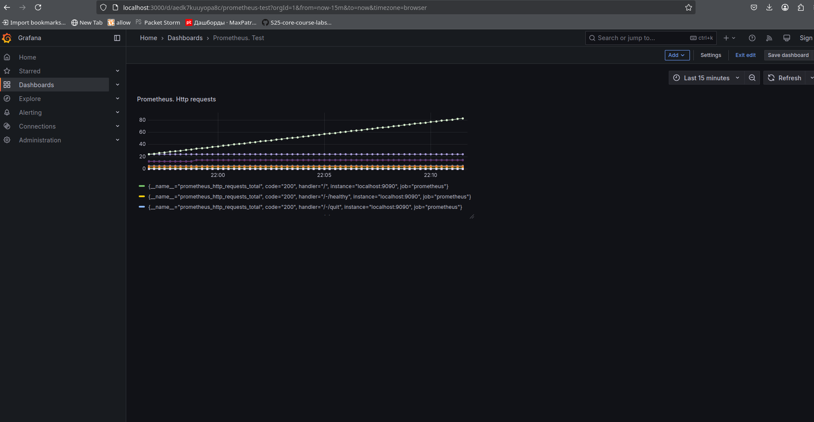
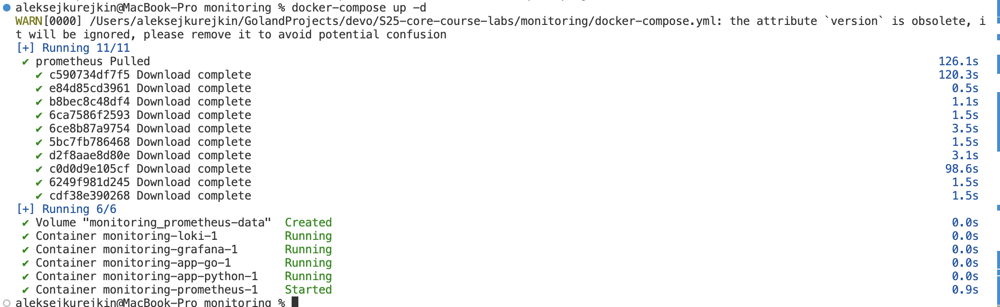

# Prometheus

Accessing <http://localhost:9090/targets> gives the result of successful setup

## Loki dashboard

## Prometheus dashboard

## Service Configuration Updates

### Log Rotation

- **Logging Configuration**: Added log rotation mechanisms to each service using the `json-file` driver.
  - **Max Size**: 10MB
  - **Max Files**: 3

### Memory Limits

- **Memory Limits**: Specified memory limits for each container to ensure efficient resource management.
  - **Loki**: 512MB
  - **Promtail**: 256MB
  - **Grafana**: 512MB
  - **Prometheus**: 512MB
  - **Database (db)**: 512MB
  - **Backend**: 512MB
  - **Frontend**: 256MB

## Prometheus Metrics Gathering

### Prometheus Configuration

- **Prometheus Configuration**: Extended Prometheus to gather metrics from all services defined in the `docker-compose.yml` file.
- **Scrape Configurations**:
  - **Loki**: Scrapes metrics from `loki:3100`
  - **Promtail**: Scrapes metrics from `promtail:9080` (assuming Promtail exposes metrics on port 9080)
  - **Grafana**: Scrapes metrics from `grafana:3000`
  - **Prometheus**: Scrapes metrics from `localhost:9090`
  - **Database (db)**: Scrapes metrics from `db:5432`
  - **Backend**: Scrapes metrics from `backend:8080`
  - **Frontend**: Scrapes metrics from `frontend:3000`
