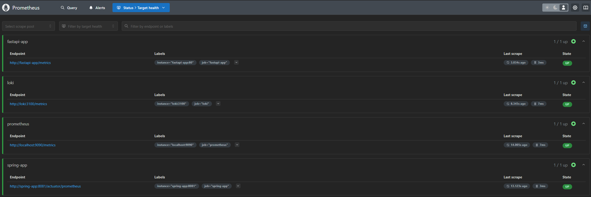
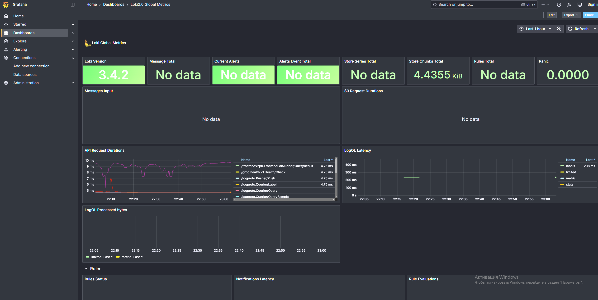
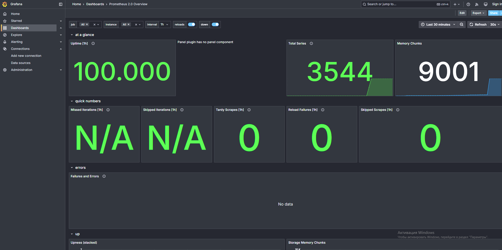
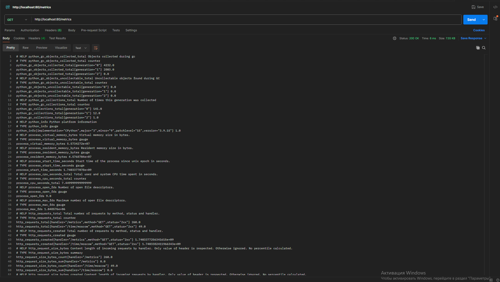
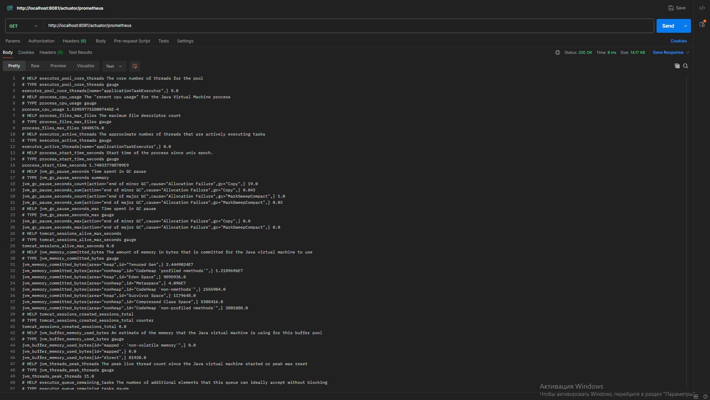
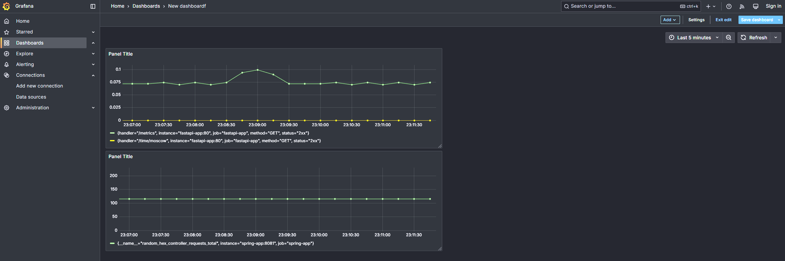

## Lab 8: Monitoring with Prometheus

### Overview
In this lab, we set up Prometheus to monitor various services and configured Grafana dashboards for visualization. Below are the details of the tasks completed, along with screenshots and configurations.

---

## Task 1: Prometheus Setup

### Integration with Docker Compose
Expanded the `docker-compose.yml` file to include Prometheus and other services. Key configurations:
- Added log rotation mechanisms (`max-size: 10m`, `max-file: 3`).
- Specified memory limits for all containers.

### Prometheus Configuration
Configured Prometheus to scrape metrics from:
- `prometheus`
- `loki`
- `fastapi-app`
- `spring-app`

**Prometheus Configuration (`prometheus.yml`)**:
```yaml
global:
  scrape_interval: 15s
scrape_configs:
  - job_name: 'prometheus'
    static_configs:
      - targets: ['localhost:9090']
  - job_name: 'loki'
    static_configs:
      - targets: ['loki:3100']
  - job_name: 'fastapi-app'
    static_configs:
      - targets: ['fastapi-app:80']
  - job_name: 'spring-app'
    static_configs:
      - targets: ['spring-app:8081']
    metrics_path: '/actuator/prometheus'
```

### Verify Prometheus Targets

Accessed [http://localhost:9090/targets](http://localhost:9090/targets) to confirm that Prometheus is correctly scraping metrics.

**Screenshot**:



## Task 2: Dashboard and Configuration Enhancements

### Grafana Dashboards

Set up dashboards in Grafana for both Loki and Prometheus.

- **Loki Dashboard**: Visualized logs collected by Loki.
- **Prometheus Dashboard**: Displayed metrics scraped by Prometheus.

**Screenshots**:
- 
- 

---

### Service Configuration Updates

Enhanced the `docker-compose.yml` file with:

- Log rotation mechanisms.
- Memory limits for all containers.

**Updated `docker-compose.yml` Snippet**:
```yaml
x-logging: &default-logging
  driver: "json-file"
  options:
    max-size: "10m"   # Log rotation: Each log file will be limited to 10MB
    max-file: "3"     # Keep up to 3 rotated log files

services:
  prometheus:
    deploy:
      resources:
        limits:
          memory: 1G  # Memory limit for Prometheus container
  grafana:
    deploy:
      resources:
        limits:
          memory: 1G  # Memory limit for Grafana container
  fastapi-app:
    deploy:
      resources:
        limits:
          memory: 512M  # Memory limit for FastAPI app container
  spring-app:
    deploy:
      resources:
        limits:
          memory: 1G  # Memory limit for Spring Boot app container
```

## Bonus Task: Metrics and Health Checks

### Application Metrics

Integrated metrics into applications using Python examples:

- **FastAPI App**: Configured to export metrics at `/metrics`.
- **Spring Boot App**: Used Actuator to expose metrics at `/actuator/prometheus`.

**Screenshots**:
- 
- 

---

### Health Checks

**Health Check Example**:

Accessed [http://localhost:8081/actuator/health](http://localhost:8081/actuator/health) to confirm that healthchecks work

```yaml
{
    "status": "UP"
}
```

In addition, I exposed my own metric from Java application, you can check it in the screenshot

