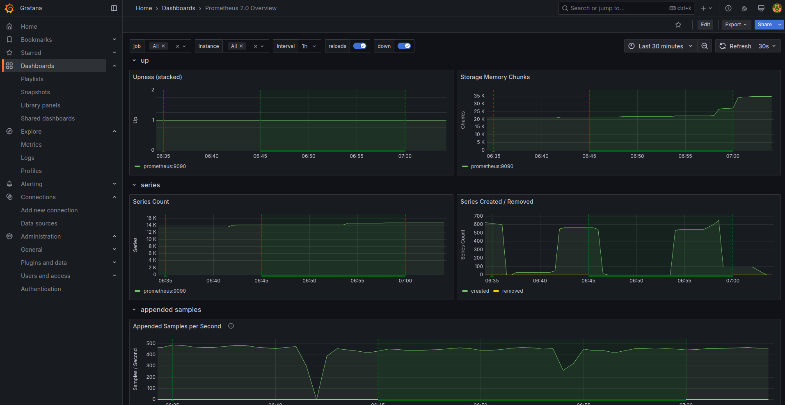
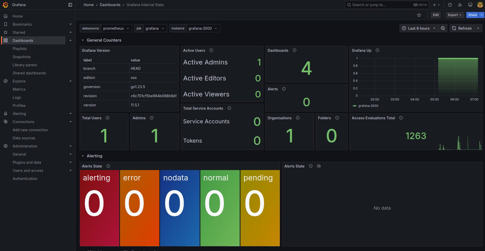
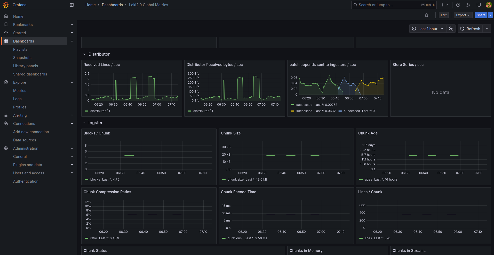
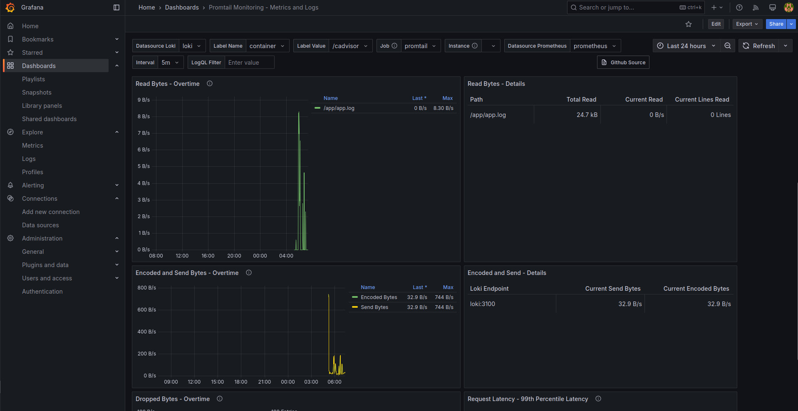
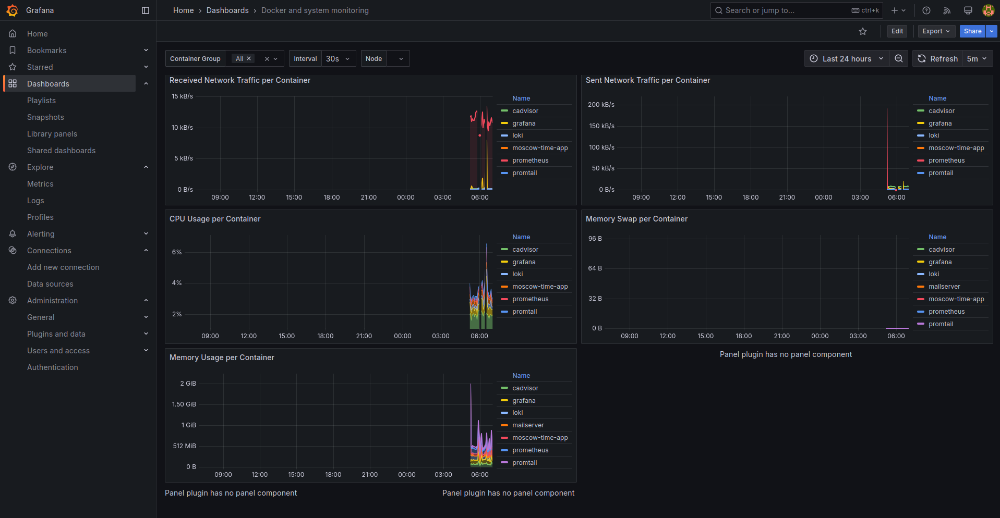

This document describes the metrics collected from various services in our monitoring stack.

## 📌 Table of Contents

1. [Prometheus Metrics](#prometheus-metrics)
2. [Grafana Metrics](#grafana-metrics)
3. [Loki Metrics](#loki-metrics)
4. [Promtail Metrics](#promtail-metrics)
5. [cAdvisor Metrics (Docker Containers)](#cadvisor-metrics-docker-containers)
6. [Moscow Time App Metrics](#moscow-time-app-metrics)
7. [Screenshots](#screenshots)

---

## 📊 Prometheus Metrics

Prometheus collects information about its own operation and the targets it scrapes.

| Metric Name                     | Description |
|----------------------------------|------------|
| `prometheus_target_interval_length_seconds` | Time interval between two scrapes (in seconds). |
| `prometheus_tsdb_head_samples_appended_total` | Number of samples added to the Prometheus database. |
| `prometheus_http_requests_total` | Total number of HTTP requests made to the Prometheus API. |
| `prometheus_sd_discovered_targets` | Number of targets discovered via service discovery. |
| `up{job="moscow-time-app"}` | Indicates if our Moscow Time App is available (`1` - OK, `0` - Unavailable). |

➡ **Endpoint:** `http://localhost:9090/metrics`

---

## 📊 Grafana Metrics

Grafana can expose its own metrics if `GF_METRICS_ENABLED=true` is set in the environment.

| Metric Name                 | Description |
|-----------------------------|------------|
| `grafana_info` | Provides information about Grafana version and settings. |
| `grafana_http_request_duration_seconds_count` | Number of HTTP requests handled by Grafana (API/UI). |
| `grafana_datasource_request_duration_seconds` | Time taken to process data source requests (e.g., Prometheus queries). |

➡ **Endpoint:** `http://localhost:3000/metrics`

---

## 📊 Loki Metrics

Loki exports internal metrics related to log ingestion and processing.

| Metric Name                    | Description |
|---------------------------------|------------|
| `loki_ingester_bytes_received_total` | Total bytes of logs received by Loki. |
| `loki_distributor_bytes_received_total` | Total bytes of logs forwarded to Loki via Promtail. |
| `loki_request_duration_seconds` | Time taken to process Loki requests. |

➡ **Endpoint:** `http://localhost:3100/metrics`

---

## 📊 Promtail Metrics

Promtail is a log shipping agent that sends logs to Loki.

| Metric Name                     | Description |
|----------------------------------|------------|
| `promtail_received_bytes_total` | Total bytes of logs received by Promtail. |
| `promtail_requests_total` | Total number of HTTP requests handled by Promtail. |

➡ **Endpoint:** `http://localhost:9080/metrics`

---

## 📊 cAdvisor Metrics (Docker Containers)

cAdvisor provides detailed container resource metrics.

| Metric Name                                      | Description |
|-------------------------------------------------|------------|
| `container_memory_usage_bytes` | Current memory usage of a container (in bytes). |
| `container_cpu_usage_seconds_total` | Total CPU time consumed by a container. |
| `container_network_transmit_bytes_total` | Total bytes transmitted over the network. |
| `container_network_receive_bytes_total` | Total bytes received over the network. |
| `container_fs_usage_bytes` | Filesystem usage of a container. |

➡ **Endpoint:** `http://localhost:8080/metrics`

---

## 📊 Screenshots

### Prometheus Screen

### Grafana Screen

### Loki Screen

### Promtail Screen

### cAdvisor Screen

