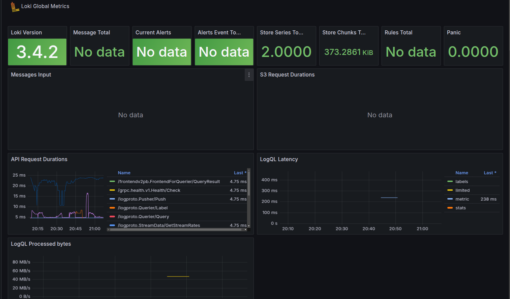
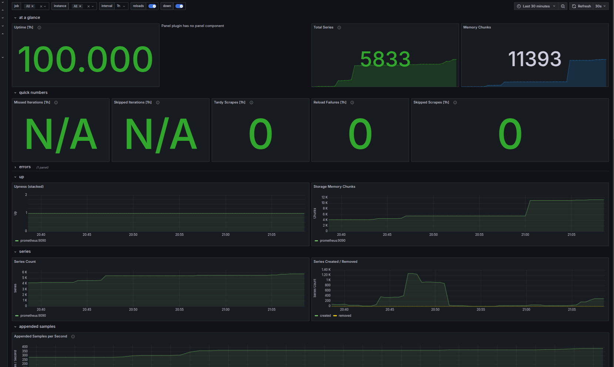
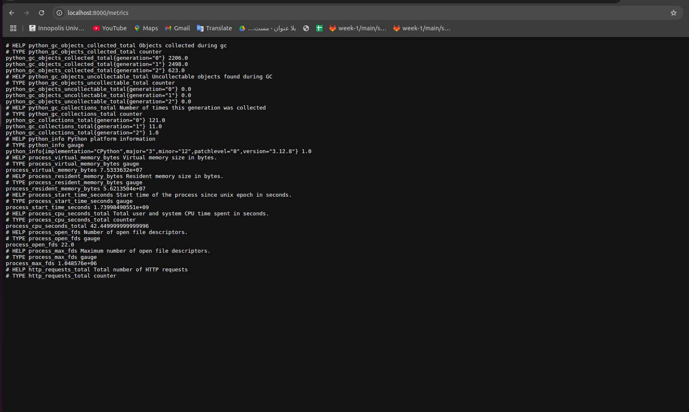
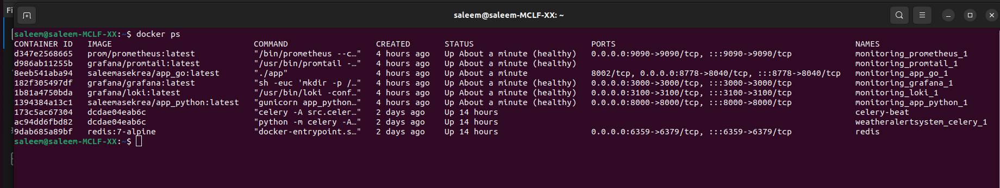

# Metrics


## All services Metrics

- To collect info from Prometheus and Loki and python app:

    - 

---

## Grafana Dashboards

I used proposed templates to create dashboards in Grafana. This one for Loki:

  - 

And this one for Prometheus:

  - 

---

## Additional settings

- **Log rotation mechanisms**: Maximum 3 log files of maximum 10Mb each for rotation;

- **Memory limits for containers**: 512Md maximum per application (for both Python and go).

Example from Python in docker-compose.yml:

- ```yml
  app_python:
      image: saleemasekrea/app_python:latest
      ports:
        - "8000:8000"
      networks:
        - loki
      healthcheck:
        test: ["CMD", "pgrep", "python"]
        interval: 30s
        timeout: 10s
        retries: 5
      logging:
        driver: "json-file"
        options:
          max-size: "10m"
          max-file: "3"
  ```

---

## Python app metrics

I setted up sending metrics from Python app using `prometheus-client`:



---

## Health checks

- I added health checks to the docker-compose.yml for all services. Each service has similar settings:
    - Interval: 30 seconds
    - Timeout: 10 seconds
    - Retries: 5
    - All services use pgrep for health checks, except Grafana, which requires curl.

    - 

---