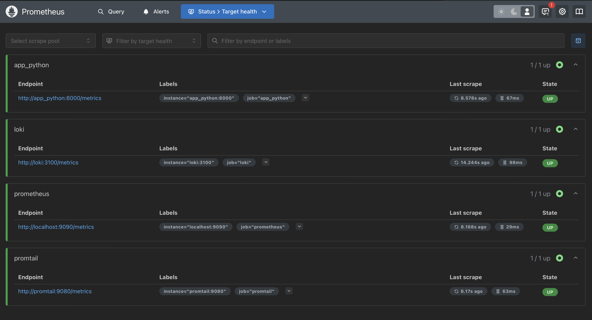

# Metrics

The `prometheus.yml` file defines the targets that Prometheus will scrape for metrics. In `docker-compose.yml` defines the services for your application and monitoring stack.

# Screenshot
