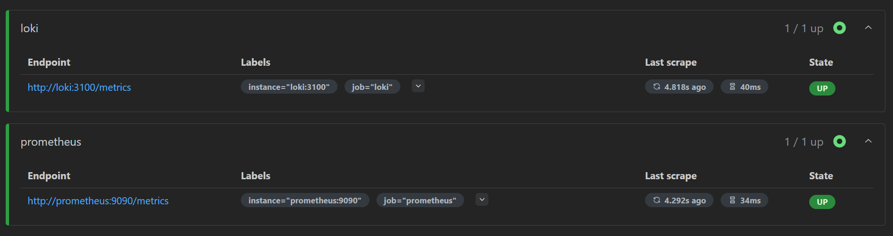

# METRICS Setup and Verification

## Integration with Docker Compose

In this setup, Prometheus is integrated into the `docker-compose.yml` file to collect metrics from Loki and Prometheus containers.

### Docker Compose Configuration:

```yaml
version: "3"

networks:
  default:
    name: monitoring_network

volumes:
  loki-storage:

services:
  app_python:
    image: chr1st1na/app_python:latest
    ports:
      - "5000:5000"

  loki:
    image: grafana/loki:latest
    ports:
      - "3100:3100"
    command: -config.file=/etc/loki/local-config.yaml
    volumes:
      - loki-storage:/loki

  promtail:
    image: grafana/promtail:latest
    volumes:
      - /var/log:/var/log
      - ./promtail.yml:/etc/promtail/config.yml
      - /var/lib/docker/containers:/var/lib/docker/containers:ro
    command: -config.file=/etc/promtail/config.yml
    depends_on:
      - loki

  grafana:
    environment:
      - GF_PATHS_PROVISIONING=/etc/grafana/provisioning
      - GF_AUTH_ANONYMOUS_ENABLED=true
      - GF_AUTH_ANONYMOUS_ORG_ROLE=Admin
    entrypoint:
      - sh
      - -euc
      - |
        mkdir -p /etc/grafana/provisioning/datasources
        cat <<EOF > /etc/grafana/provisioning/datasources/ds.yaml
        apiVersion: 1
        datasources:
        - name: Loki
          type: loki
          access: proxy 
          orgId: 1
          url: http://loki:3100
          basicAuth: false
          isDefault: true
          version: 1
          editable: false
        EOF
        /run.sh
    image: grafana/grafana:latest
    ports:
      - "3000:3000"
    depends_on:
      - loki

  prometheus:
    image: prom/prometheus:latest
    container_name: prometheus
    ports:
      - "9090:9090"
    volumes:
      - ./prometheus.yml:/etc/prometheus/prometheus.yml
    restart: always
    user: root 
    depends_on:
      - loki
```

Prometheus Configuration (`prometheus.yml`):

```yaml
global:
  scrape_interval: 15s  

scrape_configs:
  - job_name: 'prometheus'
    static_configs:
      - targets: ['prometheus:9090']

  - job_name: 'loki'
    static_configs:
      - targets: ['loki:3100']
```

## Prometheus Configuration Verification
### Verify Prometheus Targets:
Navigate to http://localhost:9090/targets in your browser.

Ensure that Prometheus is scraping data from both the prometheus and loki containers.

The target list should show both `prometheus:9090` and `loki:3100`.




## Conclusion
By following the above configuration, Prometheus is set up to collect metrics from both the prometheus and loki containers.