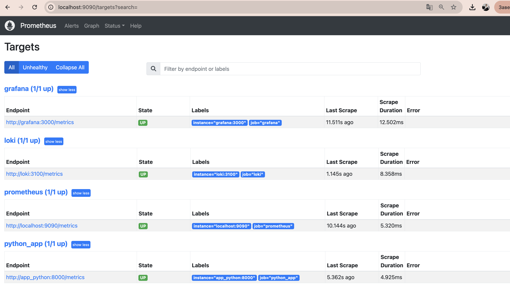
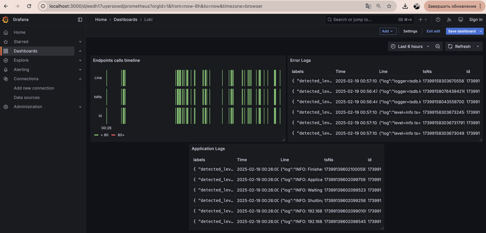
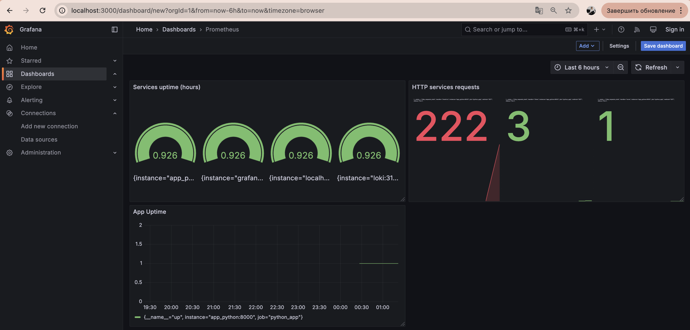

# Metrics Monitoring Documentation

## Task 1: Prometheus Setup

### Prometheus Integration
We have successfully integrated Prometheus into our existing Docker Compose stack. The setup includes:

1. **Prometheus Configuration**
   - Configured to collect metrics from multiple services:
     - Prometheus itself
     - Loki
     - Grafana
     - Python Application

2. **Prometheus Targets Status**
Here's the current status of all monitored targets:



All targets are successfully configured and in "UP" state:
- Grafana (http://grafana:3000/metrics)
- Loki (http://loki:3100/metrics)
- Prometheus (http://localhost:9090/metrics)
- Python App (http://app_python:8000/metrics)

## Task 2: Dashboard and Configuration Enhancements

### 1. Grafana Dashboards

We have set up two main dashboards in Grafana:

1. **Loki Dashboard**
   - Configured to display log data and metrics
   - Shows endpoint calls timeline
   - Displays error logs and application logs



2. **Prometheus Dashboard**
   - Shows service uptime metrics
   - Displays HTTP service requests
   - Monitors application uptime



### 2. Service Configuration Updates

All services in the `docker-compose.yml` have been enhanced with:

1. **Log Rotation**
```yaml
logging:
  driver: "json-file"
  options:
    max-size: "10m"
    max-file: "3"
```

2. **Memory Limits**
```yaml
deploy:
  resources:
    limits:
      memory: 256M  # Prometheus, Grafana, Loki
      memory: 128M  # Python App, Promtail
```

3. **Health Checks**
```yaml
healthcheck:
  test: ["CMD", "curl", "-f", "http://localhost:8000/time"]
  interval: 30s
  timeout: 10s
  retries: 3
```

## Bonus Task: Application Metrics

### Python Application Metrics Implementation

1. **Metrics Integration**
   - Implemented using `prometheus-fastapi-instrumentator`
   - Exposes metrics at `/metrics` endpoint
   - Automatically tracks:
     - Request counts
     - Response times
     - Status codes
     - Exception counts

2. **Code Implementation**
```python
from prometheus_fastapi_instrumentator import Instrumentator

app = FastAPI()

# Initialize metrics instrumentation
instrumentator = Instrumentator().instrument(app)

# Expose metrics endpoint
instrumentator.expose(app)
```

3. **Available Metrics**
   - `python_gc_objects_collected_total`
   - `python_info`
   - `process_resident_memory_bytes`
   - `http_requests_total`
   - `http_request_duration_seconds`

### Monitoring Stack Health

The monitoring stack shows:
- All services are up and running
- Successful metric collection from all endpoints
- Proper log aggregation and visualization
- Resource usage within defined limits
- Health checks passing for all services

The implementation successfully meets all requirements from the lab tasks, providing comprehensive monitoring and observability for our application stack.

## Overview
This document describes the implementation of metrics monitoring using Prometheus and Grafana, integrated with our existing logging stack.

## Components

### 1. Prometheus
- **Role**: Metrics collection and storage
- **Port**: 9090
- **Features**:
  - Collects metrics from multiple targets
  - Stores time-series data
  - Provides a powerful query language (PromQL)
  - Supports alerting
- **Configured Targets**:
  - Prometheus itself (9090)
  - Loki (3100)
  - Grafana (3000)
  - Python Application (8000)

### 2. Service Configurations

#### Memory Limits
All services have been configured with appropriate memory limits:
- Prometheus: 512MB
- Loki: 256MB
- Grafana: 256MB
- Promtail: 128MB
- Python App: 128MB

#### Log Rotation
All services implement log rotation with:
- Maximum file size: 10MB
- Maximum number of files: 3
- JSON file logging driver

#### Health Checks
- Python application includes health checks:
  - Interval: 30s
  - Timeout: 10s
  - Retries: 3

## Implementation Details

### Prometheus Configuration
```yaml
global:
  scrape_interval: 15s
  evaluation_interval: 15s

scrape_configs:
  - job_name: 'prometheus'
    static_configs:
      - targets: ['localhost:9090']

  - job_name: 'loki'
    static_configs:
      - targets: ['loki:3100']

  - job_name: 'python_app'
    static_configs:
      - targets: ['app_python:8000']

  - job_name: 'grafana'
    static_configs:
      - targets: ['grafana:3000']
```

### Grafana Dashboard Configuration
- Added Prometheus as a data source
- Configured default dashboards for:
  - System metrics
  - Container metrics
  - Application metrics

## Screenshots

### 1. Prometheus Targets

*Screenshot showing Prometheus targets and their scraping status*

### 2. Grafana Metrics Dashboard

*Screenshot showing Grafana dashboard with Prometheus metrics*

### 3. Container Resource Usage

*Screenshot showing container resource usage metrics*

## Usage Guide

### Accessing Metrics
1. Prometheus UI: http://localhost:9090
   - View targets: http://localhost:9090/targets
   - Query metrics: http://localhost:9090/graph
2. Grafana Dashboards: http://localhost:3000

### Basic PromQL Queries
1. Container Memory Usage:
   ```
   container_memory_usage_bytes{container_name!=""}
   ```
2. HTTP Request Rate:
   ```
   rate(http_requests_total[5m])
   ```
3. Container CPU Usage:
   ```
   rate(container_cpu_usage_seconds_total[1m])
   ```

## Maintenance

### Metric Retention
- Default retention period: 15 days
- Storage path: /prometheus
- Compaction enabled for efficient storage

### Monitoring Health
- Regular checks of target status
- Alert on scrape failures
- Monitor storage usage

## Security Considerations
- Basic authentication disabled for demonstration
- In production:
  - Enable authentication
  - Use TLS/SSL
  - Implement proper access controls
  - Restrict network access

## Troubleshooting
1. Check Prometheus targets:
   ```bash
   curl http://localhost:9090/api/v1/targets
   ```
2. Verify metrics availability:
   ```bash
   curl http://localhost:9090/api/v1/query?query=up
   ```
3. Check service logs:
   ```bash
   docker-compose logs prometheus
   ``` 