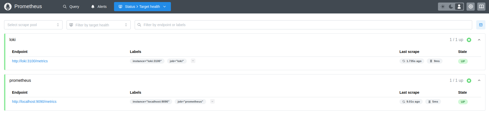
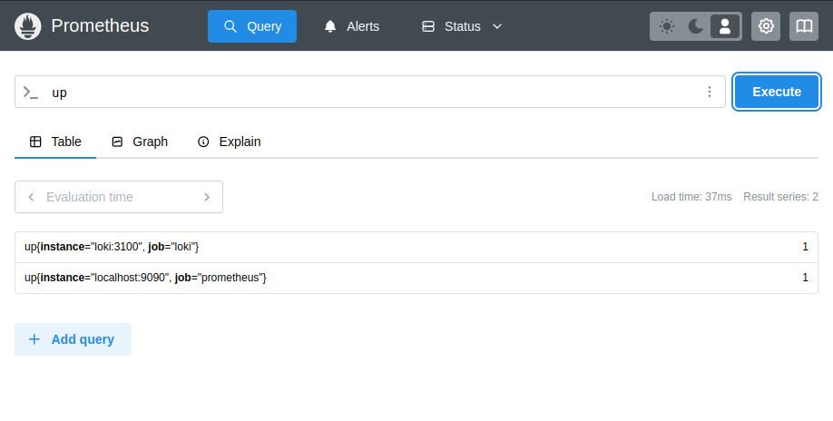
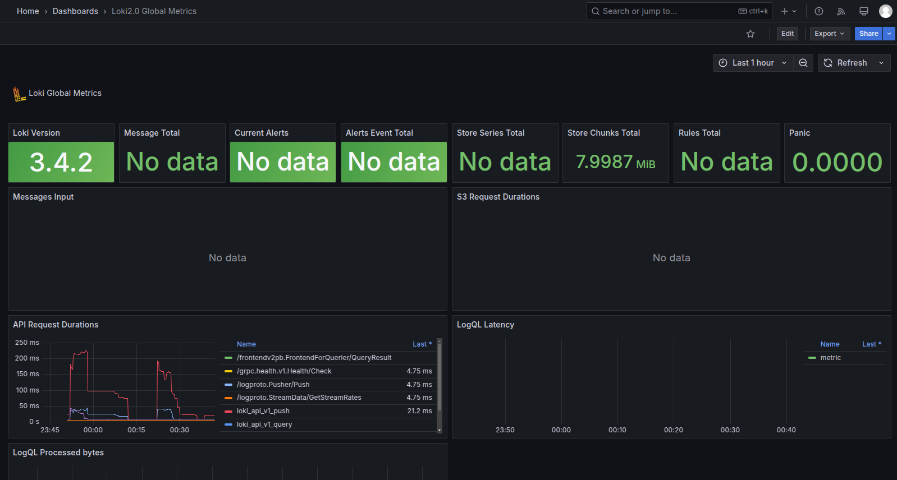
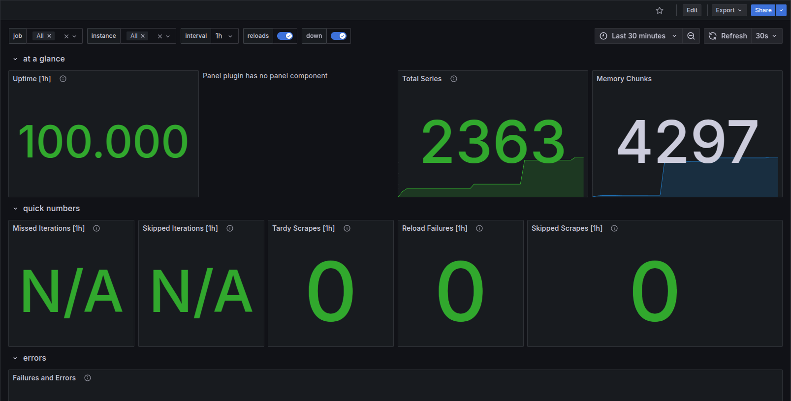
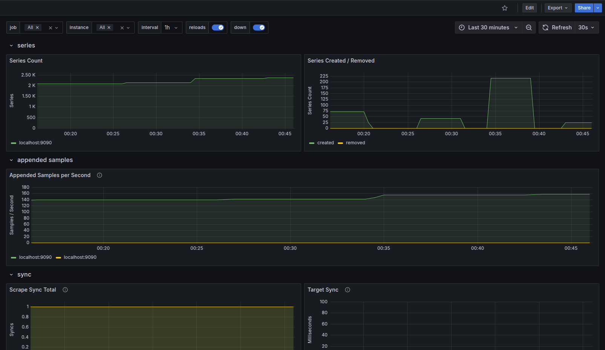

# Prometheus Report

## **Overview**

This document provides verification and documentation for the setup of **Prometheus monitoring, Grafana dashboards, and Loki logging**. The following components were configured:

- **Prometheus** to collect metrics from all services.
- **Grafana Dashboards** to visualize metrics and logs.
- **Loki** for log aggregation and querying.
---
## **Task 1: Prometheus Setup**

### 🔹 **Prometheus Overview**
Prometheus is an open-source monitoring system used for collecting, storing, and querying time-series metrics. It scrapes data from configured services and makes it available for analysis in Grafana.

### 🔹 **Verifying Prometheus Targets**
After configuring Prometheus, we confirmed that it successfully scrapes metrics from:
1. **Prometheus**
2. **Loki**


### **1. Prometheus Targets Page**
  

### **2. Prometheus Metrics Query**
  

## **Task 2: Dashboard and Configuration Enhancements**
#### **Grafana Loki Dashboard**


####  **Grafana Prometheus Dashboard**




## **Enhancing Service Configuration**

### 🔹 **Log Rotation and Memory Limits**
To optimize performance and prevent excessive logging, the following enhancements were made in `docker-compose.yml`:

| **Service**     | **Max Log Size** | **Max Log Files** | **Memory Limit** | **Memory Reservation** |
|----------------|---------------|---------------|----------------|------------------|
| Flask App     | 50MB          | 5            | 256MB          | 128MB           |
| Loki         | 50MB          | 5            | 512MB          | 256MB           |
| Promtail      | 50MB          | 5            | 256MB          | 128MB           |
| Grafana      | 50MB          | 5            | 512MB          | 256MB           |
| Prometheus   | 50MB          | 5            | 512MB          | 256MB           |

### 🔹 **Updated Docker Compose File Enhancements**
- Log rotation enabled for all services (`max-size: 50m`, `max-file: 5`).
- Memory limits applied to prevent excessive resource usage.

---

## **Extending Prometheus to Monitor All Services**

### 🔹 **Updated Prometheus Configuration**
The `prometheus.yml` file was modified to include scraping for all services:

```yaml
global:
  scrape_interval: 15s
  evaluation_interval: 15s

scrape_configs:
  - job_name: "prometheus"
    static_configs:
      - targets: ["prometheus:9090"]

  - job_name: "loki"
    static_configs:
      - targets: ["loki:3100"]

  - job_name: "flask_app"
    static_configs:
      - targets: ["flask_app:5000"]
```


---

## **Conclusion**
With these enhancements, the monitoring stack is now fully operational. Prometheus is collecting metrics from all services, Grafana is visualizing logs and metrics, and Loki is aggregating logs efficiently.
