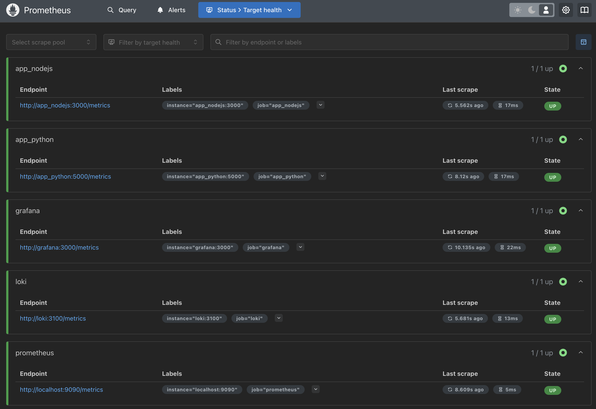
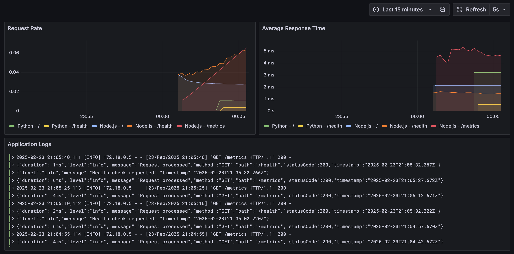

# Metrics Implementation Report

## Prometheus Setup

### Configuration

I've configured Prometheus to collect metrics from:

- Prometheus itself (localhost:9090)
- Loki (loki:3100)
- Grafana (grafana:3000)

### Service Configuration

All services in the stack have been configured with:

- Memory limits
- Health checks
- Log rotation (for applicable services)

Memory limits:

- Prometheus: 512MB
- Loki: 512MB
- Grafana: 512MB
- Promtail: 256MB
- Python App: 256MB
- Node.js App: 256MB

### Screenshots



## Grafana Dashboards



## Service Health Checks

Health check endpoints have been configured for all services:

- Prometheus: `http://localhost:9090/-/healthy`
- Loki: `http://localhost:3100/ready`
- Promtail: `http://localhost:9080/ready`
- Grafana: `http://localhost:3000/api/health`
- Python App: `http://localhost:5001/health`
- Node.js App: `http://localhost:5002/health`

## Log Rotation

Log rotation has been configured for containerized applications:

```yaml
logging:
  driver: "json-file"
  options:
    max-size: "10m"
    max-file: "3"
```

This ensures that logs don't consume excessive disk space while maintaining recent history.
