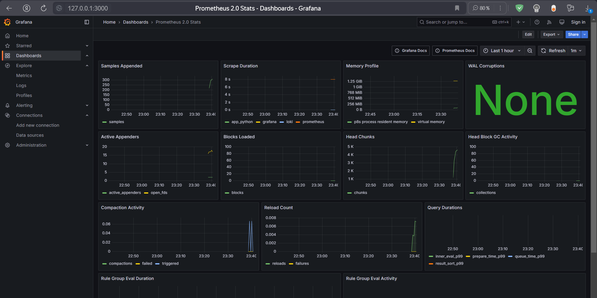
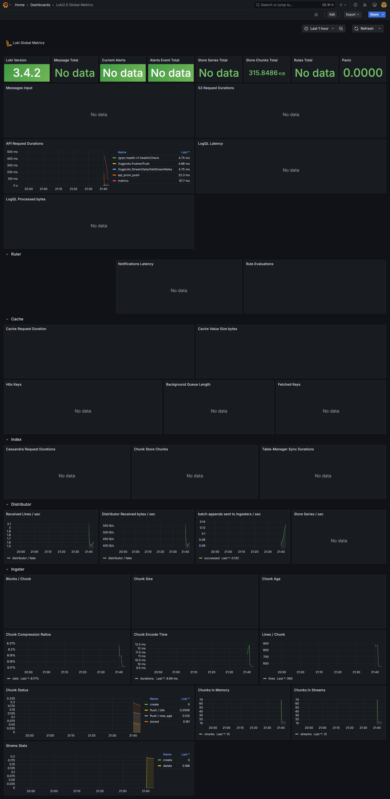

## Resource Limits and Logging

All services have been configured with memory limits and log rotation:

#### Application (Moscow Time)
- Memory Limits: 256MB
- Memory Reservation: 128MB
- Log Rotation: 10MB max size, 3 files

#### Loki
- Memory Limits: 512MB
- Memory Reservation: 256MB
- Log Rotation: 10MB max size, 3 files
- Storage: Persistent volume

#### Prometheus
- Memory Limits: 512MB
- Memory Reservation: 256MB
- Log Rotation: 10MB max size, 3 files
- Scrape Interval: 15s

#### Promtail
- Memory Limits: 256MB
- Memory Reservation: 128MB
- Log Rotation: 10MB max size, 3 files

#### Grafana
- Memory Limits: 512MB
- Memory Reservation: 256MB
- Log Rotation: 10MB max size, 3 files

## Monitoring Screenshots

