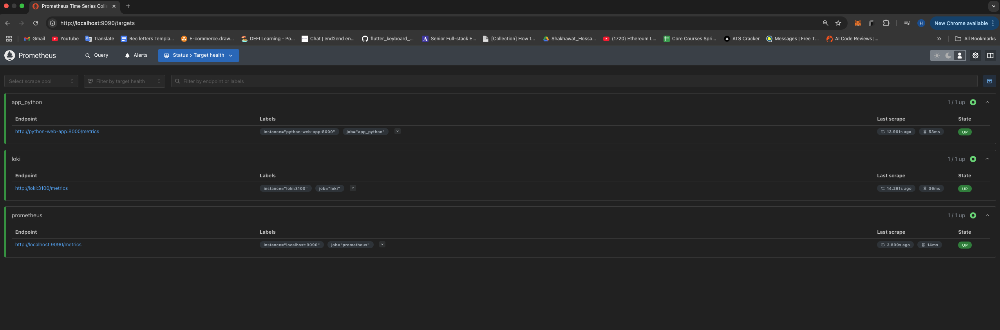
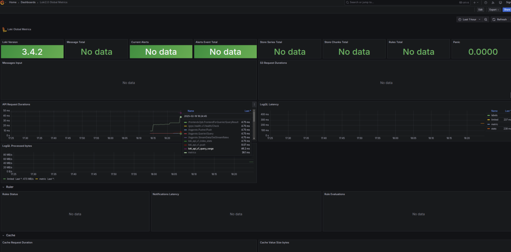
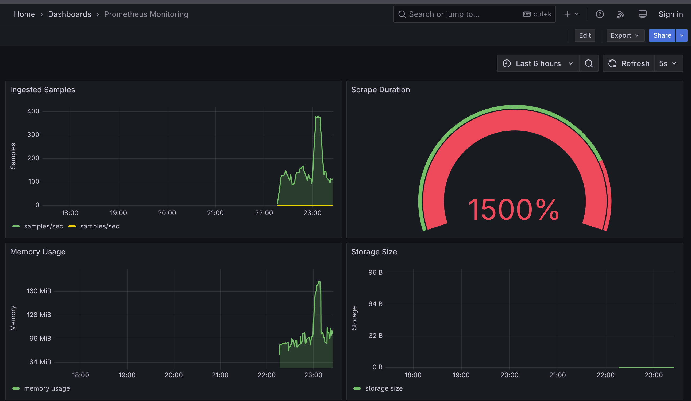
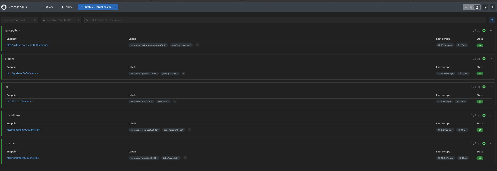

# Monitoring

## Task 1

I have added Prometheus monitoring with the following configuration:

- Running on port 9090
- Using the official `prom/prometheus:latest` image
- Configured with a memory limit of 512MB
- Mounted prometheus.yml configuration file which scrapes metrics from:
  - Prometheus itself (localhost:9090)
  - Loki (port 3100)
  - Python web app (port 8000)
  - Grafana (port 3000)
  - Promtail (port 9080)

You can verify Prometheus is running correctly by checking the screenshot.

## Task 2

### - Setup Dashboard

- Loki Dashboard

- Prometheus Dashboard

### - Configuration Details

1. Prometheus is configured to scrape metrics from:

   - Itself (localhost:9090)
   - Loki (3100)
   - Python application (8000)
   - Rust application (8080)

2. Memory Limits:

   - Prometheus: 512MB
   - Loki: 512MB
   - Grafana: 512MB
   - Python Web App: 256MB
   - Rust Web App: 256MB
   - Promtail: 256MB

3. Log Rotation:
   - Max file size: 10MB
   - Max number of files: 3
   - Using json-file logging driver
   - Custom tags for Python and Rust apps

### - Metric Gathering

I have extended the metric gathering to include other services.

## Bonus Task

### - App Metric and How to obtain it

For the Python web application, I have implemented two custom Prometheus metrics:

1. `http_requests_total`: A counter that tracks the total number of HTTP requests made to the application

These metric can be obtained by:

1. Making requests to the application endpoints
2. Accessing the `/metrics` endpoint at `http://localhost:8000/metrics`

The metric is implemented using the `prometheus_client` library with the following details:

- The metric is defined as Counter types, which only increase over time and are ideal for tracking cumulative values like request counts
- The counter is incremented in the main endpoint handler using the `.inc()` method
- The metrics endpoint is automatically created and mounted using `make_asgi_app()` from prometheus_client

The metrics data is automatically scraped by Prometheus based on the configuration in prometheus.yml, making it available for querying and visualization.

### - Adding healthchecks

I have added healthchecks to all services to ensure they are running properly:

1. Prometheus:

   - Endpoint: `http://localhost:9090/-/healthy`
   - Interval: 30s
   - Timeout: 10s
   - Retries: 3

2. Loki:

   - Endpoint: `http://localhost:3100/ready`
   - Interval: 30s
   - Timeout: 10s
   - Retries: 3

3. Grafana:

   - Endpoint: `http://localhost:3000/api/health`
   - Interval: 30s
   - Timeout: 10s
   - Retries: 3

4. Python Web App:

   - Endpoint: `http://localhost:8000`
   - Interval: 30s
   - Timeout: 10s
   - Retries: 3

5. Rust Web App:

   - Endpoint: `http://localhost:8080`
   - Interval: 30s
   - Timeout: 10s
   - Retries: 3

All healthchecks use wget to make HTTP requests to the respective service endpoints. If a service becomes unhealthy, Docker will mark it accordingly and take appropriate action based on the restart policy.
