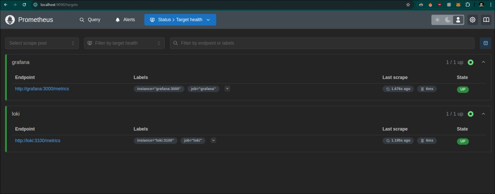
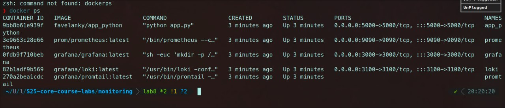
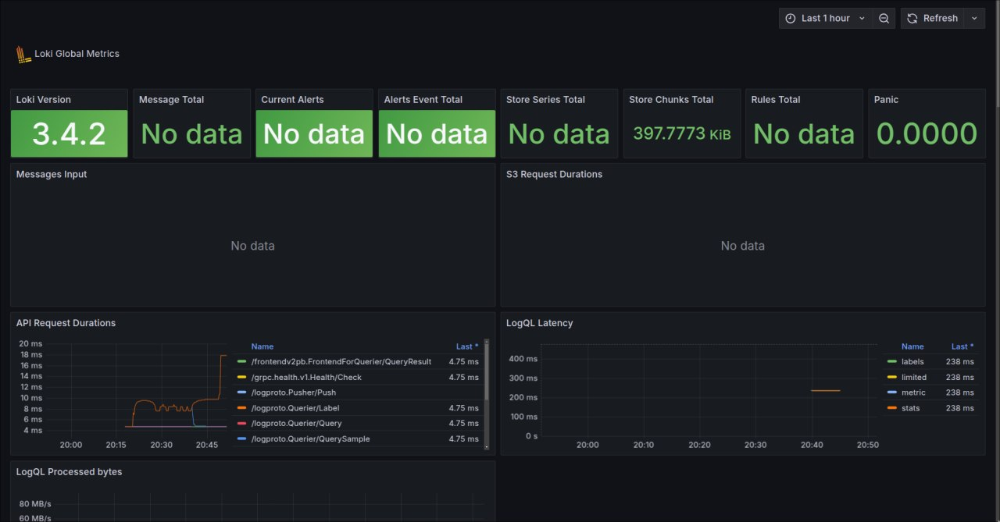
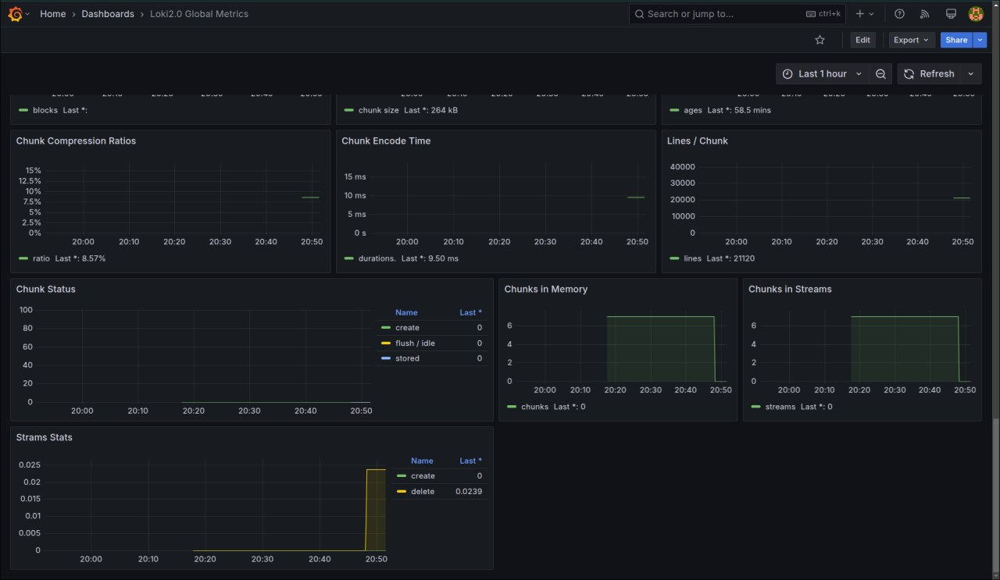

# Screenshots

## Task 1

## Task 2

# Metrics Collection and Logging in Dockerized Monitoring Stack

## **Log Rotation**
- All services use the `json-file` logging driver.
- Logs are limited to **10MB per file**, with a maximum of **3 files** retained.

## **Memory Limits**
- Each container has a memory limit:
  - **app_python**: 512MB
  - **loki**: 512MB
  - **promtail**: 256MB
  - **grafana**: 512MB
  - **prometheus**: 512MB

## **Prometheus Metrics Collection**
- Prometheus scrapes metrics from:
  - **Prometheus itself** (`localhost:9090`)
  - **Flask app** (`app_python:5000`)
  - **Loki** (`loki:3100`)
  - **Grafana** (`grafana:3000`)
  - **Docker daemon** (if enabled) (`host.docker.internal:9323`)

