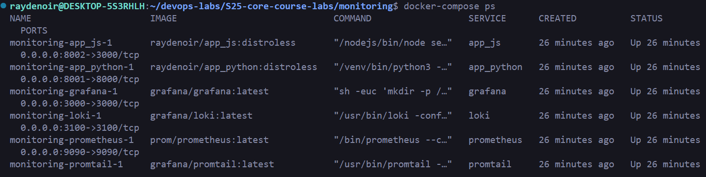
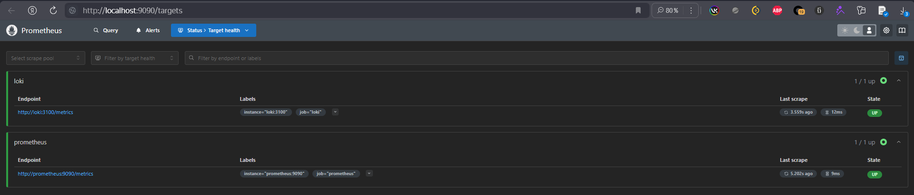
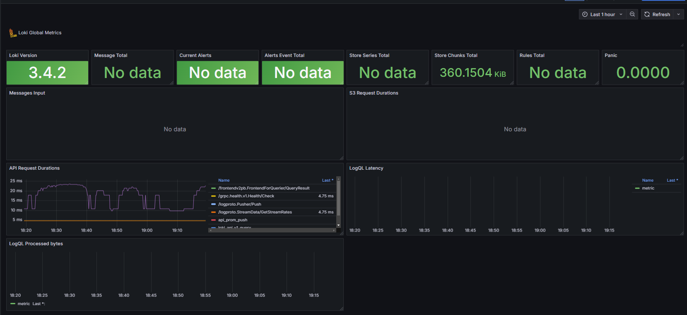
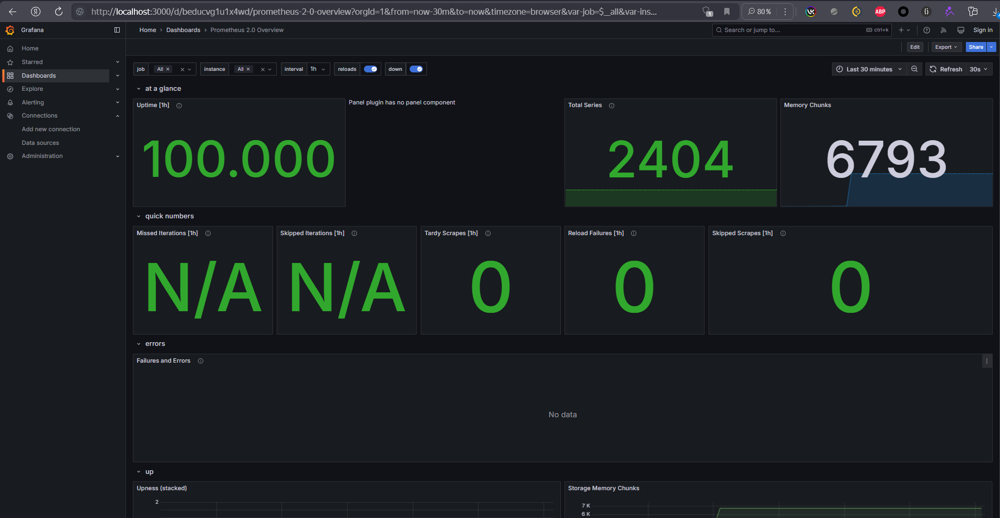
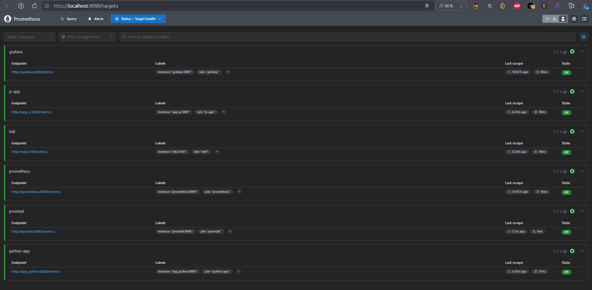
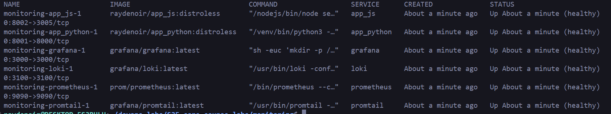

Docker Compose:



Prometheus Targets:



Loki Metrics:



Prometheus Metrics:



Applied Changes:

```docker
logging:
      driver: "json-file" # logs should be stored in JSON.
      options:
        max-size: "10m" # Limits the maximum size of a single log file to 10 megabytes.
        max-file: "3" # Keeps a maximum of 3 log files before rotating.
    deploy:
      resources:
        limits:
          memory: 128M # Restricts the container to use a maximum of 128 megabytes of RAM.
```

Finally, I integrated Prometheus Client with /metrics endpoint in both Python and JS applications and added them as Prometheus Targets (along with other components)



Components Healthcheck:

