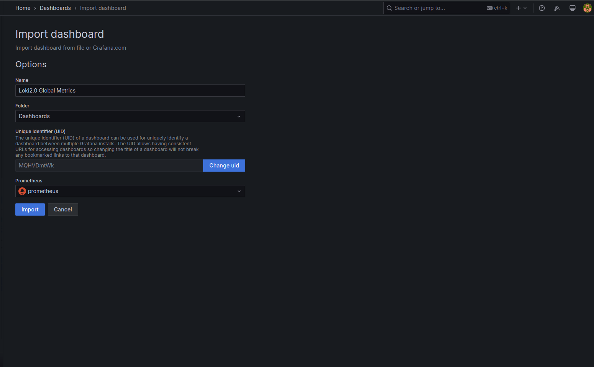
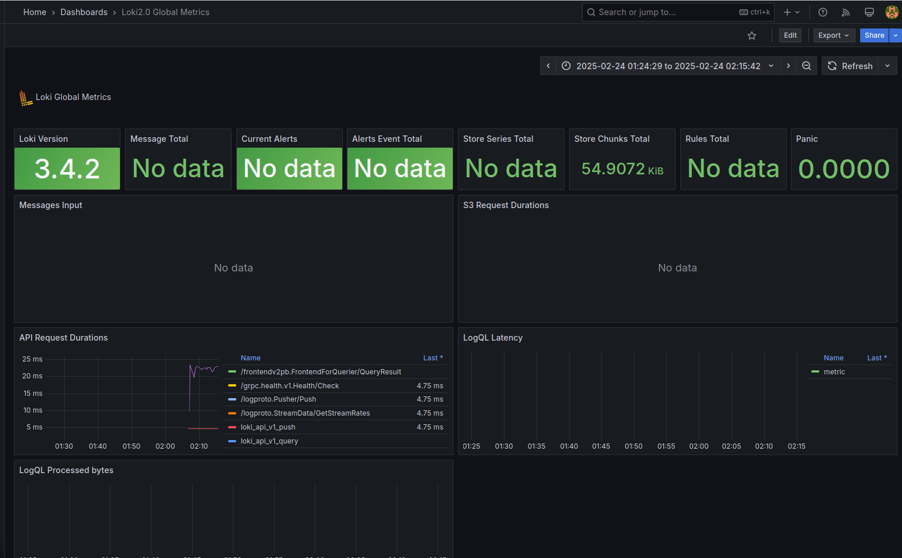
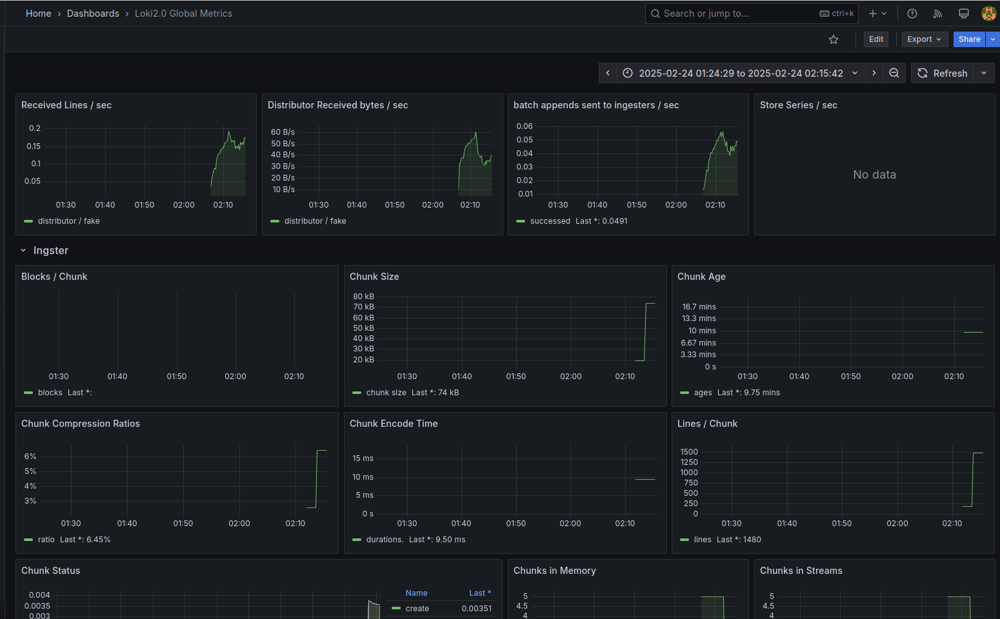
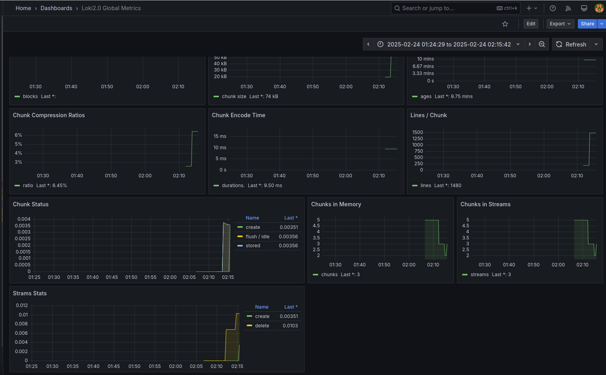
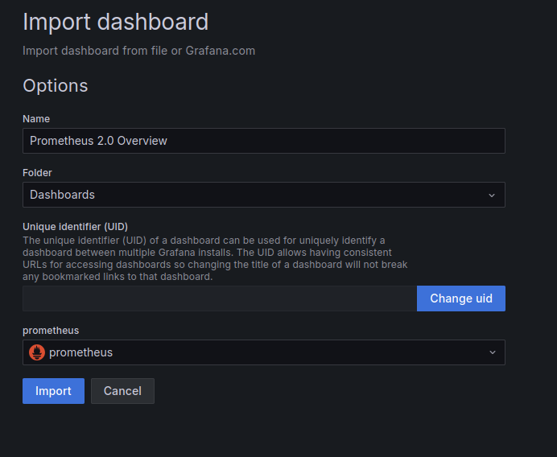
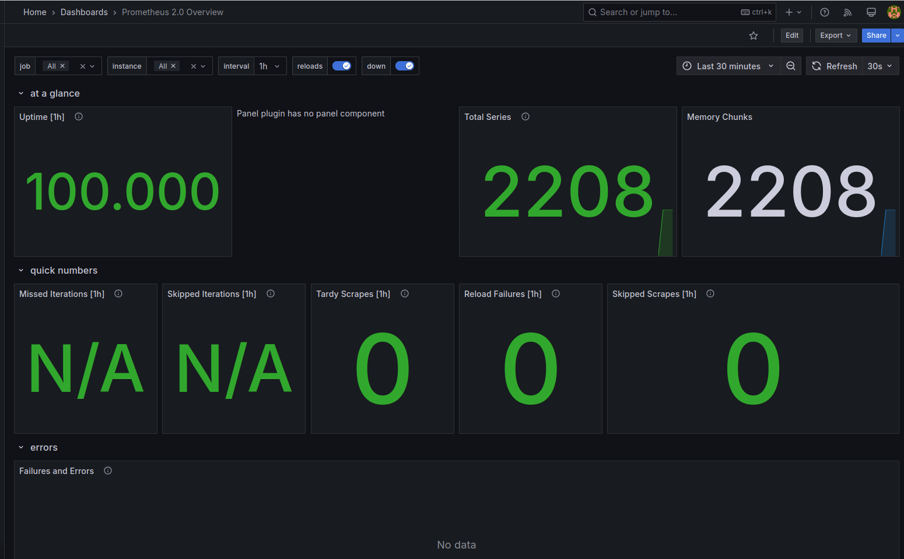
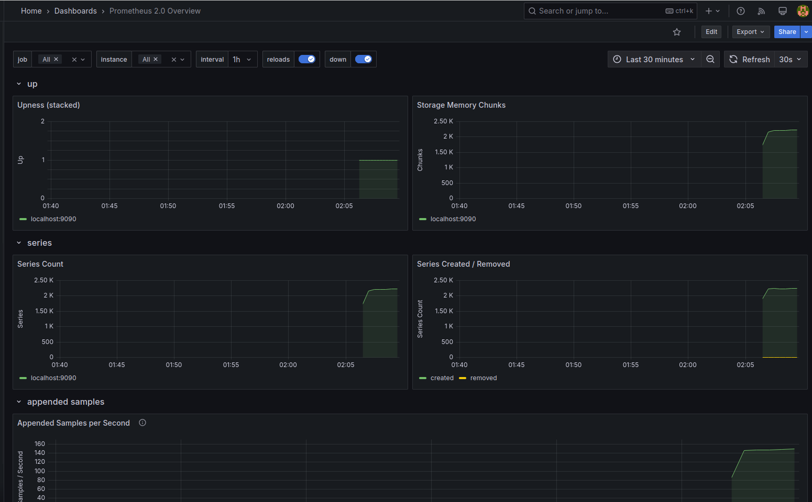
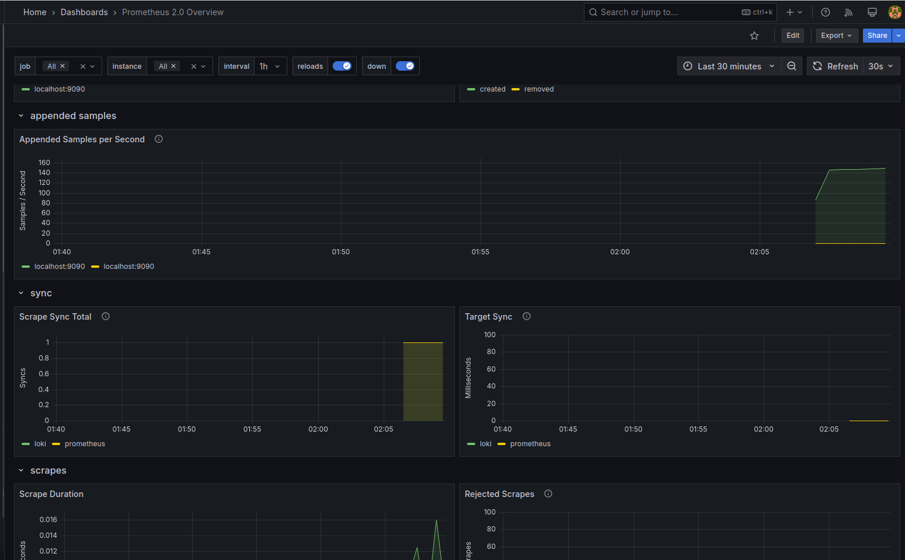
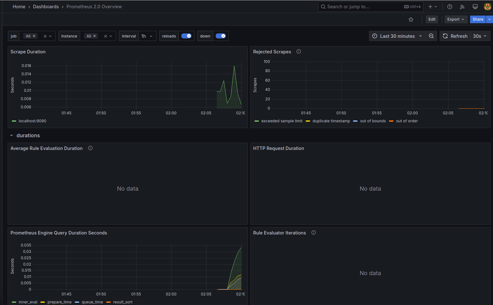
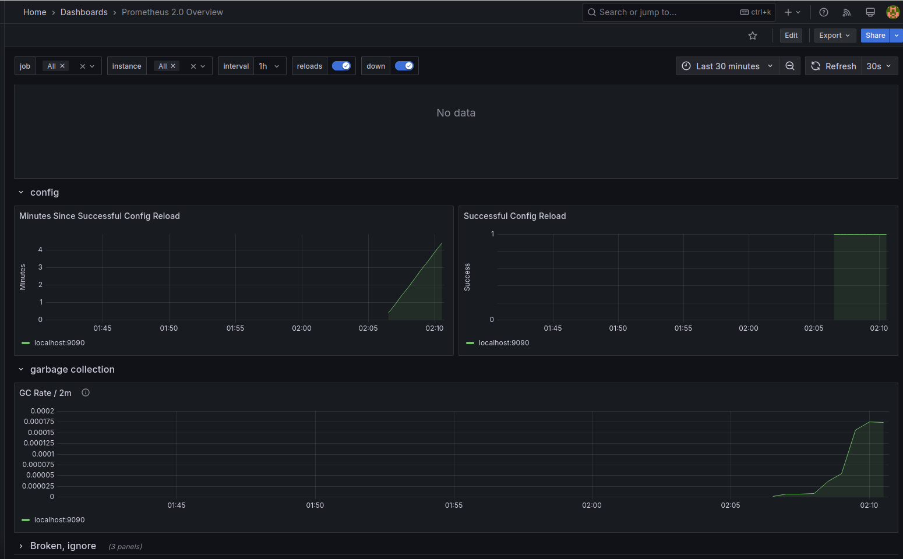

# Monitoring with Prometheus


**Import Loki dashboard**


**Loki dashboard**




**Import prometheus dashboard**


**Prometheus dashboard**






## Log rotation and Memory limits 
```
    deploy:
      resources:
        limits:
          memory: 200M
    logging:
      driver: "json-file"
      options:
        max-size: "10m"
        max-file: "3"
```