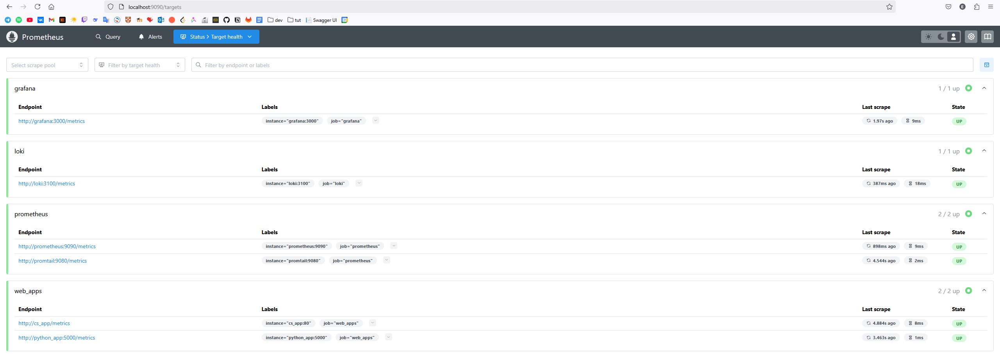
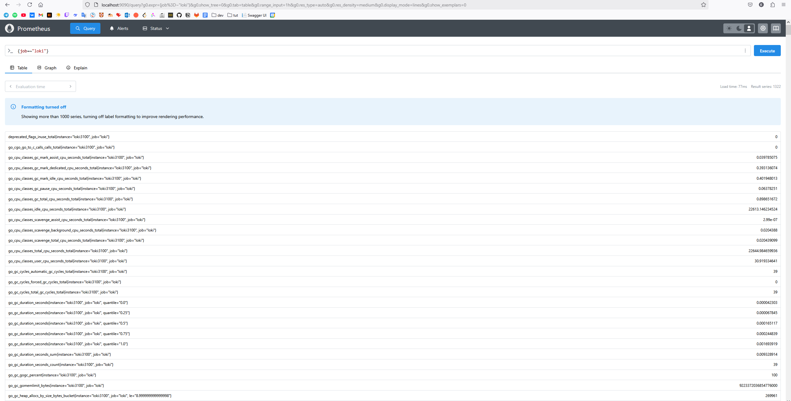
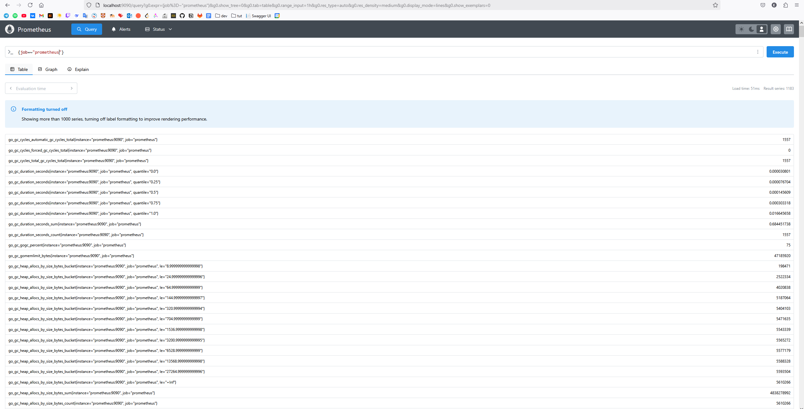
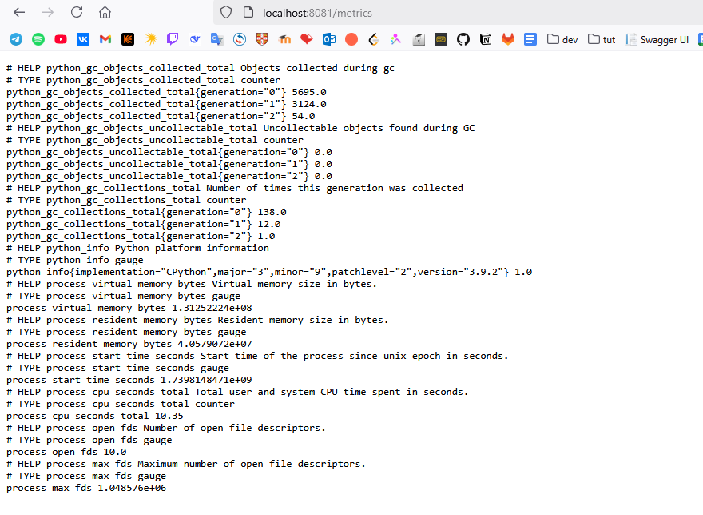
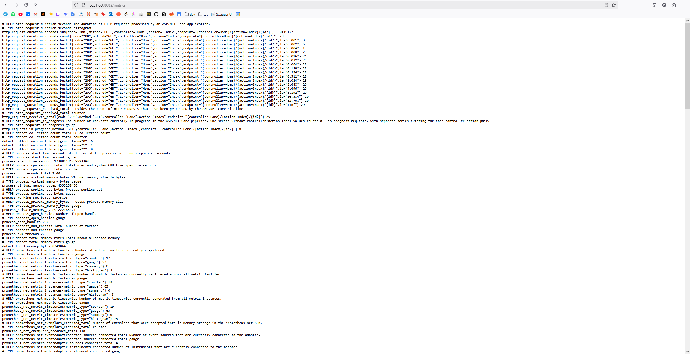
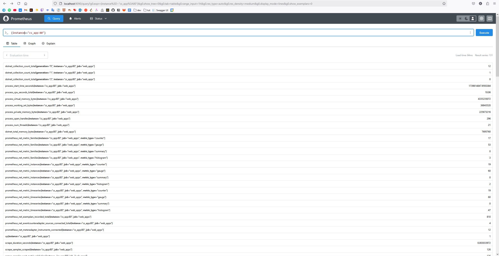
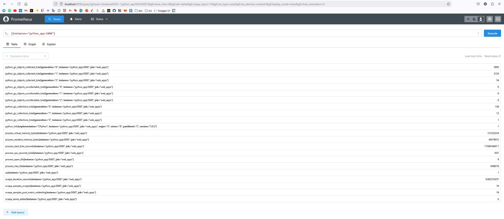

# METRICS.md

## Task 1: Prometheus Setup

### Integration with Docker Compose

- Integrated Prometheus into the `docker-compose.yml` file as shown below:
  - Added the `prometheus` service with memory limits, log rotation, and health checks.
  - Configured Prometheus to scrape metrics from other services (`loki`, `python_app`, `cs_app`).

### Prometheus Configuration

- Configured `prometheus.yml` to collect metrics from:
  - Prometheus itself (`prometheus:9090`)
  - Grafana (`grafana:3000`)
  - Loki (`loki:3100`)
  - Web applications (`python_app:5000`, `cs_app:80`)

### Verify Prometheus Targets

- Accessed `http://localhost:9090/targets` to verify that all targets are successfully being scraped.
- **Screenshots**:





---

## Task 2: Dashboard and Configuration Enhancements

### Grafana Dashboards

- Created dashboards in Grafana for:
  - **Loki**: Used an example dashboard to visualize logs.
  - **Prometheus**: Used an example dashboard to display metrics.
- **Screenshots**:
  - Loki Dashboard: 
  - Prometheus Dashboard: 

### Service Configuration Updates

- Enhanced the `docker-compose.yml` file:
  - **Log Rotation Mechanisms**: Configured `json-file` logging driver with `max-size: 10m` and `max-file: 2` for all services.
  - **Memory Limits**: Specified memory limits for all containers (e.g., `memory: 50M` for Prometheus, `memory: 200M` for Loki).
- **Documentation**: All changes are reflected in the updated `docker-compose.yml`.

### Metrics Gathering

- Extended Prometheus to gather metrics from all services defined in `docker-compose.yml`:
  - Added `web_apps` job in `prometheus.yml` to scrape metrics from `python_app` and `cs_app`.

---

## Bonus Task: Metrics and Health Checks

### Application Metrics

- Integrated metrics into the Python and C# applications:
  - **Python App**: Exposed metrics on `/metrics` endpoint using `prometheus_client`.
  - **C# App**: Used `Prometheus.Client.AspNetCore` to expose metrics on `/metrics` endpoint.

### Obtain Application Metrics

- Configured applications to export metrics:
  - Python app exposes metrics at `http://localhost:8081/metrics`.
  - C# app exposes metrics at `http://localhost:8082/metrics`.
- **Screenshots**:
  - Python App Metrics: 
  - C# App Metrics: 




### Health Checks

- Added health checks for all containers in `docker-compose.yml`:
  - Example for Python App:

    ```yaml
    healthcheck:
      test: ["CMD", "curl", "-f", "http://localhost:5000"]
      interval: 30s
      timeout: 10s
      retries: 3
    ```

  - Verified health checks by inspecting container statuses.
