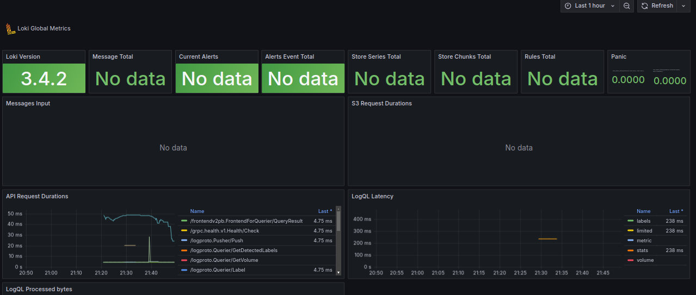

# Logging and Monitoring 

This report provides an overview of the Docker Compose setup for a monitoring and logging stack that includes Loki, Promtail, Grafana, a custom web application, and Prometheus. The configuration is designed to facilitate log aggregation, monitoring, and visualization.

## Configuration Overview

### Networks

- **loki**: A custom network named `loki` is defined for communication between the services.

### Logging Configuration

- **Default Logging**:
  - **Driver**: `json-file`
  - **Options**:
    - `max-size`: Limits log file size to 10MB.
    - `max-file`: Keeps up to 3 log files.

### Resource Limits

- **Default Deploy**:
  - **Memory Limit**: 512MB for services using this configuration.

## Services

### Loki

- **Container Name**: `loki`
- **Image**: `grafana/loki:latest`
- **Ports**: Maps port 3100 on the host to port 3100 on the container.
- **Command**: Runs Loki with a configuration file located at `/etc/loki/local-config.yaml`.
- **Networks**: Connected to the `loki` network.

### Promtail

- **Container Name**: `promtail`
- **Image**: `grafana/promtail:latest`
- **Volumes**:
  - Mounts the Promtail configuration file `promtail.yml` to `/etc/promtail/config.yml`.
  - Mounts the Docker socket for log collection.
- **Command**: Runs Promtail with the specified configuration file.
- **Networks**: Connected to the `loki` network.

### Grafana

- **Container Name**: `grafana`
- **Image**: `grafana/grafana:latest`
- **Ports**: Maps port 3000 on the host to port 3000 on the container.
- **Environment Variables**:
  - Configures provisioning paths and enables anonymous access with admin privileges.
  - Enables specific feature toggles for alerting.
- **Entrypoint**:
  - Creates necessary directories for provisioning.
  - Writes a datasource configuration for Loki to `/etc/grafana/provisioning/datasources/ds.yaml`.
  - Runs the default Grafana entrypoint script.
- **Networks**: Connected to the `loki` network.

### Web Application

- **Container Name**: `moscow-time-app`
- **Image**: `deedjei/lab2:latest`
- **Restart Policy**: Always restart the container if it stops.
- **Ports**: Maps port 5000 on the host to port 5000 on the container.

### Prometheus

- **Container Name**: `prometheus`
- **Image**: `prom/prometheus:latest`
- **Ports**: Maps port 9090 on the host to port 9090 on the container.
- **Volumes**:
  - Mounts the Prometheus configuration file `prometheus.yml` to `/etc/prometheus/prometheus.yml`.
- **Command**: Runs Prometheus with the specified configuration file.
- **Networks**: Connected to the `loki` network.
- **Logging**: Uses the default logging configuration.
- **Resource Limits**: Uses the default deploy configuration with a memory limit of 512MB.

## Usage

### Starting the Stack

1. **Navigate to the Directory**:
   - Open a terminal and navigate to the directory containing the `docker-compose.yml` file.

2. **Start the Services**:
   - Run the following command to start all the services defined in the `docker-compose.yml` file:

   ```bash
   docker-compose up -d
   ```

   This command will start Loki, Promtail, Grafana, the web application, and Prometheus in detached mode.

### Accessing Services

- **Grafana**:
  - Open your web browser and go to `http://localhost:3000`.
  - Log in using the default credentials (anonymous access is enabled with admin privileges).

- **Web Application**:
  - Access your application by navigating to `http://localhost:5000` in your browser.

- **Prometheus**:
  - Access Prometheus by navigating to `http://localhost:9090` in your browser.

## Verification

- **Prometheus**


- **Loki metrics**
