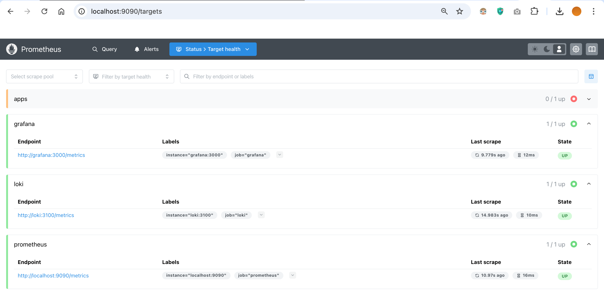
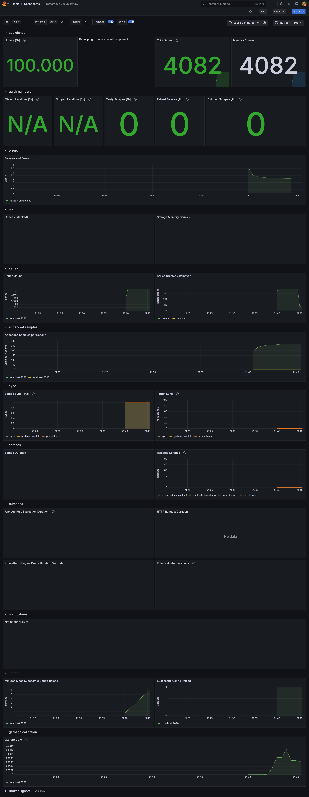
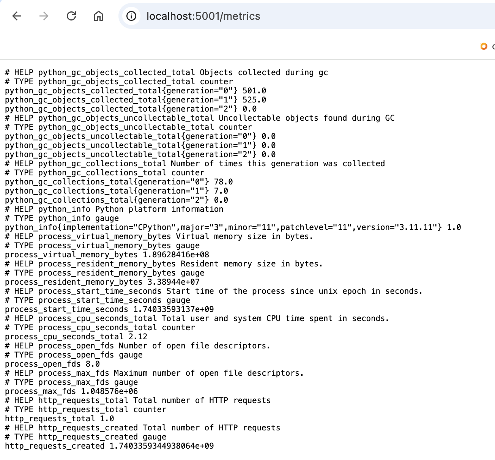

# Lab 8 Metrics

## Prometheus:

### Targets:



## Loki Metrics Dashboard:


## Prometheus Metrics Dashboard:



## Service update configurations:

### Log rotation

- Usage of JSON file logging with log rotation
- Each Log file is limited by 10MB
- Maximum 3 rotated log files will be kept

### Memory limits for containers = 512 MB

## Healthchecks:

### Loki:

```bash
test: ["CMD", "pgrep", "loki"]
start_period: 5s
retries: 3
timeout: 5s
```

### Promtail:

```bash
test: ["CMD", "pgrep", "promtail"]
start_period: 5s
retries: 3
timeout: 5s
```

### Grafana:

```bash
test: ["CMD", "curl", "-f", "http://localhost:3000/api/health"]
interval: 10s
timeout: 5s
retries: 3
```

### App_python:

```bash
test: ["CMD", "pgrep", "python"]
interval: 10s
timeout: 10s
retries: 3
```

### Prometheus:

```bash
test: ["CMD", "pgrep", "prometheus"]
interval: 10s
timeout: 10s
retries: 3
```

## App Metrics on the localhost:5001/metrics:



## Full Prometeus setup:


