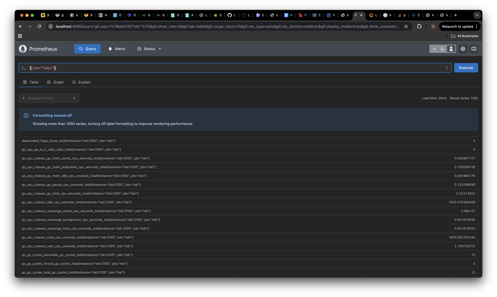
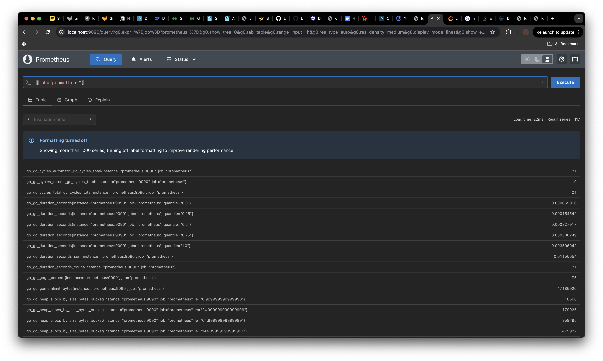
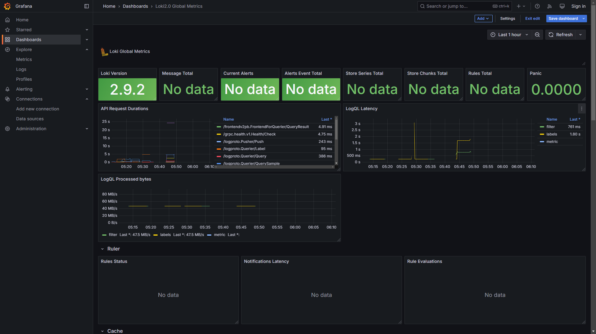
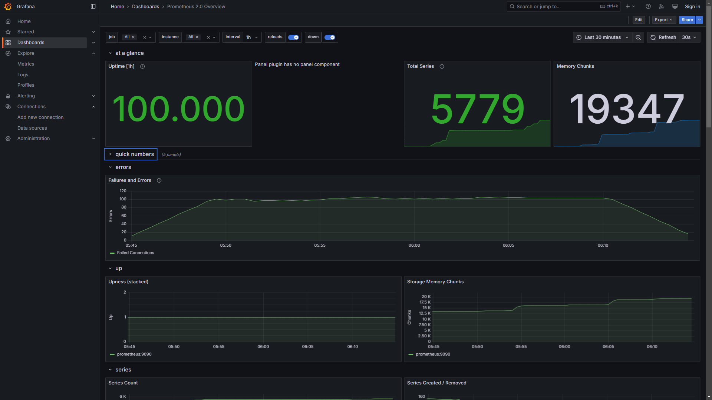
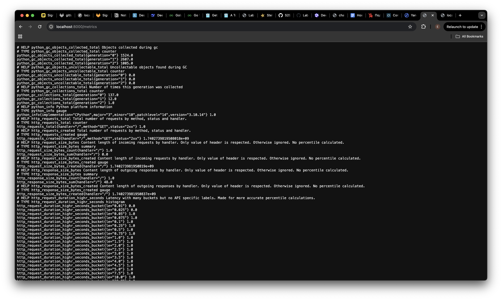
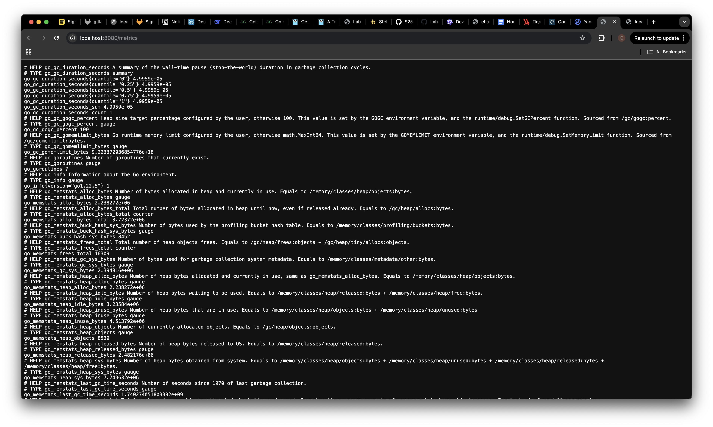
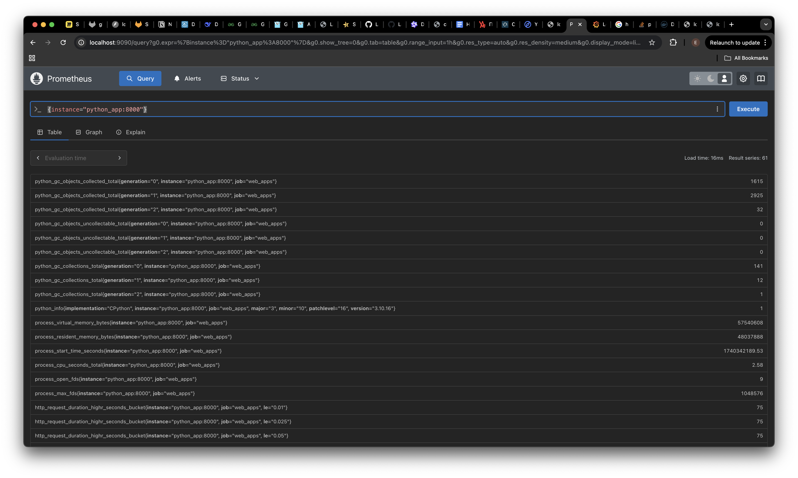
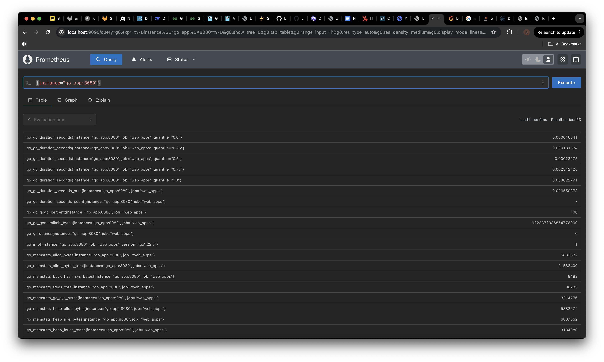

# METRICS

## Task 1: Prometheus Setup

### Integration with Docker Compose
- Added Prometheus to the `docker-compose.yml` file:
  - Included the `prometheus` service with configurations for memory limits, log rotation, and health checks.
  - Set up Prometheus to collect metrics from other services such as `loki`, `python_app`, and `go_app`.

### Prometheus Configuration
- Updated the `prometheus.yml` file to scrape metrics from:
  - Prometheus itself (`prometheus:9090`).
  - Grafana (`grafana:3000`).
  - Loki (`loki:3100`).
  - Web applications (`python_app:8000`, `go_app:8080`).

### Verify Prometheus Targets
- Accessed `http://localhost:9090/targets` to confirm that Prometheus is successfully scraping metrics from all configured targets.
- **Screenshots**:
  
  
  

---

## Task 2: Dashboard and Configuration Enhancements

### Grafana Dashboards
- Created dashboards in Grafana to visualize data:
  - **Loki**: Used a pre-built dashboard to display logs.
  - **Prometheus**: Utilized an example dashboard to showcase metrics.
- **Screenshots**:
  - Loki Dashboard: 
  - Prometheus Dashboard: 

### Service Configuration Updates
- Enhanced the `docker-compose.yml` file with additional configurations:
  - **Log Rotation Mechanisms**: Configured the `json-file` logging driver with `max-size: 10m` and `max-file: 2` for all services.
  - **Memory Limits**: Defined memory limits for containers (e.g., `memory: 50M` for Prometheus, `memory: 200M` for Loki).
- **Documentation**: All updates are documented in the revised `docker-compose.yml`.

### Metrics Gathering
- Extended Prometheus to collect metrics from all services defined in the `docker-compose.yml` file:
  - Added a `web_apps` job in `prometheus.yml` to scrape metrics from `python_app` and `go_app`.

---

## Bonus Task: Metrics and Health Checks

### Obtain Application Metrics
- Configured both Python and Go applications to expose metrics:
  - Python app exposes metrics at `http://localhost:8081/metrics`.
  - Go app exposes metrics at `http://localhost:8082/metrics`.
- **Screenshots**:
  - Python App Metrics: 
  - Go App Metrics: 
  
  

### Health Checks
- Added health checks to all containers in the `docker-compose.yml` file:
  - Verified health checks by inspecting container statuses.