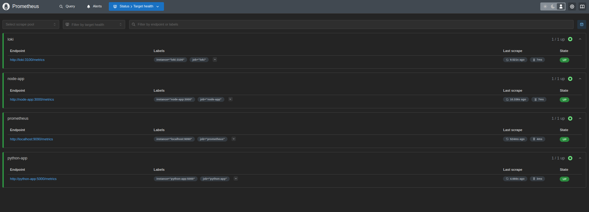
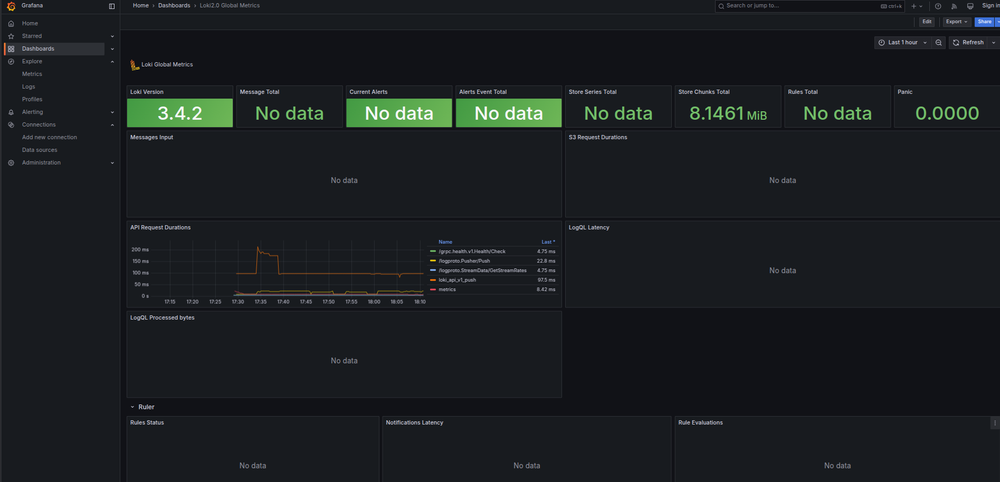
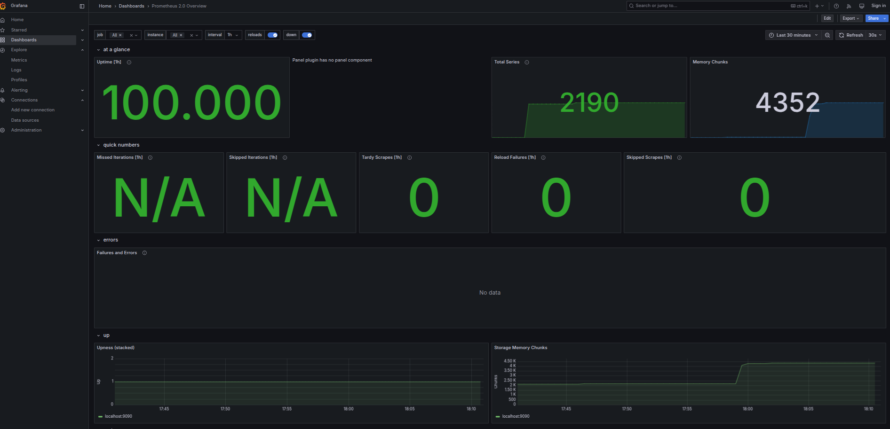
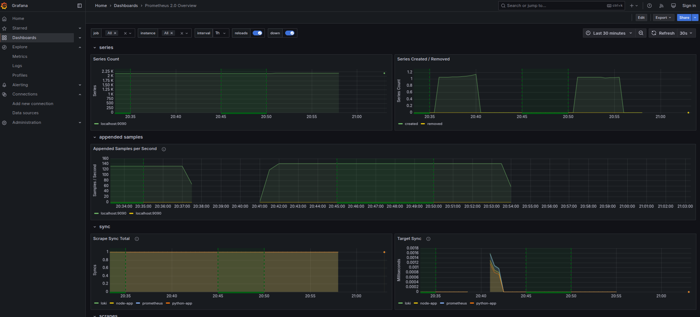
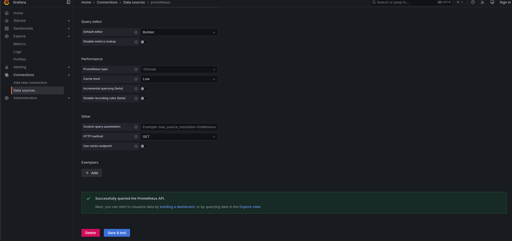
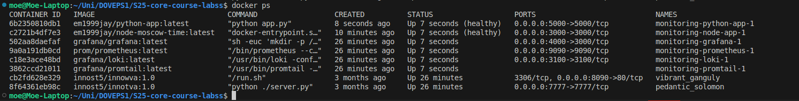

# **Lab 8: Monitoring with Prometheus**

## **Overview**

In this lab, I set up Prometheus to monitor my applications using Docker Compose. I configured Prometheus to collect metrics, created dashboards in Grafana, implemented service enhancements, and integrated health checks. Additionally, I successfully completed the **bonus task**, ensuring that my applications export metrics and are fully monitored.

---

## **Task 1: Prometheus Setup**

### **1. Integration with Docker Compose**

I added Prometheus to my `docker-compose.yml` file with the following configuration:

```yaml
  prometheus:
    image: prom/prometheus:latest
    ports:
      - "9090:9090"
    volumes:
      - ./prometheus.yml:/etc/prometheus/prometheus.yml:ro
    networks:
      - loki
    logging:
      driver: "json-file"
      options:
        max-size: "100m"
        max-file: "10"
```

### **2. Prometheus Configuration**

I configured Prometheus to scrape metrics from Loki, Prometheus itself, my Python application, and my Node.js application using the following `prometheus.yml` file:

```yaml
scrape_configs:
  - job_name: 'prometheus'
    static_configs:
      - targets: ['localhost:9090']

  - job_name: 'loki'
    static_configs:
      - targets: ['loki:3100']

  - job_name: 'node-app'
    static_configs:
      - targets: ['node-app:3000']

  - job_name: 'python-app'
    static_configs:
      - targets: ['python-app:5000']
```

### **3. Verifying Prometheus Targets**

After launching the monitoring stack using:

```bash
docker compose up -d
```

I verified that Prometheus was correctly scraping metrics by accessing [http://localhost:9090/targets](http://localhost:9090/targets).

**Screenshot:** 

---

## **Task 2: Dashboard and Configuration Enhancements**

### **1. Grafana Dashboards**

I configured Grafana to visualize Prometheus and Loki metrics. My `grafana` service in `docker-compose.yml` was set up as follows:

```yaml
  grafana:
    image: grafana/grafana:latest
    ports:
      - "4000:3000"
    networks:
      - loki
    logging:
      driver: "json-file"
      options:
        max-size: "100m"
        max-file: "10"
```

I created dashboards to display:

- **Loki logs** 
- **Prometheus metrics**



### **2. Service Configuration Enhancements**

#### **Log Rotation Mechanism**

To prevent excessive log accumulation, I enabled log rotation:

```yaml
logging:
  driver: "json-file"
  options:
    max-size: "100m"
    max-file: "10"
```

#### **Memory Limits for Containers**

I set memory constraints for my services to optimize resource usage:

```yaml
deploy:
  resources:
    limits:
      memory: 512M
    reservations:
      memory: 256M
```

---

## **Bonus Task: Metrics and Health Checks**

### **1. Application Metrics Integration**

#### **Python Application**

I integrated Prometheus metrics into my Python Flask application using `prometheus_client`:

```python
from prometheus_client import generate_latest, start_http_server, CONTENT_TYPE_LATEST, Counter
from flask import Flask, Response

app = Flask(__name__)
REQUEST_COUNT = Counter('python_app_requests_total', 'Total number of requests')

@app.route("/metrics")
def metrics():
    return Response(generate_latest(), mimetype=CONTENT_TYPE_LATEST)
```

#### **Node.js Application**

I updated my Node.js application to expose Prometheus metrics:

```javascript
const express = require('express');
const moment = require('moment-timezone');
const promClient = require('prom-client');

const app = express();
const PORT = process.env.PORT || 3000;

// Create a Prometheus registry
const register = new promClient.Registry();
promClient.collectDefaultMetrics({ register });

// Define a counter metric
const requestCounter = new promClient.Counter({
    name: 'node_app_requests_total',
    help: 'Total number of requests received',
    registers: [register],
});

app.get('/', (req, res) => {
    requestCounter.inc();
    const moscowTime = moment().tz("Europe/Moscow").format("YYYY-MM-DD HH:mm:ss");
    res.send(`<h1>Current Time in Moscow: ${moscowTime}</h1>`);
});

// Expose `/metrics`
app.get('/metrics', async (req, res) => {
    res.setHeader('Content-Type', register.contentType);
    res.end(await register.metrics());
});

app.listen(PORT, () => {
    console.log(`Server running on http://localhost:${PORT}`);
});
```

**Screenshot:**  

### **2. Health Checks**

I implemented health checks to ensure that both applications are running correctly.

#### **Python App Health Check**

```yaml
healthcheck:
  test: ["CMD", "python3", "-c", "import flask; print('Flask is installed')"]
  interval: 30s
  timeout: 10s
  retries: 3
  start_period: 10s
```

#### **Node.js App Health Check**

```yaml
healthcheck:
  test: ["CMD", "pgrep", "-x", "node"]
  interval: 30s
  timeout: 10s
  retries: 3
  start_period: 10s
```

**Screenshot:**  

---

## **Final Notes**

1. **I successfully set up Prometheus to scrape metrics from all services.**
2. **Grafana dashboards display real-time metrics from Loki and Prometheus.**
3. **I implemented health checks to monitor the availability of my applications.**
4. **I completed the bonus task by integrating metrics into both applications.**

---

### **References:**

- [Prometheus Documentation](https://prometheus.io/docs/introduction/overview/)
- [Grafana Loki Overview](https://grafana.com/docs/loki/latest/)
