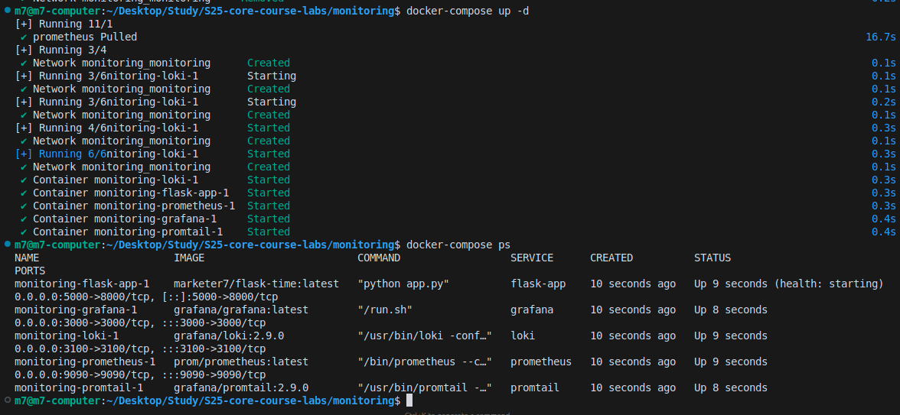
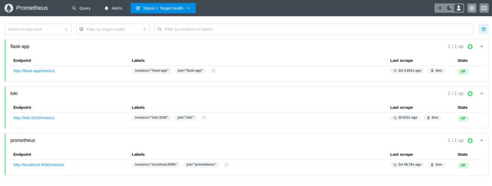

# Metrics Monitoring Stack

## Stack Components

### 1. Prometheus
Prometheus is a monitoring and alerting toolkit. Key features:
- Pull-based metrics collection
- Powerful query language (PromQL)
- Time series database
- Multiple service discovery options

### 2. Service Integration
The monitoring stack includes:
- Loki metrics
- Prometheus self-monitoring
- Container metrics
- Application metrics

## System Setup

### 1. Prometheus Configuration
Basic `prometheus.yml` configuration:
```yaml
global:
  scrape_interval: 15s
  evaluation_interval: 15s

scrape_configs:
  - job_name: 'prometheus'
    static_configs:
      - targets: ['localhost:9090']

  - job_name: 'loki'
    static_configs:
      - targets: ['loki:3100']

  - job_name: 'flask-app'
    static_configs:
      - targets: ['flask-app:8000']
```

### 2. Docker Compose Updates
Added service configurations for metrics:
```yaml
services:
  prometheus:
    image: prom/prometheus:latest
    ports:
      - "9090:9090"
    volumes:
      - ./prometheus.yml:/etc/prometheus/prometheus.yml
    networks:
      - monitoring
    restart: unless-stopped

  loki:
    image: grafana/loki:2.9.0
    ports:
      - "3100:3100"
    command: -config.file=/etc/loki/local-config.yaml
    volumes:
      - ./loki-config.yaml:/etc/loki/local-config.yaml
      - ./loki:/loki
    networks:
      - monitoring
    user: "0:0"
    restart: unless-stopped

  flask-app:
    image: marketer7/flask-time:latest
    ports:
      - "5000:8000"
    networks:
      - monitoring
    logging:
      driver: "json-file"
      options:
        max-size: "10m"
        max-file: "3"
    labels:
      logging: "promtail"
    restart: unless-stopped
    healthcheck:
      test: ["CMD", "curl", "-f", "http://localhost:8000/health"]
      interval: 30s
      timeout: 10s
      retries: 3
```

## Implementation Screenshots

### 1. Run docker compose up

*Screenshot showing the successful execution of the docker compose up command.*

### 2. Metrics Dashboard

*Screenshot showing Grafana dashboard with Prometheus metrics.*

## Metrics Examples

### Basic PromQL Queries:
```promql
# Container memory usage
container_memory_usage_bytes{container="flask-app"}

# HTTP request rate
rate(http_requests_total{job="flask-app"}[5m])

# Loki ingestion rate
rate(loki_distributor_bytes_received_total[5m])
```

## Service Configuration

### Memory Limits
All services have been configured with appropriate memory limits:
- Prometheus: 2GB
- Loki: 1GB
- Grafana: 512MB
- Flask App: 512MB

### Log Rotation
JSON file driver configuration:
```yaml
logging:
  driver: "json-file"
  options:
    max-size: "10m"
    max-file: "3"
```

## Monitoring Best Practices

1. Resource Management:
   - Set appropriate memory limits
   - Monitor container resource usage
   - Configure log rotation

2. Metrics Collection:
   - Use meaningful metric names
   - Add relevant labels
   - Set appropriate scrape intervals

3. Dashboard Organization:
   - Group related metrics
   - Use clear titles and descriptions
   - Include unit specifications

## Troubleshooting

Common issues and solutions:
1. If Prometheus targets are down:
   - Check network connectivity
   - Verify port configurations
   - Review service health checks

2. If metrics are missing:
   - Check scrape configurations
   - Verify metric endpoints
   - Review service logs

## Next Steps

Planned improvements:
1. Add alerting rules
2. Implement metric aggregation
3. Create specialized dashboards
4. Set up high availability 