# Metrics

This report provides results of the lab with demonstration of screenshots.

## Task 1

In this step service `prometheus` was introduced into `docker-compose.yml`. Process of configuration is similar to the previous lab (check services `grafana` and `promtail`). The result you may see on the screenshot.

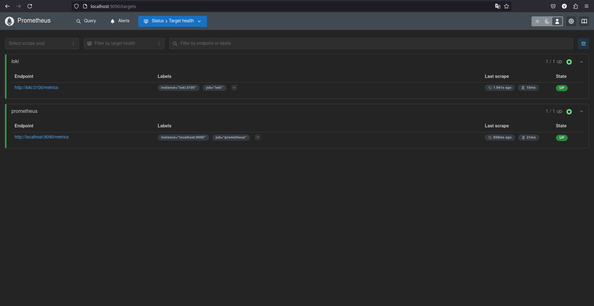
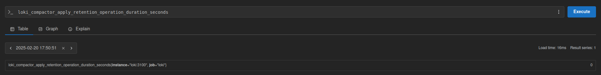
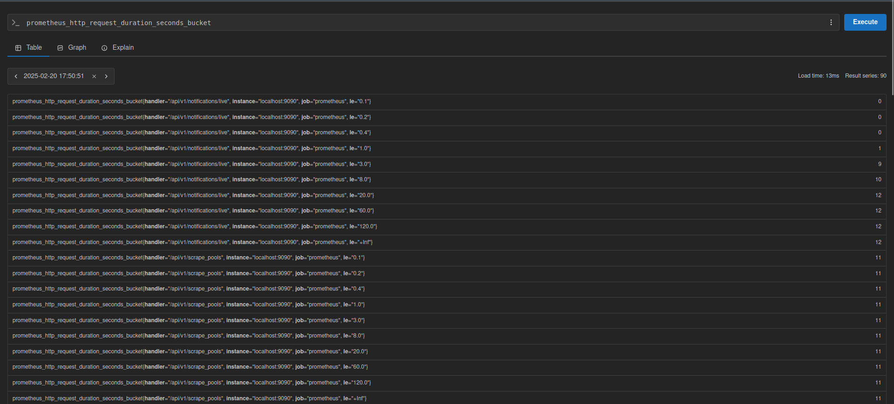

## Task 2

Dashboards from examples ( and ) was used. The process was simple (just importing, using UI, which is intuitive). Metrics for other services was introdiced. There are results:

**Loki**:

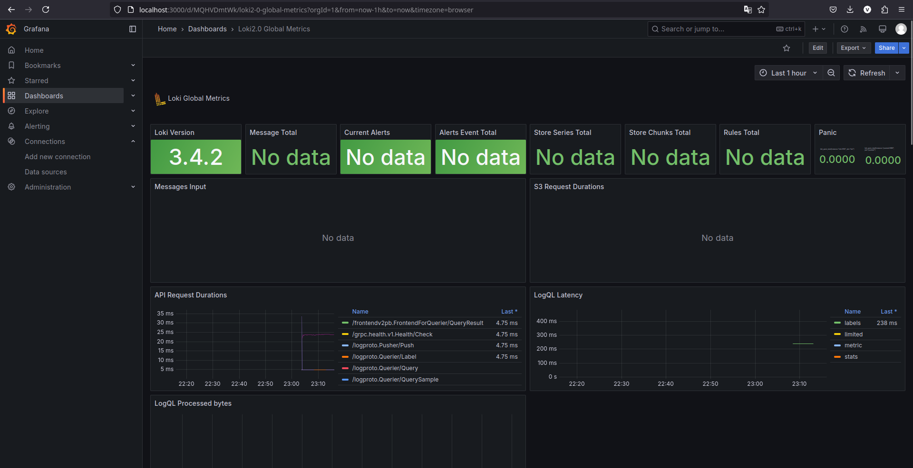
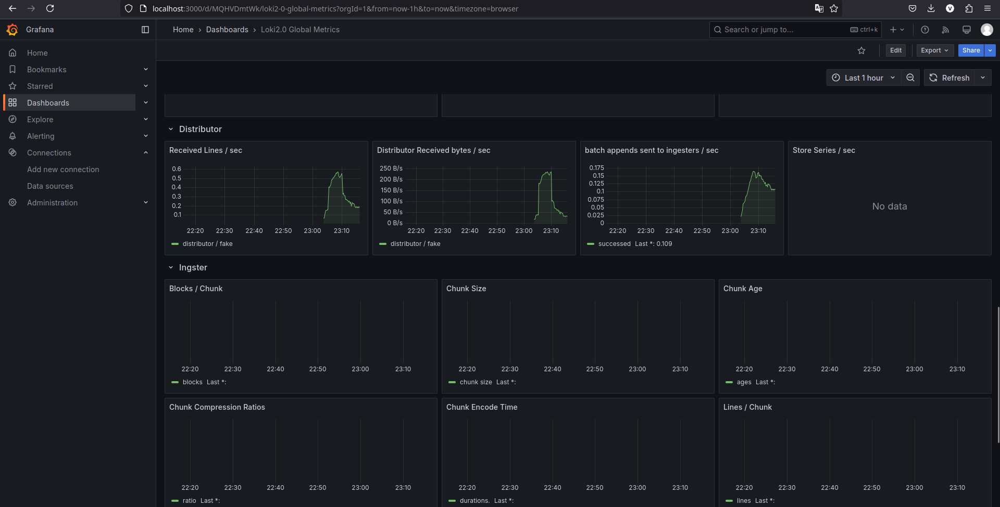
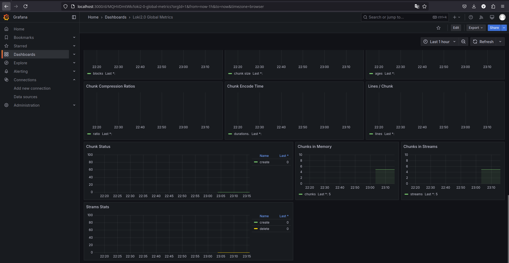

**Prometheus:**
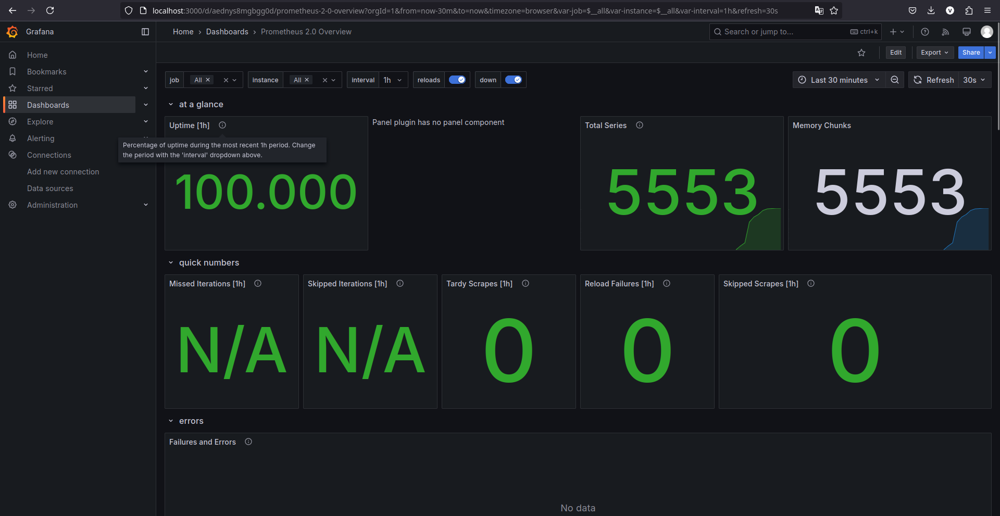
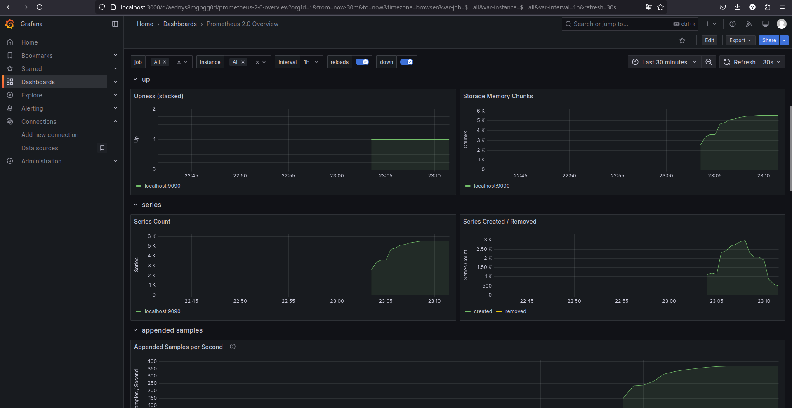
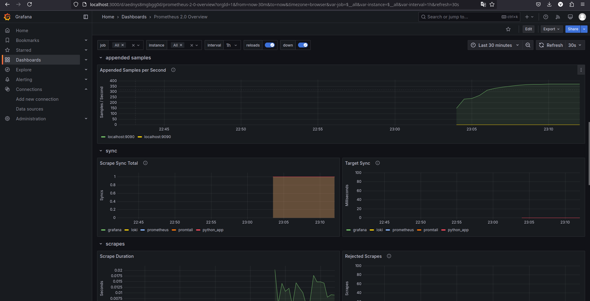
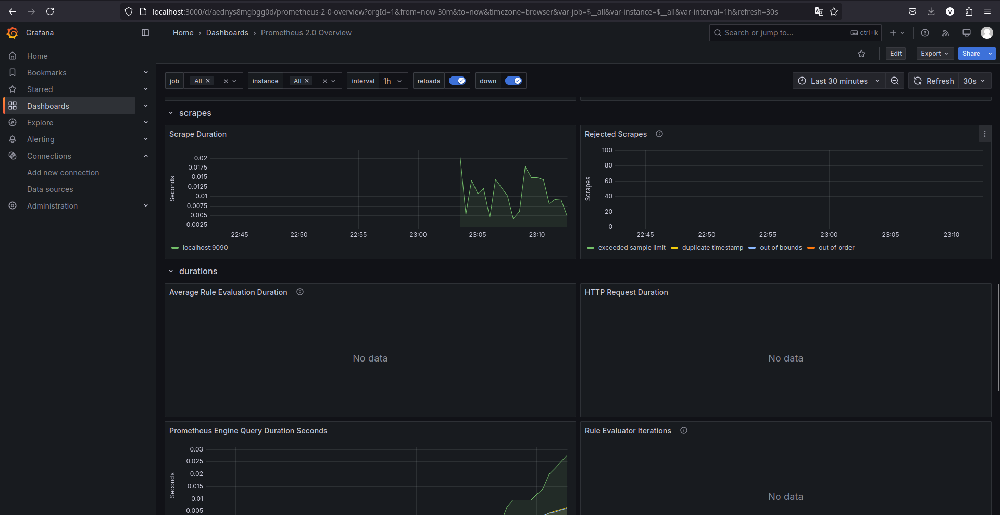
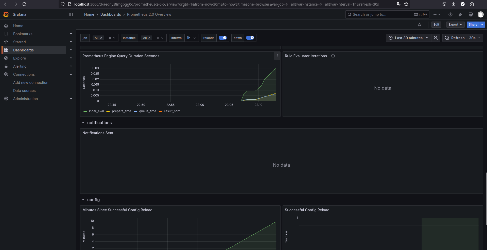
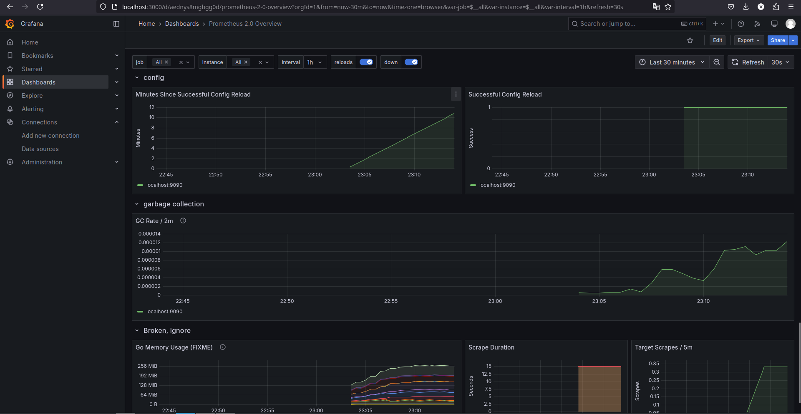

**Other services' metrics:**

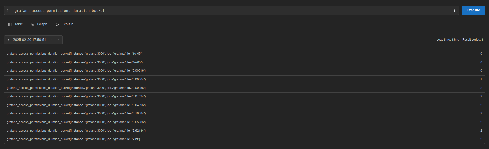
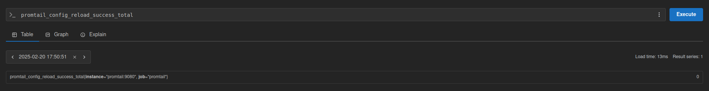

Log rotation mechanism realised by introducing

```yaml
    logging:
      driver: "json-file"
      options:
        max-size: "10m"  
        max-file: "3"
```

for each component in `docker-compose.yml`.

For memory limits was used

```yaml
    mem_limit: 512m
```

Finally, all services was gathered (python_app from bonus task too)

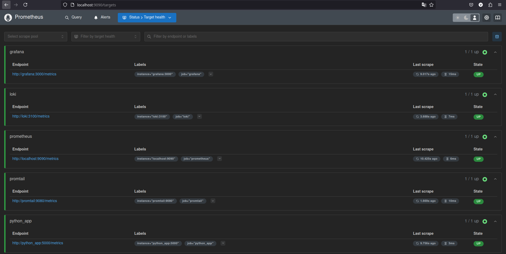

## Bonus task

**Metrics:**

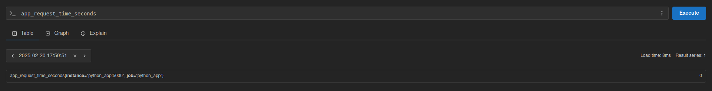

**Health check:**

Was introduced

```yaml
    healthcheck:
      test: ["CMD", "curl", "-f", "http://localhost:<port>/<url's tail>"]
      interval: <interval>s
      timeout: <timeout>s
      retries: <retries>
      ```

for each service.
