# Metrics

---

## Prometheus targets

* Prometheus currently watching for all the application in the `docker-compose`

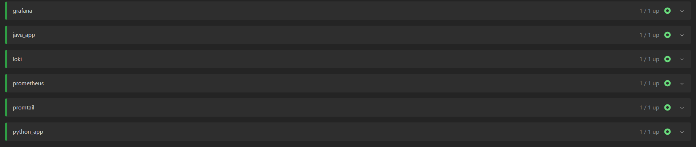

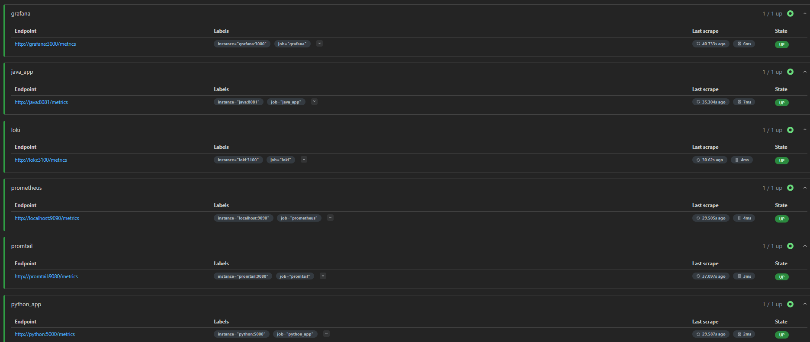

---

## Configured `docker-compose.yaml`

* There are healthcheck for each service

```yaml
services:
  loki:
    ...
    healthcheck:
      test: [ "CMD", "pgrep", "loki" ]
      interval: 30s
      timeout: 5s
      retries: 5

  prometheus:
    ...
    healthcheck:
      test: [ "CMD", "pgrep", "prometheus" ]
      interval: 30s
      timeout: 5s
      retries: 5

  promtail:
    ...
    healthcheck: # It is practically impossible to check the health of the promtail, so there is a dumb check
      test: [ "CMD-SHELL", "exit 0" ]
      interval: 30s
      timeout: 5s
      retries: 3

  grafana:
    ...
    healthcheck:
      test: [ "CMD", "curl", "-f", "http://localhost:3000/login" ]
      interval: 30s
      timeout: 5s
      retries: 5

  python:
    ...
    healthcheck:
      test: [ "CMD", "pgrep", "python" ]
      interval: 30s
      timeout: 5s
      retries: 3

  java:
    ...
    healthcheck:
      test: [ "CMD", "pgrep", "java" ]
      interval: 30s
      timeout: 5s
      retries: 3

```

* Log rotation & memory limits

```yaml
services:
  loki:
    ...
    logging:
      driver: "json-file"
      options:
        max-size: "10m"
        max-file: "3"
    deploy:
      resources:
        limits:
          memory: 512M

  prometheus:
    ...
    logging:
      driver: "json-file"
      options:
        max-size: "10m"
        max-file: "3"
    deploy:
      resources:
        limits:
          memory: 256M

  promtail:
    ...
    logging:
      driver: "json-file"
      options:
        max-size: "10m"
        max-file: "3"
    deploy:
      resources:
        limits:
          memory: 128M

  grafana:
    ...
    logging:
      driver: "json-file"
      options:
        max-size: "10m"
        max-file: "3"
    deploy:
      resources:
        limits:
          memory: 512M

  python:
    ...
    logging:
      driver: "json-file"
      options:
        max-size: "10m"
        max-file: "3"
    deploy:
      resources:
        limits:
          memory: 256M

  java:
    ...
    logging:
      driver: "json-file"
      options:
        max-size: "10m"
        max-file: "3"
    deploy:
      resources:
        limits:
          memory: 512M

```

---

## Application Configuration

### Java Application

I am already used to make bonds between Java application and the Prometheus (ELK stack), so there is just a few simple
steps to set next-off to the production, the metrics server, and the following necessary:

* Dependencies

```xml
    <!-- Metrics -->
<dependency>
    <groupId>org.springframework.boot</groupId>
    <artifactId>spring-boot-starter-actuator</artifactId>
</dependency>
<dependency>
<groupId>io.micrometer</groupId>
<artifactId>micrometer-registry-prometheus</artifactId>
</dependency>
<dependency>
<groupId>io.micrometer</groupId>
<artifactId>micrometer-tracing-bridge-brave</artifactId>
</dependency>
```

* Configuration in `.yaml` file (at least for SpringBootV3+)

```yaml
management:
  server:
    port: 8081
  endpoints:
    web:
      base-path: "/"
      exposure:
        include: "health,info,prometheus"
      path-mapping:
        "prometheus": "/metrics"
  endpoint:
    info:
      enabled: true
    health:
      enabled: true
    prometheus:
      enabled: true
  metrics:
    tags:
      "application": ${spring.application.name}
```

### Python Application

I didn't create something on python that need to be monitored before; But how it always, in python there is a very
light way to create prometheus client with base metrics:

* Dependency: `prometheus-flask-exporter`
* Configuration

```python
from prometheus_flask_exporter import PrometheusMetrics

...


def initialize_app():
    """
    Initialize application with the given routes and context
    :return: Flask app
    """


...
PrometheusMetrics(app)
...
```

---

## Dashboards

### Java Application

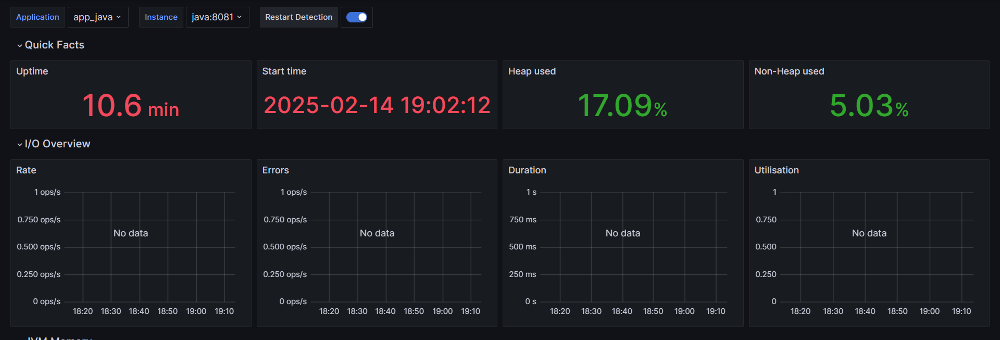

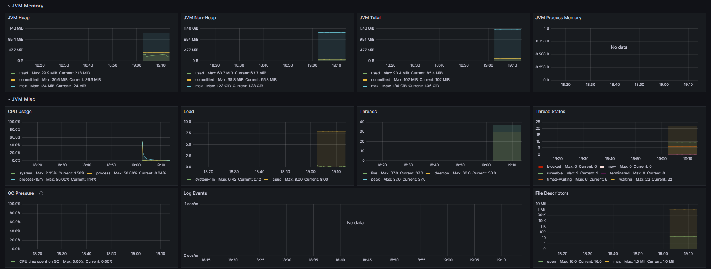

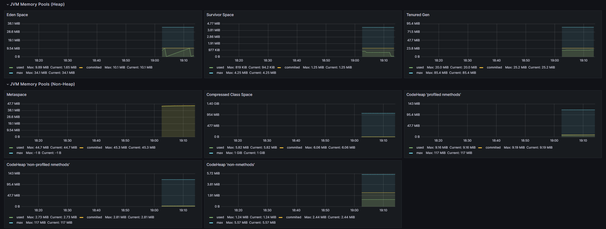

And so on...

### Python Application

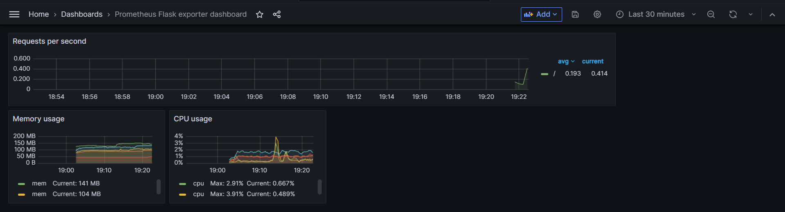

### Prometheus & Loki & Promtail

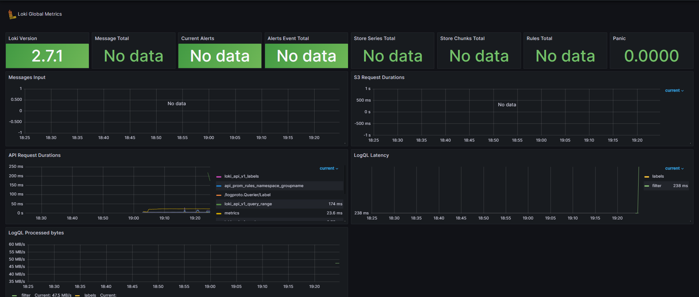

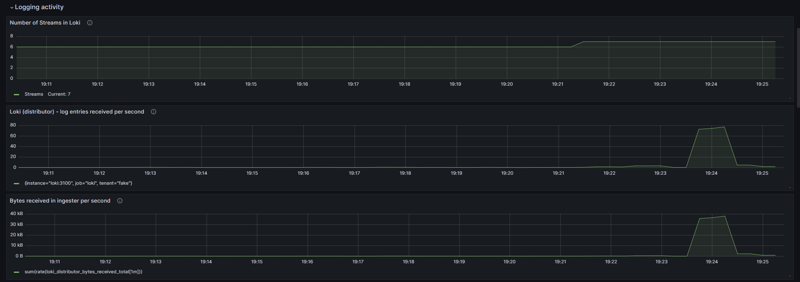

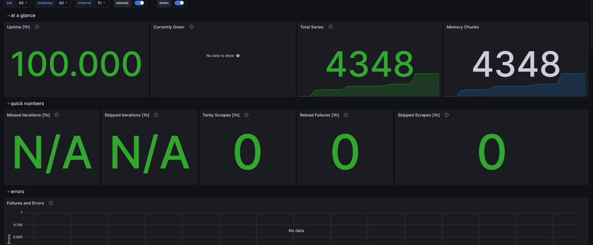

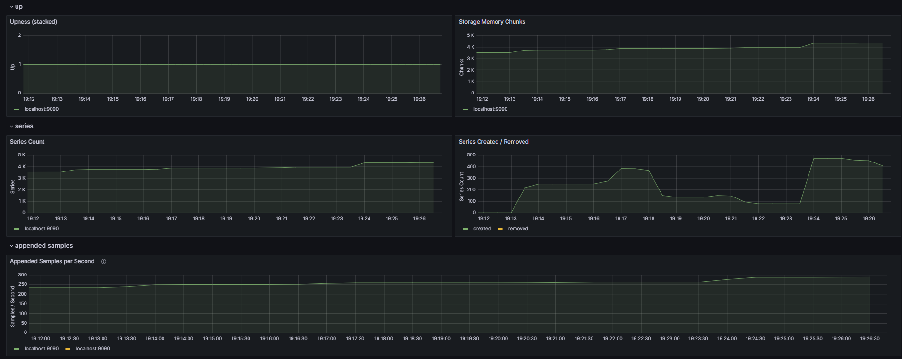

### Grafana

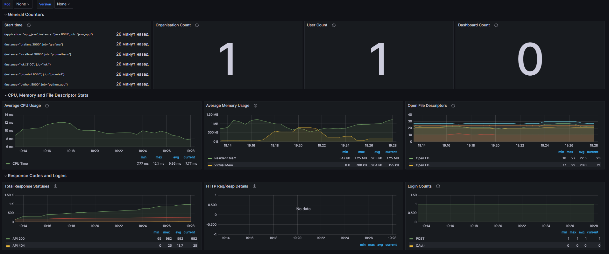

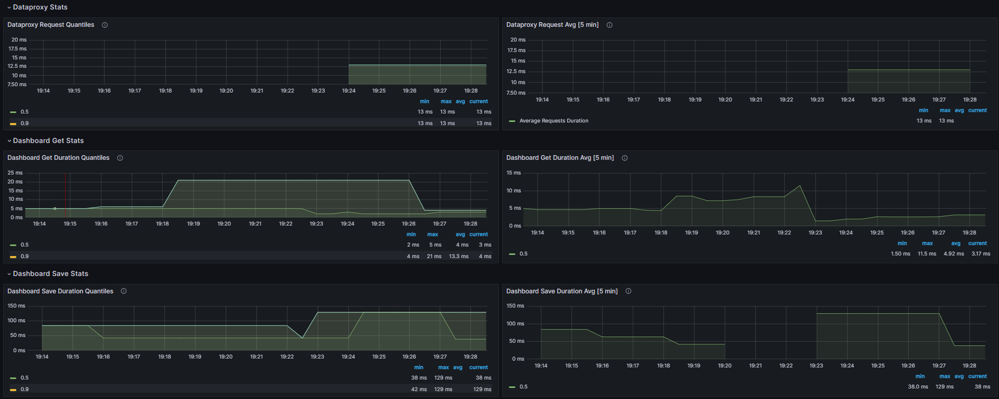

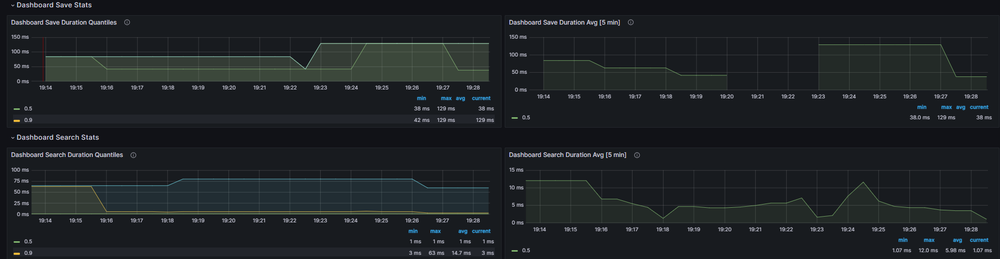
