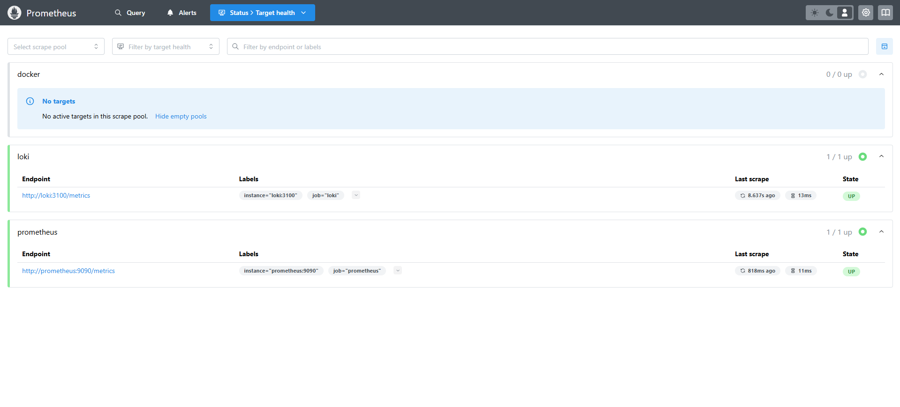
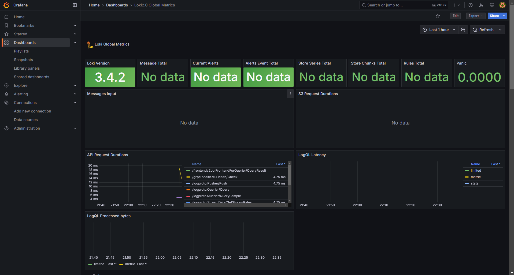
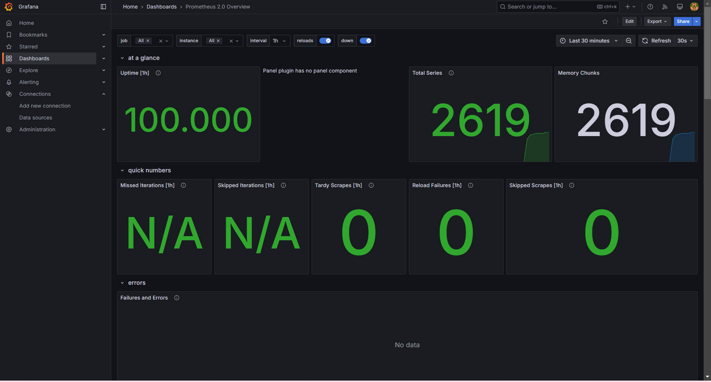
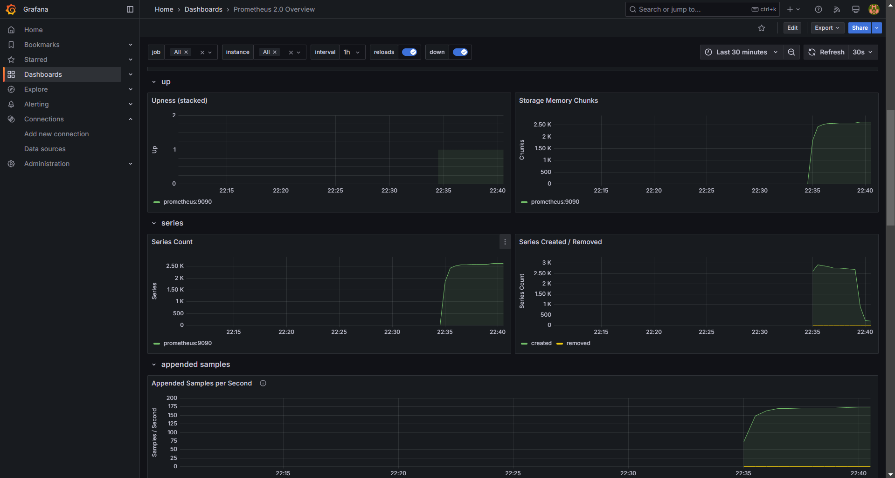
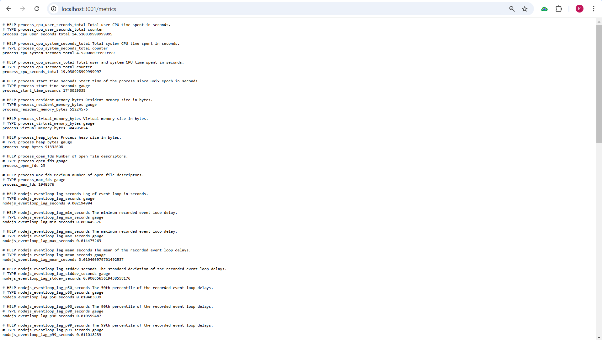
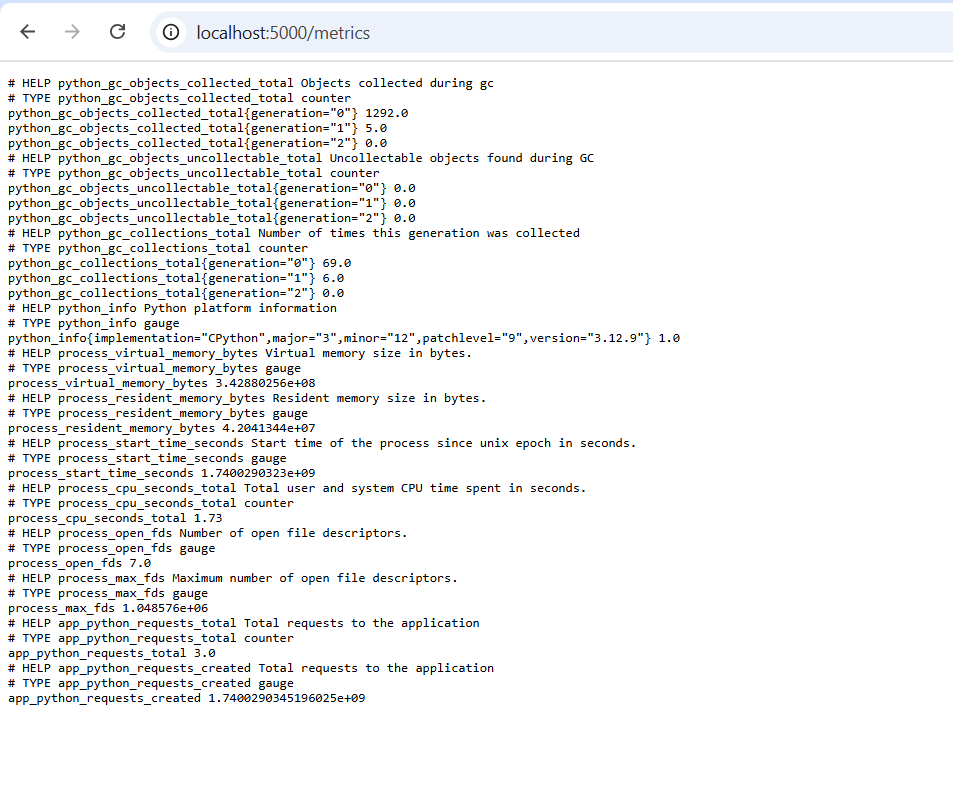
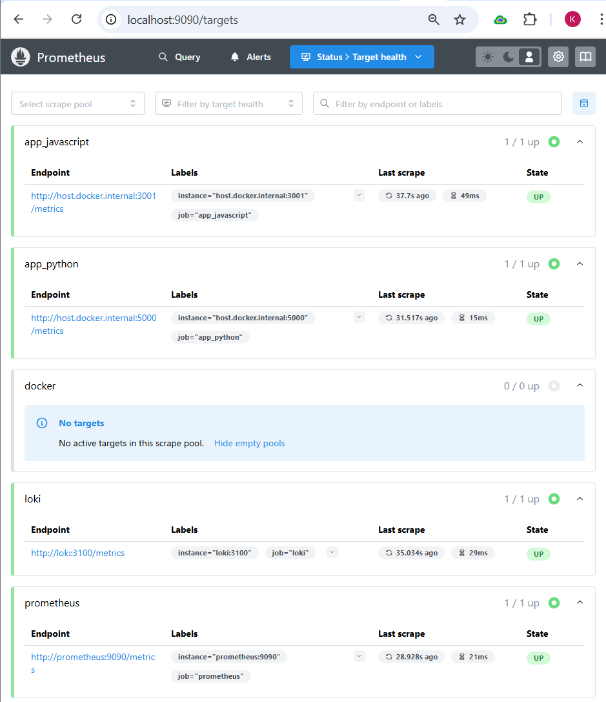

# Prometheus Monitoring Setup

## Overview

This document details the setup and configuration of Prometheus to monitor services running with Docker Compose. It also describes how to integrate metrics into the applications.

## Prometheus Setup

### Configuration

Prometheus has been configured to scrape metrics from the following targets:

- **Loki**: For log aggregation.
- **Prometheus**: For self-monitoring.
- **Docker Containers**: For monitoring container logs and metrics.

### Screenshots

- **Prometheus Targets**:
  

## Grafana Dashboards

Two dashboards have been created in Grafana:

- **Loki Dashboard**: Visualizes logs from Loki.
- **Prometheus Dashboard**: Displays Prometheus metrics.

### Screenshots

- **Loki Dashboard**:
  

- **Prometheus Dashboard**:
  
  

## Service Configuration

### Log Rotation & Memory Limits

- Log rotation mechanisms have been added where applicable.
- Memory limits for containers have been specified to prevent excessive resource usage.

### Health Checks

Health checks have been added for containers.

## Bonus Task: Application Metrics

Application metrics have been integrated into `app_python` and `app_javascript` using Prometheus client libraries.

### Screenshots

#### **Prometheus Metrics Python App**:
  

#### **Prometheus Metrics Javascript App**:
  

#### **Prometheus Targets**:
  
