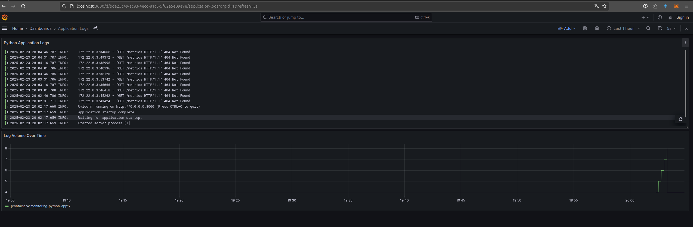
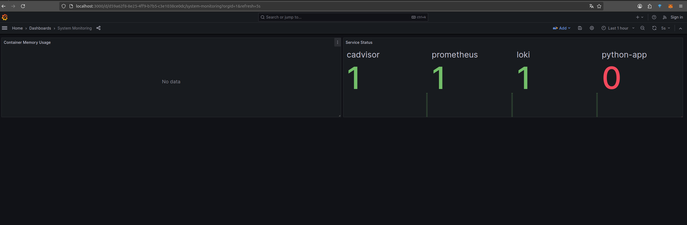

# Prometheus Monitoring Infrastructure

## Overview
Monitoring infrastructure consists of several interconnected components, with Prometheus serving as the central metrics collection and storage system. This setup enables comprehensive monitoring of both application and system-level metrics across containerized environment

## Core Components

### Prometheus
Prometheus serves as primary metrics collection and storage system. The service has been configured with the following specifications in docker-compose.yml:

```yaml
prometheus:
  image: prom/prometheus:v2.49.1
  container_name: monitoring-prometheus
  ports:
    - "9090:9090"
  command:
    - '--config.file=/etc/prometheus/prometheus.yml'
    - '--storage.tsdb.path=/prometheus'
    - '--web.console.libraries=/usr/share/prometheus/console_libraries'
    - '--web.console.templates=/usr/share/prometheus/consoles'
  volumes:
    - ./prometheus/prometheus.yml:/etc/prometheus/prometheus.yml
    - prometheus_data:/prometheus
  networks:
    - loki
```

### cAdvisor
Container Advisor (cAdvisor) provides container-level performance metrics and resource usage data. It's integrated into stack to monitor Docker containers:

```yaml
cadvisor:
  image: gcr.io/cadvisor/cadvisor:v0.47.2
  privileged: true
  volumes:
    - /:/rootfs:ro
    - /var/run:/var/run:ro
    - /sys:/sys:ro
    - /var/lib/docker/:/var/lib/docker:ro
```

## Service Monitoring Configuration

### Prometheus Targets
`Prometheus.yml` configuration collects metrics from multiple services:

```yaml
scrape_configs:
  - job_name: 'prometheus'
    static_configs:
      - targets: ['localhost:9090']
  
  - job_name: 'loki'
    static_configs:
      - targets: ['loki:3100']
      
  - job_name: 'python-app'
    static_configs:
      - targets: ['python-app:8000']
      
  - job_name: 'cadvisor'
    static_configs:
      - targets: ['cadvisor:8080']
```

Each target provides different metrics:
- Prometheus: Self-monitoring metrics
- Loki: Logging system performance metrics
- Python App: Application-specific metrics
- cAdvisor: Container and system resource metrics

### Service Health Monitoring
The monitoring setup includes service health tracking through multiple methods:

1. Direct service status monitoring through Prometheus up/down metrics
2. Resource usage tracking via cAdvisor
3. Log volume monitoring through Loki integration

## Metrics Collection Verification

### Target Status
As shown in the screenshots, all monitoring targets are successfully connected:

- Prometheus endpoint (localhost:9090) - UP
- Loki endpoint (loki:3100) - UP


The targets page (http://localhost:9090/targets) confirms successful metric collection with response times within expected ranges

## Dashboard Integration

### System Monitoring Dashboard
The system monitoring dashboard provides:

1. Container Memory Usage tracking
2. Service Status indicators for:
   - cAdvisor
   - Prometheus
   - Loki
   - Python application

### Application Logs Dashboard
The application logs dashboard displays:

1. Real-time log streaming from the Python application
2. Log volume metrics over time
3. Error rate tracking
4. Request pattern visualization





## Performance Optimization

### Log Management
The infrastructure implements several optimization strategies:

1. Log Rotation:
```yaml
logging:
  driver: "json-file"
  options:
    max-size: "10m"
    max-file: "3"
```

2. Metric Storage:
- Prometheus data persistence through Docker volumes
- Configurable retention periods
- Efficient metric query optimization

### Network Configuration
All services are connected through a dedicated Docker network 'loki', ensuring:

1. Service discovery
2. Secure internal communication
3. Isolated monitoring traffic