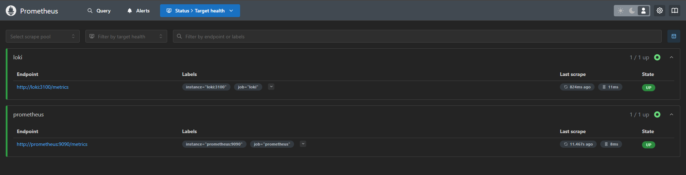
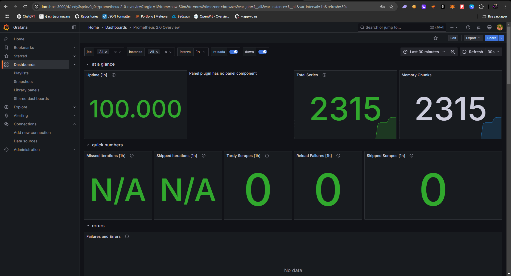
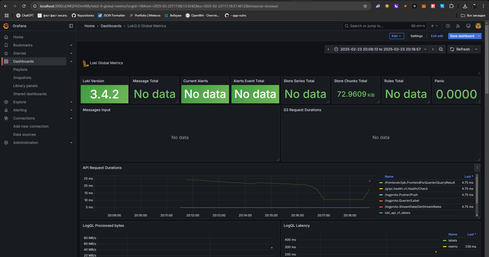

Task 1: Prometheus Setup
---

- **Prometheus Integration:**
    - Added a Prometheus service to `docker-compose.yml`.
    - Created `prometheus.yml` to scrape metrics from both Prometheus and Loki.

Prometheus service in `docker-compose.yml`:

```yaml
  prometheus:
    image: prom/prometheus:latest
    ports:
      - "9090:9090"
    volumes:
      - ./prometheus.yml:/etc/prometheus/prometheus.yml:ro
    deploy:
      resources:
        limits:
          memory: 300M
    logging:
      driver: "json-file"
      options:
        max-size: "10m"
        max-file: "3"```


```

`prometheus.yml`:

  ```yaml
    global:
      scrape_interval: 15s
    scrape_configs:
      - job_name: 'prometheus'
        static_configs:
          - targets: [ 'prometheus:9090' ]
      - job_name: 'loki'
        static_configs:
          - targets: [ 'loki:3100' ]

```

---

#### Prometheus targets at [http://localhost:9090/targets](http://localhost:9090/targets):




Task 2: Dashboard & Service Enhancements
---
**Grafana Dashboards:**

- Configured Grafana with data sources for Loki and Prometheus.
- Imported example dashboards for both data sources.

**Service Updates:**

- Added log rotation and memory limits for all services in docker-compose.yml:

```yaml
logging:
  driver: "json-file"
  options:
    max-size: "10m"
    max-file: "3"
deploy:
  resources:
    limits:
      memory: 300M
```

**Metrics Gathering**:

- Extended Prometheus scraping to include all services (e.g., app_python).

Screens
---

## Prometheus Dashboard:



## Loki Dashboard:

