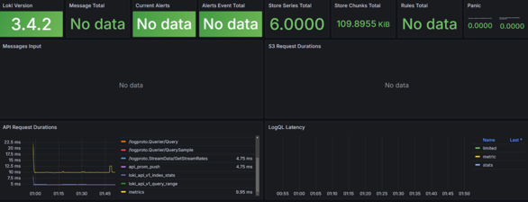
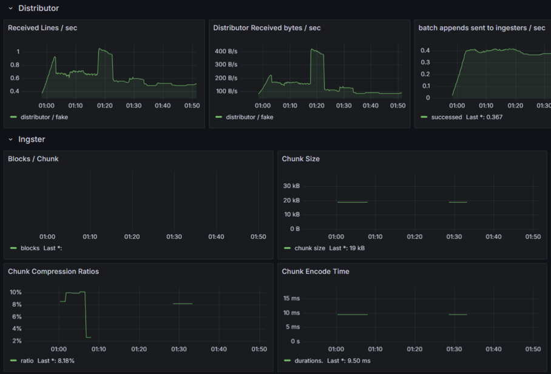
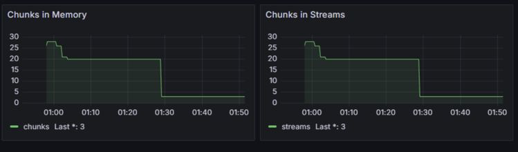
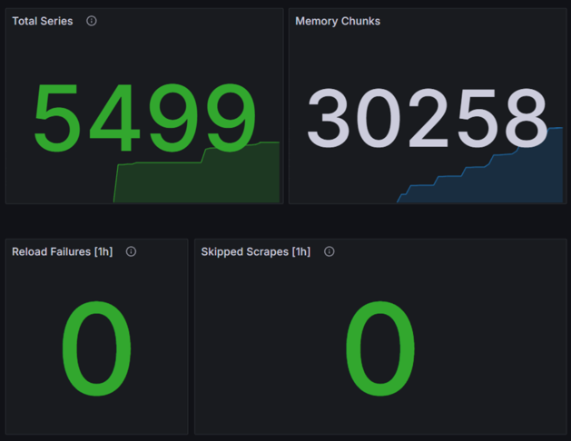
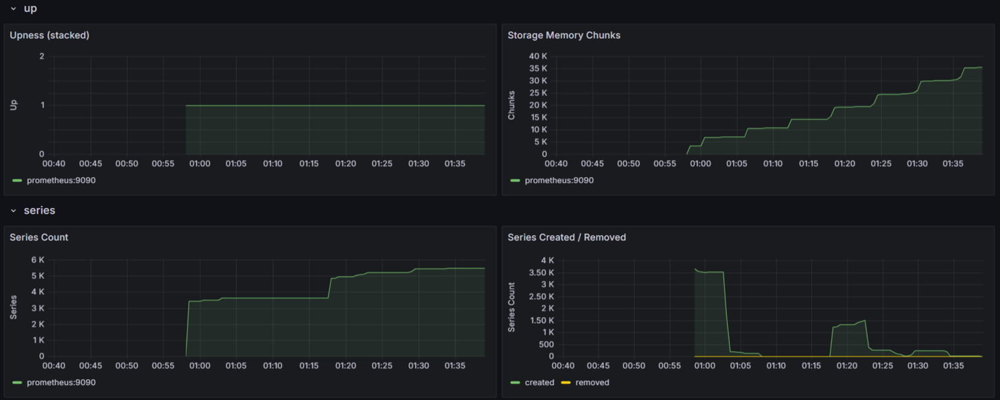
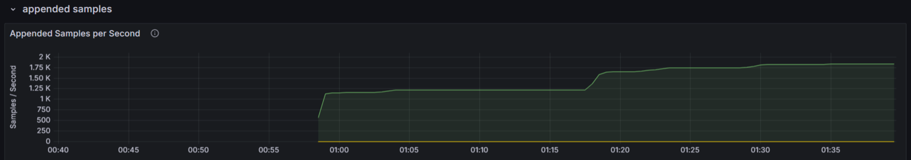

# Monitoring with Prometheus

## Prometheus Setup

Prometheus Targets are accesible at `http://localhost:8080/targets`.

## Grafana Dashboards

### Loki Dashboard

[Dashboard for Loki](https://grafana.com/grafana/dashboards/13407-loki2-0-global-metrics/) is used for this
task.





### Prometheus Dashboard

[Dashboard for Prometheus](https://grafana.com/grafana/dashboards/3662-prometheus-2-0-overview/) is used for
this task.





## Service Configuration Updates

- **Log Rotation**

  ```yaml
    logging:
          driver: "json-file"
          options:
            max-size: "10m"
            max-file: "4"
  ```
- **Memory Limits**
  ```yaml
    deploy:
      resources:
        limits:
          memory: "264m"
  ```
- **Healthcheck**: Ensure the services are running correctly.
  ```yaml
    healthcheck:
      test: ["CMD", "pgrep", "python"]
      timeout: 5s
      retries: 5
  ```

## Metrics Gathering

- **Loki** is configured to expose its metrics on `loki:8003/metrics`.
- **Grafana** metrics are scraped from `grafana:8002/metrics`.
- **Promtail** metrics are available at `promtail:8001/metrics`.
- **Prometheus** itself is scraped at `prometheus:8080/metrics`.
- **Python App** exposes metrics at `app_python:5000/metrics`.