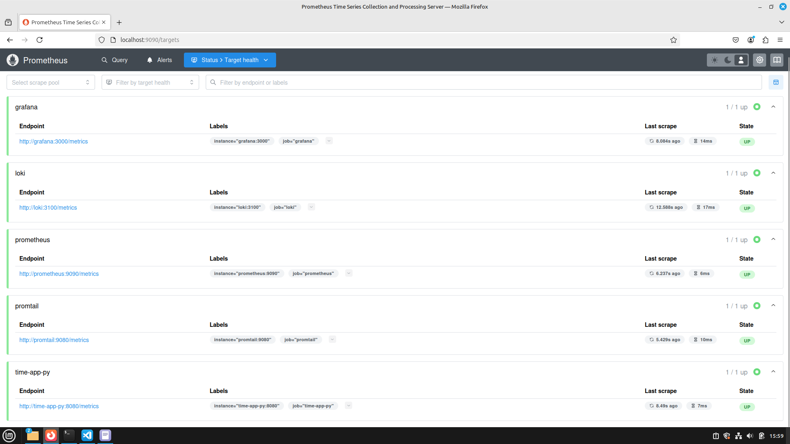
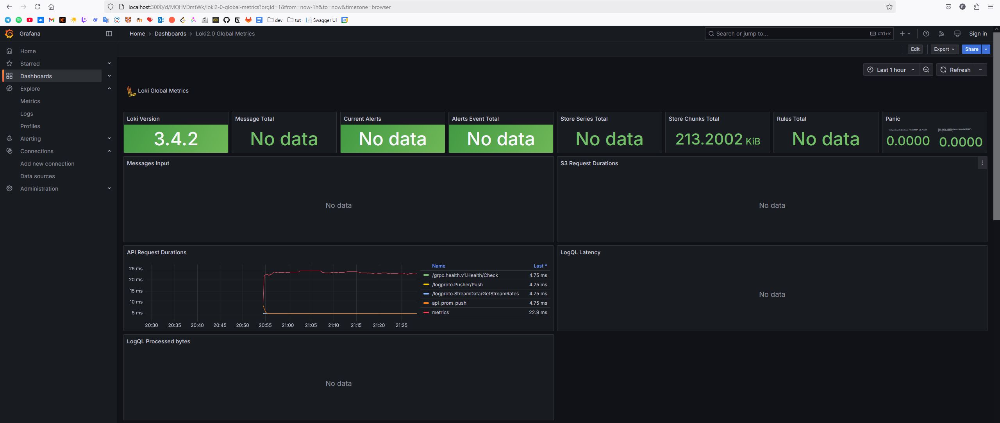
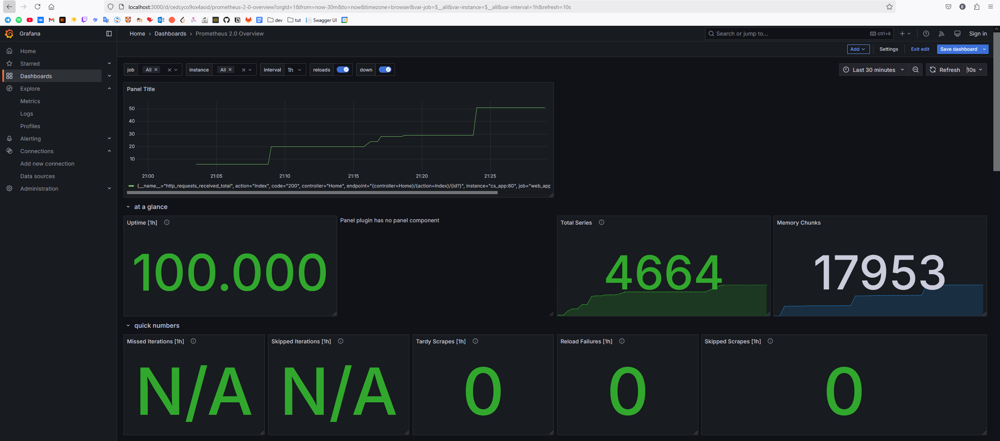
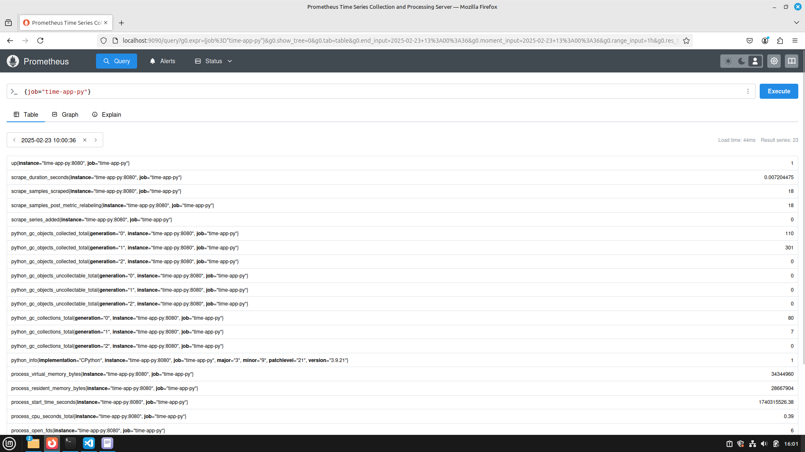

## Targets



## Dashboards





## Log rotation mechanisms

Logs configuration was introduced in such way:

```yml
x-logging:
  &default-logging
  driver: "json-file"
  options:
    max-size: "200k"
    max-file: "10"
```

And it was added to every service using this template:

```yml
logging: *default-logging
```

## Memory limits

Deploy configuration was introduced in such way:

```yml
x-deploy:
  &default-deploy
  resources:
    limits:
      memory: 512M
```

And it was added to every service using this template:

```yml
deploy: *default-deploy
```

# Bonus

## `time-app-py` application metrics



## Health checks

Health checks were added to every service using such template:

```yml
healthcheck:
  test: ["CMD-SHELL", "curl --fail http://localhost:<port>/<path (if needed)> || exit 1"]
  interval: 15s
  timeout: 5s
  retries: 3
```
