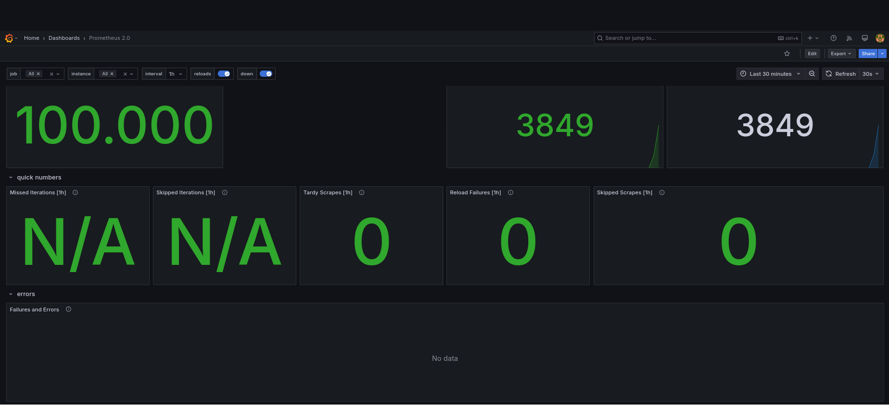
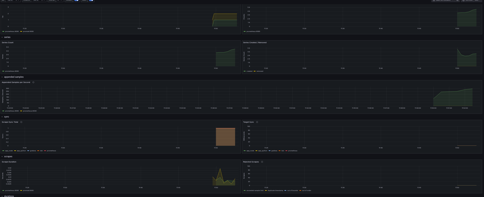
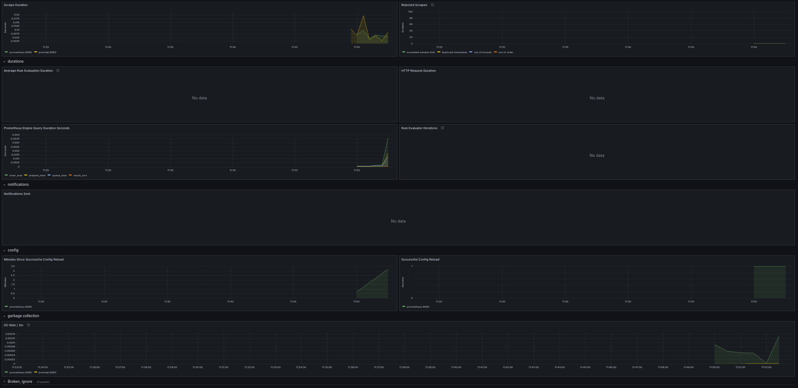
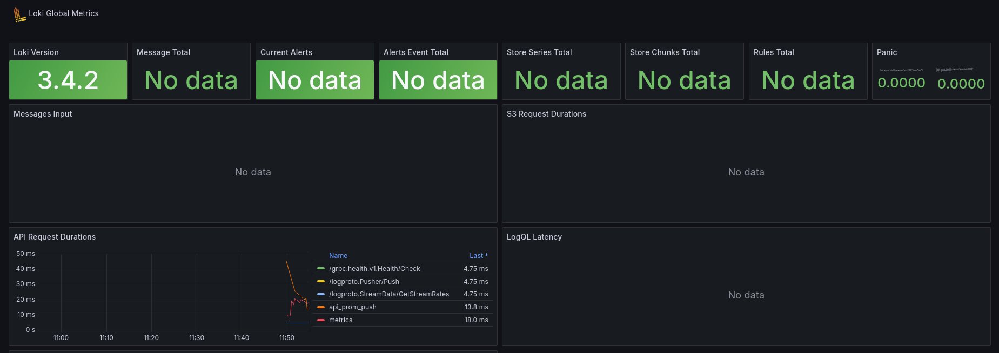
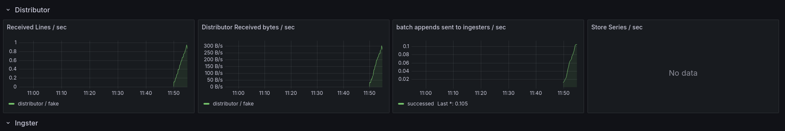
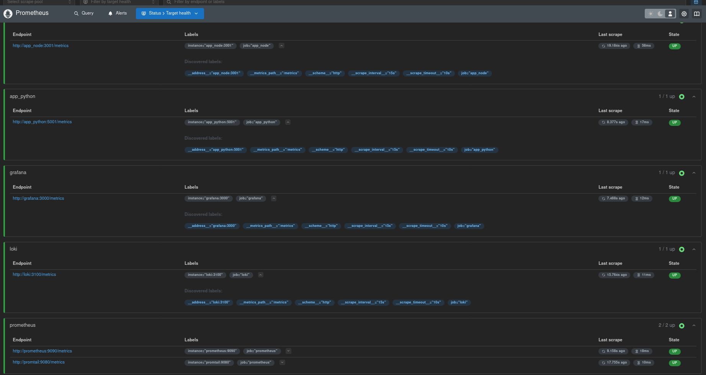
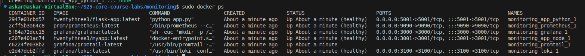
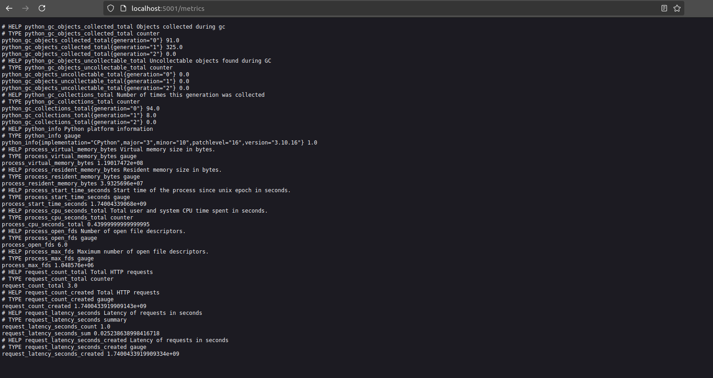
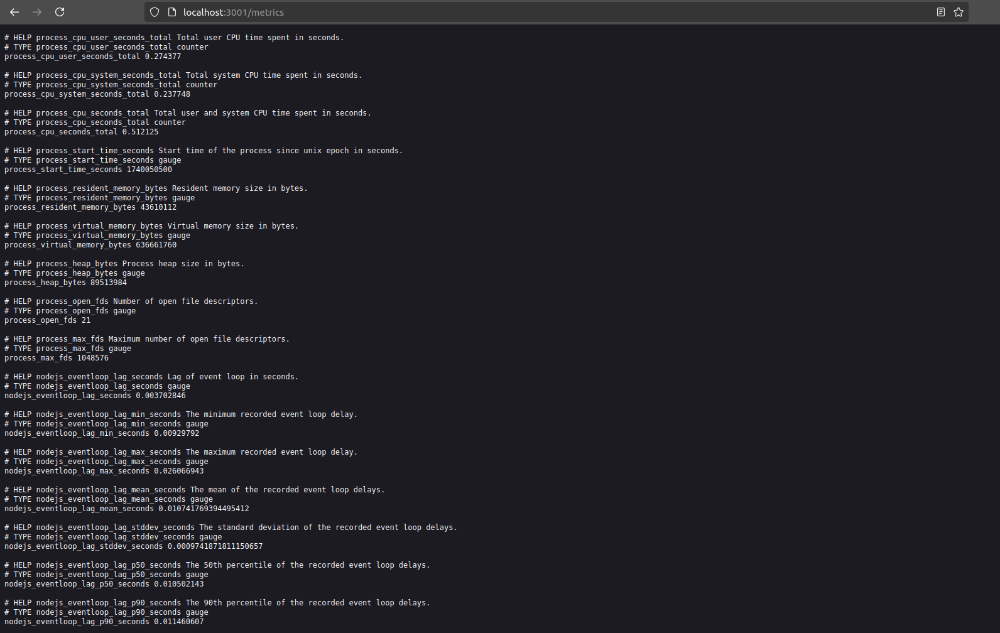

# Lab 8: Monitoring with Prometheus


We extended our logging stack to include Prometheus for metrics collection and monitoring. This lab includes following:
- **Integrating Prometheus** into existing Docker Compose setup, which already includes Loki, Promtail, and Grafana.
- **Configuring Prometheus** to scrape metrics from Loki, Grafana, Promtail, and our application containers.
- **Verifying Prometheus Targets** via the [http://localhost:9090/targets](http://localhost:9090/targets) page.
- **Enhancing service configurations** with log rotation, memory limits, and health checks.
- **Integrating application metrics** from both a Python app and a Node.js app.
---

## Prometheus Setup

### Integrating Prometheus

We expanded our Docker Compose configuration to include a Prometheus service. Prometheus scrapes metrics from:

- **Prometheus** (running on port `9090`)
- **Promtail** (running on port `9080`)
- **Loki** (running on port `3100`)
- **Grafana** (running on port `3000`)
- **App Services:**  
  - `app_python` on port `5001`  
  - `app_node` on port `3001`

The Prometheus configuration file (`prometheus.yml`):

```yaml
global:
  scrape_interval: 15s

scrape_configs:
  - job_name: 'prometheus'
    static_configs:
      - targets: ['prometheus:9090', 'promtail:9080']
  - job_name: 'loki'
    static_configs:
      - targets: ['loki:3100']
  - job_name: 'grafana'
    static_configs:
      - targets: ['grafana:3000']
  - job_name: 'app_python'
    static_configs:
      - targets: ['app_python:5001']
  - job_name: 'app_node'
    static_configs:
      - targets: ['app_node:3001']
```

### Docker Compose Configuration

Our `docker-compose.yml` deploys all the services with proper volume mounts, resource limits, logging configuration, and health checks. Our docker-compose includes:

- **Loki:** Aggregates logs and stores data in a persistent volume.
- **Promtail:** Scrapes logs from Docker containers and custom log files.
- **Grafana:** Automatically provisions a Loki datasource for log visualization.
- **Prometheus:** Collects metrics from all services.
- **Application Services:** Both `app_python` and `app_node` expose `/health` endpoints and log their output to a shared volume (`app_logs`).

Below is our Docker Compose file:

```yaml
version: '3.8'

networks:
  loki:

services:
  loki:
    image: grafana/loki:latest
    ports:
      - "3100:3100"
    volumes:
      - ./loki-config.yml:/etc/loki/loki-config.yaml
      - loki-storage:/tmp/loki
    command: -config.file=/etc/loki/local-config.yaml
    networks:
      - loki
    logging:
      driver: "json-file"
      options:
        max-size: "200k"
        max-file: "5"
    deploy:
      resources:
        limits:
          memory: 256M
    healthcheck:
      test: ["CMD", "wget", "--spider", "http://localhost:3100/metrics", "-O", "-"]
      interval: 30s
      timeout: 10s
      retries: 3

  promtail:
    image: grafana/promtail:latest
    volumes:
      - /var/log:/var/log
      - ./promtail.yml:/etc/promtail/config.yml
      - /var/lib/docker/containers:/var/lib/docker/containers:ro
      - app_logs:/app_logs:ro
    command: -config.file=/etc/promtail/config.yml
    networks:
      - loki
    logging:
      driver: "json-file"
      options:
        max-size: "200k"
        max-file: "5"
    deploy:
      resources:
        limits:
          memory: 256M

  grafana:
    image: grafana/grafana:latest
    environment:
      - GF_PATHS_PROVISIONING=/etc/grafana/provisioning
      - GF_AUTH_ANONYMOUS_ENABLED=true
      - GF_AUTH_ANONYMOUS_ORG_ROLE=Admin
      - GF_FEATURE_TOGGLES_ENABLE=alertingSimplifiedRouting,alertingQueryAndExpressionsStepMode
    entrypoint:
      - sh
      - -euc
      - |
        mkdir -p /etc/grafana/provisioning/datasources
        cat <<EOF > /etc/grafana/provisioning/datasources/ds.yaml
        apiVersion: 1
        datasources:
        - name: Loki
          type: loki
          access: proxy 
          orgId: 1
          url: http://loki:3100
          basicAuth: false
          isDefault: true
          version: 1
          editable: false
        EOF
        /run.sh
    ports:
      - "3000:3000"
    volumes:
      - grafana-storage:/var/lib/grafana
    networks:
      - loki
    logging:
      driver: "json-file"
      options:
        max-size: "200k"
        max-file: "5"
    deploy:
      resources:
        limits:
          memory: 256M
    healthcheck:
      test: ["CMD", "wget", "--spider", "http://localhost:3000"]
      interval: 30s
      timeout: 10s
      retries: 3

  prometheus:
    image: prom/prometheus:latest
    volumes:
      - ./prometheus.yml:/etc/prometheus/prometheus.yml
    command: --config.file=/etc/prometheus/prometheus.yml
    ports:
      - "9090:9090"
    networks:
      - loki
    logging:
      driver: "json-file"
      options:
        max-size: "200k"
        max-file: "5"
    deploy:
      resources:
        limits:
          memory: 256M
    healthcheck:
      test: ["CMD", "wget", "--spider", "http://localhost:9090/-/healthy", "-O", "-"]
      interval: 30s
      timeout: 10s
      retries: 3

  app_python:
    image: twentythree3/flask-app:latest
    ports:
      - "5001:5001"
    volumes:
      - app_logs:/app/logs
    networks:
      - loki
    logging:
      driver: "json-file"
      options:
        max-size: "200k"
        max-file: "5"
    deploy:
      resources:
        limits:
          memory: 256M
    healthcheck:
      test: ["CMD", "curl", "-f", "http://localhost:5001/health"]
      interval: 30s
      timeout: 10s
      retries: 3

  app_node:
    image: twentythree3/myapp:latest
    ports:
      - "3001:3001"
    volumes:
      - app_logs:/app/logs
    networks:
      - loki
    logging:
      driver: "json-file"
      options:
        max-size: "200k"
        max-file: "5"
    deploy:
      resources:
        limits:
          memory: 256M
    healthcheck:
      test: ["CMD", "curl", "-f", "http://localhost:3001/health"]
      interval: 30s
      timeout: 10s
      retries: 3

volumes:
  grafana-storage:
  loki-storage:
  app_logs:
    driver: local
```

---

## Dashboard and Configuration Enhancements

### Grafana Dashboards

We configured Grafana to provide a Loki datasource automatically. Our dashboards include:

- **Log queries from Loki**  
- **Metrics from Prometheus**

**Screenshots:**  


### Grafana Prometheus Dashboard




### Grafana Loki Dashboard




### Service Configuration

The Docker Compose file also includes:
- **Log Rotation:**  
  All services use the `json-file` logging driver with a maximum size of `200k` per log file and retention of up to `5` files.
- **Memory Limits:**  
  Each service is limited to `256MB` of memory in the `deploy.resources.limits` section.
- **Health Checks:**  
  HTTP-based health checks are configured for each container to ensure that each service is functioning properly.

### Metrics Gathering

Prometheus is configured to get metrics from all relevant services:
- The `prometheus.yml` file defines multiple jobs:
  - **prometheus** (itself and Promtail)
  - **loki**
  - **grafana**
  - **app_python** 
  - **app_node** 

**Prometheus Targets Screenshot:**  


---

## Metrics and Health Checks

Our applications have been instrumented to expose metrics. In addition, health checks have been added to ensure each container is functioning

## Health Checks


## Metrics 
- **Python App:**  
  Exposes Prometheus metrics at `/metrics` and a health check at `/health`. A special endpoints of `/metrics` and `/health` was added to the app_python code



- **Node.js App:**  
  Similarly exposes metrics and a health check. A special endpoints of `/metrics` and `/health` was added to the app_node code.



- **Grafana:**  


- **Loki**  


- **Prometheus:**  


   


