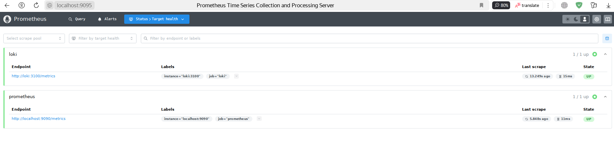
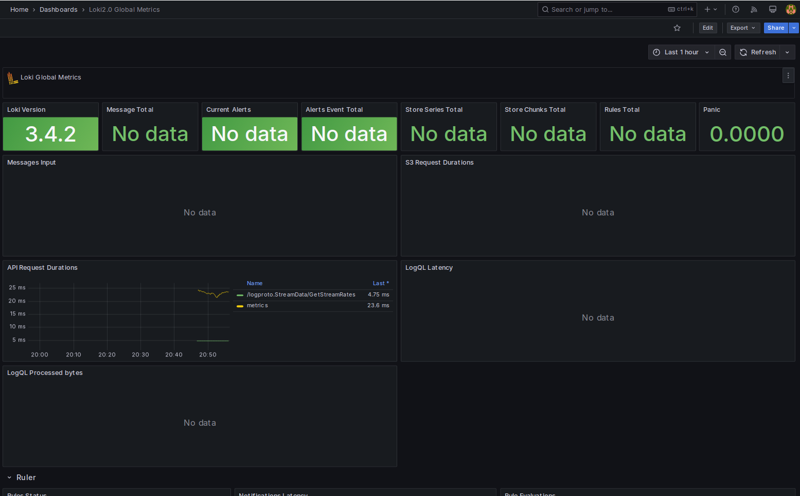
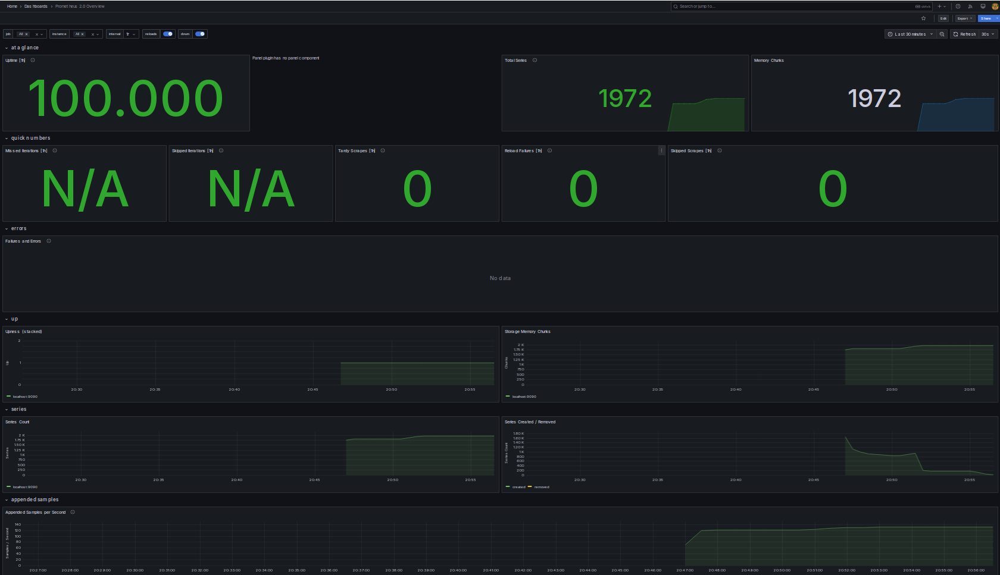
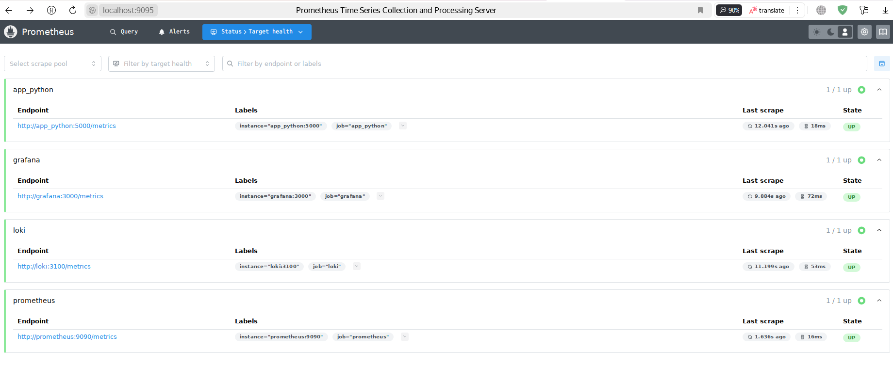
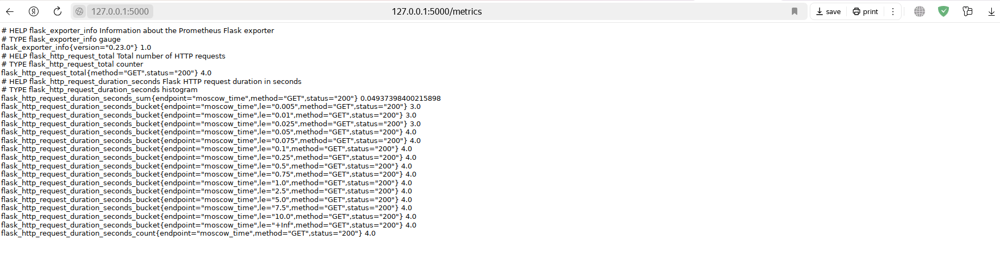

# Metrics

*One important note:* Occasionally, my Scala web app initially was set up on internal and external ports 9090, the same as Prometheus usually uses. So, in order not to make changes in the Scala project, I changed standard Prometheus external port from 9090 to 9095. Actually, no any effects, just do not be surprised of unusual ports in Prometheus targets.

---

## Prometheus targers

To collect info from Prometheus and Loki I setted up targets:



---

## Grafana Dashboards

I used proposed templates to create dashboards in Grafana. This one for Loki:



And this one for Prometheus:



---

## Additional settings

- **Log rotation mechanisms**: Maximum 3 log files of maximum 10Mb each for rotation;

- **Memory limits for containers**: 512Md maximum per application (for both Python and Scala).

Example from Python in docker-compose.yml:

```yml
  app_python:
    image: bugay/python-msk-time-app-distroless:latest
    ports:
      - "5000:5000" 
    networks:
      - loki
    volumes:
      - ./logs/python-app:/var/log/python-app
    healthcheck:
      test: ["CMD", "pgrep", "python"]
      interval: 30s
      timeout: 10s
      retries: 5
    logging:
      driver: "json-file"
      options:
        max-size: "10m"
        max-file: "3"
    deploy:
      resources:
        limits:
          memory: 512M
```

---

## All services metrics

Now I setted up that Prometheus gather metrics from all services:



---

## Python app metrics

I setted up sending metrics from Python app using `prometheus_flask_exporter`:



---

## Health checks

I added health checks to the docker-compose.yml for all services. All of them with similar settings: with 30 seconds intervals, 10 seconts timeouts and 5 retries. They are gethered with `pgrep` except Grafana (it can be gathered only with `curl`, as I implemented).

---
