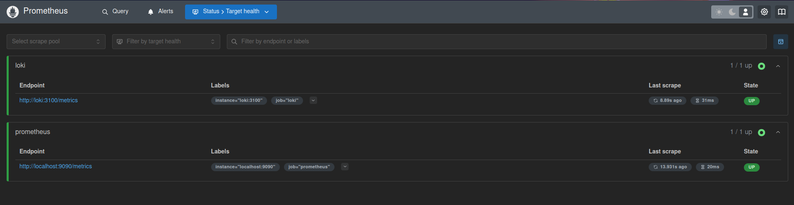
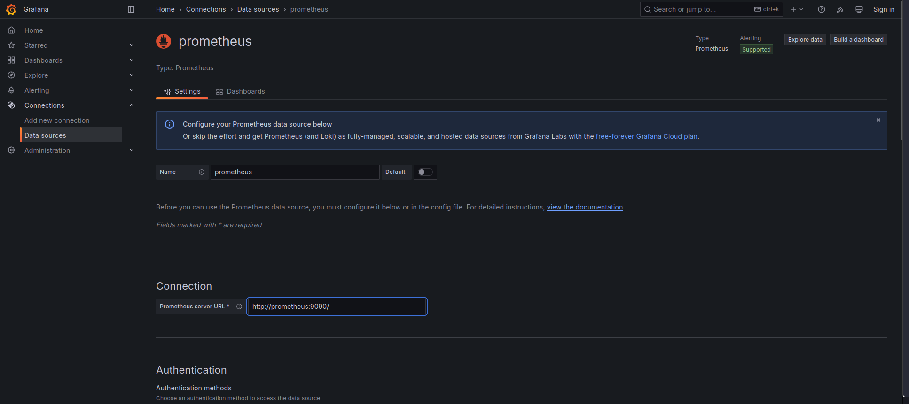
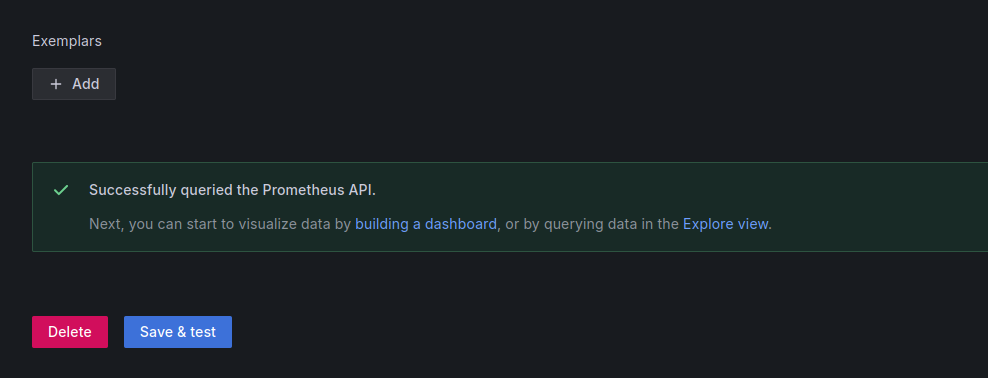
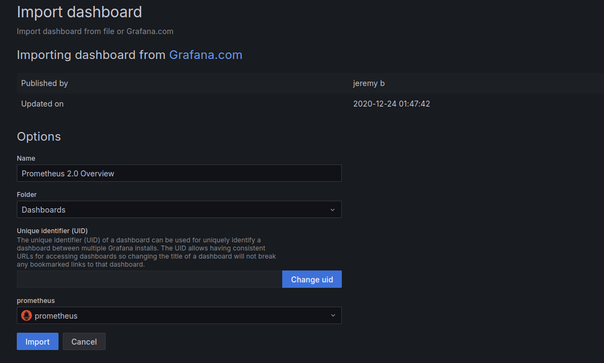
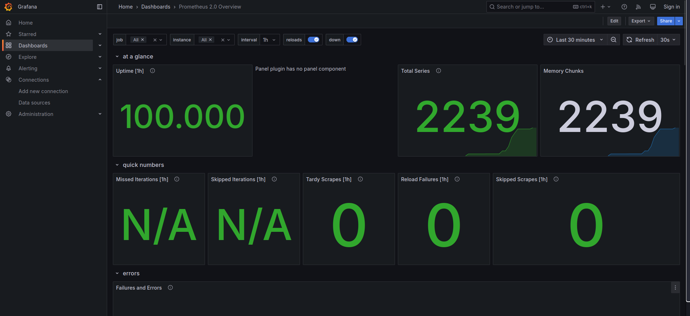
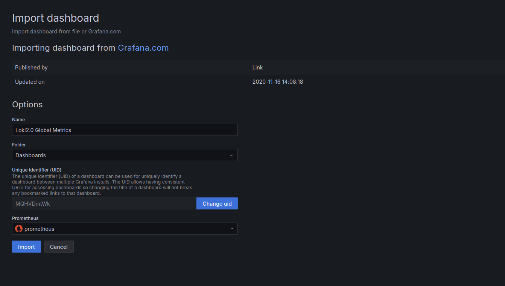
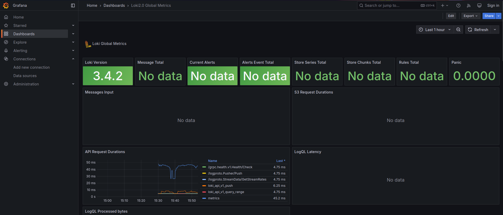
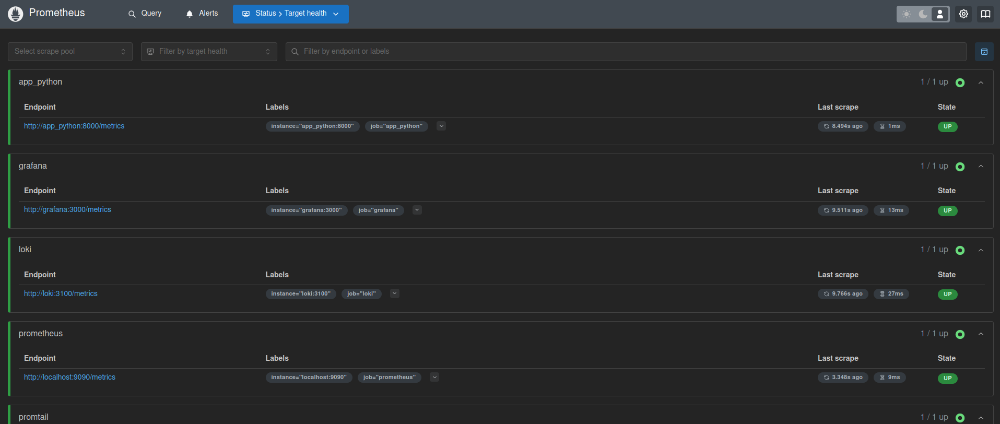

# Metrics - Prometheus

## Overview

This document provides an overview of **Prometheus**, how to set it up and configure applications to collect metrics

## Prometheus Setup

To set it up we have to:

- Add **Prometheus** to our docker compose file
- Create a `prometheus.yml` file that will scrap metrics and send them to grafana

Reference: [Monitoring a Linux host with Prometheus, Node Exporter, and Docker Compose](https://grafana.com/docs/grafana-cloud/send-data/metrics/metrics-prometheus/prometheus-config-examples/docker-compose-linux/#step-2-create-the-prometheus-configuration-file)

## Verify Prometheus targets

After setting up Prometheus we can run the docker compose file, then navigate to `http://localhost:9090/targets`:



## Setting up grafana dashboards

I imported dashboards from [GrafanaLabs](https://grafana.com/grafana/dashboards/) that were provided in the lab

Reference: [Import and export your Grafana dashboards](https://doc.sitecore.com/xp/en/developers/101/managed-cloud/import-and-export-your-grafana-dashboards.html#import-a-grafana-dashboard)

### Dashboard

We first have to add Prometheus as a Data source

- We go to Data Sources > Add new data source > Prometheus
- We add Prometheus server url:
    
- We press save & test:
    

Now we can start importing and creating our dashboards:

- **Prometheus:**

    

    

- **Loki:**

    

    

## Integrating metrics into the web application

Since the web application we have is a flask app, we can use [Prometheus Python client library](http://prometheus.github.io/client_python/) and follow the [three steps demo](http://prometheus.github.io/client_python/getting-started/three-step-demo/) in the documentation to expose the application's metric to prometheus so it can scrape it.

We add the new exposed metrics to our `prometheus.yml` so prometheus can scrape it

```yaml
- job_name: 'app_python'
    static_configs:
        - targets: ['app_python:8000']
```


