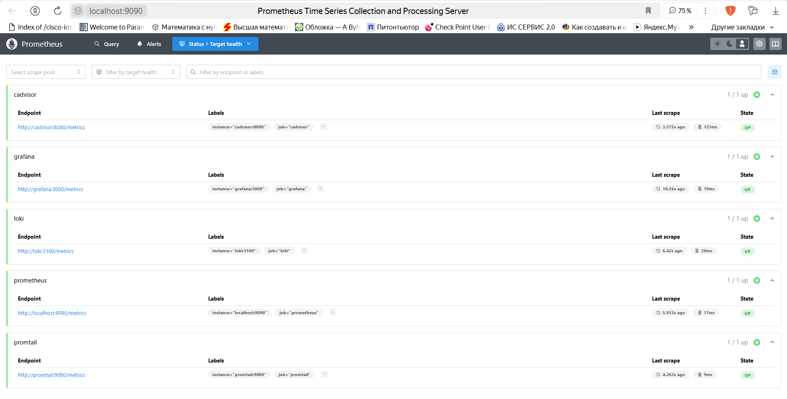
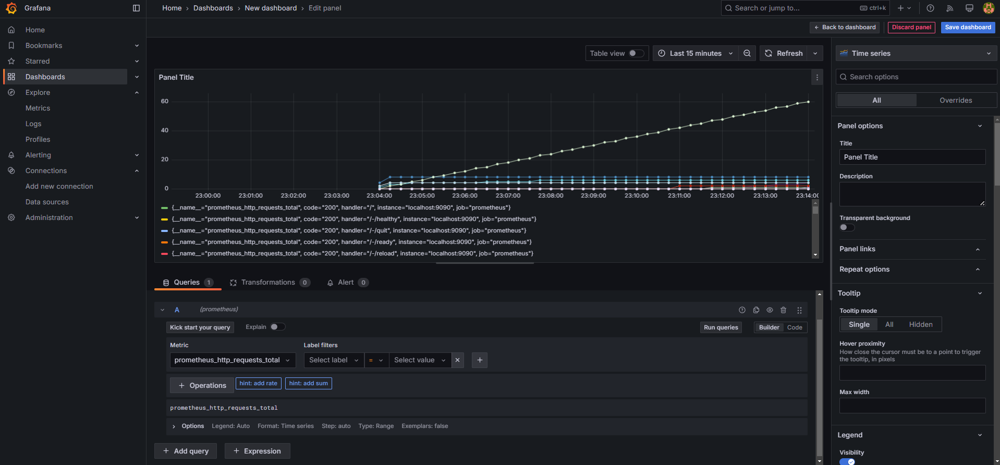

# **Monitoring with Prometheus**

## **Overview**

This lab involved setting up a monitoring stack using Prometheus, Loki, Grafana, Promtail, and cAdvisor. Prometheus collects metrics from various services, Loki handles logging, and Grafana provides visualization.

## **Task 1: Prometheus Setup**

1. **Integration of Prometheus in `docker-compose.yml`**  
   - The `prometheus` service was added to collect metrics from `loki`, `grafana`, `cadvisor`, `promtail`.  
   - Configuration file: `prometheus.yml`.

2. **Prometheus Target Verification**  
   - Verified at `http://localhost:9090/targets`.  
   - Successfully collecting metrics from all configured services.

## **Task 2: Dashboard and Configuration Enhancements**

1. **Grafana Dashboards Created**  
   - **Loki Dashboard** for log visualization.  
   - **Prometheus Dashboard** displaying container performance metrics.  

2. **Service Configuration Updates**  
   - **cAdvisor** added to monitor container performance.  
   - **Log rotation** configured (10MB, max 3 files).  
   - **Memory limits** set to **512MB per container**.

