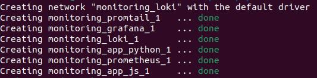
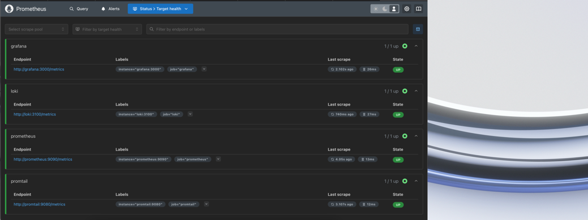
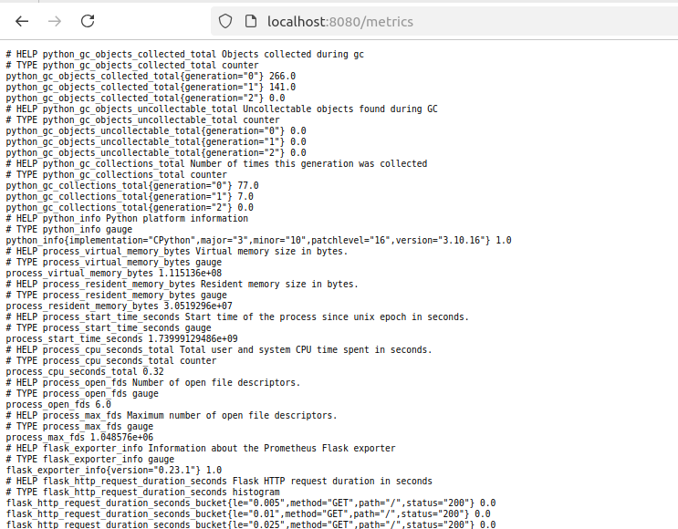
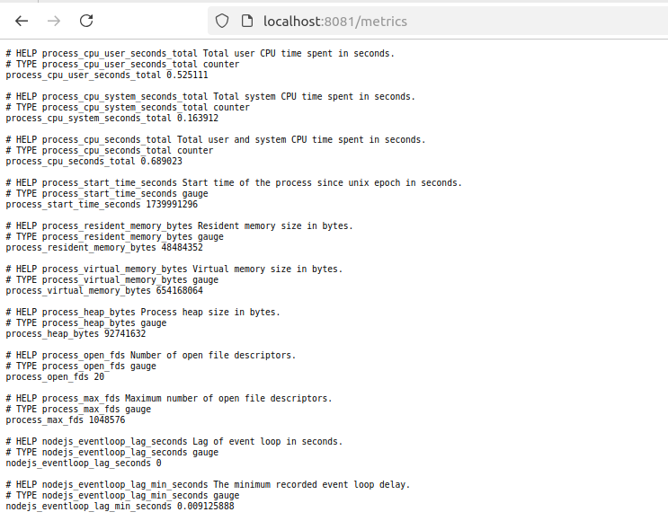
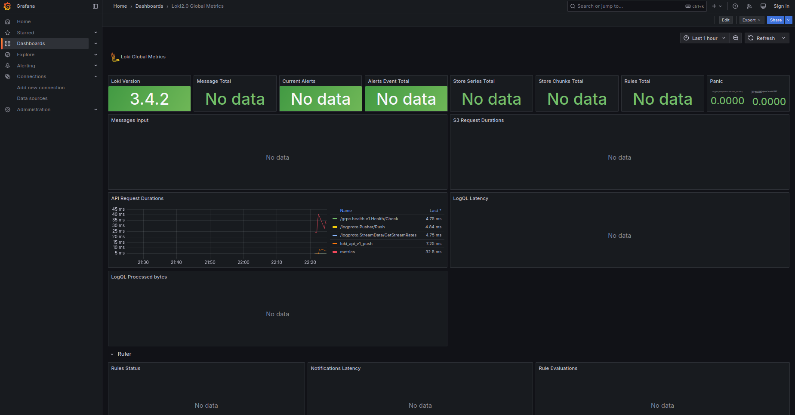
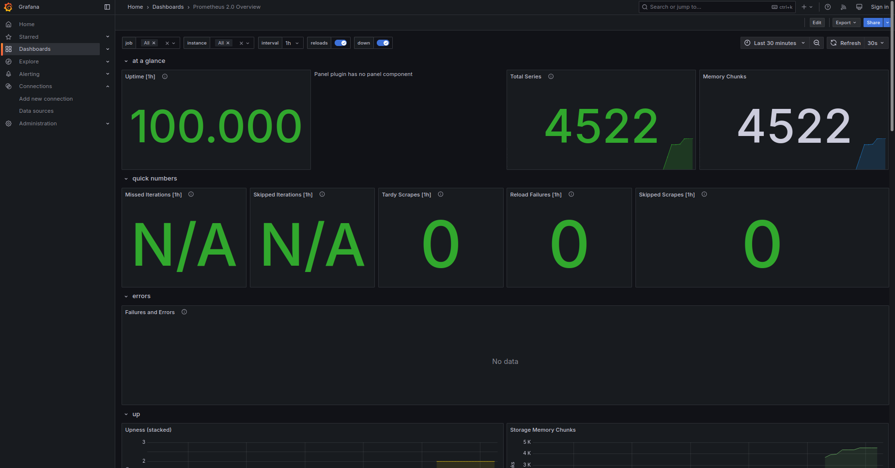
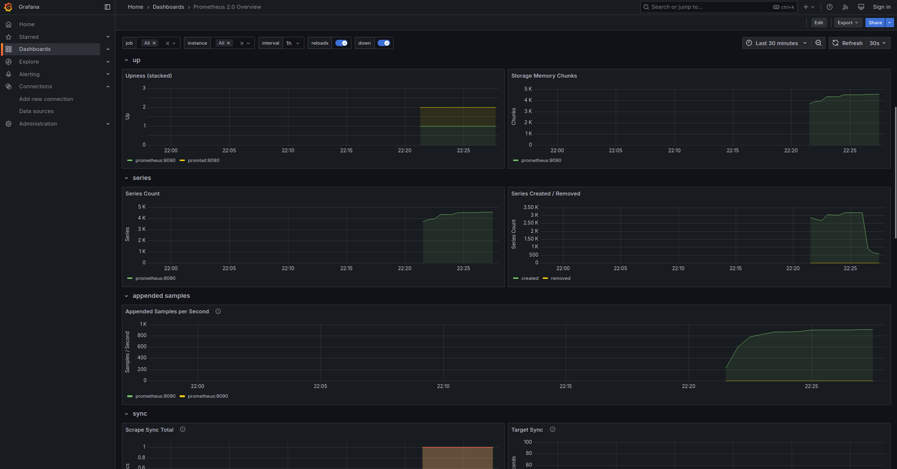
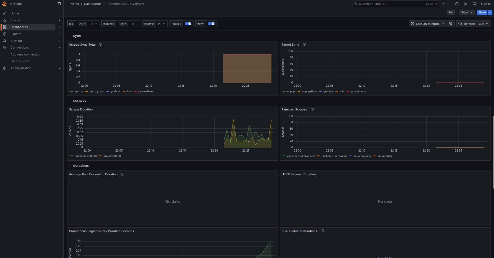
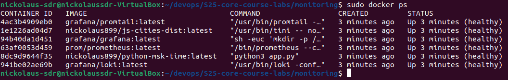

# Metrics with Prometheus

Firstly, we need to run docker compose
```
docker-compose up -d
```




I've configured endpoint `/metrics` in both Python and JS applications
## Targets




#### Also, we can check metrics of `app_python`



#### And for `app_js`




# Dashboards

## Loki




## Prometheus



#### and further info:





# Health checks


### Grafana
I used `curl` to try access `localhost:3000`

### Loki
I used `pgrep` to grep `promtail`

### Prometheus
I used `wget` to access `localhost:9090/-/healthy`

### My apps
I used specially created `/health` endpoint in each of the apps and 
a command `curl` to get access to this endpoint to cheack whether
the app is running or not

### Verify health check with `docker ps`

