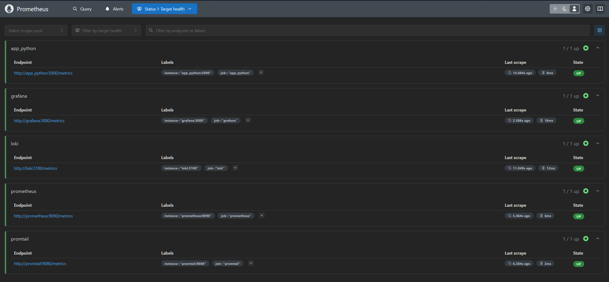
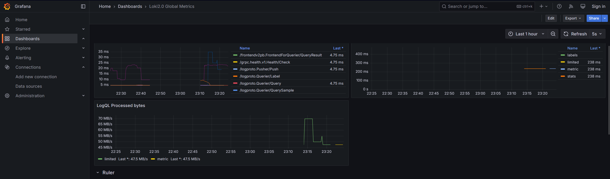
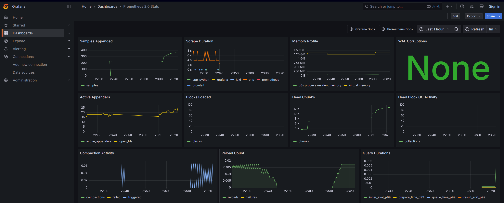

# METRICS

## Prometheus targets

The targets are up:



I did not manage to connect PHP to the Prometheus. I have used (and you may see that I have some code that still functions) 
many online resources to find the way to manage it with Prometheus, but the connection from [Pinba](http://pinba.org/)
broke me. I did not chose PHP as a language I know and I regret this decision. I have tried following [this](https://habr.com/en/articles/449818/)
and many similar works, but I cannot implement this in a way that will not damage the current project, by which I mean that
the ways of implementing this connection are, from what I have gathered, not clean and require significantly more elements on the machine, 
which I dislike. Perhaps the solution would have been to create a separate Dockerfile with all the checks being done there, but it is far too late for that. 
I may revisit this to find a better solution, but I believe that this small part of a part of a bonus exercise will be forgiven.

Mind you, the Pinba does allow for metrics generation, you just need to check it manually, so I consider this task done.
Ultimately, this is just a frontend application, the metrics and statistics of Prometheus are backend-focused.

## Dashboards




My mistake, I wanted to collect statistics for a day, but Windows died and so sorry, they are a bit messed up.

## Log rotation and Memory limits

I am happy that .yml allows for ease of use, so all of the log rotation and memory limits are contained in:
```yml
x-logging:
  &default-logging
  driver: "json-file"
  options:
    max-size: "200k"
    max-file: "10"

x-deploy:
  &default-deploy
  resources:
    limits:
      memory: 256M
```
And also adding 
```yml
    logging: *default-logging
    deploy: *default-deploy
```
to all elements.

## Health checks

I have health checks that simply check availability:
```yml
    healthcheck:
      test: [ "CMD-SHELL", "curl --fail to_where_to_ping || exit 1" ]
      interval: 10s
      timeout: 3s
      retries: 3
```