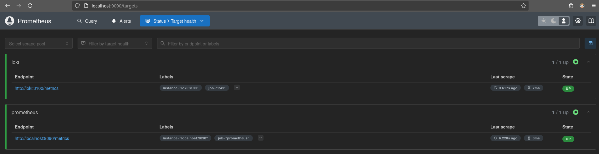
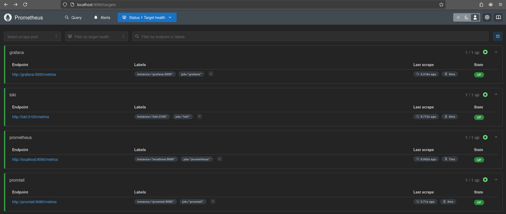
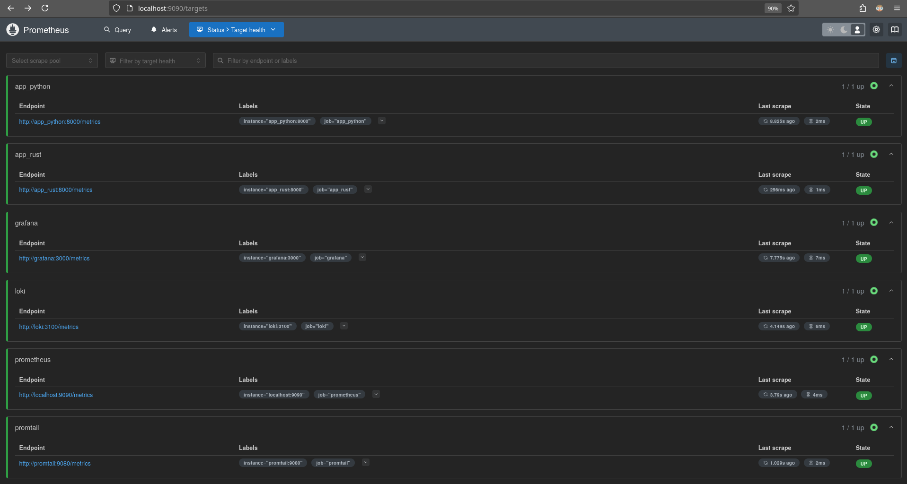
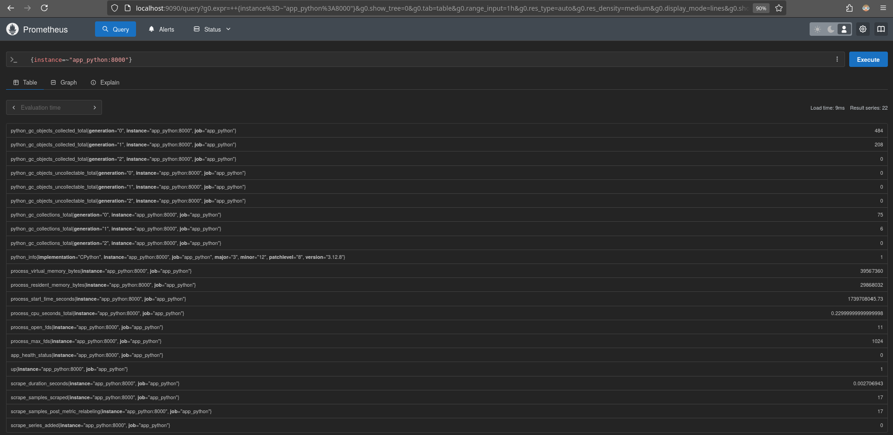
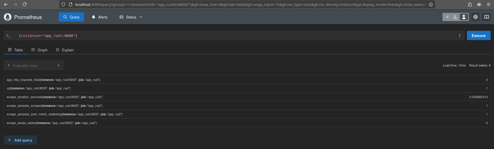

# Metrics

## Task 1: Prometheus Setup

`Prometheus` with captured logs:



## Task 2: Dashboards and Configuration Enchancements

### Dashboards

`Grafana` with `Prometheus` dashboard


`Grafana` with `Loki` dashboard


### Service Configuration Updates

I configured log rotation mechanism with

```yaml
    logging:
      driver: "json-file"
      options:
        max-size: "10m"
        max-file: "3"
```

for all services and set resource limits

```yaml
    deploy:
      resources:
        limits:
          memory: 128M
```

For web applications and `Promtail` memory limit is `128M`,
for `Grafana`, `Loki`, and `Prometheus` memory limit is `512M`.

### Metrics Gathering

I extend `Prometheus` config to capture log from `promtail` and `grafana`:

```yml
  # begining from `prometheus.yml`

  - job_name: 'promtail'
    static_configs:
      - targets: ['promtail:9080']

  - job_name: "grafana"
    static_configs:
      - targets: ["grafana:3000"]
```



## Bonus task

### Application Metrics

I extend `Prometheus` config to capture log from `app_rust` and `app_python`:

```yml
  # begining from `prometheus.yml`

  - job_name: "app_python"
    static_configs:
      - targets: ["app_python:8000"]

  - job_name: "app_rust"
    static_configs:
      - targets: ["app_rust:8000"]
```

List of all `prometheus` active targets:



I used `prometheus` for Rust and `prometheus-client` for Python to collect statistocs for
application and bind `metrics` endpoint to fetch them.

Metrics for `app_python`



Metrics for `app_rust`



### Docker Health Checks

I extended configuration of all services, here is example of this:

```yml
  # ...
  # Healthcheck for `prometheus` 
    healthcheck:
      test: [ "CMD", "pgrep", "prometheus" ]
      interval: 30s
      timeout: 5s
      retries: 5

  # ...
  # Universal healthcheck for `app_python` or `app_rust`
    healthcheck:
      test: "curl -f http://localhost:8000/health"
      interval: 30s
      timeout: 10s
      retries: 3
```

Containers healthcheck example:

```bash
[raleksan@laptop:~/projects/S25-core-course-labs/app_python/app]$ docker ps
CONTAINER ID   IMAGE                      COMMAND                  CREATED          STATUS                      PORTS                                         NAMES
51fc9989e094   prom/prometheus:latest     "/bin/prometheus --c…"   22 minutes ago   Up 21 minutes (healthy)     0.0.0.0:9090->9090/tcp, :::9090->9090/tcp     monitoring-prometheus-1
ac3edef912c1   grafana/promtail:latest    "/usr/bin/promtail -…"   22 minutes ago   Up 21 minutes (healthy)                                                   monitoring-promtail-1
2c0c4c2aa372   raleksan/app_python:v0.1   "gunicorn --bind 0.0…"   22 minutes ago   Up 21 minutes (healthy)     0.0.0.0:8001->8000/tcp, [::]:8001->8000/tcp   monitoring-app_python-1
deee9062b872   grafana/grafana:latest     "sh -euc 'mkdir -p /…"   22 minutes ago   Up 21 minutes (healthy)     0.0.0.0:3000->3000/tcp, :::3000->3000/tcp     monitoring-grafana-1
f9e29ef3f502   grafana/loki:latest        "/usr/bin/loki -conf…"   22 minutes ago   Up 21 minutes (healthy)     0.0.0.0:3100->3100/tcp, :::3100->3100/tcp     monitoring-loki-1
8132efd3c8a5   raleksan/app_rust:v0.1     "./app"                  22 minutes ago   Up 21 minutes (healthy)     0.0.0.0:8002->8000/tcp, [::]:8002->8000/tcp   monitoring-app_rust-1
```
